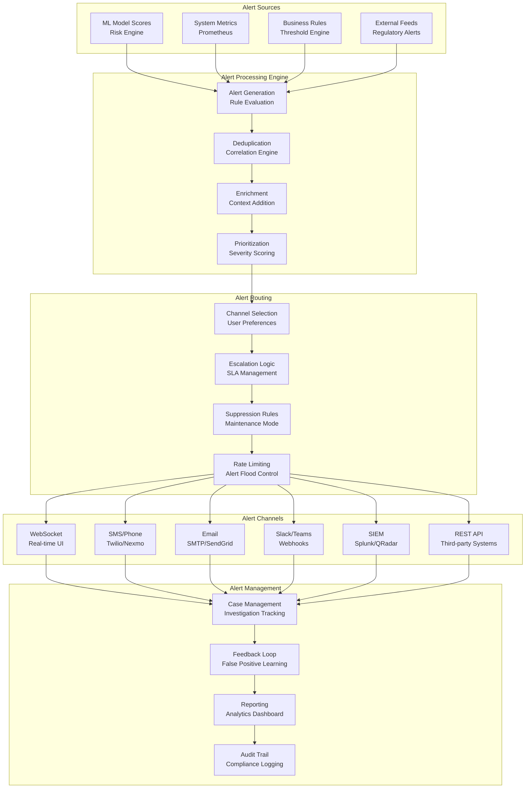

# Real-Time Alerting System

## Overview

This document outlines the comprehensive real-time alerting system designed to notify stakeholders of fraudulent activities, system anomalies, and operational issues. The system supports multiple alert categories, channels, and escalation workflows with deduplication and correlation capabilities.

## Alerting Architecture Overview



## Alert Categories and Severity Levels

### Alert Categories

```python
from enum import Enum
from typing import Dict, List, Any

class AlertCategory(Enum):
    CRITICAL = "critical"      # Immediate fraud detection requiring instant action
    HIGH = "high"             # Suspicious patterns requiring investigation
    MEDIUM = "medium"         # Behavioral anomalies for monitoring
    LOW = "low"              # Informational alerts for trending analysis
    SYSTEM = "system"         # Infrastructure and system alerts
    BUSINESS = "business"     # Business logic and KPI alerts

class AlertSeverity(Enum):
    CRITICAL = 5  # System down, major fraud detected
    HIGH = 4      # Significant issues requiring immediate attention
    MEDIUM = 3    # Issues requiring attention within hours
    LOW = 2       # Issues for monitoring and planning
    INFO = 1      # Informational notifications

# Alert configuration
alert_config = {
    AlertCategory.CRITICAL: {
        "severity": AlertSeverity.CRITICAL,
        "channels": ["sms", "phone", "email", "slack", "siem"],
        "escalation_time": 5,  # minutes
        "sla_response": 15,     # minutes
        "auto_case_creation": True
    },
    AlertCategory.HIGH: {
        "severity": AlertSeverity.HIGH,
        "channels": ["email", "slack", "siem"],
        "escalation_time": 15,
        "sla_response": 60,
        "auto_case_creation": True
    },
    AlertCategory.MEDIUM: {
        "severity": AlertSeverity.MEDIUM,
        "channels": ["email", "slack"],
        "escalation_time": 60,
        "sla_response": 240,
        "auto_case_creation": False
    },
    AlertCategory.LOW: {
        "severity": AlertSeverity.LOW,
        "channels": ["email"],
        "escalation_time": 480,
        "sla_response": 1440,
        "auto_case_creation": False
    }
}
```

## Alert Generation Engine

### Rule-Based Alert Generation

```python
import pandas as pd
from datetime import datetime, timedelta
from typing import Optional, Dict, Any

class AlertRule:
    """Base class for alert rules"""

    def __init__(self, rule_id: str, name: str, category: AlertCategory,
                 condition: str, threshold: float, description: str):
        self.rule_id = rule_id
        self.name = name
        self.category = category
        self.condition = condition
        self.threshold = threshold
        self.description = description

    def evaluate(self, data: pd.DataFrame) -> List[Dict[str, Any]]:
        """Evaluate rule against data and return alerts"""
        raise NotImplementedError

class FraudScoreAlertRule(AlertRule):
    """Alert rule for high fraud scores"""

    def evaluate(self, data: pd.DataFrame) -> List[Dict[str, Any]]:
        alerts = []

        # Filter high-risk transactions
        high_risk = data[data['fraud_score'] > self.threshold]

        for _, row in high_risk.iterrows():
            alert = {
                "alert_id": f"fraud_{row['transaction_id']}_{int(datetime.utcnow().timestamp())}",
                "rule_id": self.rule_id,
                "category": self.category.value,
                "severity": alert_config[self.category]["severity"].value,
                "title": f"High Fraud Score Detected: {row['fraud_score']:.3f}",
                "description": self.description,
                "player_id": row['player_id'],
                "transaction_id": row['transaction_id'],
                "amount": row['amount'],
                "fraud_score": row['fraud_score'],
                "timestamp": datetime.utcnow().isoformat(),
                "context": {
                    "player_segment": row.get('player_segment'),
                    "game_type": row.get('game_type'),
                    "location": row.get('location'),
                    "device_fingerprint": row.get('device_fingerprint')
                }
            }
            alerts.append(alert)

        return alerts

class VelocityAlertRule(AlertRule):
    """Alert rule for unusual transaction velocity"""

    def evaluate(self, data: pd.DataFrame) -> List[Dict[str, Any]]:
        alerts = []

        # Group by player and calculate velocity
        velocity_data = (
            data.groupby('player_id')
            .agg({
                'amount': ['sum', 'count'],
                'timestamp': ['min', 'max']
            })
            .reset_index()
        )

        velocity_data.columns = ['player_id', 'total_amount', 'transaction_count', 'first_txn', 'last_txn']

        # Calculate transactions per hour
        velocity_data['duration_hours'] = (
            velocity_data['last_txn'] - velocity_data['first_txn']
        ).dt.total_seconds() / 3600

        velocity_data['txn_per_hour'] = velocity_data['transaction_count'] / velocity_data['duration_hours'].clip(lower=1)

        # Find high velocity players
        high_velocity = velocity_data[velocity_data['txn_per_hour'] > self.threshold]

        for _, row in high_velocity.iterrows():
            alert = {
                "alert_id": f"velocity_{row['player_id']}_{int(datetime.utcnow().timestamp())}",
                "rule_id": self.rule_id,
                "category": self.category.value,
                "severity": alert_config[self.category]["severity"].value,
                "title": f"Unusual Transaction Velocity: {row['txn_per_hour']:.1f} txn/hour",
                "description": self.description,
                "player_id": row['player_id'],
                "transaction_count": row['transaction_count'],
                "total_amount": row['total_amount'],
                "txn_per_hour": row['txn_per_hour'],
                "timestamp": datetime.utcnow().isoformat()
            }
            alerts.append(alert)

        return alerts

class SystemAlertRule(AlertRule):
    """Alert rule for system metrics"""

    def evaluate(self, metrics: Dict[str, Any]) -> List[Dict[str, Any]]:
        alerts = []

        # Check system metrics against thresholds
        if metrics.get('cpu_usage', 0) > self.threshold:
            alerts.append({
                "alert_id": f"system_cpu_{int(datetime.utcnow().timestamp())}",
                "rule_id": self.rule_id,
                "category": AlertCategory.SYSTEM.value,
                "severity": AlertSeverity.HIGH.value,
                "title": f"High CPU Usage: {metrics['cpu_usage']:.1f}%",
                "description": "System CPU usage exceeds threshold",
                "metric": "cpu_usage",
                "value": metrics['cpu_usage'],
                "threshold": self.threshold,
                "timestamp": datetime.utcnow().isoformat()
            })

        if metrics.get('memory_usage', 0) > self.threshold:
            alerts.append({
                "alert_id": f"system_memory_{int(datetime.utcnow().timestamp())}",
                "rule_id": self.rule_id,
                "category": AlertCategory.SYSTEM.value,
                "severity": AlertSeverity.HIGH.value,
                "title": f"High Memory Usage: {metrics['memory_usage']:.1f}%",
                "description": "System memory usage exceeds threshold",
                "metric": "memory_usage",
                "value": metrics['memory_usage'],
                "threshold": self.threshold,
                "timestamp": datetime.utcnow().isoformat()
            })

        return alerts
```

## Deduplication and Correlation Engine

### Alert Deduplication

```python
from collections import defaultdict
import hashlib
import json
from typing import List, Dict, Any, Set

class AlertDeduplicator:
    """Deduplicate similar alerts to prevent alert fatigue"""

    def __init__(self, dedup_window_minutes: int = 60):
        self.dedup_window_minutes = dedup_window_minutes
        self.recent_alerts: Dict[str, List[datetime]] = defaultdict(list)
        self.alert_hashes: Set[str] = set()

    def is_duplicate(self, alert: Dict[str, Any]) -> bool:
        """Check if alert is a duplicate"""

        # Create alert signature
        signature_data = {
            "rule_id": alert["rule_id"],
            "player_id": alert.get("player_id"),
            "category": alert["category"]
        }

        # Add time window to signature
        current_time = datetime.utcnow()
        signature_data["time_window"] = current_time.replace(minute=0, second=0, microsecond=0).isoformat()

        signature = hashlib.md5(json.dumps(signature_data, sort_keys=True).encode()).hexdigest()

        # Check if we've seen this signature recently
        if signature in self.alert_hashes:
            return True

        # Clean old signatures
        cutoff_time = current_time - timedelta(minutes=self.dedup_window_minutes)
        self.alert_hashes = {
            h for h in self.alert_hashes
            if self._get_signature_time(h) > cutoff_time
        }

        self.alert_hashes.add(signature)
        return False

    def _get_signature_time(self, signature: str) -> datetime:
        """Extract timestamp from signature (simplified)"""
        # In practice, you'd store timestamps with signatures
        return datetime.utcnow()

class AlertCorrelator:
    """Correlate related alerts for better context"""

    def __init__(self):
        self.correlation_rules = {
            "player_cluster": self._correlate_player_alerts,
            "time_window": self._correlate_time_window,
            "amount_pattern": self._correlate_amount_patterns
        }

    def correlate_alerts(self, alerts: List[Dict[str, Any]]) -> List[Dict[str, Any]]:
        """Apply correlation rules to alerts"""

        correlated_alerts = []

        for alert in alerts:
            correlated_alert = alert.copy()

            # Apply each correlation rule
            for rule_name, rule_func in self.correlation_rules.items():
                correlation = rule_func(alert, alerts)
                if correlation:
                    correlated_alert[f"correlation_{rule_name}"] = correlation

            correlated_alerts.append(correlated_alert)

        return correlated_alerts

    def _correlate_player_alerts(self, alert: Dict[str, Any], all_alerts: List[Dict[str, Any]]) -> Optional[Dict[str, Any]]:
        """Correlate alerts for the same player"""

        if "player_id" not in alert:
            return None

        player_id = alert["player_id"]
        player_alerts = [
            a for a in all_alerts
            if a.get("player_id") == player_id and a["alert_id"] != alert["alert_id"]
        ]

        if not player_alerts:
            return None

        return {
            "related_alerts_count": len(player_alerts),
            "related_categories": list(set(a["category"] for a in player_alerts)),
            "time_span_minutes": self._calculate_time_span(player_alerts + [alert])
        }

    def _correlate_time_window(self, alert: Dict[str, Any], all_alerts: List[Dict[str, Any]]) -> Optional[Dict[str, Any]]:
        """Correlate alerts within time window"""

        alert_time = datetime.fromisoformat(alert["timestamp"])
        window_start = alert_time - timedelta(minutes=30)
        window_end = alert_time + timedelta(minutes=30)

        window_alerts = [
            a for a in all_alerts
            if window_start <= datetime.fromisoformat(a["timestamp"]) <= window_end
            and a["alert_id"] != alert["alert_id"]
        ]

        if len(window_alerts) < 2:
            return None

        return {
            "window_alerts_count": len(window_alerts),
            "window_categories": list(set(a["category"] for a in window_alerts)),
            "window_span_minutes": 60
        }

    def _correlate_amount_patterns(self, alert: Dict[str, Any], all_alerts: List[Dict[str, Any]]) -> Optional[Dict[str, Any]]:
        """Correlate alerts with similar amounts"""

        if "amount" not in alert:
            return None

        alert_amount = alert["amount"]
        tolerance = alert_amount * 0.1  # 10% tolerance

        similar_amount_alerts = [
            a for a in all_alerts
            if abs(a.get("amount", 0) - alert_amount) <= tolerance
            and a["alert_id"] != alert["alert_id"]
        ]

        if not similar_amount_alerts:
            return None

        return {
            "similar_amount_alerts_count": len(similar_amount_alerts),
            "amount_range": f"{alert_amount - tolerance:.2f} - {alert_amount + tolerance:.2f}"
        }

    def _calculate_time_span(self, alerts: List[Dict[str, Any]]) -> float:
        """Calculate time span of alerts in minutes"""

        if not alerts:
            return 0

        timestamps = [datetime.fromisoformat(a["timestamp"]) for a in alerts]
        time_span = max(timestamps) - min(timestamps)

        return time_span.total_seconds() / 60
```

## Alert Routing and Escalation

### Channel Router

```python
from abc import ABC, abstractmethod
from typing import List, Dict, Any, Optional
import asyncio
import aiohttp
import smtplib
from email.mime.text import MIMEText
from twilio.rest import Client

class AlertChannel(ABC):
    """Base class for alert channels"""

    @abstractmethod
    async def send_alert(self, alert: Dict[str, Any], recipients: List[str]) -> bool:
        """Send alert through this channel"""
        pass

class SMSChannel(AlertChannel):
    """SMS alert channel using Twilio"""

    def __init__(self, account_sid: str, auth_token: str, from_number: str):
        self.client = Client(account_sid, auth_token)
        self.from_number = from_number

    async def send_alert(self, alert: Dict[str, Any], recipients: List[str]) -> bool:
        try:
            message_body = self._format_alert_message(alert)

            for recipient in recipients:
                self.client.messages.create(
                    body=message_body,
                    from_=self.from_number,
                    to=recipient
                )

            return True
        except Exception as e:
            print(f"SMS send failed: {e}")
            return False

    def _format_alert_message(self, alert: Dict[str, Any]) -> str:
        """Format alert for SMS (limited characters)"""
        return f"FRAUD ALERT: {alert['title']} - Player: {alert.get('player_id', 'N/A')} - Score: {alert.get('fraud_score', 'N/A')}"

class EmailChannel(AlertChannel):
    """Email alert channel"""

    def __init__(self, smtp_server: str, smtp_port: int, username: str, password: str):
        self.smtp_server = smtp_server
        self.smtp_port = smtp_port
        self.username = username
        self.password = password

    async def send_alert(self, alert: Dict[str, Any], recipients: List[str]) -> bool:
        try:
            msg = MIMEText(self._format_alert_email(alert), 'html')
            msg['Subject'] = f"Fraud Detection Alert: {alert['title']}"
            msg['From'] = self.username
            msg['To'] = ', '.join(recipients)

            server = smtplib.SMTP(self.smtp_server, self.smtp_port)
            server.starttls()
            server.login(self.username, self.password)
            server.sendmail(self.username, recipients, msg.as_string())
            server.quit()

            return True
        except Exception as e:
            print(f"Email send failed: {e}")
            return False

    def _format_alert_email(self, alert: Dict[str, Any]) -> str:
        """Format alert as HTML email"""
        return f"""
        <html>
        <body>
            <h2>Fraud Detection Alert</h2>
            <h3>{alert['title']}</h3>
            <p><strong>Description:</strong> {alert['description']}</p>
            <p><strong>Player ID:</strong> {alert.get('player_id', 'N/A')}</p>
            <p><strong>Fraud Score:</strong> {alert.get('fraud_score', 'N/A')}</p>
            <p><strong>Amount:</strong> {alert.get('amount', 'N/A')}</p>
            <p><strong>Timestamp:</strong> {alert['timestamp']}</p>
            <hr>
            <p>This is an automated alert from the Fraud Detection System.</p>
        </body>
        </html>
        """

class SlackChannel(AlertChannel):
    """Slack alert channel"""

    def __init__(self, webhook_url: str):
        self.webhook_url = webhook_url

    async def send_alert(self, alert: Dict[str, Any], recipients: List[str]) -> bool:
        try:
            payload = {
                "text": f"Fraud Alert: {alert['title']}",
                "blocks": [
                    {
                        "type": "header",
                        "text": {
                            "type": "plain_text",
                            "text": "🚨 Fraud Detection Alert"
                        }
                    },
                    {
                        "type": "section",
                        "text": {
                            "type": "mrkdwn",
                            "text": f"*{alert['title']}*\n{alert['description']}"
                        }
                    },
                    {
                        "type": "section",
                        "fields": [
                            {
                                "type": "mrkdwn",
                                "text": f"*Player ID:*\n{alert.get('player_id', 'N/A')}"
                            },
                            {
                                "type": "mrkdwn",
                                "text": f"*Fraud Score:*\n{alert.get('fraud_score', 'N/A')}"
                            },
                            {
                                "type": "mrkdwn",
                                "text": f"*Amount:*\n{alert.get('amount', 'N/A')}"
                            },
                            {
                                "type": "mrkdwn",
                                "text": f"*Time:*\n{alert['timestamp']}"
                            }
                        ]
                    }
                ]
            }

            async with aiohttp.ClientSession() as session:
                async with session.post(self.webhook_url, json=payload) as response:
                    return response.status == 200

        except Exception as e:
            print(f"Slack send failed: {e}")
            return False

class AlertRouter:
    """Routes alerts to appropriate channels based on configuration"""

    def __init__(self):
        self.channels: Dict[str, AlertChannel] = {}
        self.user_preferences: Dict[str, Dict[str, Any]] = {}

    def add_channel(self, name: str, channel: AlertChannel):
        """Add an alert channel"""
        self.channels[name] = channel

    def set_user_preferences(self, user_id: str, preferences: Dict[str, Any]):
        """Set alert preferences for a user"""
        self.user_preferences[user_id] = preferences

    async def route_alert(self, alert: Dict[str, Any]):
        """Route alert to appropriate channels and recipients"""

        category = alert["category"]
        config = alert_config[AlertCategory(category)]

        # Get recipients for this alert type
        recipients = await self._get_recipients(alert, config)

        # Send through configured channels
        send_tasks = []
        for channel_name in config["channels"]:
            if channel_name in self.channels:
                channel = self.channels[channel_name]
                for recipient_group in recipients.get(channel_name, []):
                    send_tasks.append(channel.send_alert(alert, recipient_group))

        # Execute all send tasks concurrently
        if send_tasks:
            results = await asyncio.gather(*send_tasks, return_exceptions=True)
            success_count = sum(1 for r in results if r is True)
            print(f"Alert sent successfully to {success_count}/{len(send_tasks)} destinations")

    async def _get_recipients(self, alert: Dict[str, Any], config: Dict[str, Any]) -> Dict[str, List[List[str]]]:
        """Get recipients for alert based on type and preferences"""

        # Default recipients by channel
        recipients = {
            "sms": [["+1234567890"]],  # On-call engineer
            "email": [["security@casino.com", "fraud-team@casino.com"]],
            "slack": [["#fraud-alerts"]],
            "phone": [["+1234567890"]]  # Escalation number
        }

        # Add player-specific recipients if applicable
        if alert.get("player_id"):
            # Look up player's account manager or other stakeholders
            player_recipients = await self._get_player_recipients(alert["player_id"])
            if player_recipients:
                recipients["email"].append(player_recipients)

        return recipients

    async def _get_player_recipients(self, player_id: str) -> Optional[List[str]]:
        """Get additional recipients based on player information"""
        # Implementation would query player database
        # For now, return None
        return None
```

## Alert Management and Case Creation

### Case Management System

```python
from enum import Enum
from typing import Dict, List, Any, Optional
from datetime import datetime, timedelta

class CaseStatus(Enum):
    OPEN = "open"
    INVESTIGATING = "investigating"
    RESOLVED = "resolved"
    CLOSED = "closed"
    ESCALATED = "escalated"

class CasePriority(Enum):
    CRITICAL = 5
    HIGH = 4
    MEDIUM = 3
    LOW = 2

class Case:
    """Represents an investigation case"""

    def __init__(self, case_id: str, title: str, description: str,
                 priority: CasePriority, created_by: str):
        self.case_id = case_id
        self.title = title
        self.description = description
        self.priority = priority
        self.status = CaseStatus.OPEN
        self.created_by = created_by
        self.created_at = datetime.utcnow()
        self.updated_at = datetime.utcnow()
        self.assigned_to: Optional[str] = None
        self.alerts: List[str] = []  # Alert IDs
        self.notes: List[Dict[str, Any]] = []
        self.resolution: Optional[str] = None
        self.sla_deadline: Optional[datetime] = None

    def add_alert(self, alert_id: str):
        """Add an alert to this case"""
        if alert_id not in self.alerts:
            self.alerts.append(alert_id)
            self.updated_at = datetime.utcnow()

    def assign_to(self, user_id: str):
        """Assign case to a user"""
        self.assigned_to = user_id
        self.status = CaseStatus.INVESTIGATING
        self.updated_at = datetime.utcnow()

    def add_note(self, user_id: str, note: str):
        """Add a note to the case"""
        self.notes.append({
            "user_id": user_id,
            "note": note,
            "timestamp": datetime.utcnow().isoformat()
        })
        self.updated_at = datetime.utcnow()

    def resolve(self, resolution: str, user_id: str):
        """Resolve the case"""
        self.status = CaseStatus.RESOLVED
        self.resolution = resolution
        self.add_note(user_id, f"Case resolved: {resolution}")
        self.updated_at = datetime.utcnow()

    def calculate_sla_status(self) -> Dict[str, Any]:
        """Calculate SLA status"""
        if not self.sla_deadline:
            return {"status": "no_sla", "remaining_minutes": None}

        now = datetime.utcnow()
        if now > self.sla_deadline:
            return {"status": "breached", "remaining_minutes": 0}

        remaining = self.sla_deadline - now
        remaining_minutes = remaining.total_seconds() / 60

        if remaining_minutes < 60:
            status = "critical"
        elif remaining_minutes < 240:
            status = "warning"
        else:
            status = "ok"

        return {
            "status": status,
            "remaining_minutes": int(remaining_minutes)
        }

class CaseManager:
    """Manages investigation cases"""

    def __init__(self):
        self.cases: Dict[str, Case] = {}
        self.case_counter = 1

    def create_case_from_alert(self, alert: Dict[str, Any], created_by: str = "system") -> Case:
        """Create a new case from an alert"""

        case_id = f"CASE-{self.case_counter:06d}"
        self.case_counter += 1

        # Determine priority based on alert
        priority_map = {
            5: CasePriority.CRITICAL,
            4: CasePriority.HIGH,
            3: CasePriority.MEDIUM,
            2: CasePriority.LOW,
            1: CasePriority.LOW
        }
        priority = priority_map.get(alert.get("severity", 3), CasePriority.MEDIUM)

        title = alert["title"]
        description = alert["description"]

        case = Case(case_id, title, description, priority, created_by)
        case.add_alert(alert["alert_id"])

        # Set SLA deadline based on priority
        sla_hours = {
            CasePriority.CRITICAL: 1,
            CasePriority.HIGH: 4,
            CasePriority.MEDIUM: 24,
            CasePriority.LOW: 72
        }
        case.sla_deadline = case.created_at + timedelta(hours=sla_hours[priority])

        self.cases[case_id] = case
        return case

    def get_cases_by_status(self, status: CaseStatus) -> List[Case]:
        """Get cases by status"""
        return [case for case in self.cases.values() if case.status == status]

    def get_overdue_cases(self) -> List[Case]:
        """Get cases that have breached SLA"""
        now = datetime.utcnow()
        return [
            case for case in self.cases.values()
            if case.sla_deadline and now > case.sla_deadline and case.status != CaseStatus.RESOLVED
        ]

    def get_case_summary(self) -> Dict[str, Any]:
        """Get summary statistics of cases"""
        total_cases = len(self.cases)
        open_cases = len(self.get_cases_by_status(CaseStatus.OPEN))
        investigating_cases = len(self.get_cases_by_status(CaseStatus.INVESTIGATING))
        resolved_cases = len(self.get_cases_by_status(CaseStatus.RESOLVED))
        overdue_cases = len(self.get_overdue_cases())

        return {
            "total_cases": total_cases,
            "open_cases": open_cases,
            "investigating_cases": investigating_cases,
            "resolved_cases": resolved_cases,
            "overdue_cases": overdue_cases,
            "resolution_rate": resolved_cases / total_cases if total_cases > 0 else 0
        }
```

## Alert Processing Pipeline

### Main Alert Engine

```python
import asyncio
from typing import List, Dict, Any
import json
from datetime import datetime

class AlertEngine:
    """Main alert processing engine"""

    def __init__(self):
        self.rules: List[AlertRule] = []
        self.deduplicator = AlertDeduplicator()
        self.correlator = AlertCorrelator()
        self.router = AlertRouter()
        self.case_manager = CaseManager()
        self.alert_history: List[Dict[str, Any]] = []

    def add_rule(self, rule: AlertRule):
        """Add an alert rule"""
        self.rules.append(rule)

    def add_channel(self, name: str, channel: AlertChannel):
        """Add an alert channel"""
        self.router.add_channel(name, channel)

    async def process_data_batch(self, data: pd.DataFrame, data_type: str = "transactions"):
        """Process a batch of data and generate alerts"""

        alerts = []

        # Evaluate all rules
        for rule in self.rules:
            try:
                rule_alerts = rule.evaluate(data)
                alerts.extend(rule_alerts)
            except Exception as e:
                print(f"Error evaluating rule {rule.rule_id}: {e}")

        if not alerts:
            return

        # Deduplicate alerts
        unique_alerts = []
        for alert in alerts:
            if not self.deduplicator.is_duplicate(alert):
                unique_alerts.append(alert)

        # Correlate alerts
        correlated_alerts = self.correlator.correlate_alerts(unique_alerts)

        # Process each alert
        for alert in correlated_alerts:
            await self._process_alert(alert)

        # Store alert history
        self.alert_history.extend(correlated_alerts)

        # Keep only recent history (last 1000 alerts)
        if len(self.alert_history) > 1000:
            self.alert_history = self.alert_history[-1000:]

    async def _process_alert(self, alert: Dict[str, Any]):
        """Process a single alert"""

        # Enrich alert with additional context
        alert = await self._enrich_alert(alert)

        # Route alert to channels
        await self.router.route_alert(alert)

        # Create case if required
        category = AlertCategory(alert["category"])
        if alert_config[category]["auto_case_creation"]:
            case = self.case_manager.create_case_from_alert(alert)
            alert["case_id"] = case.case_id
            print(f"Created case {case.case_id} for alert {alert['alert_id']}")

        # Log alert
        print(f"Processed alert: {alert['alert_id']} - {alert['title']}")

    async def _enrich_alert(self, alert: Dict[str, Any]) -> Dict[str, Any]:
        """Enrich alert with additional context"""

        enriched = alert.copy()

        # Add processing timestamp
        enriched["processed_at"] = datetime.utcnow().isoformat()

        # Add system context
        enriched["system_info"] = {
            "version": "1.0.0",
            "environment": "production",
            "cluster": "fraud-detection-cluster"
        }

        # Add business context if player_id is present
        if alert.get("player_id"):
            player_context = await self._get_player_context(alert["player_id"])
            enriched["player_context"] = player_context

        return enriched

    async def _get_player_context(self, player_id: str) -> Dict[str, Any]:
        """Get additional context about a player"""
        # Implementation would query player database
        # For now, return mock data
        return {
            "segment": "high_value",
            "registration_date": "2023-01-15",
            "total_deposits": 50000,
            "last_login": "2024-01-15T10:30:00Z",
            "risk_level": "medium"
        }

    def get_alert_summary(self, hours: int = 24) -> Dict[str, Any]:
        """Get alert summary for the last N hours"""

        cutoff_time = datetime.utcnow() - timedelta(hours=hours)

        recent_alerts = [
            alert for alert in self.alert_history
            if datetime.fromisoformat(alert["timestamp"]) > cutoff_time
        ]

        summary = {
            "total_alerts": len(recent_alerts),
            "by_category": {},
            "by_severity": {},
            "top_rules": {}
        }

        for alert in recent_alerts:
            # Count by category
            category = alert["category"]
            summary["by_category"][category] = summary["by_category"].get(category, 0) + 1

            # Count by severity
            severity = alert["severity"]
            summary["by_severity"][severity] = summary["by_severity"].get(severity, 0) + 1

            # Count by rule
            rule_id = alert["rule_id"]
            summary["top_rules"][rule_id] = summary["top_rules"].get(rule_id, 0) + 1

        return summary

    def get_case_summary(self) -> Dict[str, Any]:
        """Get case management summary"""
        return self.case_manager.get_case_summary()
```

## Configuration and Deployment

### Alert Configuration File

```yaml
# alert-config.yaml
rules:
  - rule_id: "fraud_score_high"
    name: "High Fraud Score"
    category: "critical"
    condition: "fraud_score > 0.9"
    threshold: 0.9
    description: "Transaction with fraud score above 0.9 detected"

  - rule_id: "velocity_high"
    name: "High Transaction Velocity"
    category: "high"
    condition: "transactions_per_hour > 50"
    threshold: 50
    description: "Unusual transaction velocity detected"

  - rule_id: "amount_large"
    name: "Large Transaction Amount"
    category: "medium"
    condition: "amount > 10000"
    threshold: 10000
    description: "Transaction amount exceeds threshold"

channels:
  sms:
    provider: "twilio"
    account_sid: "${TWILIO_ACCOUNT_SID}"
    auth_token: "${TWILIO_AUTH_TOKEN}"
    from_number: "+1234567890"

  email:
    smtp_server: "smtp.company.com"
    smtp_port: 587
    username: "${SMTP_USERNAME}"
    password: "${SMTP_PASSWORD}"

  slack:
    webhook_url: "${SLACK_WEBHOOK_URL}"

escalation:
  critical:
    - delay_minutes: 5
      channels: ["phone"]
    - delay_minutes: 15
      channels: ["sms", "email"]
  high:
    - delay_minutes: 15
      channels: ["email", "slack"]
  medium:
    - delay_minutes: 60
      channels: ["email"]
```

### Docker Configuration

```dockerfile
# Dockerfile for alert engine
FROM python:3.12-slim

WORKDIR /app

COPY requirements.txt .
RUN pip install --no-cache-dir -r requirements.txt

COPY . .

EXPOSE 8083

CMD ["python", "alert_engine.py"]
```

This comprehensive alerting system provides real-time fraud detection notifications with intelligent deduplication, correlation, and escalation capabilities across multiple channels.