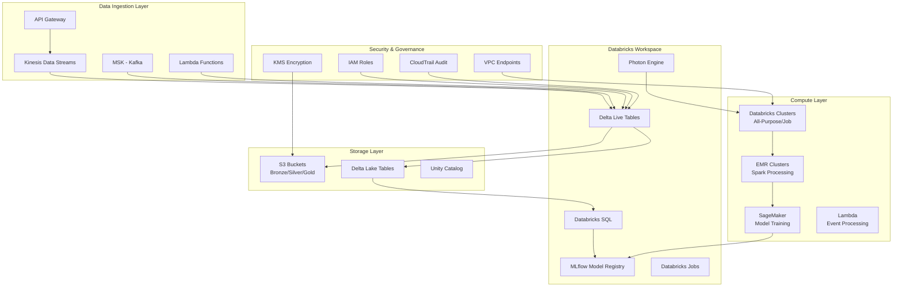

# AWS with Databricks Implementation

## Overview

This document outlines the cloud-native implementation using AWS services and Databricks for the real-time anti-fraud system. The architecture leverages Databricks' unified analytics platform with AWS's scalable infrastructure for high-performance data processing and ML operations.

## AWS Architecture Overview



## Databricks Workspace Configuration

### Workspace Setup

```python
# Databricks workspace configuration
databricks_config = {
    "workspace": {
        "name": "fraud-detection-workspace",
        "region": "us-east-1",
        "node_type": "i3.xlarge",
        "min_workers": 2,
        "max_workers": 50,
        "auto_termination_minutes": 120
    },
    "clusters": {
        "ingestion_cluster": {
            "spark_version": "12.2.x-scala2.12",
            "node_type_id": "i3.2xlarge",
            "num_workers": 4,
            "auto_termination_minutes": 60
        },
        "feature_engineering_cluster": {
            "spark_version": "12.2.x-scala2.12",
            "node_type_id": "r5.4xlarge",
            "num_workers": 8,
            "auto_termination_minutes": 120
        },
        "ml_training_cluster": {
            "spark_version": "12.2.x-scala2.12",
            "node_type_id": "g4dn.4xlarge",  # GPU for ML training
            "num_workers": 4,
            "auto_termination_minutes": 240
        }
    }
}
```

### Unity Catalog Setup

```sql
-- Unity Catalog metastore configuration
CREATE CATALOG fraud_detection_catalog
COMMENT 'Catalog for fraud detection system';

USE CATALOG fraud_detection_catalog;

-- Create schemas
CREATE SCHEMA bronze_layer
COMMENT 'Raw ingested data';

CREATE SCHEMA silver_layer
COMMENT 'Cleaned and transformed data';

CREATE SCHEMA gold_layer
COMMENT 'Aggregated features and ML-ready data';

CREATE SCHEMA models
COMMENT 'ML models and experiments';

-- Grant permissions
GRANT USE CATALOG ON CATALOG fraud_detection_catalog TO `data-engineers`;
GRANT USE SCHEMA ON SCHEMA bronze_layer TO `data-engineers`;
GRANT SELECT ON SCHEMA bronze_layer TO `analysts`;
```

## Data Lake Architecture (Bronze/Silver/Gold)

### Bronze Layer - Raw Data Ingestion

```python
# Delta Live Tables pipeline for bronze layer
import dlt
from pyspark.sql.functions import *
from pyspark.sql.types import *

# Define bronze layer tables
@dlt.table(
    name="bronze_transactions",
    comment="Raw transaction events from all sources"
)
def bronze_transactions():
    return (
        spark.readStream
        .format("kinesis")
        .option("streamName", "fraud-detection-transactions")
        .option("region", "us-east-1")
        .option("initialPosition", "latest")
        .load()
        .select(
            col("data").cast("string").alias("json_data"),
            col("partitionKey").alias("player_id"),
            col("approximateArrivalTimestamp").alias("ingestion_timestamp")
        )
        .withColumn("event_type", lit("transaction"))
        .withColumn("bronze_ingestion_time", current_timestamp())
    )

@dlt.table(
    name="bronze_user_events",
    comment="Raw user behavior events"
)
def bronze_user_events():
    return (
        spark.readStream
        .format("kafka")
        .option("kafka.bootstrap.servers", "msk-cluster.kafka.us-east-1.amazonaws.com:9092")
        .option("subscribe", "user-events")
        .option("startingOffsets", "latest")
        .load()
        .select(
            col("value").cast("string").alias("json_data"),
            col("key").cast("string").alias("player_id"),
            col("timestamp").alias("event_timestamp")
        )
        .withColumn("event_type", lit("user_event"))
        .withColumn("bronze_ingestion_time", current_timestamp())
    )
```

### Silver Layer - Data Cleaning and Standardization

```python
# Silver layer transformations
@dlt.table(
    name="silver_transactions_clean",
    comment="Cleaned and standardized transaction data"
)
def silver_transactions_clean():
    return (
        dlt.read("bronze_transactions")
        .withColumn("parsed_data", from_json(col("json_data"), transaction_schema))
        .select(
            col("parsed_data.*"),
            col("bronze_ingestion_time"),
            col("ingestion_timestamp")
        )
        .withColumn("amount_usd", when(col("currency") == "EUR", col("amount") * 1.08)
                                 .when(col("currency") == "GBP", col("amount") * 1.27)
                                 .otherwise(col("amount")))
        .filter(col("amount_usd").isNotNull())
        .filter(col("player_id").isNotNull())
        .dropDuplicates(["transaction_id"])
    )

# Define schema for transactions
transaction_schema = StructType([
    StructField("transaction_id", StringType(), True),
    StructField("player_id", StringType(), True),
    StructField("amount", DoubleType(), True),
    StructField("currency", StringType(), True),
    StructField("timestamp", TimestampType(), True),
    StructField("payment_method", StringType(), True),
    StructField("game_type", StringType(), True),
    StructField("location", StructType([
        StructField("ip_address", StringType(), True),
        StructField("country", StringType(), True),
        StructField("city", StringType(), True)
    ]), True)
])
```

### Gold Layer - Feature Engineering and Aggregation

```python
# Gold layer feature engineering using Polars
import polars as pl
from pyspark.sql.functions import pandas_udf, PandasUDFType

@pandas_udf("string")
def create_player_behavior_features_polars(player_data: pd.Series) -> pd.Series:
    """Create player behavior features using Polars within Spark UDF"""

    # Convert to Polars DataFrame
    df = pl.from_pandas(player_data.to_frame())

    # Apply feature engineering logic
    features = (
        df.group_by("player_id")
        .agg([
            pl.col("bet_amount").sum().alias("total_bet_amount"),
            pl.col("win_amount").sum().alias("total_win_amount"),
            pl.col("bet_amount").mean().alias("avg_bet_amount"),
            pl.col("session_duration").mean().alias("avg_session_duration"),
            pl.col("games_played").n_unique().alias("unique_games_played"),
            (pl.col("win_amount") - pl.col("bet_amount")).alias("net_result")
        ])
        .with_columns([
            (pl.col("total_win_amount") / pl.col("total_bet_amount")).alias("win_ratio"),
            pl.when(pl.col("net_result") > 0).then(1).otherwise(0).alias("is_profitable")
        ])
    )

    return features.to_pandas().to_json(orient="records")

@dlt.table(
    name="gold_player_features",
    comment="Aggregated player behavior features"
)
def gold_player_features():
    return (
        dlt.read("silver_transactions_clean")
        .groupBy("player_id")
        .agg(
            sum("amount_usd").alias("total_transaction_amount"),
            count("*").alias("transaction_count"),
            avg("amount_usd").alias("avg_transaction_amount"),
            stddev("amount_usd").alias("transaction_amount_std"),
            min("timestamp").alias("first_transaction"),
            max("timestamp").alias("last_transaction")
        )
        .withColumn("features_json", create_player_behavior_features_polars("player_id"))
        .withColumn("gold_processing_time", current_timestamp())
    )
```

## MLflow Model Management

### Model Training Pipeline

```python
import mlflow
import mlflow.sklearn
import mlflow.xgboost
from mlflow.tracking import MlflowClient
import xgboost as xgb
from sklearn.model_selection import train_test_split
from sklearn.metrics import roc_auc_score, classification_report

# Set MLflow experiment
mlflow.set_experiment("/fraud-detection/models")

def train_fraud_detection_model(feature_table: str, target_column: str = "is_fraud"):
    """Train fraud detection model using Databricks and MLflow"""

    with mlflow.start_run(run_name="xgboost_fraud_detector"):

        # Load training data from Delta table
        train_df = spark.table(feature_table).toPandas()

        # Prepare features and target
        feature_cols = [col for col in train_df.columns if col != target_column]
        X = train_df[feature_cols]
        y = train_df[target_column]

        # Split data
        X_train, X_test, y_train, y_test = train_test_split(
            X, y, test_size=0.2, random_state=42, stratify=y
        )

        # Train XGBoost model
        model = xgb.XGBClassifier(
            objective='binary:logistic',
            n_estimators=500,
            max_depth=6,
            learning_rate=0.1,
            scale_pos_weight=len(y_train[y_train==0]) / len(y_train[y_train==1]),
            random_state=42
        )

        model.fit(X_train, y_train)

        # Evaluate model
        y_pred_proba = model.predict_proba(X_test)[:, 1]
        auc_score = roc_auc_score(y_test, y_pred_proba)

        # Log parameters and metrics
        mlflow.log_param("n_estimators", 500)
        mlflow.log_param("max_depth", 6)
        mlflow.log_param("learning_rate", 0.1)
        mlflow.log_metric("auc", auc_score)

        # Log feature importance
        feature_importance = dict(zip(feature_cols, model.feature_importances_))
        for feature, importance in feature_importance.items():
            mlflow.log_metric(f"feature_importance_{feature}", importance)

        # Log model
        mlflow.xgboost.log_model(model, "model")

        # Register model in MLflow Model Registry
        client = MlflowClient()
        model_version = mlflow.register_model(
            f"runs:/{mlflow.active_run().info.run_id}/model",
            "fraud_detection_model"
        )

        # Transition to Staging
        client.transition_model_version_stage(
            name="fraud_detection_model",
            version=model_version.version,
            stage="Staging"
        )

        return model, auc_score

# Usage in Databricks notebook
model, auc = train_fraud_detection_model("gold_player_features")
print(f"Model trained with AUC: {auc}")
```

### Model Serving with MLflow

```python
from mlflow.deployments import get_deploy_client

def deploy_model_to_sagemaker(model_name: str, model_version: str):
    """Deploy MLflow model to SageMaker"""

    client = get_deploy_client("sagemaker")

    # Deploy model
    deployment = client.create_deployment(
        name=f"{model_name}-deployment",
        model_uri=f"models:/{model_name}/{model_version}",
        config={
            "instance_type": "ml.m5.large",
            "instance_count": 1,
            "region": "us-east-1"
        }
    )

    return deployment

# Deploy model
deployment = deploy_model_to_sagemaker("fraud_detection_model", "1")
print(f"Model deployed: {deployment}")
```

## Real-Time Processing with Structured Streaming

### Streaming Feature Engineering

```python
from pyspark.sql.functions import window, collect_list, struct

# Real-time feature engineering with windowed aggregations
streaming_features = (
    spark.readStream
    .format("delta")
    .table("silver_transactions_clean")
    .withWatermark("timestamp", "10 minutes")
    .groupBy(
        window("timestamp", "1 hour", "30 minutes"),
        "player_id"
    )
    .agg(
        sum("amount_usd").alias("window_transaction_sum"),
        count("*").alias("window_transaction_count"),
        avg("amount_usd").alias("window_avg_transaction"),
        collect_list(struct("amount_usd", "payment_method", "timestamp")).alias("transaction_list")
    )
    .withColumn("processing_time", current_timestamp())
)

# Write to feature store
streaming_query = (
    streaming_features.writeStream
    .format("delta")
    .option("checkpointLocation", "/dbfs/fraud_detection/checkpoints/streaming_features")
    .table("gold_streaming_features")
    .trigger(processingTime="5 minutes")
    .start()
)
```

## AWS Services Integration

### Kinesis Data Streams Setup

```yaml
# CloudFormation template for Kinesis streams
Resources:
  FraudDetectionStream:
    Type: AWS::Kinesis::Stream
    Properties:
      Name: fraud-detection-events
      ShardCount: 20
      StreamModeDetails:
        StreamMode: PROVISIONED
      Tags:
        - Key: Application
          Value: FraudDetection
        - Key: Environment
          Value: Production

  FraudDetectionStreamPolicy:
    Type: AWS::IAM::ManagedPolicy
    Properties:
      ManagedPolicyName: FraudDetectionKinesisPolicy
      PolicyDocument:
        Version: '2012-10-17'
        Statement:
          - Effect: Allow
            Action:
              - kinesis:PutRecord
              - kinesis:PutRecords
              - kinesis:DescribeStream
            Resource: !GetAtt FraudDetectionStream.Arn
```

### Lambda Functions for Event Processing

```python
# Lambda function for real-time event processing
import boto3
import json
from datetime import datetime

def lambda_handler(event, context):
    """Process events from API Gateway and send to Kinesis"""

    kinesis = boto3.client('kinesis')

    for record in event['Records']:
        # Process the record
        processed_record = {
            'event_id': record.get('eventId', str(uuid.uuid4())),
            'player_id': record.get('playerId'),
            'event_type': record.get('eventType'),
            'event_data': record.get('eventData'),
            'timestamp': datetime.utcnow().isoformat(),
            'source': 'api_gateway'
        }

        # Send to Kinesis
        kinesis.put_record(
            StreamName='fraud-detection-events',
            Data=json.dumps(processed_record),
            PartitionKey=processed_record['player_id']
        )

    return {
        'statusCode': 200,
        'body': json.dumps('Events processed successfully')
    }
```

## Security and Compliance

### IAM Roles and Policies

```json
{
    "Version": "2012-10-17",
    "Statement": [
        {
            "Effect": "Allow",
            "Action": [
                "s3:GetObject",
                "s3:PutObject",
                "s3:DeleteObject"
            ],
            "Resource": [
                "arn:aws:s3:::fraud-detection-data-lake/*",
                "arn:aws:s3:::fraud-detection-models/*"
            ]
        },
        {
            "Effect": "Allow",
            "Action": [
                "kinesis:PutRecord",
                "kinesis:GetRecords",
                "kinesis:GetShardIterator"
            ],
            "Resource": "arn:aws:kinesis:us-east-1:123456789012:stream/fraud-detection-events"
        },
        {
            "Effect": "Allow",
            "Action": [
                "kms:Decrypt",
                "kms:DescribeKey",
                "kms:Encrypt"
            ],
            "Resource": "arn:aws:kms:us-east-1:123456789012:key/fraud-detection-key"
        }
    ]
}
```

### Data Encryption Configuration

```python
# Databricks cluster encryption settings
cluster_config = {
    "spark_conf": {
        "spark.sql.adaptive.enabled": "true",
        "spark.sql.adaptive.coalescePartitions.enabled": "true",
        "spark.hadoop.fs.s3a.server-side-encryption-algorithm": "AES256",
        "spark.hadoop.fs.s3a.server-side-encryption.key": "alias/fraud-detection-key"
    },
    "aws_attributes": {
        "instance_profile_arn": "arn:aws:iam::123456789012:instance-profile/DatabricksFraudDetectionRole",
        "availability": "SPOT_WITH_FALLBACK",
        "ebs_volume_type": "GENERAL_PURPOSE_SSD",
        "ebs_volume_count": 3,
        "ebs_volume_size": 100
    }
}
```

## Monitoring and Alerting

### Databricks SQL Dashboards

```sql
-- Create dashboard queries
CREATE OR REPLACE VIEW fraud_detection_metrics AS
SELECT
    date_trunc('hour', timestamp) as hour,
    count(*) as total_transactions,
    count(case when fraud_score > 0.8 then 1 end) as high_risk_transactions,
    avg(fraud_score) as avg_fraud_score,
    sum(amount_usd) as total_amount
FROM gold_player_features
WHERE timestamp >= current_date - interval 7 days
GROUP BY date_trunc('hour', timestamp)
ORDER BY hour DESC;

-- Alert query for high fraud activity
SELECT
    player_id,
    fraud_score,
    total_transactions_24h,
    avg_transaction_amount_24h
FROM gold_player_features
WHERE fraud_score > 0.9
  AND total_transactions_24h > 100
  AND timestamp >= current_timestamp - interval 1 hour;
```

### CloudWatch Integration

```python
import boto3
from datetime import datetime, timedelta

def setup_cloudwatch_alarms():
    """Set up CloudWatch alarms for fraud detection system"""

    cloudwatch = boto3.client('cloudwatch')

    # High fraud score alarm
    cloudwatch.put_metric_alarm(
        AlarmName='FraudDetection-HighFraudScore',
        AlarmDescription='Alert when fraud score exceeds threshold',
        MetricName='FraudScore',
        Namespace='FraudDetection',
        Statistic='Average',
        Period=300,
        Threshold=0.8,
        ComparisonOperator='GreaterThanThreshold',
        EvaluationPeriods=2,
        AlarmActions=[
            'arn:aws:sns:us-east-1:123456789012:fraud-alerts'
        ]
    )

    # System latency alarm
    cloudwatch.put_metric_alarm(
        AlarmName='FraudDetection-HighLatency',
        AlarmDescription='Alert when processing latency is too high',
        MetricName='ProcessingLatency',
        Namespace='FraudDetection',
        Statistic='Average',
        Period=60,
        Threshold=1000,  # 1 second
        ComparisonOperator='GreaterThanThreshold',
        EvaluationPeriods=5,
        AlarmActions=[
            'arn:aws:sns:us-east-1:123456789012:fraud-alerts'
        ]
    )

setup_cloudwatch_alarms()
```

## Cost Optimization

### Auto-Scaling Configuration

```python
# Databricks cluster auto-scaling
auto_scaling_config = {
    "autoscale": {
        "min_workers": 2,
        "max_workers": 50,
        "target_utilization": 0.7
    },
    "aws_attributes": {
        "availability": "SPOT_WITH_FALLBACK",
        "spot_bid_price_percent": 100,
        "ebs_volume_type": "GENERAL_PURPOSE_SSD",
        "ebs_volume_count": 1,
        "ebs_volume_size": 100
    }
}
```

### Data Lifecycle Management

```python
# S3 lifecycle policy for cost optimization
s3_lifecycle_policy = {
    "Rules": [
        {
            "ID": "DeleteOldBronzeData",
            "Status": "Enabled",
            "Prefix": "bronze/",
            "Transitions": [
                {
                    "Days": 30,
                    "StorageClass": "STANDARD_IA"
                },
                {
                    "Days": 90,
                    "StorageClass": "GLACIER"
                }
            ],
            "Expiration": {
                "Days": 365
            }
        },
        {
            "ID": "OptimizeSilverData",
            "Status": "Enabled",
            "Prefix": "silver/",
            "Transitions": [
                {
                    "Days": 60,
                    "StorageClass": "STANDARD_IA"
                }
            ]
        }
    ]
}
```

This AWS with Databricks implementation provides a scalable, secure, and cost-effective cloud-native architecture for real-time fraud detection with comprehensive monitoring and governance capabilities.