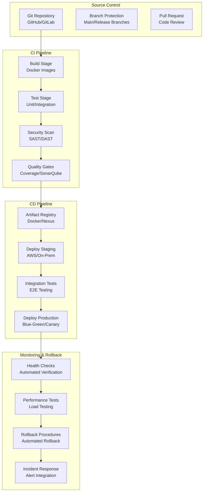
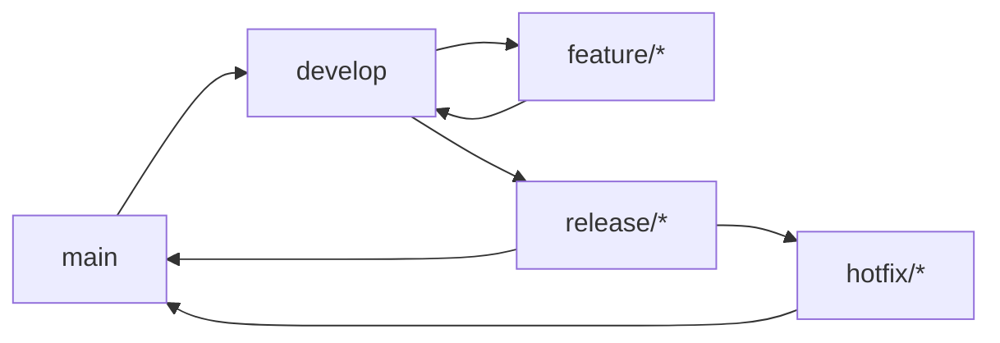

# CI/CD Pipeline Design

## Overview

This document outlines the comprehensive CI/CD pipeline for the real-time anti-fraud detection system, supporting both cloud-native (AWS/Databricks) and on-premises (Kubernetes) deployments. The pipeline ensures automated testing, security scanning, and reliable deployments across multiple environments.

## CI/CD Architecture Overview



## GitOps Workflow

### Branching Strategy



### Repository Structure

```
fraud-detection-system/
├── .github/
│   ├── workflows/
│   │   ├── ci-pipeline.yml
│   │   ├── cd-aws.yml
│   │   └── cd-onprem.yml
│   └── dependabot.yml
├── k8s/
│   ├── base/
│   ├── overlays/
│   │   ├── staging/
│   │   └── production/
│   └── helm-charts/
├── docker/
│   ├── Dockerfile.api
│   ├── Dockerfile.worker
│   └── docker-compose.yml
├── infrastructure/
│   ├── terraform/
│   │   ├── aws/
│   │   └── onprem/
│   └── ansible/
├── src/
│   ├── api/
│   ├── worker/
│   ├── models/
│   └── tests/
├── docs/
└── scripts/
```

## CI Pipeline Configuration

### GitHub Actions CI Pipeline

```yaml
# .github/workflows/ci-pipeline.yml
name: CI Pipeline

on:
  push:
    branches: [ main, develop ]
  pull_request:
    branches: [ main, develop ]

env:
  REGISTRY: ghcr.io
  IMAGE_NAME: ${{ github.repository }}

jobs:
  build-and-test:
    runs-on: ubuntu-latest
    strategy:
      matrix:
        python-version: [3.9, 3.10]

    steps:
    - name: Checkout code
      uses: actions/checkout@v3

    - name: Set up Python
      uses: actions/setup-python@v4
      with:
        python-version: ${{ matrix.python-version }}

    - name: Cache pip dependencies
      uses: actions/cache@v3
      with:
        path: ~/.cache/pip
        key: ${{ runner.os }}-pip-${{ hashFiles('**/requirements*.txt') }}
        restore-keys: |
          ${{ runner.os }}-pip-

    - name: Install dependencies
      run: |
        python -m pip install --upgrade pip
        pip install -r requirements.txt
        pip install -r requirements-dev.txt

    - name: Run linting
      run: |
        flake8 src/ --count --select=E9,F63,F7,F82 --show-source --statistics
        black --check src/
        isort --check-only src/

    - name: Run unit tests
      run: |
        pytest src/tests/unit/ -v --cov=src --cov-report=xml --cov-report=html

    - name: Run integration tests
      run: |
        pytest src/tests/integration/ -v --cov=src --cov-append --cov-report=xml

    - name: Upload coverage reports
      uses: codecov/codecov-action@v3
      with:
        file: ./coverage.xml

    - name: Security scan with Bandit
      run: |
        bandit -r src/ -f json -o security-report.json
        bandit -r src/ --exit-zero

    - name: Upload security report
      uses: actions/upload-artifact@v3
      with:
        name: security-report
        path: security-report.json

  build-docker:
    needs: build-and-test
    runs-on: ubuntu-latest
    if: github.ref == 'refs/heads/main' || github.ref == 'refs/heads/develop'

    steps:
    - name: Checkout code
      uses: actions/checkout@v3

    - name: Set up Docker Buildx
      uses: actions/docker/setup-buildx-action@v2

    - name: Log in to Container Registry
      uses: docker/login-action@v2
      with:
        registry: ${{ env.REGISTRY }}
        username: ${{ github.actor }}
        password: ${{ secrets.GITHUB_TOKEN }}

    - name: Extract metadata
      id: meta
      uses: docker/metadata-action@v4
      with:
        images: ${{ env.REGISTRY }}/${{ env.IMAGE_NAME }}
        tags: |
          type=ref,event=branch
          type=ref,event=pr
          type=sha

    - name: Build and push Docker image
      uses: docker/build-push-action@v4
      with:
        context: .
        push: true
        tags: ${{ steps.meta.outputs.tags }}
        labels: ${{ steps.meta.outputs.labels }}
        cache-from: type=gha
        cache-to: type=gha,mode=max

  quality-gate:
    needs: [build-and-test, build-docker]
    runs-on: ubuntu-latest
    if: github.ref == 'refs/heads/main'

    steps:
    - name: Checkout code
      uses: actions/checkout@v3

    - name: SonarQube Scan
      uses: SonarSource/sonarqube-scan-action@v1
      env:
        SONAR_TOKEN: ${{ secrets.SONAR_TOKEN }}
        SONAR_HOST_URL: ${{ secrets.SONAR_HOST_URL }}

    - name: Quality Gate Check
      uses: SonarSource/sonarqube-quality-gate-action@v1
```

### Advanced CI Features

```yaml
# Dependency vulnerability scanning
- name: Dependency check
  uses: dependency-check/Dependency-Check_Action@1.1.0
  with:
    project: 'fraud-detection'
    path: '.'
    format: 'ALL'
    args: >
      --enableRetired
      --enableExperimental
      --nvdValidForHours 24

# Container image scanning
- name: Scan Docker image
  uses: anchore/scan-action@v3
  with:
    image: ${{ env.REGISTRY }}/${{ env.IMAGE_NAME }}:latest
    fail-build: true
    severity-cutoff: high

# Performance regression testing
- name: Performance tests
  run: |
    # Run performance benchmarks
    python -m pytest src/tests/performance/ -v --benchmark-only --benchmark-save=benchmarks

    # Compare with baseline
    python scripts/compare_performance.py benchmarks.json baseline.json
```

## CD Pipeline for AWS/Databricks

### AWS Deployment Pipeline

```yaml
# .github/workflows/cd-aws.yml
name: CD - AWS Deployment

on:
  push:
    branches: [ main ]
  workflow_dispatch:
    inputs:
      environment:
        description: 'Deployment environment'
        required: true
        default: 'staging'
        type: choice
        options:
        - staging
        - production

env:
  AWS_REGION: us-east-1
  TERRAFORM_VERSION: 1.5.0

jobs:
  terraform-plan:
    runs-on: ubuntu-latest
    environment: ${{ github.event.inputs.environment || 'staging' }}

    steps:
    - name: Checkout code
      uses: actions/checkout@v3

    - name: Configure AWS credentials
      uses: aws-actions/configure-aws-credentials@v2
      with:
        aws-access-key-id: ${{ secrets.AWS_ACCESS_KEY_ID }}
        aws-secret-access-key: ${{ secrets.AWS_SECRET_ACCESS_KEY }}
        aws-region: ${{ env.AWS_REGION }}

    - name: Setup Terraform
      uses: hashicorp/setup-terraform@v2
      with:
        terraform_version: ${{ env.TERRAFORM_VERSION }}

    - name: Terraform Init
      run: |
        cd infrastructure/terraform/aws
        terraform init

    - name: Terraform Plan
      run: |
        cd infrastructure/terraform/aws
        terraform plan -var-file=${{ github.event.inputs.environment || 'staging' }}.tfvars -out=tfplan

    - name: Update Pull Request
      uses: actions/github-script@v6
      if: github.event_name == 'pull_request'
      env:
        PLAN: "terraform\n${{ steps.plan.outputs.stdout }}"
      with:
        github-token: ${{ secrets.GITHUB_TOKEN }}
        script: |
          const output = `#### Terraform Format and Validate 🖌\`${{ steps.fmt.outcome }}\`
          #### Terraform Plan 📖\`${{ steps.plan.outcome }}\`

          <details><summary>Show Plan</summary>

          \`\`\`\n
          ${process.env.PLAN}
          \`\`\`

          </details>

          *Pushed by: @${{ github.actor }}, Action: \`${{ github.event_name }}\`*`;

          github.rest.issues.createComment({
            issue_number: context.issue.number,
            owner: context.repo.owner,
            repo: context.repo.repo,
            body: output
          })

  deploy-staging:
    needs: terraform-plan
    runs-on: ubuntu-latest
    environment: staging
    if: github.ref == 'refs/heads/main' && github.event_name != 'pull_request'

    steps:
    - name: Checkout code
      uses: actions/checkout@v3

    - name: Configure AWS credentials
      uses: aws-actions/configure-aws-credentials@v2
      with:
        aws-access-key-id: ${{ secrets.AWS_ACCESS_KEY_ID }}
        aws-secret-access-key: ${{ secrets.AWS_SECRET_ACCESS_KEY }}
        aws-region: ${{ env.AWS_REGION }}

    - name: Deploy to Databricks
      run: |
        # Deploy notebooks and jobs to Databricks
        python scripts/deploy_databricks.py --environment staging

    - name: Run integration tests
      run: |
        # Run integration tests against staging
        python -m pytest src/tests/integration/ -v --env staging

    - name: Health check
      run: |
        # Wait for deployment to be healthy
        python scripts/health_check.py --environment staging --timeout 300

  deploy-production:
    needs: deploy-staging
    runs-on: ubuntu-latest
    environment: production
    if: github.ref == 'refs/heads/main' && github.event_name != 'pull_request'

    steps:
    - name: Checkout code
      uses: actions/checkout@v3

    - name: Configure AWS credentials
      uses: aws-actions/configure-aws-credentials@v2
      with:
        aws-access-key-id: ${{ secrets.AWS_ACCESS_KEY_ID }}
        aws-secret-access-key: ${{ secrets.AWS_SECRET_ACCESS_KEY }}
        aws-region: ${{ env.AWS_REGION }}

    - name: Blue-Green Deployment
      run: |
        # Deploy to blue environment
        python scripts/blue_green_deploy.py --target blue

        # Run smoke tests
        python scripts/smoke_tests.py --environment blue

        # Switch traffic to blue
        python scripts/traffic_switch.py --target blue

        # Monitor for 10 minutes
        python scripts/monitor_deployment.py --duration 600

        # If successful, decommission green
        python scripts/decommission.py --target green

  rollback:
    needs: deploy-production
    runs-on: ubuntu-latest
    environment: production
    if: failure() && github.ref == 'refs/heads/main'

    steps:
    - name: Rollback deployment
      run: |
        # Rollback to previous version
        python scripts/rollback.py --environment production
```

## CD Pipeline for On-Premises Kubernetes

### Kubernetes Deployment Pipeline

```yaml
# .github/workflows/cd-onprem.yml
name: CD - On-Premises Deployment

on:
  push:
    branches: [ main ]
  workflow_dispatch:
    inputs:
      environment:
        description: 'Deployment environment'
        required: true
        default: 'staging'
        type: choice
        options:
        - staging
        - production

jobs:
  build-helm:
    runs-on: ubuntu-latest

    steps:
    - name: Checkout code
      uses: actions/checkout@v3

    - name: Setup Helm
      uses: azure/setup-helm@v3
      with:
        version: v3.11.0

    - name: Lint Helm charts
      run: |
        helm lint k8s/helm-charts/fraud-detection

    - name: Package Helm chart
      run: |
        helm package k8s/helm-charts/fraud-detection -d artifacts/

    - name: Upload Helm package
      uses: actions/upload-artifact@v3
      with:
        name: helm-package
        path: artifacts/

  deploy-staging:
    needs: build-helm
    runs-on: [self-hosted, kubernetes]
    environment: staging

    steps:
    - name: Checkout code
      uses: actions/checkout@v3

    - name: Download Helm package
      uses: actions/download-artifact@v3
      with:
        name: helm-package
        path: artifacts/

    - name: Configure kubectl
      run: |
        aws eks update-kubeconfig --region ${{ secrets.AWS_REGION }} --name staging-cluster

    - name: Deploy to staging
      run: |
        # Deploy using ArgoCD or Helm
        helm upgrade --install fraud-detection-staging ./artifacts/fraud-detection-*.tgz \
          --namespace fraud-detection-staging \
          --values k8s/overlays/staging/values.yaml \
          --wait

    - name: Run integration tests
      run: |
        # Run tests against staging environment
        kubectl run test-runner --image=fraud-detection-test:latest \
          --restart=Never --rm --attach \
          --namespace=fraud-detection-staging \
          -- python -m pytest /app/tests/integration/

  deploy-production:
    needs: deploy-staging
    runs-on: [self-hosted, kubernetes]
    environment: production

    steps:
    - name: Checkout code
      uses: actions/checkout@v3

    - name: Configure kubectl
      run: |
        aws eks update-kubeconfig --region ${{ secrets.AWS_REGION }} --name prod-cluster

    - name: Canary deployment
      run: |
        # Deploy 10% of traffic to new version
        kubectl apply -f k8s/canary/

        # Wait and monitor
        sleep 300

        # Check metrics
        if python scripts/check_metrics.py --canary; then
          # Full deployment
          kubectl apply -f k8s/production/
        else
          # Rollback canary
          kubectl delete -f k8s/canary/
        fi

  post-deployment:
    needs: deploy-production
    runs-on: ubuntu-latest
    if: success()

    steps:
    - name: Update documentation
      run: |
        # Auto-update deployment docs
        python scripts/update_docs.py

    - name: Send notifications
      run: |
        # Notify teams of successful deployment
        python scripts/notify_deployment.py --status success
```

## Infrastructure as Code

### Terraform Configuration for AWS

```hcl
# infrastructure/terraform/aws/main.tf
terraform {
  required_providers {
    aws = {
      source  = "hashicorp/aws"
      version = "~> 5.0"
    }
    databricks = {
      source  = "databricks/databricks"
      version = "~> 1.0"
    }
  }

  backend "s3" {
    bucket = "fraud-detection-tf-state"
    key    = "terraform.tfstate"
    region = "us-east-1"
  }
}

provider "aws" {
  region = var.aws_region
}

provider "databricks" {
  host  = var.databricks_host
  token = var.databricks_token
}

# VPC and networking
module "vpc" {
  source = "./modules/vpc"

  name = "fraud-detection"
  cidr = "10.0.0.0/16"

  azs             = ["${var.aws_region}a", "${var.aws_region}b", "${var.aws_region}c"]
  private_subnets = ["10.0.1.0/24", "10.0.2.0/24", "10.0.3.0/24"]
  public_subnets  = ["10.0.101.0/24", "10.0.102.0/24", "10.0.103.0/24"]

  enable_nat_gateway = true
  single_nat_gateway = true
}

# Databricks workspace
resource "databricks_workspace_conf" "this" {
  custom_config = {
    "enableIpAccessLists" = true
    "enableTokensConfig"  = true
  }
}

# Kinesis streams
resource "aws_kinesis_stream" "transactions" {
  name             = "fraud-detection-transactions"
  shard_count      = var.kinesis_shard_count
  retention_period = 24

  shard_level_metrics = [
    "IncomingBytes",
    "OutgoingBytes",
    "IncomingRecords",
    "OutgoingRecords",
    "IteratorAgeMilliseconds",
    "ReadProvisionedThroughputExceeded",
    "WriteProvisionedThroughputExceeded"
  ]

  tags = {
    Name        = "fraud-detection-transactions"
    Environment = var.environment
  }
}

# S3 buckets for data lake
resource "aws_s3_bucket" "data_lake" {
  bucket = "fraud-detection-data-lake-${var.environment}"

  tags = {
    Name        = "fraud-detection-data-lake"
    Environment = var.environment
  }
}

resource "aws_s3_bucket_versioning" "data_lake" {
  bucket = aws_s3_bucket.data_lake.id
  versioning_configuration {
    status = "Enabled"
  }
}

resource "aws_s3_bucket_server_side_encryption_configuration" "data_lake" {
  bucket = aws_s3_bucket.data_lake.id

  rule {
    apply_server_side_encryption_by_default {
      sse_algorithm = "AES256"
    }
  }
}

# IAM roles
resource "aws_iam_role" "databricks_access" {
  name = "fraud-detection-databricks-access"

  assume_role_policy = jsonencode({
    Version = "2012-10-17"
    Statement = [
      {
        Effect = "Allow"
        Principal = {
          AWS = "arn:aws:iam::${var.databricks_account_id}:root"
        }
        Action = "sts:AssumeRole"
        Condition = {
          StringEquals = {
            "sts:ExternalId" = var.databricks_external_id
          }
        }
      }
    ]
  })
}

resource "aws_iam_role_policy" "databricks_access" {
  name = "fraud-detection-databricks-policy"
  role = aws_iam_role.databricks_access.id

  policy = jsonencode({
    Version = "2012-10-17"
    Statement = [
      {
        Effect = "Allow"
        Action = [
          "s3:GetObject",
          "s3:PutObject",
          "s3:DeleteObject",
          "s3:ListBucket"
        ]
        Resource = [
          aws_s3_bucket.data_lake.arn,
          "${aws_s3_bucket.data_lake.arn}/*"
        ]
      },
      {
        Effect = "Allow"
        Action = [
          "kinesis:GetRecords",
          "kinesis:GetShardIterator",
          "kinesis:DescribeStream"
        ]
        Resource = aws_kinesis_stream.transactions.arn
      }
    ]
  })
}
```

### Ansible Configuration for On-Premises

```yaml
# infrastructure/ansible/playbook.yml
---
- name: Deploy Fraud Detection System
  hosts: all
  become: yes
  vars_files:
    - vars/{{ environment }}.yml

  pre_tasks:
    - name: Update package cache
      apt:
        update_cache: yes
      when: ansible_os_family == "Debian"

    - name: Install required packages
      package:
        name:
          - curl
          - wget
          - git
          - python3
          - python3-pip
        state: present

  roles:
    - role: docker
    - role: kubernetes
    - role: monitoring
    - role: security

  tasks:
    - name: Create namespaces
      kubernetes.core.k8s:
        definition:
          apiVersion: v1
          kind: Namespace
          metadata:
            name: "{{ item }}"
        state: present
      loop:
        - fraud-detection
        - monitoring
        - ingress-nginx

    - name: Deploy ingress controller
      kubernetes.core.k8s:
        definition: "{{ lookup('template', 'ingress-controller.yml.j2') }}"
        state: present

    - name: Deploy monitoring stack
      kubernetes.core.k8s:
        definition: "{{ lookup('template', item + '.yml.j2') }}"
        state: present
      loop:
        - prometheus
        - grafana
        - elasticsearch

    - name: Deploy application
      kubernetes.core.helm:
        name: fraud-detection
        chart_ref: ../k8s/helm-charts/fraud-detection
        release_namespace: fraud-detection
        values_files:
          - values/{{ environment }}.yml
        wait: yes
        timeout: "600s"

    - name: Run post-deployment tests
      command: |
        python3 scripts/post_deploy_tests.py --environment {{ environment }}
      args:
        chdir: /opt/fraud-detection

    - name: Update DNS records
      route53:
        state: present
        zone: "{{ dns_zone }}"
        record: "{{ app_domain }}"
        type: A
        value: "{{ load_balancer_ip }}"
        alias: no
      delegate_to: localhost
      when: environment == "production"
```

## Testing Strategy

### Multi-Level Testing

```yaml
# Test configuration
test_config:
  unit_tests:
    coverage_target: 80
    timeout: 300
    parallel: true

  integration_tests:
    environments:
      - staging
      - production
    timeout: 600
    retries: 3

  e2e_tests:
    scenarios:
      - transaction_processing
      - fraud_detection
      - alerting
    timeout: 900

  performance_tests:
    load_levels:
      - 100_tps
      - 1000_tps
      - 10000_tps
    duration: 3600  # 1 hour
    latency_p95_target: 100  # ms

  chaos_tests:
    experiments:
      - pod_failure
      - network_partition
      - resource_exhaustion
    duration: 1800  # 30 minutes
```

### Automated Testing Pipeline

```python
# scripts/run_tests.py
import subprocess
import sys
from typing import Dict, List, Any

class TestRunner:
    """Automated test runner for CI/CD pipeline"""

    def __init__(self, config: Dict[str, Any]):
        self.config = config

    def run_unit_tests(self) -> bool:
        """Run unit tests with coverage"""
        cmd = [
            "pytest",
            "src/tests/unit/",
            "-v",
            "--cov=src",
            "--cov-report=xml",
            "--cov-report=html",
            f"--cov-fail-under={self.config['unit_tests']['coverage_target']}",
            "--timeout=300"
        ]

        if self.config['unit_tests']['parallel']:
            cmd.extend(["-n", "auto"])

        return self._run_command(cmd)

    def run_integration_tests(self, environment: str) -> bool:
        """Run integration tests against specific environment"""
        cmd = [
            "pytest",
            "src/tests/integration/",
            "-v",
            "--timeout=600",
            "--retries=3",
            f"--env={environment}"
        ]

        return self._run_command(cmd)

    def run_e2e_tests(self) -> bool:
        """Run end-to-end tests"""
        success = True

        for scenario in self.config['e2e_tests']['scenarios']:
            cmd = [
                "pytest",
                f"src/tests/e2e/test_{scenario}.py",
                "-v",
                "--timeout=900"
            ]

            if not self._run_command(cmd):
                success = false

        return success

    def run_performance_tests(self) -> bool:
        """Run performance and load tests"""
        success = True

        for load_level in self.config['performance_tests']['load_levels']:
            cmd = [
                "locust",
                "-f", f"src/tests/performance/{load_level}.py",
                "--headless",
                "-t", str(self.config['performance_tests']['duration']),
                "--csv", f"results_{load_level}"
            ]

            if not self._run_command(cmd):
                success = False

        return success

    def _run_command(self, cmd: List[str]) -> bool:
        """Run a command and return success status"""
        try:
            result = subprocess.run(cmd, capture_output=True, text=True, timeout=3600)
            if result.returncode == 0:
                print(f"✓ Command succeeded: {' '.join(cmd)}")
                return True
            else:
                print(f"✗ Command failed: {' '.join(cmd)}")
                print(f"STDOUT: {result.stdout}")
                print(f"STDERR: {result.stderr}")
                return False
        except subprocess.TimeoutExpired:
            print(f"✗ Command timed out: {' '.join(cmd)}")
            return False
        except Exception as e:
            print(f"✗ Command error: {e}")
            return False

# Usage in CI/CD
if __name__ == "__main__":
    import yaml

    with open("test-config.yaml", "r") as f:
        config = yaml.safe_load(f)

    runner = TestRunner(config)

    # Run test suite
    tests = [
        ("Unit Tests", runner.run_unit_tests),
        ("Integration Tests", lambda: runner.run_integration_tests("staging")),
        ("E2E Tests", runner.run_e2e_tests),
        ("Performance Tests", runner.run_performance_tests)
    ]

    results = []
    for test_name, test_func in tests:
        print(f"Running {test_name}...")
        success = test_func()
        results.append((test_name, success))
        if not success:
            print(f"{test_name} failed!")
            sys.exit(1)

    print("All tests passed!")
```

## Security in CI/CD

### Secret Management

```yaml
# GitHub Actions secrets configuration
secrets:
  AWS_ACCESS_KEY_ID:
    description: "AWS access key for deployments"
  AWS_SECRET_ACCESS_KEY:
    description: "AWS secret key for deployments"
  DATABRICKS_TOKEN:
    description: "Databricks personal access token"
  SONAR_TOKEN:
    description: "SonarQube authentication token"
  DOCKERHUB_USERNAME:
    description: "Docker Hub username"
  DOCKERHUB_TOKEN:
    description: "Docker Hub access token"

# HashiCorp Vault integration
vault_config:
  address: "https://vault.company.com"
  auth_method: "github"
  secrets_path: "secret/fraud-detection"

# AWS Secrets Manager
secrets_manager:
  region: "us-east-1"
  secrets:
    - name: "fraud-detection/db"
      keys: ["username", "password", "host", "port"]
    - name: "fraud-detection/api-keys"
      keys: ["stripe_key", "twilio_sid", "twilio_token"]
```

### Security Scanning Integration

```yaml
# Security scanning in CI
- name: Run Trivy vulnerability scanner
  uses: aquasecurity/trivy-action@0.28.0
  with:
    scan-type: 'fs'
    scan-ref: '.'
    format: 'sarif'
    output: 'trivy-results.sarif'

- name: Upload Trivy scan results
  uses: github/codeql-action/upload-sarif@v2
  with:
    sarif_file: 'trivy-results.sarif'

- name: Run Snyk for dependency scanning
  uses: snyk/actions/python@0.4.0
  env:
    SNYK_TOKEN: ${{ secrets.SNYK_TOKEN }}
  with:
    args: --severity-threshold=high

- name: Run Checkov for infrastructure as code
  uses: bridgecrewio/checkov-action@v12
  with:
    directory: infrastructure/
    framework: terraform
    output_format: cli
    output_file_path: checkov-results.txt
```

This comprehensive CI/CD pipeline ensures automated, secure, and reliable deployments of the fraud detection system across multiple environments with extensive testing and monitoring capabilities.