# Compliance and Regulatory Requirements

## Overview

This document outlines the comprehensive compliance framework for the real-time anti-fraud detection system, ensuring adherence to global regulatory standards, data protection laws, and industry-specific requirements. The system implements multi-layered controls for data privacy, security, and auditability.

## Regulatory Framework Overview

```mermaid
graph TB
    subgraph "Global Standards"
        A1[PCI DSS<br/>Payment Card Industry]
        A2[GDPR<br/>General Data Protection Regulation]
        A3[CCPA<br/>California Consumer Privacy Act]
        A4[SOX<br/>Sarbanes-Oxley Act]
    end

    subgraph "Industry Standards"
        B1[Gaming Commission<br/>Requirements]
        B2[AML/KYC<br/>Anti-Money Laundering]
        B3[GLBA<br/>Gramm-Leach-Bliley Act]
        B4[FCRA<br/>Fair Credit Reporting Act]
    end

    subgraph "Security Frameworks"
        C1[ISO 27001<br/>Information Security]
        C2[NIST Cybersecurity<br/>Framework]
        C3[CIS Controls<br/>Center for Internet Security]
        C4[MITRE ATT&CK<br/>Adversarial Tactics]
    end

    subgraph "Implementation Layers"
        D1[Data Protection<br/>Encryption, Masking]
        D2[Access Control<br/>RBAC, Audit Logging]
        D3[Monitoring<br/>SIEM, Intrusion Detection]
        D4[Incident Response<br/>Breach Notification]
    end

    A1 --> D1
    A2 --> D2
    A3 --> D1
    A4 --> D4

    B1 --> D3
    B2 --> D2
    B3 --> D1
    B4 --> D4

    C1 --> D1
    C2 --> D3
    C3 --> D2
    C4 --> D4
```



## Data Protection and Privacy

### GDPR Compliance Implementation

```python
from typing import Dict, List, Any, Optional
from datetime import datetime, timedelta
import hashlib
import json
import uuid

class GDPRComplianceManager:
    """GDPR compliance management for data processing"""

    def __init__(self):
        self.consent_records = {}
        self.data_processing_records = {}
        self.retention_policies = {
            "player_data": 365,  # days
            "transaction_data": 2555,  # 7 years for AML
            "audit_logs": 2555,
            "model_predictions": 365
        }

    def record_data_processing(self, data_subject_id: str, processing_purpose: str,
                             legal_basis: str, data_categories: List[str]) -> str:
        """Record data processing activity for GDPR Article 30"""

        processing_id = str(uuid.uuid4())

        processing_record = {
            "processing_id": processing_id,
            "data_subject_id": data_subject_id,
            "processing_purpose": processing_purpose,
            "legal_basis": legal_basis,
            "data_categories": data_categories,
            "processing_start": datetime.utcnow().isoformat(),
            "data_controllers": ["Fraud Detection System"],
            "data_processors": ["AWS/Databricks", "On-premises Infrastructure"],
            "security_measures": [
                "End-to-end encryption",
                "Access controls",
                "Audit logging",
                "Data minimization"
            ]
        }

        self.data_processing_records[processing_id] = processing_record

        # Log to audit trail
        self._log_audit_event("data_processing_recorded", {
            "processing_id": processing_id,
            "data_subject_id": data_subject_id,
            "purpose": processing_purpose
        })

        return processing_id

    def check_consent(self, data_subject_id: str, processing_purpose: str) -> bool:
        """Check if data subject has given consent for processing"""

        if data_subject_id not in self.consent_records:
            return False

        consents = self.consent_records[data_subject_id]
        return any(
            consent["purpose"] == processing_purpose and
            consent["status"] == "granted" and
            datetime.fromisoformat(consent["expires"]) > datetime.utcnow()
            for consent in consents
        )

    def record_consent(self, data_subject_id: str, consent_data: Dict[str, Any]) -> str:
        """Record data subject consent"""

        consent_id = str(uuid.uuid4())

        consent_record = {
            "consent_id": consent_id,
            "data_subject_id": data_subject_id,
            "purpose": consent_data["purpose"],
            "status": "granted",
            "granted_at": datetime.utcnow().isoformat(),
            "expires": (datetime.utcnow() + timedelta(days=365)).isoformat(),
            "consent_mechanism": consent_data.get("mechanism", "web_form"),
            "withdrawal_allowed": True
        }

        if data_subject_id not in self.consent_records:
            self.consent_records[data_subject_id] = []

        self.consent_records[data_subject_id].append(consent_record)

        self._log_audit_event("consent_granted", {
            "consent_id": consent_id,
            "data_subject_id": data_subject_id,
            "purpose": consent_data["purpose"]
        })

        return consent_id

    def handle_data_subject_right(self, request_type: str, data_subject_id: str,
                                request_data: Dict[str, Any]) -> Dict[str, Any]:
        """Handle GDPR data subject rights requests"""

        response = {
            "request_id": str(uuid.uuid4()),
            "request_type": request_type,
            "data_subject_id": data_subject_id,
            "status": "processing",
            "timestamp": datetime.utcnow().isoformat()
        }

        if request_type == "access":
            # Article 15: Right of access
            response["data"] = self._get_subject_data(data_subject_id)
            response["status"] = "completed"

        elif request_type == "rectification":
            # Article 16: Right to rectification
            self._rectify_subject_data(data_subject_id, request_data)
            response["status"] = "completed"

        elif request_type == "erasure":
            # Article 17: Right to erasure
            self._erase_subject_data(data_subject_id)
            response["status"] = "completed"

        elif request_type == "restriction":
            # Article 18: Right to restriction of processing
            self._restrict_subject_processing(data_subject_id)
            response["status"] = "completed"

        elif request_type == "portability":
            # Article 20: Right to data portability
            response["data"] = self._export_subject_data(data_subject_id)
            response["status"] = "completed"

        elif request_type == "objection":
            # Article 21: Right to object
            self._object_to_processing(data_subject_id, request_data)
            response["status"] = "completed"

        self._log_audit_event("data_subject_right_exercised", {
            "request_type": request_type,
            "data_subject_id": data_subject_id,
            "response_id": response["request_id"]
        })

        return response

    def enforce_data_retention(self, data_type: str) -> int:
        """Enforce data retention policies and return deleted records count"""

        retention_days = self.retention_policies.get(data_type, 365)
        cutoff_date = datetime.utcnow() - timedelta(days=retention_days)

        # Implementation would query database and delete old records
        deleted_count = self._delete_old_records(data_type, cutoff_date)

        self._log_audit_event("data_retention_enforced", {
            "data_type": data_type,
            "retention_days": retention_days,
            "deleted_records": deleted_count
        })

        return deleted_count

    def _get_subject_data(self, data_subject_id: str) -> Dict[str, Any]:
        """Retrieve all data for a data subject"""
        # Implementation would query all relevant databases
        return {
            "personal_data": {},
            "processing_records": self.data_processing_records.get(data_subject_id, []),
            "consent_records": self.consent_records.get(data_subject_id, [])
        }

    def _rectify_subject_data(self, data_subject_id: str, correction_data: Dict[str, Any]):
        """Correct data subject information"""
        # Implementation would update relevant records
        pass

    def _erase_subject_data(self, data_subject_id: str):
        """Delete all data for a data subject"""
        # Implementation would delete from all systems
        pass

    def _restrict_subject_processing(self, data_subject_id: str):
        """Restrict processing of data subject data"""
        # Implementation would add processing restrictions
        pass

    def _export_subject_data(self, data_subject_id: str) -> Dict[str, Any]:
        """Export data subject data in portable format"""
        return self._get_subject_data(data_subject_id)

    def _object_to_processing(self, data_subject_id: str, objection_data: Dict[str, Any]):
        """Handle objection to processing"""
        # Implementation would stop relevant processing
        pass

    def _delete_old_records(self, data_type: str, cutoff_date: datetime) -> int:
        """Delete records older than cutoff date"""
        # Implementation would perform database deletion
        return 0

    def _log_audit_event(self, event_type: str, event_data: Dict[str, Any]):
        """Log compliance event to audit trail"""
        audit_event = {
            "event_id": str(uuid.uuid4()),
            "event_type": event_type,
            "timestamp": datetime.utcnow().isoformat(),
            "event_data": event_data,
            "compliance_framework": "GDPR"
        }

        # Write to audit log
        print(f"AUDIT: {json.dumps(audit_event)}")

# Usage
gdpr_manager = GDPRComplianceManager()

# Record data processing
processing_id = gdpr_manager.record_data_processing(
    data_subject_id="player_123",
    processing_purpose="fraud_detection",
    legal_basis="legitimate_interest",
    data_categories=["transaction_data", "behavioral_data"]
)

# Handle data subject rights request
response = gdpr_manager.handle_data_subject_right(
    request_type="access",
    data_subject_id="player_123",
    request_data={}
)
```

### Data Anonymization and Pseudonymization

```python
import hashlib
import hmac
import secrets
from cryptography.fernet import Fernet
from typing import Any, Dict, List

class DataAnonymizationEngine:
    """Data anonymization and pseudonymization engine"""

    def __init__(self, encryption_key: bytes = None):
        self.encryption_key = encryption_key or Fernet.generate_key()
        self.cipher = Fernet(self.encryption_key)
        self.salt = secrets.token_bytes(32)

    def pseudonymize_pii(self, data: Dict[str, Any], pii_fields: List[str]) -> Dict[str, Any]:
        """Pseudonymize personally identifiable information"""

        pseudonymized = data.copy()

        for field in pii_fields:
            if field in data:
                original_value = str(data[field])
                pseudonymized[field] = self._generate_pseudonym(original_value)

        return pseudonymized

    def _generate_pseudonym(self, value: str) -> str:
        """Generate consistent pseudonym for a value"""

        # Use HMAC for consistent pseudonymization
        hmac_obj = hmac.new(self.salt, value.encode(), hashlib.sha256)
        pseudonym = hmac_obj.hexdigest()[:16]  # First 16 chars

        return f"pseudo_{pseudonym}"

    def anonymize_data(self, data: Dict[str, Any], sensitive_fields: List[str]) -> Dict[str, Any]:
        """Anonymize sensitive data (irreversible)"""

        anonymized = data.copy()

        for field in sensitive_fields:
            if field in data:
                anonymized[field] = self._anonymize_value(data[field])

        return anonymized

    def _anonymize_value(self, value: Any) -> str:
        """Anonymize a value irreversibly"""

        if isinstance(value, str):
            # Replace with hash
            return hashlib.sha256(str(value).encode()).hexdigest()[:16]
        elif isinstance(value, (int, float)):
            # Generalize numeric values
            return self._generalize_numeric(value)
        else:
            return "anonymized"

    def _generalize_numeric(self, value: float) -> str:
        """Generalize numeric values for anonymity"""

        if value < 100:
            return "<100"
        elif value < 1000:
            return f"{(value // 100) * 100}-{((value // 100) + 1) * 100}"
        elif value < 10000:
            return f"{(value // 1000) * 1000}-{((value // 1000) + 1) * 1000}"
        else:
            return ">10000"

    def encrypt_sensitive_data(self, data: str) -> str:
        """Encrypt sensitive data for storage"""

        encrypted = self.cipher.encrypt(data.encode())
        return encrypted.decode()

    def decrypt_sensitive_data(self, encrypted_data: str) -> str:
        """Decrypt sensitive data"""

        decrypted = self.cipher.decrypt(encrypted_data.encode())
        return decrypted.decode()

    def create_data_masking_policy(self, data_type: str) -> Dict[str, str]:
        """Create data masking policy for different data types"""

        policies = {
            "player_data": {
                "email": "pseudonymize",
                "phone": "pseudonymize",
                "name": "anonymize",
                "address": "mask",
                "ip_address": "pseudonymize"
            },
            "transaction_data": {
                "card_number": "mask",
                "account_number": "pseudonymize",
                "amount": "keep",  # Amounts are not PII
                "merchant": "keep"
            },
            "behavioral_data": {
                "device_fingerprint": "pseudonymize",
                "session_id": "pseudonymize",
                "user_agent": "keep"
            }
        }

        return policies.get(data_type, {})

    def apply_data_masking(self, data: Dict[str, Any], data_type: str) -> Dict[str, Any]:
        """Apply data masking based on policy"""

        policy = self.create_data_masking_policy(data_type)
        masked = data.copy()

        for field, masking_type in policy.items():
            if field in data:
                if masking_type == "pseudonymize":
                    masked[field] = self._generate_pseudonym(str(data[field]))
                elif masking_type == "anonymize":
                    masked[field] = self._anonymize_value(data[field])
                elif masking_type == "mask":
                    masked[field] = self._mask_value(str(data[field]))
                # "keep" means no masking

        return masked

    def _mask_value(self, value: str) -> str:
        """Mask a value (e.g., credit card numbers)"""

        if len(value) <= 4:
            return "*" * len(value)

        # Show last 4 characters
        return "*" * (len(value) - 4) + value[-4:]

# Usage
anonymizer = DataAnonymizationEngine()

# Pseudonymize PII
player_data = {
    "player_id": "12345",
    "email": "john.doe@example.com",
    "phone": "+1234567890",
    "name": "John Doe"
}

pseudonymized = anonymizer.pseudonymize_pii(player_data, ["email", "phone"])
print(pseudonymized)
# Output: {'player_id': '12345', 'email': 'pseudo_a1b2c3d4...', 'phone': 'pseudo_e5f6g7h8...', 'name': 'John Doe'}

# Apply data masking policy
masked_transaction = anonymizer.apply_data_masking({
    "card_number": "4111111111111111",
    "amount": 100.50,
    "merchant": "Online Casino"
}, "transaction_data")

print(masked_transaction)
# Output: {'card_number': '************1111', 'amount': 100.50, 'merchant': 'Online Casino'}
```

## PCI DSS Compliance

### Payment Data Handling

```python
from typing import Dict, Any, List, Optional
from datetime import datetime, timedelta
import re

class PCIDSSComplianceManager:
    """PCI DSS compliance management for payment data"""

    def __init__(self):
        self.audit_logs = []
        self.encryption_keys = {}
        self.key_rotation_schedule = {}

    def validate_card_data(self, card_number: str) -> Dict[str, Any]:
        """Validate credit card data according to PCI DSS"""

        validation_result = {
            "is_valid": False,
            "card_type": None,
            "luhn_valid": False,
            "length_valid": False,
            "errors": []
        }

        # Remove spaces and dashes
        card_number = re.sub(r'[\s-]', '', card_number)

        # Check length
        if not 13 <= len(card_number) <= 19:
            validation_result["errors"].append("Invalid card number length")
            return validation_result

        validation_result["length_valid"] = True

        # Luhn algorithm validation
        validation_result["luhn_valid"] = self._validate_luhn(card_number)

        # Identify card type
        validation_result["card_type"] = self._identify_card_type(card_number)

        # Overall validation
        validation_result["is_valid"] = (
            validation_result["length_valid"] and
            validation_result["luhn_valid"] and
            validation_result["card_type"] is not None
        )

        # Log validation attempt
        self._log_pci_event("card_validation", {
            "card_type": validation_result["card_type"],
            "validation_success": validation_result["is_valid"],
            "timestamp": datetime.utcnow().isoformat()
        })

        return validation_result

    def _validate_luhn(self, card_number: str) -> bool:
        """Validate card number using Luhn algorithm"""

        def digits_of(n):
            return [int(d) for d in str(n)]

        digits = digits_of(card_number)
        odd_digits = digits[-1::-2]
        even_digits = digits[-2::-2]
        checksum = sum(odd_digits)

        for d in even_digits:
            checksum += sum(digits_of(d * 2))

        return checksum % 10 == 0

    def _identify_card_type(self, card_number: str) -> Optional[str]:
        """Identify credit card type"""

        card_patterns = {
            "Visa": r"^4[0-9]{12}(?:[0-9]{3})?$",
            "MasterCard": r"^5[1-5][0-9]{14}$",
            "American Express": r"^3[47][0-9]{13}$",
            "Discover": r"^6(?:011|5[0-9]{2})[0-9]{12}$",
            "JCB": r"^(?:2131|1800|35\d{3})\d{11}$"
        }

        for card_type, pattern in card_patterns.items():
            if re.match(pattern, card_number):
                return card_type

        return None

    def tokenize_card_data(self, card_data: Dict[str, Any]) -> Dict[str, Any]:
        """Tokenize sensitive card data"""

        tokenized = card_data.copy()

        # Generate token
        token = self._generate_secure_token()

        # Encrypt and store actual data (in production, use HSM)
        encrypted_data = self._encrypt_card_data(card_data)

        # Store mapping (in production, use secure token vault)
        self.encryption_keys[token] = encrypted_data

        # Replace sensitive data with token
        tokenized["card_number"] = token
        tokenized["cvv"] = "***"
        tokenized["expiry"] = "**/**"

        # Log tokenization
        self._log_pci_event("card_tokenization", {
            "token": token,
            "card_type": card_data.get("card_type"),
            "timestamp": datetime.utcnow().isoformat()
        })

        return tokenized

    def _generate_secure_token(self) -> str:
        """Generate a secure token for card data"""

        import secrets
        return f"tok_{secrets.token_hex(16)}"

    def _encrypt_card_data(self, card_data: Dict[str, Any]) -> str:
        """Encrypt card data (simplified - use proper encryption in production)"""

        # In production, use AES-256 with proper key management
        data_str = json.dumps(card_data)
        return data_str  # Placeholder - should be encrypted

    def detokenize_card_data(self, token: str) -> Optional[Dict[str, Any]]:
        """Retrieve original card data from token"""

        if token not in self.encryption_keys:
            return None

        # Log detokenization (security event)
        self._log_pci_event("card_detokenization", {
            "token": token,
            "timestamp": datetime.utcnow().isoformat()
        })

        # Decrypt and return
        encrypted_data = self.encryption_keys[token]
        return json.loads(encrypted_data)

    def enforce_data_retention(self) -> int:
        """Enforce PCI DSS data retention requirements"""

        # PCI DSS requires deletion of card data after processing
        # Delete data older than 24 hours
        cutoff_time = datetime.utcnow() - timedelta(hours=24)

        deleted_count = 0
        to_delete = []

        for token, data in self.encryption_keys.items():
            # Check if token is old enough to delete
            # In practice, you'd have timestamps
            if True:  # Placeholder condition
                to_delete.append(token)
                deleted_count += 1

        for token in to_delete:
            del self.encryption_keys[token]

        self._log_pci_event("data_retention_enforced", {
            "deleted_records": deleted_count,
            "retention_policy": "24_hours",
            "timestamp": datetime.utcnow().isoformat()
        })

        return deleted_count

    def _log_pci_event(self, event_type: str, event_data: Dict[str, Any]):
        """Log PCI DSS compliance event"""

        pci_event = {
            "event_id": str(uuid.uuid4()),
            "event_type": event_type,
            "timestamp": datetime.utcnow().isoformat(),
            "pci_requirement": self._map_to_pci_requirement(event_type),
            "event_data": event_data
        }

        self.audit_logs.append(pci_event)

        # In production, write to secure audit log
        print(f"PCI AUDIT: {json.dumps(pci_event)}")

    def _map_to_pci_requirement(self, event_type: str) -> str:
        """Map event type to PCI DSS requirement"""

        mapping = {
            "card_validation": "3.6",
            "card_tokenization": "3.4",
            "card_detokenization": "3.5",
            "data_retention_enforced": "3.1"
        }

        return mapping.get(event_type, "General")

# Usage
pci_manager = PCIDSSComplianceManager()

# Validate card
validation = pci_manager.validate_card_data("4111111111111111")
print(f"Card valid: {validation['is_valid']}, Type: {validation['card_type']}")

# Tokenize card data
card_data = {
    "card_number": "4111111111111111",
    "cvv": "123",
    "expiry": "12/25",
    "card_type": "Visa"
}

tokenized = pci_manager.tokenize_card_data(card_data)
print(f"Tokenized: {tokenized}")
```

## AML/KYC Compliance

### Transaction Monitoring for AML

```python
from typing import Dict, List, Any, Optional
from datetime import datetime, timedelta
import numpy as np

class AMLComplianceManager:
    """AML/KYC compliance management"""

    def __init__(self):
        self.sanctions_lists = {}
        self.kyc_records = {}
        self.transaction_monitoring_rules = self._load_aml_rules()

    def _load_aml_rules(self) -> Dict[str, Any]:
        """Load AML monitoring rules"""

        return {
            "large_transaction": {
                "threshold": 10000,
                "description": "Transactions over $10,000"
            },
            "rapid_movement": {
                "threshold": 5000,
                "time_window": 24,  # hours
                "description": "Rapid movement of funds"
            },
            "structuring": {
                "threshold": 9000,
                "time_window": 24,
                "description": "Structured transactions under reporting threshold"
            },
            "unusual_pattern": {
                "threshold": 2.0,  # standard deviations
                "description": "Unusual transaction patterns"
            }
        }

    def screen_against_sanctions(self, entity_data: Dict[str, Any]) -> Dict[str, Any]:
        """Screen entity against sanctions lists"""

        screening_result = {
            "entity_id": entity_data.get("entity_id"),
            "screened_at": datetime.utcnow().isoformat(),
            "matches": [],
            "risk_level": "low",
            "recommendations": []
        }

        # Check against OFAC SDN list (simplified)
        name = entity_data.get("name", "").upper()
        aliases = entity_data.get("aliases", [])

        sanctions_matches = []

        # Simplified sanctions screening
        for sanctioned_entity in self.sanctions_lists.get("ofac", []):
            if self._name_matches(name, sanctioned_entity["name"]):
                sanctions_matches.append({
                    "list": "OFAC",
                    "entity": sanctioned_entity,
                    "match_type": "name_exact"
                })

            for alias in aliases:
                if self._name_matches(alias.upper(), sanctioned_entity["name"]):
                    sanctions_matches.append({
                        "list": "OFAC",
                        "entity": sanctioned_entity,
                        "match_type": "alias"
                    })

        screening_result["matches"] = sanctions_matches

        if sanctions_matches:
            screening_result["risk_level"] = "high"
            screening_result["recommendations"].append("Freeze assets and report to authorities")

        # Log screening
        self._log_aml_event("sanctions_screening", {
            "entity_id": entity_data.get("entity_id"),
            "matches_found": len(sanctions_matches),
            "risk_level": screening_result["risk_level"]
        })

        return screening_result

    def _name_matches(self, name1: str, name2: str) -> bool:
        """Check if two names match (simplified fuzzy matching)"""

        # Simple exact match for demo
        return name1 == name2

    def monitor_transaction_aml(self, transaction: Dict[str, Any],
                              historical_transactions: List[Dict[str, Any]]) -> Dict[str, Any]:
        """Monitor transaction for AML compliance"""

        monitoring_result = {
            "transaction_id": transaction["transaction_id"],
            "player_id": transaction["player_id"],
            "aml_flags": [],
            "risk_score": 0.0,
            "recommendations": []
        }

        # Check AML rules
        for rule_name, rule_config in self.transaction_monitoring_rules.items():
            flag = self._check_aml_rule(rule_name, rule_config, transaction, historical_transactions)
            if flag:
                monitoring_result["aml_flags"].append(flag)
                monitoring_result["risk_score"] += flag["risk_score"]

        # Determine overall risk
        if monitoring_result["risk_score"] >= 3.0:
            monitoring_result["risk_level"] = "high"
            monitoring_result["recommendations"].append("Enhanced due diligence required")
        elif monitoring_result["risk_score"] >= 1.5:
            monitoring_result["risk_level"] = "medium"
            monitoring_result["recommendations"].append("Additional verification needed")
        else:
            monitoring_result["risk_level"] = "low"

        # Log monitoring
        self._log_aml_event("transaction_monitoring", {
            "transaction_id": transaction["transaction_id"],
            "flags_count": len(monitoring_result["aml_flags"]),
            "risk_score": monitoring_result["risk_score"],
            "risk_level": monitoring_result["risk_level"]
        })

        return monitoring_result

    def _check_aml_rule(self, rule_name: str, rule_config: Dict[str, Any],
                       transaction: Dict[str, Any], historical: List[Dict[str, Any]]) -> Optional[Dict[str, Any]]:
        """Check a specific AML rule"""

        amount = transaction.get("amount", 0)

        if rule_name == "large_transaction":
            if amount >= rule_config["threshold"]:
                return {
                    "rule": rule_name,
                    "description": rule_config["description"],
                    "amount": amount,
                    "threshold": rule_config["threshold"],
                    "risk_score": 1.0
                }

        elif rule_name == "rapid_movement":
            # Check for rapid fund movements
            recent_transactions = [
                t for t in historical
                if (datetime.fromisoformat(transaction["timestamp"]) -
                    datetime.fromisoformat(t["timestamp"])).total_seconds() < rule_config["time_window"] * 3600
            ]

            total_recent = sum(t.get("amount", 0) for t in recent_transactions)
            if total_recent >= rule_config["threshold"]:
                return {
                    "rule": rule_name,
                    "description": rule_config["description"],
                    "recent_total": total_recent,
                    "threshold": rule_config["threshold"],
                    "risk_score": 1.5
                }

        elif rule_name == "structuring":
            # Check for structuring (multiple transactions just under threshold)
            structuring_window = [
                t for t in historical
                if (datetime.fromisoformat(transaction["timestamp"]) -
                    datetime.fromisoformat(t["timestamp"])).total_seconds() < rule_config["time_window"] * 3600
                and t.get("amount", 0) < rule_config["threshold"]
            ]

            if len(structuring_window) >= 3:  # Multiple small transactions
                return {
                    "rule": rule_name,
                    "description": rule_config["description"],
                    "transaction_count": len(structuring_window),
                    "risk_score": 2.0
                }

        return None

    def perform_kyc_check(self, player_data: Dict[str, Any]) -> Dict[str, Any]:
        """Perform KYC check on player"""

        kyc_result = {
            "player_id": player_data["player_id"],
            "kyc_status": "unknown",
            "checks_performed": [],
            "risk_factors": [],
            "recommendations": []
        }

        # Document verification (simplified)
        if player_data.get("id_document_verified"):
            kyc_result["checks_performed"].append("document_verification")
        else:
            kyc_result["risk_factors"].append("unverified_identity")
            kyc_result["recommendations"].append("Request identity document verification")

        # Address verification
        if player_data.get("address_verified"):
            kyc_result["checks_performed"].append("address_verification")
        else:
            kyc_result["risk_factors"].append("unverified_address")

        # Source of funds
        if not player_data.get("source_of_funds_declared"):
            kyc_result["risk_factors"].append("unknown_fund_source")
            kyc_result["recommendations"].append("Verify source of funds")

        # PEP/Sanctions check
        sanctions_result = self.screen_against_sanctions(player_data)
        if sanctions_result["matches"]:
            kyc_result["risk_factors"].append("sanctions_match")
            kyc_result["recommendations"].append("Enhanced due diligence for sanctions match")

        # Determine KYC status
        if not kyc_result["risk_factors"]:
            kyc_result["kyc_status"] = "approved"
        elif len(kyc_result["risk_factors"]) <= 2:
            kyc_result["kyc_status"] = "pending_review"
        else:
            kyc_result["kyc_status"] = "rejected"

        # Store KYC record
        self.kyc_records[player_data["player_id"]] = kyc_result

        self._log_aml_event("kyc_check", {
            "player_id": player_data["player_id"],
            "kyc_status": kyc_result["kyc_status"],
            "risk_factors_count": len(kyc_result["risk_factors"])
        })

        return kyc_result

    def _log_aml_event(self, event_type: str, event_data: Dict[str, Any]):
        """Log AML compliance event"""

        aml_event = {
            "event_id": str(uuid.uuid4()),
            "event_type": event_type,
            "timestamp": datetime.utcnow().isoformat(),
            "aml_regulation": "BSA/AML",
            "event_data": event_data
        }

        # In production, write to secure audit log
        print(f"AML AUDIT: {json.dumps(aml_event)}")

# Usage
aml_manager = AMLComplianceManager()

# Screen entity against sanctions
screening = aml_manager.screen_against_sanctions({
    "entity_id": "player_123",
    "name": "JOHN DOE",
    "aliases": ["J DOE", "JOHN D"]
})

# Monitor transaction
transaction_result = aml_manager.monitor_transaction_aml({
    "transaction_id": "txn_123",
    "player_id": "player_123",
    "amount": 15000,
    "timestamp": datetime.utcnow().isoformat()
}, [])  # historical_transactions would be passed here

# Perform KYC check
kyc_result = aml_manager.perform_kyc_check({
    "player_id": "player_123",
    "id_document_verified": True,
    "address_verified": False,
    "source_of_funds_declared": True
})
```

## Audit and Reporting

### Comprehensive Audit Trail

```python
from typing import Dict, List, Any, Optional
from datetime import datetime
import json
import hashlib

class ComplianceAuditTrail:
    """Comprehensive audit trail for compliance reporting"""

    def __init__(self):
        self.audit_events = []
        self.immutable_log = []

    def log_compliance_event(self, framework: str, requirement: str,
                           event_type: str, event_data: Dict[str, Any],
                           user_id: Optional[str] = None, system_id: Optional[str] = None):
        """Log a compliance-related event"""

        audit_event = {
            "event_id": str(uuid.uuid4()),
            "timestamp": datetime.utcnow().isoformat(),
            "framework": framework,
            "requirement": requirement,
            "event_type": event_type,
            "event_data": event_data,
            "user_id": user_id,
            "system_id": system_id,
            "integrity_hash": None
        }

        # Calculate integrity hash
        event_copy = audit_event.copy()
        event_copy["integrity_hash"] = None
        event_str = json.dumps(event_copy, sort_keys=True)
        audit_event["integrity_hash"] = hashlib.sha256(event_str.encode()).hexdigest()

        self.audit_events.append(audit_event)

        # Add to immutable log
        self.immutable_log.append(audit_event)

        # In production, write to tamper-proof storage
        print(f"AUDIT [{framework}]: {event_type}")

    def generate_compliance_report(self, framework: str, start_date: datetime,
                                 end_date: datetime) -> Dict[str, Any]:
        """Generate compliance report for a specific framework"""

        relevant_events = [
            event for event in self.audit_events
            if event["framework"] == framework
            and start_date <= datetime.fromisoformat(event["timestamp"]) <= end_date
        ]

        report = {
            "framework": framework,
            "report_period": {
                "start": start_date.isoformat(),
                "end": end_date.isoformat()
            },
            "total_events": len(relevant_events),
            "events_by_type": {},
            "events_by_requirement": {},
            "integrity_check": self._verify_log_integrity(),
            "generated_at": datetime.utcnow().isoformat()
        }

        # Aggregate by event type
        for event in relevant_events:
            event_type = event["event_type"]
            requirement = event["requirement"]

            if event_type not in report["events_by_type"]:
                report["events_by_type"][event_type] = 0
            report["events_by_type"][event_type] += 1

            if requirement not in report["events_by_requirement"]:
                report["events_by_requirement"][requirement] = 0
            report["events_by_requirement"][requirement] += 1

        return report

    def _verify_log_integrity(self) -> bool:
        """Verify the integrity of the audit log"""

        for i, event in enumerate(self.immutable_log):
            # Recalculate hash
            event_copy = event.copy()
            original_hash = event_copy.pop("integrity_hash")
            event_str = json.dumps(event_copy, sort_keys=True)
            calculated_hash = hashlib.sha256(event_str.encode()).hexdigest()

            if calculated_hash != original_hash:
                return False

        return True

    def export_audit_log(self, format: str = "json") -> str:
        """Export audit log in specified format"""

        if format == "json":
            return json.dumps(self.immutable_log, indent=2)
        elif format == "csv":
            # Convert to CSV format
            if not self.immutable_log:
                return ""

            import csv
            import io

            output = io.StringIO()
            writer = csv.DictWriter(output, fieldnames=self.immutable_log[0].keys())
            writer.writeheader()
            writer.writerows(self.immutable_log)

            return output.getvalue()

        return ""

# Global audit trail
audit_trail = ComplianceAuditTrail()

# Usage examples
audit_trail.log_compliance_event(
    framework="GDPR",
    requirement="Article 30",
    event_type="data_processing_recorded",
    event_data={"processing_id": "proc_123", "purpose": "fraud_detection"},
    user_id="system"
)

audit_trail.log_compliance_event(
    framework="PCI DSS",
    requirement="3.4",
    event_type="card_data_encrypted",
    event_data={"card_token": "tok_abc123"},
    system_id="fraud-detection-api"
)

# Generate compliance report
report = audit_trail.generate_compliance_report(
    framework="GDPR",
    start_date=datetime.utcnow() - timedelta(days=30),
    end_date=datetime.utcnow()
)

print(f"GDPR Compliance Report: {report['total_events']} events")
```

This comprehensive compliance framework ensures the fraud detection system meets all regulatory requirements while maintaining data privacy, security, and auditability standards.