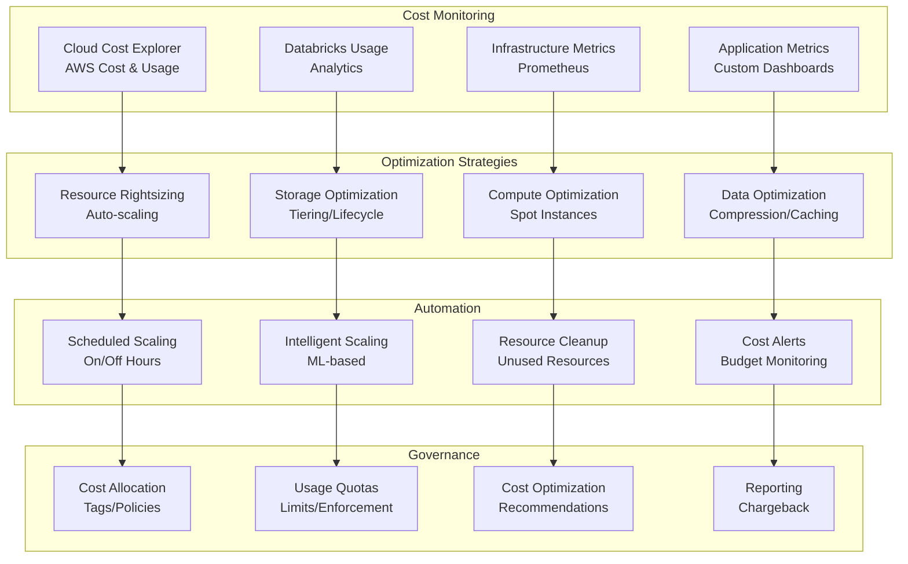

# Cost Optimization Strategies

## Overview

This document outlines comprehensive cost optimization strategies for the real-time anti-fraud detection system, covering both cloud (AWS/Databricks) and on-premises deployments. The strategies focus on maximizing efficiency while maintaining performance, reliability, and security requirements.

## Cost Optimization Architecture



## AWS Cost Optimization

### Compute Optimization

```python
# AWS Lambda reserved concurrency optimization
lambda_config = {
    "fraud_detection_api": {
        "reserved_concurrency": 100,  # Base load
        "provisioned_concurrency": 50  # For cold starts
    },
    "data_processing": {
        "reserved_concurrency": 200,
        "memory_size": 2048  # Optimize memory for cost
    }
}

# EC2 Auto Scaling with mixed instance types
autoscaling_config = {
    "mixed_instances_policy": {
        "launch_template": {
            "launch_template_specification": {
                "launch_template_name": "fraud-detection-asg",
                "version": "$Latest"
            },
            "overrides": [
                {
                    "instance_type": "m5.large",
                    "weighted_capacity": "1"
                },
                {
                    "instance_type": "m5.xlarge",
                    "weighted_capacity": "2"
                },
                {
                    "instance_type": "c5.large",
                    "weighted_capacity": "1"
                }
            ]
        }
    },
    "min_size": 2,
    "max_size": 20,
    "desired_capacity": 5,
    "target_group_arns": ["arn:aws:elasticloadbalancing:..."]
}
```

### Databricks Cost Optimization

```python
# Databricks cluster configuration for cost optimization
databricks_cost_config = {
    "clusters": {
        "ingestion_cluster": {
            "autoscale": {
                "min_workers": 1,
                "max_workers": 10
            },
            "autotermination_minutes": 30,
            "node_type_id": "i3.xlarge",  # Storage optimized for cost
            "driver_node_type_id": "i3.large"
        },
        "processing_cluster": {
            "autoscale": {
                "min_workers": 2,
                "max_workers": 50
            },
            "autotermination_minutes": 60,
            "node_type_id": "r5d.large",  # Memory optimized
            "spot_bid_price_percent": 100  # Use spot instances
        },
        "ml_training_cluster": {
            "autoscale": {
                "min_workers": 0,  # Start with 0 for job clusters
                "max_workers": 8
            },
            "autotermination_minutes": 120,
            "node_type_id": "g4dn.xlarge",  # GPU for ML, but cost-effective
            "enable_elastic_disk": True  # Use EBS for storage needs
        }
    },
    "instance_pools": {
        "hot_pool": {
            "node_type_id": "i3.2xlarge",
            "min_idle_instances": 2,
            "max_capacity": 10,
            "idle_instance_autotermination_minutes": 30
        },
        "warm_pool": {
            "node_type_id": "i3.xlarge",
            "min_idle_instances": 0,
            "max_capacity": 20,
            "idle_instance_autotermination_minutes": 60
        }
    }
}
```

### Storage Optimization

```python
# S3 Intelligent Tiering configuration
s3_intelligent_tiering = {
    "buckets": {
        "fraud-detection-data-lake": {
            "intelligent_tiering": {
                "status": "Enabled",
                "prefixes": [
                    {
                        "prefix": "bronze/",
                        "configuration": {
                            "id": "BronzeTiering",
                            "status": "Enabled",
                            "transitions": [
                                {
                                    "days": 30,
                                    "storage_class": "STANDARD_IA"
                                },
                                {
                                    "days": 90,
                                    "storage_class": "GLACIER"
                                },
                                {
                                    "days": 365,
                                    "storage_class": "DEEP_ARCHIVE"
                                }
                            ]
                        }
                    },
                    {
                        "prefix": "silver/",
                        "configuration": {
                            "id": "SilverTiering",
                            "status": "Enabled",
                            "transitions": [
                                {
                                    "days": 60,
                                    "storage_class": "STANDARD_IA"
                                },
                                {
                                    "days": 180,
                                    "storage_class": "GLACIER"
                                }
                            ]
                        }
                    }
                ]
            }
        }
    }
}

# Delta Lake optimization
delta_optimization_config = {
    "optimize_write": {
        "auto_compact": True,
        "optimize_write": True,
        "target_file_size": "128MB"
    },
    "z_order": {
        "columns": ["player_id", "timestamp", "fraud_score"],
        "frequency": "daily"
    },
    "vacuum": {
        "retention_hours": 168,  # 7 days
        "schedule": "0 2 * * *"  # Daily at 2 AM
    }
}
```

## On-Premises Cost Optimization

### Kubernetes Resource Optimization

```yaml
# Kubernetes resource optimization
k8s_optimization:
  # Vertical Pod Autoscaler
  vertical_pod_autoscaler:
    fraud_detection_api:
      updatePolicy:
        updateMode: "Auto"
      resourcePolicy:
        containerPolicies:
        - containerName: "api"
          minAllowed:
            cpu: "100m"
            memory: "128Mi"
          maxAllowed:
            cpu: "2000m"
            memory: "4Gi"
          controlledResources: ["cpu", "memory"]

  # Horizontal Pod Autoscaler
  horizontal_pod_autoscaler:
    model_serving:
      spec:
        scaleTargetRef:
          apiVersion: apps/v1
          kind: Deployment
          name: model-serving
        minReplicas: 2
        maxReplicas: 10
        metrics:
        - type: Resource
          resource:
            name: cpu
            target:
              type: Utilization
              averageUtilization: 70
        - type: Resource
          resource:
            name: memory
            target:
              type: Utilization
              averageUtilization: 80
        behavior:
          scaleDown:
            stabilizationWindowSeconds: 300
            policies:
            - type: Percent
              value: 10
              periodSeconds: 60

  # Cluster Autoscaler
  cluster_autoscaler:
    enabled: true
    expander: "least-waste"
    scale_down_delay_after_add: "10m"
    scale_down_unneeded_time: "10m"
    scale_down_utilization_threshold: 0.5
```

### Storage Optimization

```yaml
# Ceph/Rook storage optimization
ceph_optimization:
  storage_classes:
    - name: "fast-ssd"
      provisioner: "rook-ceph.rbd.csi.ceph.com"
      parameters:
        clusterID: "fraud-detection-cluster"
        pool: "ssd-pool"
        imageFormat: "2"
        imageFeatures: "rbd,mirroring"
        csi.storage.k8s.io/provisioner-secret-name: "csi-rbd-secret"
        csi.storage.k8s.io/provisioner-secret-namespace: "kube-system"
        csi.storage.k8s.io/controller-expand-secret-name: "csi-rbd-secret"
        csi.storage.k8s.io/controller-expand-secret-namespace: "kube-system"
        csi.storage.k8s.io/node-stage-secret-name: "csi-rbd-secret"
        csi.storage.k8s.io/node-stage-secret-namespace: "kube-system"
        csi.storage.k8s.io/fstype: "ext4"
      reclaimPolicy: "Delete"
      allowVolumeExpansion: true
      volumeBindingMode: "Immediate"

    - name: "slow-hdd"
      provisioner: "rook-ceph.rbd.csi.ceph.com"
      parameters:
        clusterID: "fraud-detection-cluster"
        pool: "hdd-pool"
        # Same parameters as fast-ssd but different pool

  # Storage tiering
  tiering_policy:
    rules:
      - name: "hot-data"
        conditions:
          - "access_frequency > 10_per_hour"
        storage_class: "fast-ssd"
      - name: "warm-data"
        conditions:
          - "access_frequency 1-10_per_hour"
          - "age < 30_days"
        storage_class: "slow-hdd"
      - name: "cold-data"
        conditions:
          - "access_frequency < 1_per_hour"
          - "age > 30_days"
        storage_class: "tape-archive"
```

## Automated Cost Management

### Cost Monitoring and Alerting

```python
import boto3
import pandas as pd
from datetime import datetime, timedelta
from typing import Dict, List, Any

class CostOptimizer:
    """Automated cost optimization system"""

    def __init__(self, aws_region: str = "us-east-1"):
        self.ce_client = boto3.client('ce', region_name=aws_region)
        self.cloudwatch = boto3.client('cloudwatch', region_name=aws_region)

    def get_cost_and_usage(self, start_date: str, end_date: str,
                          granularity: str = "DAILY") -> pd.DataFrame:
        """Get AWS cost and usage data"""

        response = self.ce_client.get_cost_and_usage(
            TimePeriod={
                'Start': start_date,
                'End': end_date
            },
            Granularity=granularity,
            Metrics=['BlendedCost', 'UsageQuantity'],
            GroupBy=[
                {
                    'Type': 'DIMENSION',
                    'Key': 'SERVICE'
                },
                {
                    'Type': 'DIMENSION',
                    'Key': 'AZ'
                }
            ]
        )

        # Convert to DataFrame
        data = []
        for result in response['ResultsByTime']:
            for group in result['Groups']:
                data.append({
                    'date': result['TimePeriod']['Start'],
                    'service': group['Keys'][0],
                    'az': group['Keys'][1],
                    'cost': float(group['Metrics']['BlendedCost']['Amount']),
                    'usage': float(group['Metrics']['UsageQuantity']['Amount'])
                })

        return pd.DataFrame(data)

    def analyze_cost_anomalies(self, days: int = 30) -> Dict[str, Any]:
        """Analyze cost anomalies using statistical methods"""

        end_date = datetime.utcnow()
        start_date = end_date - timedelta(days=days)

        df = self.get_cost_and_usage(
            start_date.strftime('%Y-%m-%d'),
            end_date.strftime('%Y-%m-%d')
        )

        # Calculate daily costs by service
        daily_costs = df.groupby(['date', 'service'])['cost'].sum().reset_index()

        # Detect anomalies using IQR method
        anomalies = []
        for service in daily_costs['service'].unique():
            service_data = daily_costs[daily_costs['service'] == service].copy()
            service_data = service_data.sort_values('date')

            # Calculate rolling statistics
            service_data['rolling_mean'] = service_data['cost'].rolling(window=7).mean()
            service_data['rolling_std'] = service_data['cost'].rolling(window=7).std()

            # Calculate z-scores
            service_data['z_score'] = (
                service_data['cost'] - service_data['rolling_mean']
            ) / service_data['rolling_std']

            # Flag anomalies (z-score > 3)
            service_anomalies = service_data[abs(service_data['z_score']) > 3]
            for _, anomaly in service_anomalies.iterrows():
                anomalies.append({
                    'date': anomaly['date'],
                    'service': service,
                    'cost': anomaly['cost'],
                    'expected_cost': anomaly['rolling_mean'],
                    'z_score': anomaly['z_score'],
                    'severity': 'high' if abs(anomaly['z_score']) > 5 else 'medium'
                })

        return {
            'anomalies': anomalies,
            'total_anomalies': len(anomalies),
            'analysis_period_days': days
        }

    def generate_cost_alerts(self, anomalies: List[Dict[str, Any]]):
        """Generate CloudWatch alarms for cost anomalies"""

        for anomaly in anomalies:
            if anomaly['severity'] == 'high':
                alarm_name = f"CostAnomaly-{anomaly['service']}-{anomaly['date']}"

                self.cloudwatch.put_metric_alarm(
                    AlarmName=alarm_name,
                    AlarmDescription=f"Cost anomaly detected for {anomaly['service']}",
                    MetricName="EstimatedCharges",
                    Namespace="AWS/Billing",
                    Statistic="Maximum",
                    Period=86400,  # 1 day
                    Threshold=anomaly['cost'] * 1.5,  # 50% above anomaly cost
                    ComparisonOperator="GreaterThanThreshold",
                    EvaluationPeriods=1,
                    AlarmActions=[
                        'arn:aws:sns:us-east-1:123456789012:cost-alerts'
                    ]
                )

    def optimize_resources(self) -> Dict[str, Any]:
        """Generate resource optimization recommendations"""

        recommendations = {
            'underutilized_instances': [],
            'unused_volumes': [],
            'idle_load_balancers': [],
            'old_snapshots': []
        }

        # Check for underutilized EC2 instances
        ec2 = boto3.client('ec2')
        cloudwatch = boto3.client('cloudwatch')

        instances = ec2.describe_instances()
        for reservation in instances['Reservations']:
            for instance in reservation['Instances']:
                instance_id = instance['InstanceId']

                # Get CPU utilization for last 7 days
                cpu_metrics = cloudwatch.get_metric_statistics(
                    Namespace='AWS/EC2',
                    MetricName='CPUUtilization',
                    Dimensions=[
                        {
                            'Name': 'InstanceId',
                            'Value': instance_id
                        }
                    ],
                    StartTime=datetime.utcnow() - timedelta(days=7),
                    EndTime=datetime.utcnow(),
                    Period=3600,
                    Statistics=['Average']
                )

                if cpu_metrics['Datapoints']:
                    avg_cpu = sum(dp['Average'] for dp in cpu_metrics['Datapoints']) / len(cpu_metrics['Datapoints'])
                    if avg_cpu < 20:  # Less than 20% utilization
                        recommendations['underutilized_instances'].append({
                            'instance_id': instance_id,
                            'avg_cpu': avg_cpu,
                            'recommendation': 'Consider stopping or resizing'
                        })

        return recommendations

    def implement_scheduled_scaling(self):
        """Implement scheduled scaling for predictable workloads"""

        # Scale down during off-hours (weekdays 6 PM - 6 AM, weekends)
        scheduled_actions = [
            {
                "ScheduledActionName": "scale-down-evenings",
                "Schedule": "cron(0 18 * * MON-FRI *)",  # 6 PM weekdays
                "MinSize": 2,
                "MaxSize": 5,
                "DesiredCapacity": 2
            },
            {
                "ScheduledActionName": "scale-up-mornings",
                "Schedule": "cron(0 6 * * MON-FRI *)",  # 6 AM weekdays
                "MinSize": 2,
                "MaxSize": 20,
                "DesiredCapacity": 8
            },
            {
                "ScheduledActionName": "weekend-scaling",
                "Schedule": "cron(0 0 * * SAT *)",  # Saturdays
                "MinSize": 1,
                "MaxSize": 10,
                "DesiredCapacity": 3
            }
        ]

        autoscaling = boto3.client('autoscaling')
        for action in scheduled_actions:
            autoscaling.put_scheduled_update_group_action(
                AutoScalingGroupName="fraud-detection-asg",
                **action
            )

# Usage
cost_optimizer = CostOptimizer()

# Analyze cost anomalies
anomalies = cost_optimizer.analyze_cost_anomalies(days=30)
print(f"Found {anomalies['total_anomalies']} cost anomalies")

# Generate alerts for high-severity anomalies
cost_optimizer.generate_cost_alerts(anomalies['anomalies'])

# Get optimization recommendations
recommendations = cost_optimizer.optimize_resources()
print(f"Found {len(recommendations['underutilized_instances'])} underutilized instances")

# Implement scheduled scaling
cost_optimizer.implement_scheduled_scaling()
```

### Intelligent Resource Scaling

```python
from sklearn.ensemble import RandomForestRegressor
from sklearn.preprocessing import StandardScaler
import numpy as np
from datetime import datetime, timedelta

class IntelligentScaler:
    """ML-based intelligent scaling system"""

    def __init__(self):
        self.models = {}
        self.scalers = {}
        self.training_data = {}

    def train_scaling_model(self, metric_name: str, days_history: int = 30):
        """Train ML model to predict optimal resource allocation"""

        # Collect historical metrics and scaling decisions
        historical_data = self._get_historical_metrics(metric_name, days_history)

        if len(historical_data) < 100:
            print(f"Insufficient data for training {metric_name}")
            return

        # Prepare features
        df = pd.DataFrame(historical_data)
        df['hour'] = pd.to_datetime(df['timestamp']).dt.hour
        df['day_of_week'] = pd.to_datetime(df['timestamp']).dt.dayofweek
        df['is_weekend'] = df['day_of_week'].isin([5, 6]).astype(int)

        # Features for prediction
        features = ['cpu_usage', 'memory_usage', 'request_rate', 'hour', 'day_of_week', 'is_weekend']
        target = 'optimal_instances'

        X = df[features]
        y = df[target]

        # Scale features
        scaler = StandardScaler()
        X_scaled = scaler.fit_transform(X)

        # Train model
        model = RandomForestRegressor(n_estimators=100, random_state=42)
        model.fit(X_scaled, y)

        # Store model and scaler
        self.models[metric_name] = model
        self.scalers[metric_name] = scaler
        self.training_data[metric_name] = df

        print(f"Trained scaling model for {metric_name}")

    def predict_optimal_scaling(self, metric_name: str, current_metrics: Dict[str, float]) -> int:
        """Predict optimal number of instances based on current metrics"""

        if metric_name not in self.models:
            return 3  # Default fallback

        model = self.models[metric_name]
        scaler = self.scalers[metric_name]

        # Prepare current features
        now = datetime.utcnow()
        features = np.array([[
            current_metrics.get('cpu_usage', 50),
            current_metrics.get('memory_usage', 60),
            current_metrics.get('request_rate', 100),
            now.hour,
            now.weekday(),
            1 if now.weekday() >= 5 else 0
        ]])

        # Scale features
        features_scaled = scaler.transform(features)

        # Predict
        prediction = model.predict(features_scaled)[0]

        # Bound prediction
        optimal_instances = max(1, min(20, int(round(prediction))))

        return optimal_instances

    def _get_historical_metrics(self, metric_name: str, days: int) -> List[Dict[str, Any]]:
        """Get historical metrics and scaling decisions"""

        # In practice, this would query Prometheus/CloudWatch
        # For demo, generate synthetic data
        data = []
        base_time = datetime.utcnow() - timedelta(days=days)

        for i in range(days * 24):  # Hourly data
            timestamp = base_time + timedelta(hours=i)
            hour = timestamp.hour
            is_weekend = timestamp.weekday() >= 5

            # Simulate metrics based on time patterns
            base_load = 50 + 30 * np.sin(2 * np.pi * hour / 24)  # Daily pattern
            if is_weekend:
                base_load *= 0.7  # Lower on weekends

            cpu_usage = base_load + np.random.normal(0, 10)
            memory_usage = base_load + np.random.normal(0, 8)
            request_rate = base_load * 2 + np.random.normal(0, 20)

            # Simulate scaling decisions (simplified)
            optimal_instances = max(1, min(20, int(round((cpu_usage + memory_usage) / 20))))

            data.append({
                'timestamp': timestamp.isoformat(),
                'cpu_usage': cpu_usage,
                'memory_usage': memory_usage,
                'request_rate': request_rate,
                'optimal_instances': optimal_instances
            })

        return data

# Usage
scaler = IntelligentScaler()

# Train scaling model
scaler.train_scaling_model("fraud-detection-api")

# Predict optimal scaling
current_metrics = {
    'cpu_usage': 75.5,
    'memory_usage': 68.2,
    'request_rate': 150.0
}

optimal_instances = scaler.predict_optimal_scaling("fraud-detection-api", current_metrics)
print(f"Predicted optimal instances: {optimal_instances}")
```

## Cost Governance and Reporting

### Cost Allocation and Chargeback

```python
class CostGovernance:
    """Cost governance and chargeback system"""

    def __init__(self):
        self.cost_centers = {}
        self.budgets = {}
        self.allocation_rules = {}

    def setup_cost_allocation(self):
        """Set up cost allocation tags and rules"""

        # AWS resource tags
        resource_tags = {
            "Environment": ["production", "staging", "development"],
            "Team": ["fraud-detection", "data-engineering", "ml-ops"],
            "Project": ["anti-fraud-system"],
            "CostCenter": ["engineering", "operations", "security"]
        }

        # Cost allocation rules
        self.allocation_rules = {
            "fraud-detection": {
                "percentage": 60,
                "cost_center": "engineering"
            },
            "data-engineering": {
                "percentage": 30,
                "cost_center": "engineering"
            },
            "ml-ops": {
                "percentage": 10,
                "cost_center": "operations"
            }
        }

    def generate_chargeback_report(self, start_date: str, end_date: str) -> Dict[str, Any]:
        """Generate chargeback report by cost center"""

        # Get cost data
        cost_optimizer = CostOptimizer()
        cost_data = cost_optimizer.get_cost_and_usage(start_date, end_date)

        # Apply allocation rules
        allocated_costs = {}
        for _, row in cost_data.iterrows():
            service = row['service']
            cost = row['cost']

            # Find applicable allocation rule
            for team, rule in self.allocation_rules.items():
                if team in service.lower() or service.lower() in team:
                    cost_center = rule['cost_center']
                    allocated_cost = cost * (rule['percentage'] / 100)

                    if cost_center not in allocated_costs:
                        allocated_costs[cost_center] = 0
                    allocated_costs[cost_center] += allocated_cost
                    break

        return {
            "period": {"start": start_date, "end": end_date},
            "total_cost": cost_data['cost'].sum(),
            "allocated_costs": allocated_costs,
            "unallocated_cost": cost_data['cost'].sum() - sum(allocated_costs.values())
        }

    def set_budget_alerts(self):
        """Set up budget alerts"""

        budgets = {
            "engineering_monthly": {
                "amount": 50000,
                "unit": "USD",
                "time_unit": "MONTHLY"
            },
            "operations_monthly": {
                "amount": 20000,
                "unit": "USD",
                "time_unit": "MONTHLY"
            }
        }

        budgets_client = boto3.client('budgets')

        for budget_name, budget_config in budgets.items():
            budgets_client.create_budget(
                AccountId="123456789012",  # AWS account ID
                Budget={
                    "BudgetName": budget_name,
                    "BudgetLimit": {
                        "Amount": str(budget_config["amount"]),
                        "Unit": budget_config["unit"]
                    },
                    "TimeUnit": budget_config["time_unit"],
                    "BudgetType": "COST"
                },
                NotificationsWithSubscribers=[
                    {
                        "Notification": {
                            "NotificationType": "ACTUAL",
                            "ComparisonOperator": "GREATER_THAN",
                            "Threshold": 80,
                            "ThresholdType": "PERCENTAGE"
                        },
                        "Subscribers": [
                            {
                                "SubscriptionType": "EMAIL",
                                "Address": "cost-alerts@company.com"
                            }
                        ]
                    }
                ]
            )

# Usage
governance = CostGovernance()
governance.setup_cost_allocation()

# Generate chargeback report
report = governance.generate_chargeback_report("2024-01-01", "2024-01-31")
print(f"Total cost: ${report['total_cost']:.2f}")
print(f"Engineering cost: ${report['allocated_costs'].get('engineering', 0):.2f}")

# Set budget alerts
governance.set_budget_alerts()
```

## Data Optimization Strategies

### Compression and Encoding

```python
# Polars data compression configuration
polars_compression_config = {
    "write_options": {
        "compression": "snappy",  # Fast compression
        "statistics": True,       # Enable statistics for query optimization
        "row_group_size": 100000  # Optimize for query patterns
    },
    "read_options": {
        "cache": True,           # Enable caching
        "memory_map": True       # Memory map for large files
    }
}

# Delta Lake optimization
delta_compression_config = {
    "optimize_write": {
        "enabled": True,
        "target_file_size": "128MB"
    },
    "z_order_by": ["player_id", "timestamp"],  # Optimize for common queries
    "vacuum": {
        "enabled": True,
        "retention_hours": 168  # 7 days
    }
}
```

This comprehensive cost optimization strategy provides automated monitoring, intelligent scaling, and governance controls to minimize cloud and on-premises infrastructure costs while maintaining system performance and reliability.