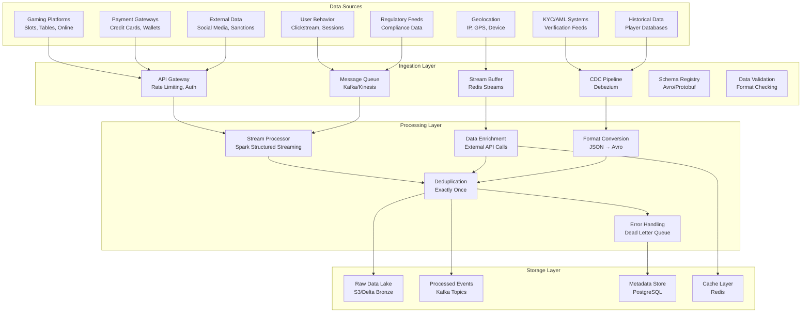
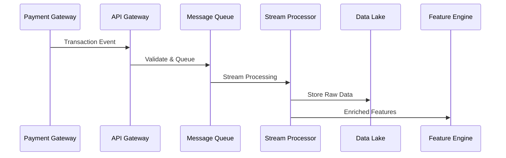
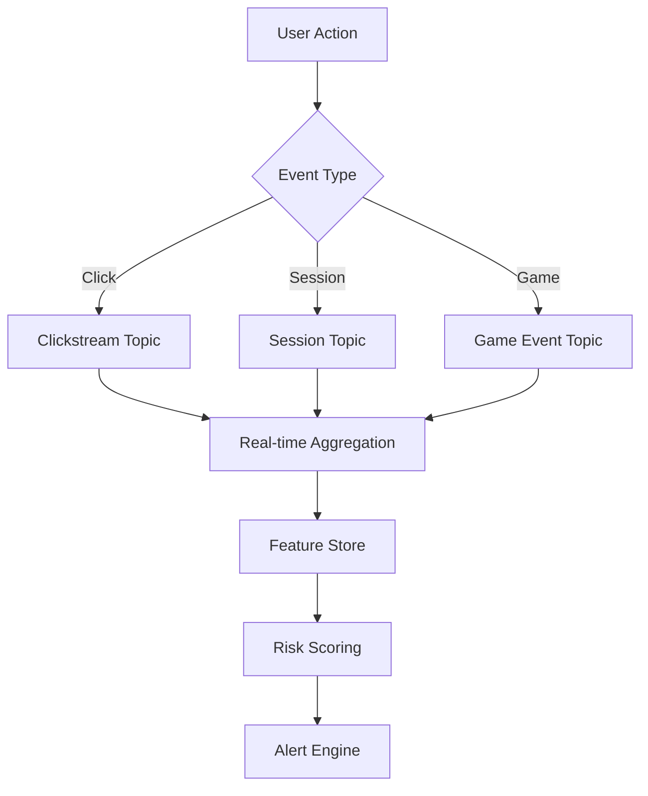
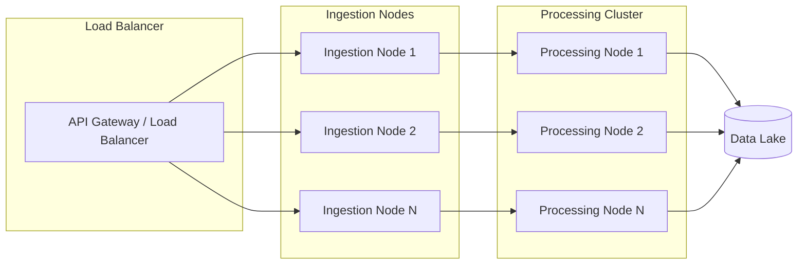

# Real-Time Data Collection Architecture

## Overview

The data collection architecture is designed to handle high-throughput, low-latency ingestion of diverse data sources with exactly-once semantics for critical financial transactions. The system supports multiple data formats and provides robust buffering and retry mechanisms.

## Architecture Components



## Data Flow Patterns

### Transaction Data Flow



### User Behavior Data Flow



## Technology Stack

### Primary Streaming Technologies

| Component | Technology | Purpose |
|-----------|------------|---------|
| Message Broker | Apache Kafka | High-throughput event streaming |
| Cloud Streaming | AWS Kinesis | Managed streaming for AWS |
| Low-latency Buffer | Redis Streams | Sub-millisecond buffering |
| CDC | Debezium | Database change capture |
| Schema Management | Confluent Schema Registry | Data contract enforcement |

### Data Formats and Protocols

```python
# Example Avro Schema for Transaction Events
transaction_schema = {
    "type": "record",
    "name": "TransactionEvent",
    "fields": [
        {"name": "event_id", "type": "string"},
        {"name": "player_id", "type": "string"},
        {"name": "amount", "type": {"type": "bytes", "logicalType": "decimal"}},
        {"name": "currency", "type": "string"},
        {"name": "timestamp", "type": {"type": "long", "logicalType": "timestamp-millis"}},
        {"name": "payment_method", "type": "string"},
        {"name": "game_type", "type": ["string", "null"]},
        {"name": "location", "type": {
            "type": "record",
            "name": "Location",
            "fields": [
                {"name": "ip_address", "type": "string"},
                {"name": "country", "type": "string"},
                {"name": "city", "type": ["string", "null"]}
            ]
        }},
        {"name": "device_fingerprint", "type": ["string", "null"]}
    ]
}
```

## Configuration Examples

### Kafka Topic Configuration

```yaml
# kafka-topics.yaml
topics:
  - name: transactions
    partitions: 12
    replication-factor: 3
    config:
      retention.ms: 604800000  # 7 days
      cleanup.policy: delete
      compression.type: lz4

  - name: user_events
    partitions: 24
    replication-factor: 3
    config:
      retention.ms: 259200000  # 3 days
      cleanup.policy: compact
      compression.type: snappy

  - name: game_events
    partitions: 36
    replication-factor: 3
    config:
      retention.ms: 86400000   # 1 day
      cleanup.policy: delete
      compression.type: gzip
```

### AWS Kinesis Configuration

```json
{
  "StreamName": "fraud-detection-events",
  "ShardCount": 20,
  "StreamModeDetails": {
    "StreamMode": "PROVISIONED"
  },
  "Tags": [
    {
      "Key": "Environment",
      "Value": "production"
    },
    {
      "Key": "Application",
      "Value": "fraud-detection"
    }
  ]
}
```

### Redis Streams Configuration

```redis
# Redis configuration for streams
stream-max-len 10000
stream-max-age 3600000  # 1 hour
stream-read-block-timeout 1000
stream-read-count 100
```

## Performance Characteristics

### Throughput Requirements

| Data Source | Volume | Frequency | Latency Requirement |
|-------------|--------|-----------|-------------------|
| Transactions | 100K/sec | Real-time | < 10ms |
| User Events | 500K/sec | Real-time | < 50ms |
| Game Events | 1M/sec | Real-time | < 100ms |
| CDC Updates | 10K/sec | Near real-time | < 1s |

### Scalability Design



## Error Handling and Resilience

### Retry and Dead Letter Queue Strategy

```python
from kafka import KafkaProducer
from redis import Redis
import json
from typing import Dict, Any

class ResilientProducer:
    def __init__(self, kafka_config: Dict[str, Any], redis_config: Dict[str, Any]):
        self.producer = KafkaProducer(**kafka_config)
        self.redis = Redis(**redis_config)
        self.max_retries = 3
        self.dlq_topic = "dead-letter-queue"

    def send_with_retry(self, topic: str, message: Dict[str, Any], key: str = None):
        """Send message with retry logic and DLQ fallback"""
        for attempt in range(self.max_retries):
            try:
                future = self.producer.send(topic, message, key=key)
                future.get(timeout=10)  # Wait for acknowledgment
                return True
            except Exception as e:
                print(f"Attempt {attempt + 1} failed: {e}")
                if attempt == self.max_retries - 1:
                    # Send to DLQ
                    dlq_message = {
                        "original_topic": topic,
                        "original_message": message,
                        "error": str(e),
                        "timestamp": datetime.utcnow().isoformat()
                    }
                    self.redis.xadd(self.dlq_topic, dlq_message)
                    return False
        return False
```

### Circuit Breaker Pattern

```python
import time
from enum import Enum

class CircuitState(Enum):
    CLOSED = "closed"
    OPEN = "open"
    HALF_OPEN = "half_open"

class CircuitBreaker:
    def __init__(self, failure_threshold: int = 5, recovery_timeout: int = 60):
        self.failure_threshold = failure_threshold
        self.recovery_timeout = recovery_timeout
        self.failure_count = 0
        self.last_failure_time = None
        self.state = CircuitState.CLOSED

    def call(self, func, *args, **kwargs):
        if self.state == CircuitState.OPEN:
            if time.time() - self.last_failure_time > self.recovery_timeout:
                self.state = CircuitState.HALF_OPEN
            else:
                raise Exception("Circuit breaker is OPEN")

        try:
            result = func(*args, **kwargs)
            self.on_success()
            return result
        except Exception as e:
            self.on_failure()
            raise e

    def on_success(self):
        self.failure_count = 0
        self.state = CircuitState.CLOSED

    def on_failure(self):
        self.failure_count += 1
        self.last_failure_time = time.time()
        if self.failure_count >= self.failure_threshold:
            self.state = CircuitState.OPEN
```

## Monitoring and Observability

### Key Metrics to Monitor

```python
# Prometheus metrics configuration
metrics = {
    "ingestion_rate": "Rate of events ingested per second",
    "processing_latency": "End-to-end processing latency",
    "error_rate": "Percentage of failed processing attempts",
    "queue_depth": "Number of unprocessed messages in queue",
    "throughput": "Events processed per second",
    "data_quality": "Percentage of valid vs invalid events"
}
```

### Logging Strategy

```python
import logging
import json
from datetime import datetime

class StructuredLogger:
    def __init__(self, service_name: str):
        self.logger = logging.getLogger(service_name)
        self.service_name = service_name

        # Configure structured logging
        formatter = logging.Formatter(
            json.dumps({
                "timestamp": "%(asctime)s",
                "level": "%(levelname)s",
                "service": service_name,
                "message": "%(message)s",
                "extra": "%(extra)s"
            })
        )

        handler = logging.StreamHandler()
        handler.setFormatter(formatter)
        self.logger.addHandler(handler)
        self.logger.setLevel(logging.INFO)

    def log_event(self, event_type: str, event_data: Dict[str, Any], level: str = "info"):
        extra = {
            "event_type": event_type,
            "event_data": event_data,
            "correlation_id": event_data.get("correlation_id", "unknown")
        }

        if level == "error":
            self.logger.error(f"Event: {event_type}", extra=extra)
        elif level == "warning":
            self.logger.warning(f"Event: {event_type}", extra=extra)
        else:
            self.logger.info(f"Event: {event_type}", extra=extra)
```

## Security Considerations

### Data Encryption

- **In Transit:** TLS 1.3 for all network communications
- **At Rest:** AES-256 encryption for stored data
- **Key Management:** AWS KMS or HashiCorp Vault

### Access Control

```yaml
# API Gateway security configuration
security:
  authentication:
    type: JWT
    issuer: "https://auth.casino.com"
    audience: "fraud-detection-api"

  authorization:
    type: RBAC
    roles:
      - admin: "full access"
      - analyst: "read-only access"
      - service: "api access"

  rate_limiting:
    requests_per_minute: 1000
    burst_limit: 2000
```

### Data Privacy

- PII data masking and anonymization
- Data retention policies per regulation
- Audit logging for all data access
- GDPR compliance for EU data subjects

## Deployment Configuration

### Docker Compose for Development

```yaml
version: '3.8'
services:
  kafka:
    image: confluentinc/cp-kafka:7.3.0
    ports:
      - "9092:9092"
    environment:
      KAFKA_ADVERTISED_LISTENERS: PLAINTEXT://localhost:9092
      KAFKA_OFFSETS_TOPIC_REPLICATION_FACTOR: 1

  redis:
    image: redis:8-alpine
    ports:
      - "6379:6379"

  ingestion-service:
    build: ./ingestion
    ports:
      - "8080:8080"
    depends_on:
      - kafka
      - redis
    environment:
      KAFKA_BOOTSTRAP_SERVERS: kafka:9092
      REDIS_URL: redis://redis:6379
```

### Kubernetes Deployment for Production

```yaml
apiVersion: apps/v1
kind: Deployment
metadata:
  name: data-ingestion-service
spec:
  replicas: 3
  selector:
    matchLabels:
      app: data-ingestion
  template:
    metadata:
      labels:
        app: data-ingestion
    spec:
      containers:
      - name: ingestion
        image: casino/fraud-detection:ingestion-v1.0
        ports:
        - containerPort: 8080
        env:
        - name: KAFKA_SERVERS
          value: "kafka-cluster:9092"
        - name: REDIS_CLUSTER
          value: "redis-cluster:6379"
        resources:
          requests:
            memory: "1Gi"
            cpu: "500m"
          limits:
            memory: "2Gi"
            cpu: "1000m"
        livenessProbe:
          httpGet:
            path: /health
            port: 8080
          initialDelaySeconds: 30
          periodSeconds: 10
        readinessProbe:
          httpGet:
            path: /ready
            port: 8080
          initialDelaySeconds: 5
          periodSeconds: 5
```

This architecture provides a robust, scalable foundation for real-time data collection with comprehensive error handling, monitoring, and security features.