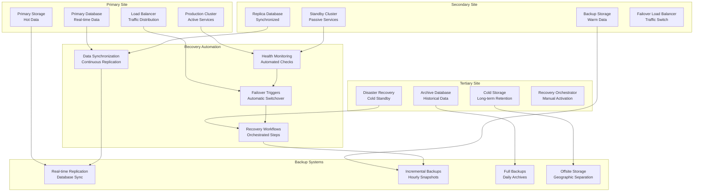

# Disaster Recovery and Business Continuity

## Overview

This document outlines the comprehensive disaster recovery (DR) and business continuity (BC) strategy for the real-time anti-fraud detection system. The strategy ensures system availability, data integrity, and rapid recovery in the event of disasters, cyber attacks, or system failures while maintaining regulatory compliance.

## DR/BC Architecture Overview



## Recovery Time and Recovery Point Objectives

### RTO/RPO Definitions

```python
from enum import Enum
from typing import Dict, Any

class RecoveryTier(Enum):
    CRITICAL = "critical"      # Core fraud detection (RTO: 5min, RPO: 1min)
    HIGH = "high"             # Transaction processing (RTO: 15min, RPO: 5min)
    MEDIUM = "medium"         # Analytics and reporting (RTO: 1hr, RPO: 15min)
    LOW = "low"              # Historical data (RTO: 4hr, RPO: 1hr)

class RecoveryObjectives:
    """Recovery Time Objective and Recovery Point Objective definitions"""

    OBJECTIVES = {
        RecoveryTier.CRITICAL: {
            "rto_minutes": 5,      # Recovery Time Objective
            "rpo_minutes": 1,      # Recovery Point Objective
            "data_loss_max": "1 minute of transactions",
            "availability_sla": "99.99%",
            "components": [
                "real-time scoring engine",
                "alerting system",
                "primary database"
            ]
        },
        RecoveryTier.HIGH: {
            "rto_minutes": 15,
            "rpo_minutes": 5,
            "data_loss_max": "5 minutes of transactions",
            "availability_sla": "99.95%",
            "components": [
                "transaction processing",
                "feature engineering",
                "model serving"
            ]
        },
        RecoveryTier.MEDIUM: {
            "rto_minutes": 60,
            "rpo_minutes": 15,
            "data_loss_max": "15 minutes of data",
            "availability_sla": "99.9%",
            "components": [
                "batch analytics",
                "reporting dashboards",
                "historical data access"
            ]
        },
        RecoveryTier.LOW: {
            "rto_minutes": 240,
            "rpo_minutes": 60,
            "data_loss_max": "1 hour of data",
            "availability_sla": "99.5%",
            "components": [
                "archived data",
                "audit logs",
                "compliance reports"
            ]
        }
    }

    @classmethod
    def get_objectives(cls, tier: RecoveryTier) -> Dict[str, Any]:
        """Get RTO/RPO objectives for a specific tier"""
        return cls.OBJECTIVES[tier]

    @classmethod
    def get_all_components(cls) -> Dict[str, RecoveryTier]:
        """Get all components mapped to their recovery tiers"""
        component_mapping = {}
        for tier, objectives in cls.OBJECTIVES.items():
            for component in objectives["components"]:
                component_mapping[component] = tier
        return component_mapping
```

## Multi-Site Deployment Strategy

### Active-Active Configuration

```yaml
# Kubernetes active-active configuration
active_active_config:
  clusters:
    - name: primary-us-east
      region: us-east-1
      role: active
      weight: 70
    - name: secondary-us-west
      region: us-west-2
      role: active
      weight: 30

  global_load_balancer:
    type: AWS Global Accelerator
    endpoints:
      - cluster: primary-us-east
        weight: 70
        health_checks:
          path: /health
          interval: 30s
          timeout: 5s
          healthy_threshold: 2
          unhealthy_threshold: 3
      - cluster: secondary-us-west
        weight: 30
        health_checks:
          path: /health
          interval: 30s
          timeout: 5s
          healthy_threshold: 2
          unhealthy_threshold: 3

  database_replication:
    type: PostgreSQL streaming replication
    mode: synchronous
    clusters:
      - primary: primary-us-east
      - standby: secondary-us-west
    failover:
      automatic: true
      trigger: connection_loss
      timeout: 30s
```

### Active-Passive Configuration

```yaml
# Kubernetes active-passive configuration
active_passive_config:
  clusters:
    - name: primary-us-east
      region: us-east-1
      role: active
      services:
        - fraud-detection-api
        - model-serving
        - alerting-system
    - name: dr-us-west
      region: us-west-2
      role: passive
      services:
        - fraud-detection-api
        - model-serving
        - alerting-system

  failover_mechanism:
    type: DNS-based
    provider: AWS Route 53
    health_checks:
      - name: primary-health-check
        type: HTTP
        resource_path: /health
        failure_threshold: 3
        request_interval: 30
      - name: dr-health-check
        type: HTTP
        resource_path: /health
        failure_threshold: 3
        request_interval: 30

  database_failover:
    type: PostgreSQL automatic failover
    tool: repmgr
    primary: primary-us-east
    standby: dr-us-west
    witness: dr-us-central
```

## Data Replication and Backup Strategy

### Real-Time Data Replication

```python
from typing import Dict, List, Any, Optional
import asyncio
import aiohttp
from datetime import datetime, timedelta

class DataReplicationManager:
    """Manages real-time data replication across sites"""

    def __init__(self, primary_site: str, secondary_sites: List[str]):
        self.primary_site = primary_site
        self.secondary_sites = secondary_sites
        self.replication_status = {}
        self.last_sync_times = {}

    async def start_replication(self):
        """Start real-time replication to all secondary sites"""

        tasks = []
        for site in self.secondary_sites:
            task = asyncio.create_task(self._replicate_to_site(site))
            tasks.append(task)

        await asyncio.gather(*tasks, return_exceptions=True)

    async def _replicate_to_site(self, site: str):
        """Replicate data to a specific site"""

        while True:
            try:
                # Get latest changes from primary
                changes = await self._get_changes_from_primary(site)

                if changes:
                    # Apply changes to secondary site
                    success = await self._apply_changes_to_secondary(site, changes)

                    if success:
                        self.last_sync_times[site] = datetime.utcnow()
                        self.replication_status[site] = "healthy"
                    else:
                        self.replication_status[site] = "error"
                        await self._handle_replication_error(site)
                else:
                    self.replication_status[site] = "healthy"

            except Exception as e:
                self.replication_status[site] = "error"
                print(f"Replication error for {site}: {e}")

            # Wait before next replication cycle
            await asyncio.sleep(5)  # 5 second intervals

    async def _get_changes_from_primary(self, site: str) -> Optional[List[Dict[str, Any]]]:
        """Get pending changes from primary site"""

        try:
            async with aiohttp.ClientSession() as session:
                # Get last sync time for this site
                last_sync = self.last_sync_times.get(site, datetime.utcnow() - timedelta(hours=1))

                params = {
                    "since": last_sync.isoformat(),
                    "site": site
                }

                async with session.get(
                    f"http://{self.primary_site}:8080/api/replication/changes",
                    params=params
                ) as response:
                    if response.status == 200:
                        return await response.json()
                    else:
                        return None

        except Exception as e:
            print(f"Error getting changes from primary: {e}")
            return None

    async def _apply_changes_to_secondary(self, site: str, changes: List[Dict[str, Any]]) -> bool:
        """Apply changes to secondary site"""

        try:
            async with aiohttp.ClientSession() as session:
                async with session.post(
                    f"http://{site}:8080/api/replication/apply",
                    json={"changes": changes}
                ) as response:
                    return response.status == 200

        except Exception as e:
            print(f"Error applying changes to {site}: {e}")
            return False

    async def _handle_replication_error(self, site: str):
        """Handle replication errors"""

        # Implement exponential backoff
        # Alert administrators
        # Check network connectivity
        # Attempt manual sync if needed

        print(f"Handling replication error for {site}")

    def get_replication_status(self) -> Dict[str, Any]:
        """Get current replication status"""

        return {
            "primary_site": self.primary_site,
            "secondary_sites": self.secondary_sites,
            "replication_status": self.replication_status,
            "last_sync_times": {
                site: sync_time.isoformat() if sync_time else None
                for site, sync_time in self.last_sync_times.items()
            },
            "lag_times": {
                site: (datetime.utcnow() - sync_time).total_seconds()
                if sync_time else None
                for site, sync_time in self.last_sync_times.items()
            }
        }

# Usage
replication_manager = DataReplicationManager(
    primary_site="primary-cluster",
    secondary_sites=["dr-cluster-1", "dr-cluster-2"]
)

# Start replication
await replication_manager.start_replication()

# Check status
status = replication_manager.get_replication_status()
print(f"Replication status: {status}")
```

### Backup Strategy

```python
from typing import Dict, List, Any, Optional
import subprocess
import shutil
from datetime import datetime, timedelta
from pathlib import Path

class BackupManager:
    """Comprehensive backup management system"""

    def __init__(self, backup_config: Dict[str, Any]):
        self.config = backup_config
        self.backup_root = Path(backup_config["backup_root"])
        self.retention_days = backup_config["retention_days"]

    async def create_backup(self, backup_type: str = "incremental") -> str:
        """Create a new backup"""

        timestamp = datetime.utcnow().strftime("%Y%m%d_%H%M%S")
        backup_name = f"{backup_type}_{timestamp}"

        if backup_type == "full":
            success = await self._create_full_backup(backup_name)
        elif backup_type == "incremental":
            success = await self._create_incremental_backup(backup_name)
        else:
            raise ValueError(f"Unknown backup type: {backup_type}")

        if success:
            # Clean up old backups
            await self._cleanup_old_backups()

            return backup_name
        else:
            raise Exception(f"Backup {backup_name} failed")

    async def _create_full_backup(self, backup_name: str) -> bool:
        """Create full database backup"""

        try:
            backup_path = self.backup_root / "full" / backup_name
            backup_path.mkdir(parents=True, exist_ok=True)

            # PostgreSQL full backup
            cmd = [
                "pg_dumpall",
                "-h", self.config["db_host"],
                "-U", self.config["db_user"],
                "-f", str(backup_path / "full_backup.sql")
            ]

            env = {"PGPASSWORD": self.config["db_password"]}
            result = await asyncio.create_subprocess_exec(
                *cmd, env=env, stdout=asyncio.subprocess.PIPE, stderr=asyncio.subprocess.PIPE
            )

            stdout, stderr = await result.communicate()

            if result.returncode == 0:
                # Backup configuration files
                config_files = [
                    "/etc/fraud-detection/config.yml",
                    "/etc/postgresql/postgresql.conf",
                    "/etc/redis/redis.conf"
                ]

                for config_file in config_files:
                    if Path(config_file).exists():
                        shutil.copy2(config_file, backup_path)

                return True
            else:
                print(f"Backup failed: {stderr.decode()}")
                return False

        except Exception as e:
            print(f"Full backup error: {e}")
            return False

    async def _create_incremental_backup(self, backup_name: str) -> bool:
        """Create incremental backup using WAL files"""

        try:
            backup_path = self.backup_root / "incremental" / backup_name
            backup_path.mkdir(parents=True, exist_ok=True)

            # Copy WAL files since last backup
            wal_source = Path("/var/lib/postgresql/wal")
            wal_dest = backup_path / "wal"

            if wal_source.exists():
                shutil.copytree(wal_source, wal_dest, dirs_exist_ok=True)

            return True

        except Exception as e:
            print(f"Incremental backup error: {e}")
            return False

    async def _cleanup_old_backups(self):
        """Clean up backups older than retention period"""

        cutoff_date = datetime.utcnow() - timedelta(days=self.retention_days)

        for backup_type in ["full", "incremental"]:
            backup_dir = self.backup_root / backup_type

            if backup_dir.exists():
                for backup_path in backup_dir.iterdir():
                    if backup_path.is_dir():
                        # Extract timestamp from backup name
                        try:
                            timestamp_str = backup_path.name.split('_', 1)[1]
                            backup_date = datetime.strptime(timestamp_str, "%Y%m%d_%H%M%S")

                            if backup_date < cutoff_date:
                                shutil.rmtree(backup_path)
                                print(f"Cleaned up old backup: {backup_path}")

                        except (ValueError, IndexError):
                            # Invalid backup name format, skip
                            continue

    async def restore_backup(self, backup_name: str, target_type: str = "full") -> bool:
        """Restore from backup"""

        try:
            if target_type == "full":
                return await self._restore_full_backup(backup_name)
            elif target_type == "incremental":
                return await self._restore_incremental_backup(backup_name)
            else:
                raise ValueError(f"Unknown restore type: {target_type}")

        except Exception as e:
            print(f"Restore error: {e}")
            return False

    async def _restore_full_backup(self, backup_name: str) -> bool:
        """Restore full backup"""

        backup_path = self.backup_root / "full" / backup_name / "full_backup.sql"

        if not backup_path.exists():
            print(f"Backup file not found: {backup_path}")
            return False

        try:
            # Restore PostgreSQL database
            cmd = [
                "psql",
                "-h", self.config["db_host"],
                "-U", self.config["db_user"],
                "-f", str(backup_path)
            ]

            env = {"PGPASSWORD": self.config["db_password"]}
            result = await asyncio.create_subprocess_exec(
                *cmd, env=env, stdout=asyncio.subprocess.PIPE, stderr=asyncio.subprocess.PIPE
            )

            stdout, stderr = await result.communicate()

            return result.returncode == 0

        except Exception as e:
            print(f"Full restore error: {e}")
            return False

    def get_backup_status(self) -> Dict[str, Any]:
        """Get backup status and statistics"""

        status = {
            "last_full_backup": None,
            "last_incremental_backup": None,
            "total_full_backups": 0,
            "total_incremental_backups": 0,
            "oldest_backup": None,
            "newest_backup": None,
            "total_size_gb": 0
        }

        for backup_type in ["full", "incremental"]:
            backup_dir = self.backup_root / backup_type

            if backup_dir.exists():
                backups = list(backup_dir.iterdir())
                status[f"total_{backup_type}_backups"] = len([b for b in backups if b.is_dir()])

                if backups:
                    # Find last backup
                    backup_times = []
                    for backup in backups:
                        if backup.is_dir():
                            try:
                                timestamp_str = backup.name.split('_', 1)[1]
                                backup_time = datetime.strptime(timestamp_str, "%Y%m%d_%H%M%S")
                                backup_times.append((backup, backup_time))
                            except (ValueError, IndexError):
                                continue

                    if backup_times:
                        backup_times.sort(key=lambda x: x[1], reverse=True)
                        latest_backup, latest_time = backup_times[0]
                        status[f"last_{backup_type}_backup"] = latest_time.isoformat()

                        # Calculate total size
                        total_size = sum(
                            sum(f.stat().st_size for f in backup.rglob('*') if f.is_file())
                            for backup, _ in backup_times
                        )
                        status["total_size_gb"] += total_size / (1024**3)

        return status

# Backup configuration
backup_config = {
    "backup_root": "/opt/fraud-detection/backups",
    "retention_days": 30,
    "db_host": "localhost",
    "db_user": "backup_user",
    "db_password": "${DB_BACKUP_PASSWORD}",
    "schedule": {
        "full_backup": "0 2 * * 0",      # Weekly full backup (Sunday 2 AM)
        "incremental_backup": "0 */4 * * *"  # Every 4 hours
    }
}

backup_manager = BackupManager(backup_config)
```

## Automated Failover System

### Health Monitoring and Failover Triggers

```python
from typing import Dict, List, Any, Callable, Optional
import asyncio
import aiohttp
from datetime import datetime, timedelta
from enum import Enum

class HealthStatus(Enum):
    HEALTHY = "healthy"
    DEGRADED = "degraded"
    UNHEALTHY = "unhealthy"

class FailoverManager:
    """Automated failover management system"""

    def __init__(self, primary_site: str, secondary_sites: List[str]):
        self.primary_site = primary_site
        self.secondary_sites = secondary_sites
        self.current_primary = primary_site
        self.failover_in_progress = False
        self.health_checks = {}
        self.failover_hooks: List[Callable] = []

    def add_health_check(self, service_name: str, check_url: str,
                        interval_seconds: int = 30, timeout_seconds: int = 5):
        """Add health check for a service"""

        self.health_checks[service_name] = {
            "url": check_url,
            "interval": interval_seconds,
            "timeout": timeout_seconds,
            "last_check": None,
            "status": HealthStatus.HEALTHY,
            "failures": 0,
            "last_failure": None
        }

    def add_failover_hook(self, hook: Callable):
        """Add hook to be called during failover"""

        self.failover_hooks.append(hook)

    async def start_health_monitoring(self):
        """Start continuous health monitoring"""

        tasks = []
        for service_name, check_config in self.health_checks.items():
            task = asyncio.create_task(self._monitor_service(service_name, check_config))
            tasks.append(task)

        await asyncio.gather(*tasks, return_exceptions=True)

    async def _monitor_service(self, service_name: str, check_config: Dict[str, Any]):
        """Monitor a specific service"""

        while True:
            try:
                status = await self._check_service_health(check_config)

                check_config["last_check"] = datetime.utcnow()
                check_config["status"] = status

                if status == HealthStatus.UNHEALTHY:
                    check_config["failures"] += 1
                    check_config["last_failure"] = datetime.utcnow()

                    # Check if we should trigger failover
                    if self._should_trigger_failover(service_name, check_config):
                        await self._trigger_failover(service_name)
                else:
                    check_config["failures"] = 0

            except Exception as e:
                print(f"Health check error for {service_name}: {e}")

            await asyncio.sleep(check_config["interval"])

    async def _check_service_health(self, check_config: Dict[str, Any]) -> HealthStatus:
        """Check health of a service"""

        try:
            timeout = aiohttp.ClientTimeout(total=check_config["timeout"])
            async with aiohttp.ClientSession(timeout=timeout) as session:
                async with session.get(check_config["url"]) as response:
                    if response.status == 200:
                        data = await response.json()
                        if data.get("status") == "healthy":
                            return HealthStatus.HEALTHY
                        else:
                            return HealthStatus.DEGRADED
                    else:
                        return HealthStatus.UNHEALTHY

        except Exception:
            return HealthStatus.UNHEALTHY

    def _should_trigger_failover(self, service_name: str, check_config: Dict[str, Any]) -> bool:
        """Determine if failover should be triggered"""

        # Trigger failover if:
        # 1. Service has failed 3 consecutive checks
        # 2. Service is critical (defined in configuration)
        # 3. No failover is currently in progress

        critical_services = ["fraud-detection-api", "database", "load-balancer"]
        max_failures = 3

        return (
            check_config["failures"] >= max_failures
            and service_name in critical_services
            and not self.failover_in_progress
        )

    async def _trigger_failover(self, failed_service: str):
        """Trigger failover to secondary site"""

        if self.failover_in_progress:
            return

        self.failover_in_progress = True

        try:
            print(f"Triggering failover due to {failed_service} failure")

            # Execute failover hooks
            for hook in self.failover_hooks:
                try:
                    await hook(failed_service, self.secondary_sites[0])
                except Exception as e:
                    print(f"Failover hook error: {e}")

            # Switch primary site
            old_primary = self.current_primary
            self.current_primary = self.secondary_sites[0]

            # Update DNS/load balancer
            await self._update_traffic_routing(old_primary, self.current_primary)

            # Notify monitoring systems
            await self._send_failover_notification(failed_service, old_primary, self.current_primary)

            print(f"Failover completed: {old_primary} -> {self.current_primary}")

        except Exception as e:
            print(f"Failover failed: {e}")
        finally:
            self.failover_in_progress = False

    async def _update_traffic_routing(self, old_primary: str, new_primary: str):
        """Update traffic routing to new primary"""

        # Implementation would update DNS, load balancers, etc.
        print(f"Updating traffic routing: {old_primary} -> {new_primary}")

    async def _send_failover_notification(self, failed_service: str, old_primary: str, new_primary: str):
        """Send failover notification"""

        notification = {
            "event": "failover_triggered",
            "failed_service": failed_service,
            "old_primary": old_primary,
            "new_primary": new_primary,
            "timestamp": datetime.utcnow().isoformat()
        }

        # Send to alerting system, Slack, email, etc.
        print(f"Failover notification: {notification}")

    def get_failover_status(self) -> Dict[str, Any]:
        """Get current failover status"""

        return {
            "current_primary": self.current_primary,
            "failover_in_progress": self.failover_in_progress,
            "health_status": {
                service: {
                    "status": config["status"].value,
                    "last_check": config["last_check"].isoformat() if config["last_check"] else None,
                    "failures": config["failures"]
                }
                for service, config in self.health_checks.items()
            }
        }

# Usage
failover_manager = FailoverManager(
    primary_site="primary-cluster",
    secondary_sites=["dr-cluster"]
)

# Add health checks
failover_manager.add_health_check(
    "fraud-detection-api",
    "http://primary-cluster:8080/health",
    interval_seconds=30
)

failover_manager.add_health_check(
    "database",
    "http://primary-cluster:5432/health",
    interval_seconds=60
)

# Add failover hook
async def database_failover_hook(failed_service: str, new_primary: str):
    """Hook to handle database failover"""
    print(f"Performing database failover to {new_primary}")

failover_manager.add_failover_hook(database_failover_hook)

# Start monitoring
await failover_manager.start_health_monitoring()
```

## Business Continuity Planning

### Incident Response Procedures

```yaml
# Incident response playbook
incident_response:
  phases:
    - detection: "Automated monitoring detects issue"
    - assessment: "Evaluate impact and severity"
    - communication: "Notify stakeholders"
    - containment: "Isolate affected systems"
    - recovery: "Restore services"
    - lessons_learned: "Post-incident review"

  severity_levels:
    - critical: "System down, data loss > RPO"
    - high: "Major functionality impaired"
    - medium: "Minor functionality impaired"
    - low: "Cosmetic issues"

  response_times:
    critical: "15 minutes"
    high: "1 hour"
    medium: "4 hours"
    low: "24 hours"

  communication_plan:
    internal:
      - slack_channel: "#incident-response"
      - email_group: "engineering@company.com"
    external:
      - customer_communication: "Status page updates"
      - regulatory_reporting: "As required by jurisdiction"
```

### Testing and Validation

```python
from typing import Dict, List, Any, Optional
import asyncio
from datetime import datetime, timedelta

class DisasterRecoveryTester:
    """Automated DR testing system"""

    def __init__(self, test_scenarios: List[Dict[str, Any]]):
        self.test_scenarios = test_scenarios
        self.test_results = []

    async def run_dr_tests(self) -> Dict[str, Any]:
        """Run comprehensive DR tests"""

        results = {
            "test_run_id": str(uuid.uuid4()),
            "start_time": datetime.utcnow().isoformat(),
            "scenarios_tested": [],
            "overall_status": "unknown"
        }

        for scenario in self.test_scenarios:
            scenario_result = await self._run_scenario_test(scenario)
            results["scenarios_tested"].append(scenario_result)

        # Determine overall status
        failed_scenarios = [s for s in results["scenarios_tested"] if not s["passed"]]
        results["overall_status"] = "failed" if failed_scenarios else "passed"
        results["end_time"] = datetime.utcnow().isoformat()

        self.test_results.append(results)
        return results

    async def _run_scenario_test(self, scenario: Dict[str, Any]) -> Dict[str, Any]:
        """Run a specific DR test scenario"""

        scenario_result = {
            "scenario_name": scenario["name"],
            "description": scenario["description"],
            "start_time": datetime.utcnow().isoformat(),
            "steps": [],
            "passed": False,
            "error": None
        }

        try:
            for step in scenario["steps"]:
                step_result = await self._execute_test_step(step)
                scenario_result["steps"].append(step_result)

                if not step_result["passed"]:
                    scenario_result["error"] = step_result.get("error", "Step failed")
                    break

            scenario_result["passed"] = all(step["passed"] for step in scenario_result["steps"])

        except Exception as e:
            scenario_result["error"] = str(e)

        scenario_result["end_time"] = datetime.utcnow().isoformat()
        return scenario_result

    async def _execute_test_step(self, step: Dict[str, Any]) -> Dict[str, Any]:
        """Execute a single test step"""

        step_result = {
            "step_name": step["name"],
            "description": step["description"],
            "start_time": datetime.utcnow().isoformat(),
            "passed": False,
            "error": None,
            "metrics": {}
        }

        try:
            # Execute step based on type
            if step["type"] == "api_call":
                step_result["passed"] = await self._test_api_call(step)
            elif step["type"] == "database_query":
                step_result["passed"] = await self._test_database_query(step)
            elif step["type"] == "failover_trigger":
                step_result["passed"] = await self._test_failover(step)
            elif step["type"] == "data_integrity":
                step_result["passed"] = await self._test_data_integrity(step)

            step_result["metrics"] = await self._collect_step_metrics(step)

        except Exception as e:
            step_result["error"] = str(e)

        step_result["end_time"] = datetime.utcnow().isoformat()
        return step_result

    async def _test_api_call(self, step: Dict[str, Any]) -> bool:
        """Test API endpoint availability"""

        try:
            async with aiohttp.ClientSession() as session:
                async with session.get(step["url"], timeout=aiohttp.ClientTimeout(total=30)) as response:
                    return response.status in step.get("expected_statuses", [200])
        except Exception:
            return False

    async def _test_database_query(self, step: Dict[str, Any]) -> bool:
        """Test database connectivity and query execution"""

        # Implementation would test database connections and queries
        return True  # Placeholder

    async def _test_failover(self, step: Dict[str, Any]) -> bool:
        """Test failover mechanisms"""

        # Implementation would trigger and verify failover
        return True  # Placeholder

    async def _test_data_integrity(self, step: Dict[str, Any]) -> bool:
        """Test data integrity after recovery"""

        # Implementation would verify data consistency
        return True  # Placeholder

    async def _collect_step_metrics(self, step: Dict[str, Any]) -> Dict[str, Any]:
        """Collect metrics for test step"""

        return {
            "duration_seconds": 0,  # Would calculate actual duration
            "resource_usage": {}    # Would collect CPU, memory, etc.
        }

# DR test scenarios
dr_test_scenarios = [
    {
        "name": "primary_site_failure",
        "description": "Test failover when primary site becomes unavailable",
        "steps": [
            {
                "name": "simulate_primary_failure",
                "description": "Simulate primary site failure",
                "type": "failover_trigger"
            },
            {
                "name": "verify_secondary_activation",
                "description": "Verify secondary site takes over",
                "type": "api_call",
                "url": "http://secondary-site/health"
            },
            {
                "name": "test_data_consistency",
                "description": "Verify data consistency across sites",
                "type": "data_integrity"
            }
        ]
    },
    {
        "name": "database_failover",
        "description": "Test database failover and replication",
        "steps": [
            {
                "name": "simulate_db_failure",
                "description": "Simulate primary database failure",
                "type": "database_query"
            },
            {
                "name": "verify_replica_promotion",
                "description": "Verify replica database promotion",
                "type": "database_query"
            },
            {
                "name": "test_write_operations",
                "description": "Test write operations on new primary",
                "type": "database_query"
            }
        ]
    }
]

dr_tester = DisasterRecoveryTester(dr_test_scenarios)

# Run DR tests
test_results = await dr_tester.run_dr_tests()
print(f"DR test results: {test_results['overall_status']}")
```

This comprehensive disaster recovery and business continuity system ensures the fraud detection platform can withstand various failure scenarios while maintaining service availability and data integrity.