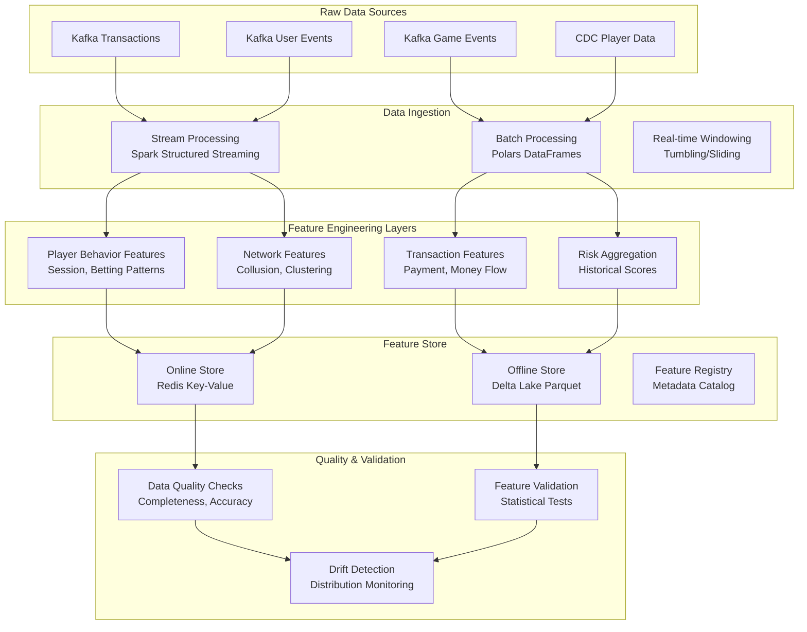

# Data Processing and Feature Engineering Pipeline Using Polars

## Overview

This document outlines the feature engineering pipeline that transforms raw casino data into ML-ready features using Polars for high-performance data processing. The pipeline creates comprehensive player behavior, transaction, and risk scoring features with real-time processing capabilities.

## Pipeline Architecture



## Core Feature Categories

### 1. Player Behavior Features

```python
import polars as pl
from polars import col
import numpy as np
from datetime import datetime, timedelta

def create_player_behavior_features(df: pl.DataFrame) -> pl.DataFrame:
    """
    Create comprehensive player behavior features using Polars expressions.

    Args:
        df: DataFrame with player activity data

    Returns:
        DataFrame with engineered behavior features
    """

    # Ensure timestamp is properly typed
    df = df.with_columns([
        col("timestamp").str.strptime(pl.Datetime, "%Y-%m-%d %H:%M:%S").alias("timestamp")
    ])

    # Session-based features
    session_features = (
        df.group_by(["player_id", "session_id"])
        .agg([
            col("timestamp").min().alias("session_start"),
            col("timestamp").max().alias("session_end"),
            col("bet_amount").sum().alias("session_total_bet"),
            col("win_amount").sum().alias("session_total_win"),
            col("duration_minutes").mean().alias("avg_session_duration"),
            col("game_type").n_unique().alias("games_played_in_session"),
            col("bet_amount").count().alias("bets_per_session")
        ])
        .with_columns([
            (col("session_end") - col("session_start")).dt.minutes().alias("session_duration_minutes"),
            (col("session_total_win") - col("session_total_bet")).alias("session_net_result"),
            (col("session_total_win") / col("session_total_bet")).alias("session_win_ratio")
        ])
    )

    # Rolling window features (last 24 hours)
    rolling_features = (
        df.sort("timestamp")
        .group_by("player_id")
        .agg([
            col("bet_amount").rolling_sum(window_size=100).alias("rolling_bet_sum_100"),
            col("bet_amount").rolling_mean(window_size=50).alias("rolling_bet_avg_50"),
            col("win_loss_ratio").rolling_mean(window_size=20).alias("rolling_win_ratio_20"),
            col("session_duration").rolling_std(window_size=10).alias("session_duration_std_10")
        ])
    )

    # Time-based patterns
    time_features = (
        df.with_columns([
            col("timestamp").dt.hour().alias("hour_of_day"),
            col("timestamp").dt.weekday().alias("day_of_week"),
            col("timestamp").dt.month().alias("month")
        ])
        .group_by(["player_id", "hour_of_day"])
        .agg([
            col("bet_amount").sum().alias("hourly_bet_total"),
            col("bet_amount").count().alias("hourly_bet_count"),
            col("win_amount").mean().alias("hourly_avg_win")
        ])
    )

    # Velocity and acceleration metrics
    velocity_features = (
        df.sort("timestamp")
        .group_by("player_id")
        .agg([
            col("bet_amount").diff().abs().mean().alias("bet_amount_velocity"),
            col("bet_amount").diff().diff().abs().mean().alias("bet_acceleration"),
            col("session_duration").diff().mean().alias("session_duration_trend")
        ])
    )

    # Game switching patterns
    game_switch_features = (
        df.sort(["player_id", "timestamp"])
        .group_by("player_id")
        .agg([
            col("game_type").shift(1).alias("previous_game"),
            col("game_type").alias("current_game")
        ])
        .with_columns([
            (col("current_game") != col("previous_game")).sum().alias("game_switches_total"),
            (col("current_game") != col("previous_game")).mean().alias("game_switch_rate")
        ])
    )

    # Combine all behavior features
    behavior_features = (
        session_features
        .join(rolling_features, on="player_id", how="left")
        .join(time_features, on="player_id", how="left")
        .join(velocity_features, on="player_id", how="left")
        .join(game_switch_features, on="player_id", how="left")
    )

    return behavior_features

# Example usage with streaming data
def process_player_behavior_batch(batch_df: pl.DataFrame) -> pl.DataFrame:
    """Process a batch of player behavior data"""
    features = create_player_behavior_features(batch_df)

    # Add feature metadata
    features = features.with_columns([
        pl.lit(datetime.utcnow()).alias("feature_timestamp"),
        pl.lit("player_behavior").alias("feature_category")
    ])

    return features
```

### 2. Transaction Features

```python
def create_transaction_features(df: pl.DataFrame) -> pl.DataFrame:
    """
    Create transaction-based features for fraud detection.

    Args:
        df: DataFrame with transaction data

    Returns:
        DataFrame with transaction features
    """

    # Payment method diversity
    payment_diversity = (
        df.group_by("player_id")
        .agg([
            col("payment_method").n_unique().alias("unique_payment_methods"),
            col("payment_method").value_counts().alias("payment_method_distribution")
        ])
    )

    # Transaction velocity and patterns
    transaction_velocity = (
        df.sort("timestamp")
        .group_by("player_id")
        .agg([
            col("amount").rolling_sum(window_size=10).alias("rolling_transaction_sum_10"),
            col("amount").rolling_count(window_size=24).alias("transactions_last_24h"),
            col("amount").diff().abs().mean().alias("transaction_amount_velocity")
        ])
    )

    # Deposit/withdrawal patterns
    deposit_withdrawal = (
        df.with_columns([
            pl.when(col("transaction_type") == "deposit").then(col("amount")).otherwise(0).alias("deposit_amount"),
            pl.when(col("transaction_type") == "withdrawal").then(col("amount")).otherwise(0).alias("withdrawal_amount")
        ])
        .group_by("player_id")
        .agg([
            col("deposit_amount").sum().alias("total_deposits"),
            col("withdrawal_amount").sum().alias("total_withdrawals"),
            col("deposit_amount").mean().alias("avg_deposit_amount"),
            col("withdrawal_amount").mean().alias("avg_withdrawal_amount"),
            (col("deposit_amount").sum() - col("withdrawal_amount").sum()).alias("net_transaction_flow")
        ])
    )

    # Chargeback and dispute indicators
    chargeback_features = (
        df.group_by("player_id")
        .agg([
            (col("transaction_status") == "chargeback").sum().alias("chargeback_count"),
            (col("transaction_status") == "dispute").sum().alias("dispute_count"),
            col("amount").filter(col("transaction_status") == "chargeback").sum().alias("chargeback_amount_total")
        ])
    )

    # Time-based transaction patterns
    time_transaction_features = (
        df.with_columns([
            col("timestamp").dt.hour().alias("hour"),
            col("timestamp").dt.weekday().alias("weekday")
        ])
        .group_by(["player_id", "hour"])
        .agg([
            col("amount").sum().alias("hourly_transaction_total"),
            col("amount").count().alias("hourly_transaction_count")
        ])
    )

    # Combine transaction features
    transaction_features = (
        payment_diversity
        .join(transaction_velocity, on="player_id", how="left")
        .join(deposit_withdrawal, on="player_id", how="left")
        .join(chargeback_features, on="player_id", how="left")
        .join(time_transaction_features, on="player_id", how="left")
    )

    return transaction_features
```

### 3. Network and Relationship Features

```python
def create_network_features(df: pl.DataFrame) -> pl.DataFrame:
    """
    Create network-based features for detecting collusion and money flows.

    Args:
        df: DataFrame with player and transaction network data

    Returns:
        DataFrame with network features
    """

    # Device and IP clustering
    device_ip_features = (
        df.group_by("device_fingerprint")
        .agg([
            col("player_id").n_unique().alias("unique_players_per_device"),
            col("ip_address").n_unique().alias("unique_ips_per_device"),
            col("player_id").count().alias("total_sessions_per_device")
        ])
        .filter(col("unique_players_per_device") > 1)
    )

    # Multi-account detection
    multi_account_features = (
        df.group_by("ip_address")
        .agg([
            col("player_id").n_unique().alias("accounts_per_ip"),
            col("device_fingerprint").n_unique().alias("devices_per_ip"),
            col("registration_date").min().alias("first_registration_per_ip")
        ])
        .filter(col("accounts_per_ip") > 3)
    )

    # Money flow network analysis
    money_flow_features = (
        df.with_columns([
            col("amount").filter(col("transaction_type") == "transfer").alias("transfer_amount")
        ])
        .group_by(["sender_id", "receiver_id"])
        .agg([
            col("transfer_amount").sum().alias("total_transfer_amount"),
            col("transfer_amount").count().alias("transfer_count"),
            col("transfer_amount").mean().alias("avg_transfer_amount")
        ])
    )

    # Temporal network patterns
    temporal_network = (
        df.group_by(["player_id", "timestamp"])
        .agg([
            col("connected_players").list.unique().alias("unique_connections"),
            col("connected_players").list.len().alias("connection_count")
        ])
        .with_columns([
            col("unique_connections").list.len().alias("unique_connection_count"),
            col("connection_count").rolling_mean(window_size=7).alias("avg_connections_7d")
        ])
    )

    # Combine network features
    network_features = (
        device_ip_features
        .join(multi_account_features, on="device_fingerprint", how="left")
        .join(money_flow_features, on=["sender_id", "receiver_id"], how="left")
        .join(temporal_network, on="player_id", how="left")
    )

    return network_features
```

### 4. Risk Aggregation Features

```python
def create_risk_aggregation_features(df: pl.DataFrame, historical_scores: pl.DataFrame) -> pl.DataFrame:
    """
    Create risk aggregation features combining current and historical data.

    Args:
        df: Current feature DataFrame
        historical_scores: Historical risk scores DataFrame

    Returns:
        DataFrame with aggregated risk features
    """

    # Historical risk score aggregation
    historical_agg = (
        historical_scores
        .group_by("player_id")
        .agg([
            col("risk_score").mean().alias("avg_historical_risk"),
            col("risk_score").std().alias("risk_score_volatility"),
            col("risk_score").max().alias("max_historical_risk"),
            col("risk_score").rolling_mean(window_size=30).alias("risk_trend_30d")
        ])
    )

    # Peer group comparison
    peer_comparison = (
        df.with_columns([
            col("registration_country").alias("country"),
            col("player_segment").alias("segment")
        ])
        .join(
            df.group_by(["country", "segment"])
            .agg(col("risk_score").mean().alias("peer_avg_risk")),
            on=["country", "segment"],
            how="left"
        )
        .with_columns([
            (col("risk_score") - col("peer_avg_risk")).alias("risk_vs_peer")
        ])
    )

    # Regulatory compliance scores
    compliance_features = (
        df.with_columns([
            # KYC compliance score based on verification level
            pl.when(col("kyc_status") == "verified").then(1.0)
             .when(col("kyc_status") == "pending").then(0.5)
             .otherwise(0.0).alias("kyc_compliance_score"),

            # AML risk score based on sanctions and PEP status
            pl.when(col("sanctions_match") == True).then(1.0).otherwise(0.0).alias("sanctions_risk"),
            pl.when(col("pep_status") == True).then(0.8).otherwise(0.0).alias("pep_risk")
        ])
        .with_columns([
            (col("kyc_compliance_score") + col("sanctions_risk") + col("pep_risk")).alias("regulatory_risk_score")
        ])
    )

    # Combine all risk features
    risk_features = (
        df
        .join(historical_agg, on="player_id", how="left")
        .join(peer_comparison, on="player_id", how="left")
        .join(compliance_features, on="player_id", how="left")
    )

    return risk_features
```

## Real-Time Feature Pipeline

```python
from typing import Dict, Any, List
import asyncio
from concurrent.futures import ThreadPoolExecutor
import redis
import json

class RealTimeFeaturePipeline:
    """Real-time feature engineering pipeline using Polars and Redis"""

    def __init__(self, redis_config: Dict[str, Any]):
        self.redis = redis.Redis(**redis_config)
        self.executor = ThreadPoolExecutor(max_workers=4)
        self.feature_functions = {
            "player_behavior": create_player_behavior_features,
            "transaction": create_transaction_features,
            "network": create_network_features,
            "risk": create_risk_aggregation_features
        }

    async def process_event_stream(self, event_stream: asyncio.Queue):
        """Process events from Kafka stream in real-time"""
        while True:
            event_batch = await event_stream.get()

            # Process batch asynchronously
            loop = asyncio.get_event_loop()
            features = await loop.run_in_executor(
                self.executor,
                self._process_batch,
                event_batch
            )

            # Store features in Redis
            await self._store_features(features)

            event_stream.task_done()

    def _process_batch(self, batch_df: pl.DataFrame) -> Dict[str, pl.DataFrame]:
        """Process a batch of events through feature engineering pipeline"""
        features = {}

        # Apply each feature engineering function
        for feature_type, func in self.feature_functions.items():
            try:
                if feature_type == "risk":
                    # Risk features need historical data
                    historical_scores = self._get_historical_scores(batch_df)
                    features[feature_type] = func(batch_df, historical_scores)
                else:
                    features[feature_type] = func(batch_df)
            except Exception as e:
                print(f"Error processing {feature_type} features: {e}")
                features[feature_type] = pl.DataFrame()

        return features

    def _get_historical_scores(self, df: pl.DataFrame) -> pl.DataFrame:
        """Retrieve historical risk scores from Redis"""
        player_ids = df.select("player_id").unique().to_series().to_list()

        historical_data = []
        for player_id in player_ids:
            scores = self.redis.lrange(f"risk_scores:{player_id}", 0, 100)
            for score_json in scores:
                score_data = json.loads(score_json)
                historical_data.append({
                    "player_id": player_id,
                    **score_data
                })

        return pl.DataFrame(historical_data)

    async def _store_features(self, features: Dict[str, pl.DataFrame]):
        """Store engineered features in Redis feature store"""
        for feature_type, feature_df in features.items():
            if feature_df.is_empty():
                continue

            # Convert to dictionary format for Redis
            feature_records = feature_df.to_dicts()

            for record in feature_records:
                player_id = record["player_id"]
                key = f"features:{feature_type}:{player_id}"

                # Store as JSON in Redis
                self.redis.set(key, json.dumps(record))

                # Set expiration (24 hours)
                self.redis.expire(key, 86400)

    def get_features_for_player(self, player_id: str, feature_types: List[str] = None) -> Dict[str, Any]:
        """Retrieve features for a specific player"""
        if feature_types is None:
            feature_types = list(self.feature_functions.keys())

        player_features = {}
        for feature_type in feature_types:
            key = f"features:{feature_type}:{player_id}"
            feature_json = self.redis.get(key)

            if feature_json:
                player_features[feature_type] = json.loads(feature_json)

        return player_features
```

## Feature Quality Validation

```python
def validate_features(df: pl.DataFrame) -> Dict[str, Any]:
    """
    Validate feature quality and statistical properties.

    Args:
        df: DataFrame with engineered features

    Returns:
        Dictionary with validation results
    """

    validation_results = {
        "completeness": {},
        "statistical_properties": {},
        "data_quality_issues": []
    }

    # Check for missing values
    for col in df.columns:
        null_count = df.select(col).null_count().item()
        null_percentage = (null_count / len(df)) * 100
        validation_results["completeness"][col] = {
            "null_count": null_count,
            "null_percentage": null_percentage
        }

        if null_percentage > 10:
            validation_results["data_quality_issues"].append(
                f"High null percentage in {col}: {null_percentage:.2f}%"
            )

    # Statistical validation
    numeric_cols = df.select_dtypes(include=[pl.Float64, pl.Int64]).columns

    for col in numeric_cols:
        stats = df.select([
            col.mean().alias("mean"),
            col.std().alias("std"),
            col.min().alias("min"),
            col.max().alias("max"),
            col.quantile(0.25).alias("q25"),
            col.quantile(0.75).alias("q75")
        ]).to_dicts()[0]

        validation_results["statistical_properties"][col] = stats

        # Check for potential data quality issues
        if stats["std"] == 0:
            validation_results["data_quality_issues"].append(
                f"No variance in {col} - constant value"
            )

        if abs(stats["mean"]) > 10 * stats["std"]:
            validation_results["data_quality_issues"].append(
                f"Potential outlier in {col} - extreme mean"
            )

    return validation_results
```

## Performance Optimization

### Polars Configuration for Performance

```python
import polars as pl

# Configure Polars for optimal performance
pl.Config.set_global_string_cache(True)
pl.Config.set_global_float_width(4)  # Reduce memory usage
pl.Config.set_global_tbl_rows(100)   # Limit display rows

# Use lazy evaluation for complex pipelines
def optimized_feature_pipeline(df: pl.LazyFrame) -> pl.LazyFrame:
    """Optimized feature engineering using lazy evaluation"""

    return (
        df
        .group_by("player_id")
        .agg([
            col("bet_amount").sum().alias("total_bet"),
            col("win_amount").sum().alias("total_win"),
            col("bet_amount").mean().alias("avg_bet"),
            col("win_amount").mean().alias("avg_win"),
            col("bet_amount").std().alias("bet_std"),
            col("win_amount").std().alias("win_std"),
            col("bet_amount").count().alias("bet_count")
        ])
        .with_columns([
            (col("total_win") - col("total_bet")).alias("net_result"),
            (col("total_win") / col("total_bet")).alias("win_ratio"),
            (col("bet_std") / col("avg_bet")).alias("bet_volatility")
        ])
        .filter(col("bet_count") > 0)  # Remove inactive players
    )

# Usage
lazy_df = pl.scan_csv("large_dataset.csv")
result = optimized_feature_pipeline(lazy_df).collect()
```

### Memory Management

```python
def process_large_dataset_in_chunks(file_path: str, chunk_size: int = 100000):
    """Process large datasets in memory-efficient chunks"""

    # Get total rows
    total_rows = pl.scan_csv(file_path).select(pl.len()).collect().item()

    results = []
    for start_row in range(0, total_rows, chunk_size):
        # Process chunk
        chunk = (
            pl.scan_csv(file_path)
            .slice(start_row, chunk_size)
            .collect()
        )

        # Apply feature engineering
        chunk_features = create_player_behavior_features(chunk)

        # Store or process results
        results.append(chunk_features)

        # Force garbage collection
        import gc
        gc.collect()

    # Combine results
    final_result = pl.concat(results)
    return final_result
```

This feature engineering pipeline provides a comprehensive, high-performance solution for transforming raw casino data into ML-ready features using Polars' efficient data processing capabilities.