# Integration Requirements

## Overview

This document outlines the comprehensive integration requirements for the real-time anti-fraud detection system, covering casino management systems, external data sources, payment gateways, and third-party services. The integrations ensure seamless data flow and real-time fraud detection across the entire casino ecosystem.

## Integration Architecture Overview

```mermaid
graph TB
    subgraph "Casino Systems"
        A1[Player Tracking<br/>Systems]
        A2[Loyalty Programs<br/>Management]
        A3[Cage Management<br/>Cashier Systems]
        A4[Slot Accounting<br/>Gaming Systems]
        A5[Table Games<br/>Management]
        A6[Sports Betting<br/>Platforms]
    end

    subgraph "Payment & Financial"
        B1[Payment Gateways<br/>Stripe/Adyen]
        B2[Banking Systems<br/>Core Banking]
        B3[Credit Bureaus<br/>Experian/Equifax]
        B4[AML Screening<br/>Services]
        B5[Currency Exchange<br/>Providers]
    end

    subgraph "External Data Sources"
        C1[Geolocation Services<br/>MaxMind/IP2Location]
        C2[Device Fingerprinting<br/>FingerprintJS]
        C3[Social Media APIs<br/>Facebook/Twitter]
        C4[Public Records<br/>Watchlists]
        C5[Credit Scoring<br/>FICO/TransUnion]
    end

    subgraph "Integration Layer"
        D1[API Gateway<br/>Kong/Apigee]
        D2[Event Streaming<br/>Kafka/Kinesis]
        D3[Data Transformation<br/>Polars/Python]
        D4[Schema Registry<br/>Confluent/APICurio]
        D5[Webhook Handlers<br/>Real-time Events]
        D6[Batch Processors<br/>Scheduled Syncs]
    end

    subgraph "Security & Compliance"
        E1[OAuth 2.0/JWT<br/>Authentication]
        E2[TLS 1.3<br/>Encryption]
        E3[Rate Limiting<br/>DDoS Protection]
        E4[Data Masking<br/>PII Protection]
        E5[Audit Logging<br/>Compliance]
    end

    A1 --> D1
    A2 --> D2
    A3 --> D5
    A4 --> D6
    A5 --> D1
    A6 --> D2

    B1 --> D1
    B2 --> D6
    B3 --> D3
    B4 --> D3
    B5 --> D1

    C1 --> D2
    C2 --> D2
    C3 --> D5
    C4 --> D6
    C5 --> D3

    D1 --> E1
    D2 --> E2
    D3 --> E4
    D5 --> E3
    D6 --> E5
```



## Casino Management System Integrations

### Player Tracking System Integration

```python
from typing import Dict, List, Any, Optional
from datetime import datetime
import httpx
import asyncio
from pydantic import BaseModel

class PlayerData(BaseModel):
    player_id: str
    registration_date: datetime
    last_login: datetime
    total_bets: float
    total_wins: float
    loyalty_tier: str
    risk_score: Optional[float]
    vip_status: bool

class PlayerTrackingIntegration:
    """Integration with casino player tracking systems"""

    def __init__(self, api_base_url: str, api_key: str):
        self.api_base_url = api_base_url
        self.api_key = api_key
        self.client = httpx.AsyncClient(
            timeout=30.0,
            headers={"Authorization": f"Bearer {api_key}"}
        )

    async def get_player_data(self, player_id: str) -> Optional[PlayerData]:
        """Retrieve player data from tracking system"""

        try:
            response = await self.client.get(
                f"{self.api_base_url}/api/v1/players/{player_id}"
            )

            if response.status_code == 200:
                data = response.json()
                return PlayerData(**data)
            elif response.status_code == 404:
                return None
            else:
                raise Exception(f"API error: {response.status_code}")

        except Exception as e:
            print(f"Error fetching player data: {e}")
            return None

    async def get_recent_sessions(self, player_id: str, hours: int = 24) -> List[Dict[str, Any]]:
        """Get recent gaming sessions for a player"""

        try:
            params = {"hours": hours}
            response = await self.client.get(
                f"{self.api_base_url}/api/v1/players/{player_id}/sessions",
                params=params
            )

            if response.status_code == 200:
                return response.json()
            else:
                return []

        except Exception as e:
            print(f"Error fetching sessions: {e}")
            return []

    async def update_player_risk_score(self, player_id: str, risk_score: float,
                                     reason: str) -> bool:
        """Update player risk score in tracking system"""

        try:
            payload = {
                "risk_score": risk_score,
                "updated_by": "fraud-detection-system",
                "update_reason": reason,
                "timestamp": datetime.utcnow().isoformat()
            }

            response = await self.client.put(
                f"{self.api_base_url}/api/v1/players/{player_id}/risk-score",
                json=payload
            )

            return response.status_code == 200

        except Exception as e:
            print(f"Error updating risk score: {e}")
            return False

    async def report_suspicious_activity(self, player_id: str, activity_type: str,
                                       details: Dict[str, Any]) -> bool:
        """Report suspicious activity to player tracking system"""

        try:
            payload = {
                "player_id": player_id,
                "activity_type": activity_type,
                "details": details,
                "reported_by": "fraud-detection-system",
                "timestamp": datetime.utcnow().isoformat(),
                "severity": "high"
            }

            response = await self.client.post(
                f"{self.api_base_url}/api/v1/suspicious-activity",
                json=payload
            )

            return response.status_code == 201

        except Exception as e:
            print(f"Error reporting suspicious activity: {e}")
            return False

    async def get_loyalty_program_data(self, player_id: str) -> Dict[str, Any]:
        """Get loyalty program data for player"""

        try:
            response = await self.client.get(
                f"{self.api_base_url}/api/v1/players/{player_id}/loyalty"
            )

            if response.status_code == 200:
                return response.json()
            else:
                return {}

        except Exception as e:
            print(f"Error fetching loyalty data: {e}")
            return {}

# Usage
player_tracking = PlayerTrackingIntegration(
    api_base_url="https://api.casino-tracker.com",
    api_key="your-api-key"
)

# Get player data
player_data = await player_tracking.get_player_data("player_123")
if player_data:
    print(f"Player {player_data.player_id} has risk score: {player_data.risk_score}")

# Report suspicious activity
await player_tracking.report_suspicious_activity(
    player_id="player_123",
    activity_type="unusual_betting_pattern",
    details={"pattern": "martingale_strategy", "amount": 5000}
)
```

### Slot Accounting System Integration

```python
class SlotAccountingIntegration:
    """Integration with slot machine accounting systems"""

    def __init__(self, api_base_url: str, api_key: str):
        self.api_base_url = api_base_url
        self.api_key = api_key
        self.client = httpx.AsyncClient(
            timeout=30.0,
            headers={"Authorization": f"Bearer {api_key}"}
        )

    async def get_machine_performance(self, machine_id: str, date: str) -> Dict[str, Any]:
        """Get performance data for a specific slot machine"""

        try:
            response = await self.client.get(
                f"{self.api_base_url}/api/v1/machines/{machine_id}/performance",
                params={"date": date}
            )

            if response.status_code == 200:
                return response.json()
            else:
                return {}

        except Exception as e:
            print(f"Error fetching machine performance: {e}")
            return {}

    async def get_machine_transactions(self, machine_id: str, start_time: datetime,
                                     end_time: datetime) -> List[Dict[str, Any]]:
        """Get transactions for a slot machine within time range"""

        try:
            params = {
                "start_time": start_time.isoformat(),
                "end_time": end_time.isoformat()
            }

            response = await self.client.get(
                f"{self.api_base_url}/api/v1/machines/{machine_id}/transactions",
                params=params
            )

            if response.status_code == 200:
                return response.json()
            else:
                return []

        except Exception as e:
            print(f"Error fetching machine transactions: {e}")
            return []

    async def report_machine_anomaly(self, machine_id: str, anomaly_type: str,
                                   details: Dict[str, Any]) -> bool:
        """Report anomalous behavior in slot machine"""

        try:
            payload = {
                "machine_id": machine_id,
                "anomaly_type": anomaly_type,
                "details": details,
                "reported_by": "fraud-detection-system",
                "timestamp": datetime.utcnow().isoformat()
            }

            response = await self.client.post(
                f"{self.api_base_url}/api/v1/machines/{machine_id}/anomalies",
                json=payload
            )

            return response.status_code == 201

        except Exception as e:
            print(f"Error reporting machine anomaly: {e}")
            return False

    async def get_jackpot_history(self, machine_id: str, days: int = 30) -> List[Dict[str, Any]]:
        """Get jackpot history for analysis"""

        try:
            params = {"days": days}
            response = await self.client.get(
                f"{self.api_base_url}/api/v1/machines/{machine_id}/jackpots",
                params=params
            )

            if response.status_code == 200:
                return response.json()
            else:
                return []

        except Exception as e:
            print(f"Error fetching jackpot history: {e}")
            return []
```

## Payment Gateway Integrations

### Real-Time Payment Monitoring

```python
class PaymentGatewayIntegration:
    """Integration with payment gateways for real-time transaction monitoring"""

    def __init__(self, gateway_name: str, api_key: str, webhook_secret: str):
        self.gateway_name = gateway_name
        self.api_key = api_key
        self.webhook_secret = webhook_secret
        self.client = httpx.AsyncClient(
            timeout=30.0,
            headers={"Authorization": f"Bearer {api_key}"}
        )

    async def process_payment_webhook(self, webhook_data: Dict[str, Any],
                                    signature: str) -> Dict[str, Any]:
        """Process incoming payment webhook"""

        # Verify webhook signature
        if not self._verify_webhook_signature(webhook_data, signature):
            raise ValueError("Invalid webhook signature")

        # Extract transaction data
        transaction = self._extract_transaction_data(webhook_data)

        # Enrich with additional data
        enriched_transaction = await self._enrich_transaction_data(transaction)

        # Check for fraud indicators
        fraud_check = await self._perform_fraud_check(enriched_transaction)

        return {
            "transaction": enriched_transaction,
            "fraud_check": fraud_check,
            "processed_at": datetime.utcnow().isoformat()
        }

    def _verify_webhook_signature(self, data: Dict[str, Any], signature: str) -> bool:
        """Verify webhook signature for security"""

        import hmac
        import hashlib
        import json

        # Create signature payload
        payload = json.dumps(data, sort_keys=True)

        # Calculate expected signature
        expected_signature = hmac.new(
            self.webhook_secret.encode(),
            payload.encode(),
            hashlib.sha256
        ).hexdigest()

        return hmac.compare_digest(signature, expected_signature)

    def _extract_transaction_data(self, webhook_data: Dict[str, Any]) -> Dict[str, Any]:
        """Extract standardized transaction data from gateway-specific format"""

        # Gateway-specific mapping
        mappings = {
            "stripe": {
                "transaction_id": "id",
                "amount": "amount",
                "currency": "currency",
                "customer_id": "customer",
                "payment_method": "payment_method",
                "status": "status"
            },
            "adyen": {
                "transaction_id": "pspReference",
                "amount": "amount.value",
                "currency": "amount.currency",
                "customer_id": "merchantReference",
                "payment_method": "paymentMethod.type",
                "status": "resultCode"
            }
        }

        mapping = mappings.get(self.gateway_name, {})
        transaction = {}

        for std_field, gateway_field in mapping.items():
            # Handle nested fields
            if "." in gateway_field:
                keys = gateway_field.split(".")
                value = webhook_data
                for key in keys:
                    value = value.get(key, {}) if isinstance(value, dict) else None
                    if value is None:
                        break
                transaction[std_field] = value
            else:
                transaction[std_field] = webhook_data.get(gateway_field)

        return transaction

    async def _enrich_transaction_data(self, transaction: Dict[str, Any]) -> Dict[str, Any]:
        """Enrich transaction with additional data"""

        enriched = transaction.copy()

        # Add geolocation data
        if "ip_address" in transaction:
            geo_data = await self._get_geolocation_data(transaction["ip_address"])
            enriched["geo_data"] = geo_data

        # Add device fingerprinting
        if "device_fingerprint" in transaction:
            device_data = await self._get_device_data(transaction["device_fingerprint"])
            enriched["device_data"] = device_data

        # Add velocity checks
        customer_id = transaction.get("customer_id")
        if customer_id:
            velocity_data = await self._check_transaction_velocity(customer_id, transaction)
            enriched["velocity_check"] = velocity_data

        return enriched

    async def _get_geolocation_data(self, ip_address: str) -> Dict[str, Any]:
        """Get geolocation data for IP address"""

        # Integration with MaxMind or similar service
        try:
            response = await self.client.get(f"https://api.maxmind.com/geoip/v2.1/city/{ip_address}")
            if response.status_code == 200:
                return response.json()
            else:
                return {}
        except Exception:
            return {}

    async def _get_device_data(self, fingerprint: str) -> Dict[str, Any]:
        """Get device information from fingerprint"""

        # Integration with device fingerprinting service
        try:
            response = await self.client.get(f"https://api.fingerprintjs.com/v3/{fingerprint}")
            if response.status_code == 200:
                return response.json()
            else:
                return {}
        except Exception:
            return {}

    async def _check_transaction_velocity(self, customer_id: str,
                                        transaction: Dict[str, Any]) -> Dict[str, Any]:
        """Check transaction velocity for customer"""

        # Query recent transactions for velocity analysis
        try:
            response = await self.client.get(
                f"{self.api_base_url}/customers/{customer_id}/transactions",
                params={"hours": 24}
            )

            if response.status_code == 200:
                recent_transactions = response.json()
                return self._analyze_velocity(recent_transactions, transaction)
            else:
                return {"velocity_score": 0, "flags": []}

        except Exception:
            return {"velocity_score": 0, "flags": []}

    def _analyze_velocity(self, recent_transactions: List[Dict[str, Any]],
                         current_transaction: Dict[str, Any]) -> Dict[str, Any]:
        """Analyze transaction velocity"""

        # Simple velocity analysis
        total_amount_24h = sum(t.get("amount", 0) for t in recent_transactions)
        transaction_count_24h = len(recent_transactions)

        current_amount = current_transaction.get("amount", 0)

        # Calculate velocity score (0-100, higher = more suspicious)
        velocity_score = min(100, (total_amount_24h / 1000) + (transaction_count_24h * 5))

        flags = []
        if velocity_score > 70:
            flags.append("high_velocity")
        if current_amount > total_amount_24h * 0.5:
            flags.append("large_transaction")

        return {
            "velocity_score": velocity_score,
            "total_amount_24h": total_amount_24h,
            "transaction_count_24h": transaction_count_24h,
            "flags": flags
        }

    async def _perform_fraud_check(self, transaction: Dict[str, Any]) -> Dict[str, Any]:
        """Perform fraud check on transaction"""

        # Combine multiple fraud indicators
        fraud_score = 0
        risk_factors = []

        # Geolocation risk
        geo_data = transaction.get("geo_data", {})
        if geo_data.get("country", {}).get("iso_code") not in ["US", "CA", "GB"]:
            fraud_score += 20
            risk_factors.append("high_risk_country")

        # Device risk
        device_data = transaction.get("device_data", {})
        if device_data.get("bot", {}).get("probability", 0) > 0.7:
            fraud_score += 30
            risk_factors.append("bot_detected")

        # Velocity risk
        velocity_check = transaction.get("velocity_check", {})
        fraud_score += velocity_check.get("velocity_score", 0) * 0.5
        risk_factors.extend(velocity_check.get("flags", []))

        return {
            "fraud_score": min(100, fraud_score),
            "risk_level": "high" if fraud_score > 70 else "medium" if fraud_score > 40 else "low",
            "risk_factors": risk_factors,
            "recommendations": self._get_fraud_recommendations(fraud_score, risk_factors)
        }

    def _get_fraud_recommendations(self, fraud_score: float,
                                 risk_factors: List[str]) -> List[str]:
        """Get fraud prevention recommendations"""

        recommendations = []

        if fraud_score > 80:
            recommendations.append("Block transaction immediately")
            recommendations.append("Require additional verification")
        elif fraud_score > 60:
            recommendations.append("Hold transaction for review")
            recommendations.append("Send additional authentication")
        elif fraud_score > 40:
            recommendations.append("Monitor transaction closely")
            recommendations.append("Flag for manual review")

        if "high_risk_country" in risk_factors:
            recommendations.append("Verify customer identity")
        if "bot_detected" in risk_factors:
            recommendations.append("Implement bot detection measures")

        return recommendations

# Usage
payment_integration = PaymentGatewayIntegration(
    gateway_name="stripe",
    api_key="sk_test_...",
    webhook_secret="whsec_..."
)

# Process webhook
webhook_result = await payment_integration.process_payment_webhook(
    webhook_data=stripe_webhook_payload,
    signature=request.headers.get("stripe-signature")
)

print(f"Transaction fraud score: {webhook_result['fraud_check']['fraud_score']}")
```

## External Data Source Integrations

### Geolocation and Device Fingerprinting

```python
class ExternalDataIntegration:
    """Integration with external data sources"""

    def __init__(self):
        self.clients = {
            "maxmind": httpx.AsyncClient(
                base_url="https://geoip.maxmind.com",
                headers={"Authorization": f"Bearer {os.getenv('MAXMIND_API_KEY')}"}
            ),
            "fingerprintjs": httpx.AsyncClient(
                base_url="https://api.fingerprintjs.com",
                headers={"Authorization": f"Bearer {os.getenv('FINGERPRINTJS_API_KEY')}"}
            )
        }

    async def get_ip_geolocation(self, ip_address: str) -> Dict[str, Any]:
        """Get geolocation data for IP address"""

        try:
            response = await self.clients["maxmind"].get(f"/geoip/v2.1/city/{ip_address}")
            if response.status_code == 200:
                data = response.json()
                return {
                    "country": data.get("country", {}).get("iso_code"),
                    "city": data.get("city", {}).get("name"),
                    "latitude": data.get("location", {}).get("latitude"),
                    "longitude": data.get("location", {}).get("longitude"),
                    "risk_score": self._calculate_geo_risk(data)
                }
            else:
                return {}
        except Exception as e:
            print(f"Geolocation error: {e}")
            return {}

    def _calculate_geo_risk(self, geo_data: Dict[str, Any]) -> float:
        """Calculate risk score based on geolocation"""

        risk_score = 0

        # High-risk countries
        high_risk_countries = ["KP", "IR", "CU", "SY", "VE"]
        if geo_data.get("country", {}).get("iso_code") in high_risk_countries:
            risk_score += 50

        # Anonymous proxies/VPNs
        if geo_data.get("traits", {}).get("is_anonymous_proxy"):
            risk_score += 30

        return min(100, risk_score)

    async def get_device_fingerprint(self, visitor_id: str) -> Dict[str, Any]:
        """Get device fingerprinting data"""

        try:
            response = await self.clients["fingerprintjs"].get(f"/v3/{visitor_id}")
            if response.status_code == 200:
                data = response.json()
                return {
                    "visitor_id": data.get("visitorId"),
                    "browser": data.get("browserName"),
                    "os": data.get("os"),
                    "device": data.get("device"),
                    "bot_probability": data.get("bot", {}).get("probability", 0),
                    "ip_location": data.get("ipLocation"),
                    "timestamp": data.get("timestamp")
                }
            else:
                return {}
        except Exception as e:
            print(f"Device fingerprinting error: {e}")
            return {}

    async def check_credit_score(self, ssn: str, name: str) -> Dict[str, Any]:
        """Check credit score (simplified - requires proper licensing)"""

        # Note: Credit score checking requires proper licensing and compliance
        # This is a simplified example
        try:
            # Integration with credit bureau APIs
            response = await httpx.AsyncClient().post(
                "https://api.creditbureau.com/score",
                json={"ssn": ssn, "name": name},
                headers={"Authorization": f"Bearer {os.getenv('CREDIT_API_KEY')}"}
            )

            if response.status_code == 200:
                return response.json()
            else:
                return {"error": "Credit check failed"}
        except Exception as e:
            return {"error": str(e)}

    async def screen_aml_watchlists(self, entity_data: Dict[str, Any]) -> Dict[str, Any]:
        """Screen entity against AML watchlists"""

        try:
            response = await httpx.AsyncClient().post(
                "https://api.aml-screening.com/screen",
                json=entity_data,
                headers={"Authorization": f"Bearer {os.getenv('AML_API_KEY')}"}
            )

            if response.status_code == 200:
                return response.json()
            else:
                return {"matches": [], "risk_level": "unknown"}
        except Exception as e:
            return {"matches": [], "risk_level": "unknown", "error": str(e)}
```

## Integration Patterns and Best Practices

### Event-Driven Integration

```python
from typing import Callable, Dict, Any
import asyncio
from concurrent.futures import ThreadPoolExecutor

class EventDrivenIntegrator:
    """Event-driven integration framework"""

    def __init__(self):
        self.event_handlers: Dict[str, List[Callable]] = {}
        self.executor = ThreadPoolExecutor(max_workers=10)

    def register_handler(self, event_type: str, handler: Callable):
        """Register event handler"""

        if event_type not in self.event_handlers:
            self.event_handlers[event_type] = []
        self.event_handlers[event_type].append(handler)

    async def process_event(self, event_type: str, event_data: Dict[str, Any]):
        """Process incoming event asynchronously"""

        if event_type in self.event_handlers:
            tasks = []
            for handler in self.event_handlers[event_type]:
                # Run handler in thread pool to avoid blocking
                task = asyncio.get_event_loop().run_in_executor(
                    self.executor, handler, event_data
                )
                tasks.append(task)

            # Wait for all handlers to complete
            await asyncio.gather(*tasks, return_exceptions=True)

    async def publish_event(self, event_type: str, event_data: Dict[str, Any]):
        """Publish event to message queue"""

        # Publish to Kafka/Kinesis
        event_payload = {
            "event_type": event_type,
            "event_data": event_data,
            "timestamp": datetime.utcnow().isoformat(),
            "source": "fraud-detection-system"
        }

        # Implementation would publish to message queue
        print(f"Published event: {event_type}")

# Usage
integrator = EventDrivenIntegrator()

# Register handlers
@integrator.register_handler("payment_received")
def handle_payment(event_data):
    print(f"Processing payment: {event_data['transaction_id']}")

@integrator.register_handler("player_login")
def handle_login(event_data):
    print(f"Player login: {event_data['player_id']}")

# Process events
await integrator.process_event("payment_received", {
    "transaction_id": "txn_123",
    "amount": 100.0,
    "player_id": "player_456"
})
```

### API Gateway Configuration

```yaml
# Kong API Gateway configuration
kong_config:
  services:
    - name: fraud-detection-api
      url: http://fraud-detection-service:8080
      routes:
        - name: fraud-api-route
          paths:
            - /api/v1/fraud
          methods: ["GET", "POST"]
          plugins:
            - name: rate-limiting
              config:
                minute: 1000
                hour: 10000
            - name: request-transformer
              config:
                add:
                  headers:
                    - "X-API-Key:fraud-detection"
            - name: cors
            - name: key-auth

    - name: player-tracking-api
      url: http://player-tracking-service:8080
      routes:
        - name: player-api-route
          paths:
            - /api/v1/players
          plugins:
            - name: jwt
            - name: acl
              config:
                allow: ["fraud-detection"]

  plugins:
    - name: prometheus
      config:
        status_code_metrics: true
        latency_metrics: true
        bandwidth_metrics: true
        upstream_health_metrics: true
```

### Error Handling and Circuit Breakers

```python
import asyncio
from typing import Optional, Callable, Any
from datetime import datetime, timedelta
from enum import Enum

class CircuitBreakerState(Enum):
    CLOSED = "closed"
    OPEN = "open"
    HALF_OPEN = "half_open"

class CircuitBreaker:
    """Circuit breaker for external service calls"""

    def __init__(self, failure_threshold: int = 5, recovery_timeout: int = 60,
                 expected_exception: Exception = Exception):
        self.failure_threshold = failure_threshold
        self.recovery_timeout = recovery_timeout
        self.expected_exception = expected_exception
        self.failure_count = 0
        self.last_failure_time: Optional[datetime] = None
        self.state = CircuitBreakerState.CLOSED

    def __call__(self, func: Callable) -> Callable:
        async def wrapper(*args, **kwargs) -> Any:
            if self.state == CircuitBreakerState.OPEN:
                if self._should_attempt_reset():
                    self.state = CircuitBreakerState.HALF_OPEN
                else:
                    raise Exception("Circuit breaker is OPEN")

            try:
                result = await func(*args, **kwargs)
                self._on_success()
                return result
            except self.expected_exception as e:
                self._on_failure()
                raise e

        return wrapper

    def _should_attempt_reset(self) -> bool:
        """Check if circuit breaker should attempt to reset"""

        if self.last_failure_time is None:
            return True

        return datetime.utcnow() - self.last_failure_time > timedelta(seconds=self.recovery_timeout)

    def _on_success(self):
        """Handle successful call"""

        self.failure_count = 0
        self.state = CircuitBreakerState.CLOSED

    def _on_failure(self):
        """Handle failed call"""

        self.failure_count += 1
        self.last_failure_time = datetime.utcnow()

        if self.failure_count >= self.failure_threshold:
            self.state = CircuitBreakerState.OPEN

# Usage
circuit_breaker = CircuitBreaker(failure_threshold=3, recovery_timeout=30)

@circuit_breaker
async def call_external_api(api_url: str, data: Dict[str, Any]) -> Dict[str, Any]:
    """Call external API with circuit breaker protection"""

    async with httpx.AsyncClient(timeout=10.0) as client:
        response = await client.post(api_url, json=data)
        response.raise_for_status()
        return response.json()

# Safe API call
try:
    result = await call_external_api("https://api.external-service.com/data", {"key": "value"})
except Exception as e:
    print(f"External API call failed: {e}")
    # Fallback logic here
```

This comprehensive integration framework provides robust, secure, and scalable connections to all casino systems, payment gateways, and external data sources required for real-time fraud detection.