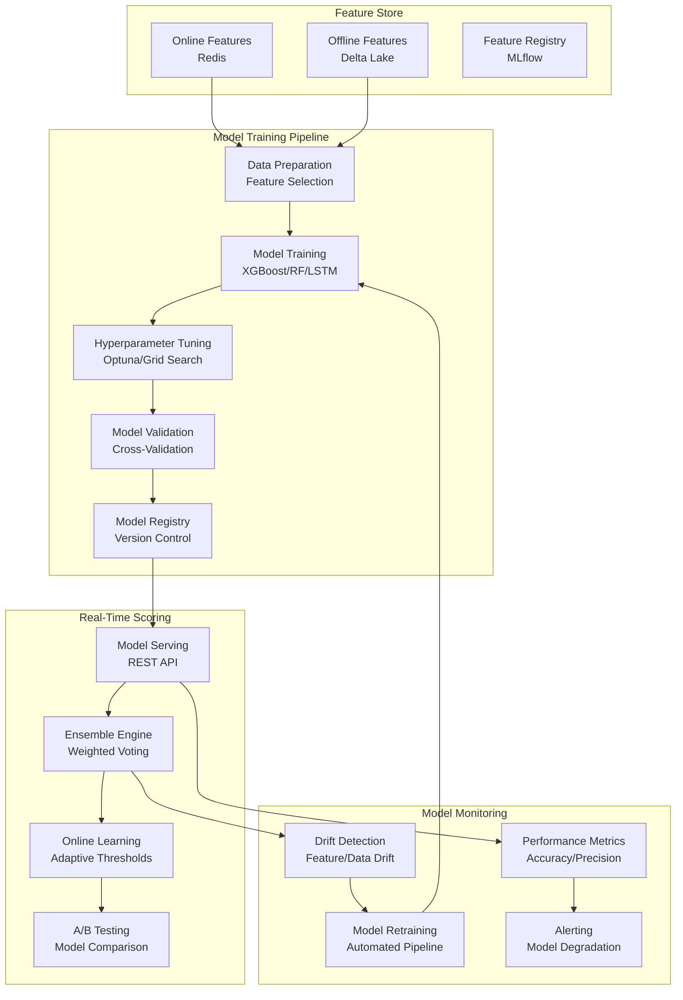

# Machine Learning Models Architecture

## Overview

This document outlines the multi-layered ML architecture for real-time fraud detection, combining unsupervised anomaly detection, supervised classification, and online learning components. The system supports both batch and real-time model training with comprehensive model versioning and monitoring.

## ML Architecture Overview



## Model Components

### 1. Unsupervised Models for Anomaly Detection

```python
import numpy as np
import pandas as pd
from sklearn.ensemble import IsolationForest
from sklearn.cluster import DBSCAN
from sklearn.preprocessing import StandardScaler
from tensorflow import keras
from tensorflow.keras import layers
import mlflow
import mlflow.sklearn

class UnsupervisedFraudDetector:
    """Unsupervised models for anomaly detection in casino transactions"""

    def __init__(self, contamination: float = 0.1):
        self.contamination = contamination
        self.models = {}
        self.scalers = {}

    def train_isolation_forest(self, features: pd.DataFrame, feature_name: str):
        """Train Isolation Forest for anomaly detection"""

        # Scale features
        scaler = StandardScaler()
        scaled_features = scaler.fit_transform(features)

        # Train model
        model = IsolationForest(
            contamination=self.contamination,
            random_state=42,
            n_estimators=100
        )
        model.fit(scaled_features)

        # Store model and scaler
        self.models[f'iforest_{feature_name}'] = model
        self.scalers[f'iforest_{feature_name}'] = scaler

        # Log with MLflow
        with mlflow.start_run(run_name=f'isolation_forest_{feature_name}'):
            mlflow.log_param("contamination", self.contamination)
            mlflow.log_param("n_estimators", 100)
            mlflow.log_param("feature_name", feature_name)
            mlflow.sklearn.log_model(model, "model")

        return model

    def train_autoencoder(self, features: pd.DataFrame, feature_name: str,
                         encoding_dim: int = 32, epochs: int = 50):
        """Train Autoencoder for pattern recognition"""

        # Normalize data
        scaler = StandardScaler()
        scaled_features = scaler.fit_transform(features)

        # Build autoencoder
        input_dim = scaled_features.shape[1]
        input_layer = keras.Input(shape=(input_dim,))

        # Encoder
        encoded = layers.Dense(encoding_dim, activation='relu')(input_layer)
        encoded = layers.Dense(encoding_dim // 2, activation='relu')(encoded)

        # Decoder
        decoded = layers.Dense(encoding_dim, activation='relu')(encoded)
        decoded = layers.Dense(input_dim, activation='sigmoid')(decoded)

        # Model
        autoencoder = keras.Model(input_layer, decoded)
        autoencoder.compile(optimizer='adam', loss='mse')

        # Train
        autoencoder.fit(
            scaled_features, scaled_features,
            epochs=epochs,
            batch_size=256,
            validation_split=0.2,
            verbose=0
        )

        # Store components
        self.models[f'autoencoder_{feature_name}'] = autoencoder
        self.scalers[f'autoencoder_{feature_name}'] = scaler

        # Log with MLflow
        with mlflow.start_run(run_name=f'autoencoder_{feature_name}'):
            mlflow.log_param("encoding_dim", encoding_dim)
            mlflow.log_param("epochs", epochs)
            mlflow.log_param("feature_name", feature_name)
            mlflow.keras.log_model(autoencoder, "model")

        return autoencoder

    def train_dbscan_clustering(self, features: pd.DataFrame, feature_name: str,
                               eps: float = 0.5, min_samples: int = 5):
        """Train DBSCAN for clustering suspicious activities"""

        # Scale features
        scaler = StandardScaler()
        scaled_features = scaler.fit_transform(features)

        # Train clustering
        clustering = DBSCAN(eps=eps, min_samples=min_samples)
        clusters = clustering.fit_predict(scaled_features)

        # Store model and scaler
        self.models[f'dbscan_{feature_name}'] = clustering
        self.scalers[f'dbscan_{feature_name}'] = scaler

        # Log with MLflow
        with mlflow.start_run(run_name=f'dbscan_{feature_name}'):
            mlflow.log_param("eps", eps)
            mlflow.log_param("min_samples", min_samples)
            mlflow.log_param("feature_name", feature_name)
            mlflow.sklearn.log_model(clustering, "model")

        return clustering, clusters

    def score_anomalies(self, features: pd.DataFrame, model_type: str,
                       feature_name: str) -> np.ndarray:
        """Score new data for anomalies"""

        model_key = f'{model_type}_{feature_name}'
        if model_key not in self.models:
            raise ValueError(f"Model {model_key} not trained")

        model = self.models[model_key]
        scaler = self.scalers[model_key]

        # Scale features
        scaled_features = scaler.transform(features)

        if model_type == 'iforest':
            # Isolation Forest: -1 for anomalies, 1 for normal
            scores = model.score_samples(scaled_features)
            # Convert to 0-1 scale (higher = more anomalous)
            scores = (scores - scores.min()) / (scores.max() - scores.min())

        elif model_type == 'autoencoder':
            # Autoencoder: reconstruction error
            reconstructed = model.predict(scaled_features)
            scores = np.mean(np.square(scaled_features - reconstructed), axis=1)
            # Normalize scores
            scores = (scores - scores.min()) / (scores.max() - scores.min())

        elif model_type == 'dbscan':
            # DBSCAN: -1 for noise (anomalous), cluster labels for normal
            cluster_labels = model.fit_predict(scaled_features)
            scores = (cluster_labels == -1).astype(int)

        return scores
```

### 2. Supervised Models for Classification

```python
import xgboost as xgb
from sklearn.ensemble import RandomForestClassifier
from sklearn.model_selection import cross_val_score, StratifiedKFold
from sklearn.metrics import classification_report, roc_auc_score
import optuna
from typing import Dict, Any

class SupervisedFraudClassifier:
    """Supervised models for fraud classification"""

    def __init__(self):
        self.models = {}
        self.best_params = {}

    def train_xgboost(self, X_train: pd.DataFrame, y_train: pd.Series,
                     feature_name: str, optimize_hyperparams: bool = True):
        """Train XGBoost classifier with optional hyperparameter optimization"""

        if optimize_hyperparams:
            # Hyperparameter optimization with Optuna
            def objective(trial):
                param = {
                    'max_depth': trial.suggest_int('max_depth', 3, 10),
                    'learning_rate': trial.suggest_float('learning_rate', 0.01, 0.3),
                    'n_estimators': trial.suggest_int('n_estimators', 100, 1000),
                    'min_child_weight': trial.suggest_int('min_child_weight', 1, 10),
                    'subsample': trial.suggest_float('subsample', 0.5, 1.0),
                    'colsample_bytree': trial.suggest_float('colsample_bytree', 0.5, 1.0),
                    'gamma': trial.suggest_float('gamma', 0, 5),
                    'scale_pos_weight': trial.suggest_float('scale_pos_weight', 1, 10)
                }

                model = xgb.XGBClassifier(**param, random_state=42)
                cv_scores = cross_val_score(model, X_train, y_train, cv=5, scoring='roc_auc')
                return cv_scores.mean()

            study = optuna.create_study(direction='maximize')
            study.optimize(objective, n_trials=50)
            best_params = study.best_params
        else:
            # Default parameters
            best_params = {
                'max_depth': 6,
                'learning_rate': 0.1,
                'n_estimators': 500,
                'scale_pos_weight': len(y_train[y_train==0]) / len(y_train[y_train==1])
            }

        # Train final model
        model = xgb.XGBClassifier(**best_params, random_state=42)
        model.fit(X_train, y_train)

        # Store model and parameters
        self.models[f'xgb_{feature_name}'] = model
        self.best_params[f'xgb_{feature_name}'] = best_params

        # Log with MLflow
        with mlflow.start_run(run_name=f'xgb_{feature_name}'):
            mlflow.log_params(best_params)
            mlflow.log_param("feature_name", feature_name)
            mlflow.xgboost.log_model(model, "model")

            # Log metrics
            y_pred_proba = model.predict_proba(X_train)[:, 1]
            auc_score = roc_auc_score(y_train, y_pred_proba)
            mlflow.log_metric("train_auc", auc_score)

        return model

    def train_random_forest(self, X_train: pd.DataFrame, y_train: pd.Series,
                           feature_name: str, optimize_hyperparams: bool = True):
        """Train Random Forest classifier"""

        if optimize_hyperparams:
            def objective(trial):
                param = {
                    'n_estimators': trial.suggest_int('n_estimators', 100, 500),
                    'max_depth': trial.suggest_int('max_depth', 10, 50),
                    'min_samples_split': trial.suggest_int('min_samples_split', 2, 20),
                    'min_samples_leaf': trial.suggest_int('min_samples_leaf', 1, 10),
                    'max_features': trial.suggest_categorical('max_features', ['sqrt', 'log2', None]),
                    'class_weight': trial.suggest_categorical('class_weight', ['balanced', 'balanced_subsample', None])
                }

                model = RandomForestClassifier(**param, random_state=42)
                cv_scores = cross_val_score(model, X_train, y_train, cv=5, scoring='roc_auc')
                return cv_scores.mean()

            study = optuna.create_study(direction='maximize')
            study.optimize(objective, n_trials=30)
            best_params = study.best_params
        else:
            best_params = {
                'n_estimators': 200,
                'max_depth': 20,
                'class_weight': 'balanced'
            }

        # Train final model
        model = RandomForestClassifier(**best_params, random_state=42)
        model.fit(X_train, y_train)

        # Store model and parameters
        self.models[f'rf_{feature_name}'] = model
        self.best_params[f'rf_{feature_name}'] = best_params

        # Log with MLflow
        with mlflow.start_run(run_name=f'rf_{feature_name}'):
            mlflow.log_params(best_params)
            mlflow.log_param("feature_name", feature_name)
            mlflow.sklearn.log_model(model, "model")

            # Log feature importance
            feature_importance = dict(zip(X_train.columns, model.feature_importances_))
            for feature, importance in feature_importance.items():
                mlflow.log_metric(f"feature_importance_{feature}", importance)

        return model

    def predict_fraud_probability(self, X: pd.DataFrame, model_type: str,
                                feature_name: str) -> np.ndarray:
        """Predict fraud probability for new data"""

        model_key = f'{model_type}_{feature_name}'
        if model_key not in self.models:
            raise ValueError(f"Model {model_key} not trained")

        model = self.models[model_key]

        if hasattr(model, 'predict_proba'):
            return model.predict_proba(X)[:, 1]
        else:
            # For models without predict_proba, use decision function
            decision_scores = model.decision_function(X)
            # Convert to probability-like scores
            return 1 / (1 + np.exp(-decision_scores))
```

### 3. Sequence Models for Temporal Patterns

```python
from tensorflow.keras.models import Sequential
from tensorflow.keras.layers import LSTM, Dense, Dropout, Bidirectional
from sklearn.preprocessing import MinMaxScaler
from tensorflow.keras.callbacks import EarlyStopping

class SequenceFraudDetector:
    """LSTM-based models for detecting temporal fraud patterns"""

    def __init__(self, sequence_length: int = 50):
        self.sequence_length = sequence_length
        self.models = {}
        self.scalers = {}

    def create_sequences(self, data: pd.DataFrame, target_col: str = 'is_fraud'):
        """Create sequences for LSTM training"""

        features = data.drop(columns=[target_col])
        targets = data[target_col]

        # Scale features
        scaler = MinMaxScaler()
        scaled_features = scaler.fit_transform(features)

        X, y = [], []
        for i in range(len(scaled_features) - self.sequence_length):
            X.append(scaled_features[i:i+self.sequence_length])
            y.append(targets.iloc[i+self.sequence_length])

        return np.array(X), np.array(y), scaler

    def build_lstm_model(self, input_shape: tuple, lstm_units: int = 64,
                        dropout_rate: float = 0.2):
        """Build LSTM model architecture"""

        model = Sequential([
            LSTM(lstm_units, input_shape=input_shape, return_sequences=True),
            Dropout(dropout_rate),
            LSTM(lstm_units // 2),
            Dropout(dropout_rate),
            Dense(32, activation='relu'),
            Dense(1, activation='sigmoid')
        ])

        model.compile(
            optimizer='adam',
            loss='binary_crossentropy',
            metrics=['accuracy', 'AUC']
        )

        return model

    def train_lstm(self, data: pd.DataFrame, feature_name: str,
                  epochs: int = 50, batch_size: int = 32):
        """Train LSTM model for sequence prediction"""

        # Create sequences
        X, y, scaler = self.create_sequences(data)

        # Build model
        model = self.build_lstm_model((X.shape[1], X.shape[2]))

        # Callbacks
        early_stopping = EarlyStopping(
            monitor='val_auc',
            patience=10,
            mode='max',
            restore_best_weights=True
        )

        # Train model
        history = model.fit(
            X, y,
            epochs=epochs,
            batch_size=batch_size,
            validation_split=0.2,
            callbacks=[early_stopping],
            verbose=0
        )

        # Store model and scaler
        self.models[f'lstm_{feature_name}'] = model
        self.scalers[f'lstm_{feature_name}'] = scaler

        # Log with MLflow
        with mlflow.start_run(run_name=f'lstm_{feature_name}'):
            mlflow.log_param("sequence_length", self.sequence_length)
            mlflow.log_param("epochs", epochs)
            mlflow.log_param("batch_size", batch_size)
            mlflow.log_param("feature_name", feature_name)
            mlflow.keras.log_model(model, "model")

            # Log final metrics
            final_val_auc = max(history.history['val_auc'])
            mlflow.log_metric("best_val_auc", final_val_auc)

        return model, history

    def predict_sequence_fraud(self, sequence_data: pd.DataFrame,
                              feature_name: str) -> np.ndarray:
        """Predict fraud probability for sequence data"""

        model_key = f'lstm_{feature_name}'
        if model_key not in self.models:
            raise ValueError(f"Model {model_key} not trained")

        model = self.models[model_key]
        scaler = self.scalers[model_key]

        # Scale and create sequence
        scaled_data = scaler.transform(sequence_data)
        if len(scaled_data) < self.sequence_length:
            # Pad sequence if too short
            padding = np.zeros((self.sequence_length - len(scaled_data), scaled_data.shape[1]))
            scaled_data = np.vstack([padding, scaled_data])

        sequence = scaled_data[-self.sequence_length:].reshape(1, self.sequence_length, -1)

        # Predict
        prediction = model.predict(sequence, verbose=0)
        return prediction.flatten()
```

### 4. Ensemble Model Engine

```python
from typing import List, Dict, Any
import numpy as np
from collections import defaultdict

class EnsembleFraudEngine:
    """Ensemble engine combining multiple models for final fraud scoring"""

    def __init__(self):
        self.models = {}
        self.model_weights = {}
        self.feature_sets = {}

    def add_model(self, model_name: str, model_instance, weight: float = 1.0,
                  feature_set: List[str] = None):
        """Add a model to the ensemble"""

        self.models[model_name] = model_instance
        self.model_weights[model_name] = weight
        self.feature_sets[model_name] = feature_set or []

    def predict_ensemble(self, features: pd.DataFrame) -> Dict[str, Any]:
        """Generate ensemble fraud prediction"""

        predictions = {}
        weights = []

        for model_name, model in self.models.items():
            try:
                # Select relevant features for this model
                if self.feature_sets[model_name]:
                    model_features = features[self.feature_sets[model_name]]
                else:
                    model_features = features

                # Get prediction
                if hasattr(model, 'predict_proba'):
                    pred_proba = model.predict_proba(model_features)[:, 1]
                elif hasattr(model, 'score_anomalies'):
                    pred_proba = model.score_anomalies(model_features, 'iforest', 'combined')
                else:
                    pred_proba = model.predict(model_features)

                predictions[model_name] = pred_proba
                weights.append(self.model_weights[model_name])

            except Exception as e:
                print(f"Error predicting with {model_name}: {e}")
                predictions[model_name] = np.zeros(len(features))
                weights.append(0)

        # Weighted ensemble prediction
        weights = np.array(weights)
        weights = weights / weights.sum() if weights.sum() > 0 else weights

        ensemble_pred = np.zeros(len(features))
        for i, (model_name, pred) in enumerate(predictions.items()):
            ensemble_pred += weights[i] * pred

        # Calculate confidence and decision
        confidence = np.std(list(predictions.values()), axis=0)
        final_decision = (ensemble_pred > 0.5).astype(int)

        return {
            'ensemble_score': ensemble_pred,
            'final_decision': final_decision,
            'confidence': confidence,
            'model_predictions': predictions,
            'model_weights': dict(zip(predictions.keys(), weights))
        }

    def explain_prediction(self, features: pd.DataFrame, prediction_result: Dict[str, Any]) -> Dict[str, Any]:
        """Provide explanation for ensemble prediction"""

        explanation = {
            'primary_contributors': [],
            'conflicting_signals': [],
            'feature_importance': {}
        }

        # Find models with highest influence
        model_scores = prediction_result['model_predictions']
        sorted_models = sorted(model_scores.items(), key=lambda x: abs(x[1].mean()), reverse=True)

        explanation['primary_contributors'] = [model[0] for model in sorted_models[:3]]

        # Check for conflicting signals
        predictions_array = np.array(list(model_scores.values()))
        std_per_sample = np.std(predictions_array, axis=0)
        high_conflict_indices = np.where(std_per_sample > 0.3)[0]

        if len(high_conflict_indices) > 0:
            explanation['conflicting_signals'] = high_conflict_indices.tolist()

        # Aggregate feature importance (if available)
        for model_name, model in self.models.items():
            if hasattr(model, 'feature_importances_'):
                for feature, importance in zip(features.columns, model.feature_importances_):
                    if feature not in explanation['feature_importance']:
                        explanation['feature_importance'][feature] = []
                    explanation['feature_importance'][feature].append(importance)

        # Average feature importance across models
        for feature, importances in explanation['feature_importance'].items():
            explanation['feature_importance'][feature] = np.mean(importances)

        return explanation
```

### 5. Online Learning and Model Adaptation

```python
from sklearn.linear_model import SGDClassifier
from sklearn.model_selection import learning_curve
import time

class OnlineLearningEngine:
    """Online learning component for adaptive fraud detection"""

    def __init__(self, learning_rate: float = 0.01, adaptation_threshold: float = 0.1):
        self.learning_rate = learning_rate
        self.adaptation_threshold = adaptation_threshold
        self.models = {}
        self.performance_history = defaultdict(list)
        self.last_update = {}

    def initialize_online_model(self, feature_name: str, initial_features: pd.DataFrame = None):
        """Initialize online learning model"""

        model = SGDClassifier(
            loss='log_loss',
            learning_rate='adaptive',
            eta0=self.learning_rate,
            random_state=42,
            warm_start=True
        )

        # Initial training if data provided
        if initial_features is not None and 'is_fraud' in initial_features.columns:
            X = initial_features.drop('is_fraud', axis=1)
            y = initial_features['is_fraud']
            model.partial_fit(X, y, classes=[0, 1])

        self.models[f'online_{feature_name}'] = model
        self.last_update[f'online_{feature_name}'] = time.time()

        return model

    def update_model(self, feature_name: str, new_features: pd.DataFrame,
                    true_labels: pd.Series, performance_metrics: Dict[str, float]):
        """Update online model with new data and performance feedback"""

        model_key = f'online_{feature_name}'
        if model_key not in self.models:
            self.initialize_online_model(feature_name, new_features)

        model = self.models[model_key]

        # Update performance history
        for metric, value in performance_metrics.items():
            self.performance_history[f'{feature_name}_{metric}'].append(value)

        # Check if adaptation is needed
        recent_performance = self.performance_history[f'{feature_name}_accuracy'][-10:]
        if len(recent_performance) >= 5:
            performance_trend = np.polyfit(range(len(recent_performance)), recent_performance, 1)[0]

            if abs(performance_trend) > self.adaptation_threshold:
                # Significant performance change detected - update model
                X = new_features.drop('is_fraud', axis=1) if 'is_fraud' in new_features.columns else new_features
                y = true_labels if 'is_fraud' not in new_features.columns else new_features['is_fraud']

                model.partial_fit(X, y)
                self.last_update[model_key] = time.time()

                print(f"Model {feature_name} updated due to performance change: {performance_trend}")

        return model

    def predict_online(self, feature_name: str, features: pd.DataFrame) -> np.ndarray:
        """Generate predictions using online model"""

        model_key = f'online_{feature_name}'
        if model_key not in self.models:
            raise ValueError(f"Online model {model_key} not initialized")

        model = self.models[model_key]
        return model.predict_proba(features)[:, 1]

    def get_adaptation_stats(self, feature_name: str) -> Dict[str, Any]:
        """Get statistics about model adaptation"""

        model_key = f'online_{feature_name}'

        return {
            'last_update': self.last_update.get(model_key, None),
            'performance_history_length': len(self.performance_history.get(f'{feature_name}_accuracy', [])),
            'recent_accuracy_trend': self._calculate_trend(f'{feature_name}_accuracy'),
            'recent_precision_trend': self._calculate_trend(f'{feature_name}_precision')
        }

    def _calculate_trend(self, metric_key: str, window: int = 10) -> float:
        """Calculate performance trend over recent window"""

        history = self.performance_history.get(metric_key, [])
        if len(history) < window:
            return 0.0

        recent = history[-window:]
        return np.polyfit(range(len(recent)), recent, 1)[0]
```

## Model Training Pipeline

```python
import dask.dataframe as dd
from dask_ml.model_selection import train_test_split
from distributed import Client
import yaml

class ModelTrainingPipeline:
    """End-to-end model training pipeline with distributed processing"""

    def __init__(self, config_path: str):
        with open(config_path, 'r') as f:
            self.config = yaml.safe_load(f)

        self.client = Client()  # Dask distributed client
        self.models = {}

    def run_training_pipeline(self, feature_data_path: str):
        """Execute complete model training pipeline"""

        # Load and preprocess data
        print("Loading feature data...")
        df = dd.read_parquet(feature_data_path)

        # Split data
        X = df.drop('is_fraud', axis=1)
        y = df['is_fraud']

        X_train, X_test, y_train, y_test = train_test_split(
            X, y, test_size=0.2, random_state=42, shuffle=True
        )

        # Train unsupervised models
        print("Training unsupervised models...")
        unsupervised_detector = UnsupervisedFraudDetector()
        unsupervised_detector.train_isolation_forest(X_train.compute(), 'combined')
        unsupervised_detector.train_autoencoder(X_train.compute(), 'combined')

        # Train supervised models
        print("Training supervised models...")
        supervised_classifier = SupervisedFraudClassifier()
        supervised_classifier.train_xgboost(X_train.compute(), y_train.compute(), 'combined')
        supervised_classifier.train_random_forest(X_train.compute(), y_train.compute(), 'combined')

        # Train sequence models (if temporal data available)
        if 'sequence_data' in self.config:
            print("Training sequence models...")
            sequence_detector = SequenceFraudDetector()
            sequence_detector.train_lstm(df.compute(), 'temporal')

        # Create ensemble
        print("Building ensemble model...")
        ensemble_engine = EnsembleFraudEngine()

        # Add models to ensemble with weights
        ensemble_engine.add_model('xgboost', supervised_classifier.models['xgb_combined'], weight=0.4)
        ensemble_engine.add_model('random_forest', supervised_classifier.models['rf_combined'], weight=0.3)
        ensemble_engine.add_model('isolation_forest', unsupervised_detector, weight=0.2)
        ensemble_engine.add_model('autoencoder', unsupervised_detector, weight=0.1)

        # Evaluate ensemble
        print("Evaluating ensemble performance...")
        test_predictions = ensemble_engine.predict_ensemble(X_test.compute())

        # Store trained models
        self.models = {
            'unsupervised': unsupervised_detector,
            'supervised': supervised_classifier,
            'sequence': sequence_detector if 'sequence_data' in self.config else None,
            'ensemble': ensemble_engine
        }

        return self.models, test_predictions

    def save_models(self, output_path: str):
        """Save trained models to disk"""

        import joblib

        for model_name, model in self.models.items():
            if model is not None:
                joblib.dump(model, f"{output_path}/{model_name}_model.pkl")

        print(f"Models saved to {output_path}")
```

This ML architecture provides a comprehensive, scalable solution for real-time fraud detection with multiple model types, ensemble methods, and continuous learning capabilities.