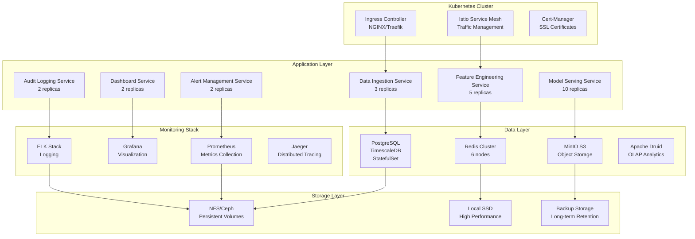

# On-Premises Containerized Deployment

## Overview

This document outlines the on-premises containerized deployment using Docker, Kubernetes, and microservices architecture. The system is designed for organizations that prefer to maintain their fraud detection infrastructure within their own data centers while still benefiting from containerization and orchestration.

## Kubernetes Architecture Overview



## Microservices Architecture

### Service Definitions

```yaml
# k8s-services.yaml
apiVersion: v1
kind: Service
metadata:
  name: fraud-detection-services
  namespace: fraud-detection
spec:
  selector:
    app: fraud-detection
  ports:
    - name: ingestion-api
      port: 8080
      targetPort: 8080
    - name: feature-api
      port: 8081
      targetPort: 8081
    - name: model-api
      port: 8082
      targetPort: 8082
    - name: alert-api
      port: 8083
      targetPort: 8083
  type: ClusterIP

---
apiVersion: apps/v1
kind: Deployment
metadata:
  name: data-ingestion-service
  namespace: fraud-detection
spec:
  replicas: 3
  selector:
    matchLabels:
      app: fraud-detection
      component: ingestion
  template:
    metadata:
      labels:
        app: fraud-detection
        component: ingestion
    spec:
      containers:
      - name: ingestion
        image: casino/fraud-detection:ingestion-v1.0.0
        ports:
        - containerPort: 8080
        env:
        - name: KAFKA_SERVERS
          value: "kafka-cluster:9092"
        - name: REDIS_CLUSTER
          value: "redis-cluster:6379"
        - name: POSTGRES_URL
          valueFrom:
            secretKeyRef:
              name: db-secrets
              key: postgres-url
        resources:
          requests:
            memory: "1Gi"
            cpu: "500m"
          limits:
            memory: "2Gi"
            cpu: "1000m"
        livenessProbe:
          httpGet:
            path: /health
            port: 8080
          initialDelaySeconds: 30
          periodSeconds: 10
        readinessProbe:
          httpGet:
            path: /ready
            port: 8080
          initialDelaySeconds: 5
          periodSeconds: 5
        volumeMounts:
        - name: config-volume
          mountPath: /app/config
      volumes:
      - name: config-volume
        configMap:
          name: fraud-detection-config
```

## Helm Chart Structure

### Main Chart Configuration

```yaml
# Chart.yaml
apiVersion: v2
name: fraud-detection-system
description: Real-time anti-fraud detection system for casino operations
type: application
version: 1.0.0
appVersion: "1.0.0"

dependencies:
  - name: postgresql
    version: "12.x.x"
    repository: "https://charts.bitnami.com/bitnami"
  - name: redis
    version: "17.x.x"
    repository: "https://charts.bitnami.com/bitnami"
  - name: kafka
    version: "20.x.x"
    repository: "https://charts.bitnami.com/bitnami"
  - name: prometheus
    version: "15.x.x"
    repository: "https://prometheus-community.github.io/helm-charts"
  - name: grafana
    version: "6.x.x"
    repository: "https://grafana.github.io/helm-charts"
```

### Values Configuration

```yaml
# values.yaml
global:
  imageRegistry: "casino"
  imagePullSecrets:
    - name: registry-secret

fraudDetection:
  image:
    repository: fraud-detection
    tag: "v1.0.0"
    pullPolicy: IfNotPresent

  services:
    ingestion:
      replicas: 3
      resources:
        requests:
          memory: "1Gi"
          cpu: "500m"
        limits:
          memory: "2Gi"
          cpu: "1000m"

    featureEngineering:
      replicas: 5
      resources:
        requests:
          memory: "2Gi"
          cpu: "1000m"
        limits:
          memory: "4Gi"
          cpu: "2000m"

    modelServing:
      replicas: 10
      resources:
        requests:
          memory: "4Gi"
          cpu: "2000m"
        limits:
          memory: "8Gi"
          cpu: "4000m"

  config:
    kafka:
      brokers: "kafka-cluster:9092"
      topic: "fraud-events"
    redis:
      cluster: "redis-cluster:6379"
    postgres:
      host: "postgresql"
      database: "fraud_detection"

postgresql:
  enabled: true
  auth:
    postgresPassword: "change-me"
    username: "fraud_user"
    password: "change-me"
    database: "fraud_detection"
  architecture: standalone
  persistence:
    enabled: true
    size: 50Gi

redis:
  enabled: true
  architecture: replication
  master:
    persistence:
      enabled: true
      size: 20Gi
  replica:
    replicaCount: 3
    persistence:
      enabled: true
      size: 20Gi

kafka:
  enabled: true
  replicas: 3
  persistence:
    enabled: true
    size: 100Gi
  zookeeper:
    persistence:
      enabled: true
      size: 20Gi

prometheus:
  enabled: true
  server:
    persistentVolume:
      enabled: true
      size: 50Gi

grafana:
  enabled: true
  adminPassword: "admin"
  persistence:
    enabled: true
    size: 10Gi
```

## Istio Service Mesh Configuration

### Traffic Management

```yaml
# istio-gateway.yaml
apiVersion: networking.istio.io/v1beta1
kind: Gateway
metadata:
  name: fraud-detection-gateway
  namespace: fraud-detection
spec:
  selector:
    istio: ingressgateway
  servers:
  - port:
      number: 80
      name: http
      protocol: HTTP
    hosts:
    - "fraud-detection.internal.company.com"
  - port:
      number: 443
      name: https
      protocol: HTTPS
    tls:
      mode: SIMPLE
      credentialName: fraud-detection-tls
    hosts:
    - "fraud-detection.internal.company.com"

---
apiVersion: networking.istio.io/v1beta1
kind: VirtualService
metadata:
  name: fraud-detection-routing
  namespace: fraud-detection
spec:
  hosts:
  - "fraud-detection.internal.company.com"
  gateways:
  - fraud-detection-gateway
  http:
  - match:
    - uri:
        prefix: "/api/v1/ingestion"
    route:
    - destination:
        host: data-ingestion-service
  - match:
    - uri:
        prefix: "/api/v1/features"
    route:
    - destination:
        host: feature-engineering-service
  - match:
    - uri:
        prefix: "/api/v1/models"
    route:
    - destination:
        host: model-serving-service
  - match:
    - uri:
        prefix: "/api/v1/alerts"
    route:
    - destination:
        host: alert-management-service
```

### Security Policies

```yaml
# istio-security.yaml
apiVersion: security.istio.io/v1beta1
kind: PeerAuthentication
metadata:
  name: fraud-detection-mtls
  namespace: fraud-detection
spec:
  selector:
    matchLabels:
      app: fraud-detection
  mtls:
    mode: STRICT

---
apiVersion: security.istio.io/v1beta1
kind: AuthorizationPolicy
metadata:
  name: fraud-detection-authz
  namespace: fraud-detection
spec:
  selector:
    matchLabels:
      app: fraud-detection
  action: ALLOW
  rules:
  - from:
    - source:
        principals: ["cluster.local/ns/fraud-detection/sa/fraud-detection-service-account"]
    to:
    - operation:
        methods: ["GET", "POST"]
```

## Data Storage Solutions

### PostgreSQL with TimescaleDB

```yaml
# postgresql-timescaledb.yaml
apiVersion: apps/v1
kind: StatefulSet
metadata:
  name: postgresql-timescaledb
  namespace: fraud-detection
spec:
  serviceName: postgresql
  replicas: 1
  selector:
    matchLabels:
      app: postgresql
  template:
    metadata:
      labels:
        app: postgresql
    spec:
      containers:
      - name: postgresql
        image: timescale/timescaledb:latest-pg14
        ports:
        - containerPort: 5432
        env:
        - name: POSTGRES_DB
          value: "fraud_detection"
        - name: POSTGRES_USER
          valueFrom:
            secretKeyRef:
              name: db-secrets
              key: username
        - name: POSTGRES_PASSWORD
          valueFrom:
            secretKeyRef:
              name: db-secrets
              key: password
        volumeMounts:
        - name: data
          mountPath: /var/lib/postgresql/data
        - name: init-scripts
          mountPath: /docker-entrypoint-initdb.d
      volumes:
      - name: init-scripts
        configMap:
          name: postgresql-init
  volumeClaimTemplates:
  - metadata:
      name: data
    spec:
      accessModes: ["ReadWriteOnce"]
      resources:
        requests:
          storage: 100Gi
      storageClassName: fast-ssd
```

### Redis Cluster Configuration

```yaml
# redis-cluster.yaml
apiVersion: apps/v1
kind: StatefulSet
metadata:
  name: redis-cluster
  namespace: fraud-detection
spec:
  serviceName: redis
  replicas: 6
  selector:
    matchLabels:
      app: redis
  template:
    metadata:
      labels:
        app: redis
    spec:
      containers:
      - name: redis
        image: redis:8-alpine
        ports:
        - containerPort: 6379
        command:
        - redis-server
        - /etc/redis/redis.conf
        volumeMounts:
        - name: config
          mountPath: /etc/redis
        - name: data
          mountPath: /data
        resources:
          requests:
            memory: "2Gi"
            cpu: "1000m"
          limits:
            memory: "4Gi"
            cpu: "2000m"
      volumes:
      - name: config
        configMap:
          name: redis-config
  volumeClaimTemplates:
  - metadata:
      name: data
    spec:
      accessModes: ["ReadWriteOnce"]
      resources:
        requests:
          storage: 50Gi
      storageClassName: fast-ssd

---
apiVersion: v1
kind: ConfigMap
metadata:
  name: redis-config
  namespace: fraud-detection
data:
  redis.conf: |
    cluster-enabled yes
    cluster-config-file /data/nodes.conf
    cluster-node-timeout 5000
    appendonly yes
    maxmemory 3gb
    maxmemory-policy allkeys-lru
```

## Monitoring and Observability

### Prometheus Configuration

```yaml
# prometheus-config.yaml
apiVersion: v1
kind: ConfigMap
metadata:
  name: prometheus-config
  namespace: monitoring
data:
  prometheus.yml: |
    global:
      scrape_interval: 15s
      evaluation_interval: 15s

    rule_files:
      - /etc/prometheus/rules/*.yml

    alerting:
      alertmanagers:
      - static_configs:
        - targets:
          - alertmanager:9093

    scrape_configs:
    - job_name: 'fraud-detection-services'
      kubernetes_sd_configs:
      - role: pod
      relabel_configs:
      - source_labels: [__meta_kubernetes_pod_label_app]
        regex: fraud-detection
        action: keep
      - source_labels: [__meta_kubernetes_pod_name]
        target_label: pod_name
      metrics_path: '/metrics'
      scrape_interval: 5s

    - job_name: 'kubernetes-nodes'
      kubernetes_sd_configs:
      - role: node
      relabel_configs:
      - source_labels: [__meta_kubernetes_node_name]
        target_label: node_name
```

### Grafana Dashboards

```json
// grafana-dashboard.json
{
  "dashboard": {
    "title": "Fraud Detection System Overview",
    "tags": ["fraud-detection", "kubernetes"],
    "timezone": "browser",
    "panels": [
      {
        "title": "Request Rate",
        "type": "graph",
        "targets": [
          {
            "expr": "rate(http_requests_total{namespace=\"fraud-detection\"}[5m])",
            "legendFormat": "{{service}}"
          }
        ]
      },
      {
        "title": "Response Time",
        "type": "graph",
        "targets": [
          {
            "expr": "histogram_quantile(0.95, rate(http_request_duration_seconds_bucket{namespace=\"fraud-detection\"}[5m]))",
            "legendFormat": "95th percentile"
          }
        ]
      },
      {
        "title": "Fraud Score Distribution",
        "type": "histogram",
        "targets": [
          {
            "expr": "fraud_score{namespace=\"fraud-detection\"}",
            "legendFormat": "fraud scores"
          }
        ]
      }
    ]
  }
}
```

## CI/CD Pipeline

### GitOps with ArgoCD

```yaml
# argocd-application.yaml
apiVersion: argoproj.io/v1alpha1
kind: Application
metadata:
  name: fraud-detection-system
  namespace: argocd
spec:
  project: default
  source:
    repoURL: https://github.com/company/fraud-detection
    targetRevision: HEAD
    path: k8s
  destination:
    server: https://kubernetes.default.svc
    namespace: fraud-detection
  syncPolicy:
    automated:
      prune: true
      selfHeal: true
    syncOptions:
    - CreateNamespace=true
```

### Jenkins Pipeline

```groovy
// Jenkinsfile
pipeline {
    agent {
        kubernetes {
            yaml '''
apiVersion: v1
kind: Pod
spec:
  containers:
  - name: docker
    image: docker:dind
    securityContext:
      privileged: true
  - name: kubectl
    image: bitnami/kubectl
    command:
    - cat
    tty: true
'''
        }
    }

    stages {
        stage('Build') {
            steps {
                container('docker') {
                    sh 'docker build -t casino/fraud-detection:${BUILD_NUMBER} .'
                    sh 'docker push casino/fraud-detection:${BUILD_NUMBER}'
                }
            }
        }

        stage('Test') {
            steps {
                sh 'kubectl apply -f k8s/test-environment.yaml'
                sh 'kubectl wait --for=condition=available --timeout=300s deployment/test-deployment'
                sh 'kubectl run test-runner --image=casino/fraud-detection-test:${BUILD_NUMBER} --restart=Never -- python -m pytest'
            }
        }

        stage('Deploy') {
            steps {
                container('kubectl') {
                    sh 'kubectl set image deployment/fraud-detection-app app=casino/fraud-detection:${BUILD_NUMBER}'
                    sh 'kubectl rollout status deployment/fraud-detection-app'
                }
            }
        }
    }
}
```

## Security Configuration

### Network Policies

```yaml
# network-policies.yaml
apiVersion: networking.k8s.io/v1
kind: NetworkPolicy
metadata:
  name: fraud-detection-network-policy
  namespace: fraud-detection
spec:
  podSelector:
    matchLabels:
      app: fraud-detection
  policyTypes:
  - Ingress
  - Egress
  ingress:
  - from:
    - namespaceSelector:
        matchLabels:
          name: ingress-nginx
    ports:
    - protocol: TCP
      port: 8080
    - protocol: TCP
      port: 8081
  egress:
  - to:
    - podSelector:
        matchLabels:
          app: postgresql
    ports:
    - protocol: TCP
      port: 5432
  - to:
    - podSelector:
        matchLabels:
          app: redis
    ports:
    - protocol: TCP
      port: 6379
  - to: []
    ports:
    - protocol: TCP
      port: 53
    - protocol: UDP
      port: 53
```

### Secrets Management

```yaml
# secrets.yaml
apiVersion: v1
kind: Secret
metadata:
  name: fraud-detection-secrets
  namespace: fraud-detection
type: Opaque
data:
  db-password: <base64-encoded-password>
  api-keys: <base64-encoded-api-keys>
  tls-cert: <base64-encoded-certificate>
  tls-key: <base64-encoded-private-key>

---
apiVersion: external-secrets.io/v1beta1
kind: ExternalSecret
metadata:
  name: fraud-detection-external-secrets
  namespace: fraud-detection
spec:
  refreshInterval: 15s
  secretStoreRef:
    name: vault-backend
    kind: SecretStore
  target:
    name: fraud-detection-external-secrets
    creationPolicy: Owner
  data:
  - secretKey: api-key
    remoteRef:
      key: fraud-detection
      property: api-key
```

## Backup and Disaster Recovery

### Velero Configuration

```yaml
# velero-backup.yaml
apiVersion: velero.io/v1
kind: Backup
metadata:
  name: fraud-detection-daily-backup
  namespace: velero
spec:
  includedNamespaces:
  - fraud-detection
  includedResources:
  - '*'
  excludedResources:
  - events
  - event
  storageLocation: default
  ttl: 720h0m0s
  schedule: "0 1 * * *"
  snapshotVolumes: true

---
apiVersion: velero.io/v1
kind: Schedule
metadata:
  name: fraud-detection-backup-schedule
  namespace: velero
spec:
  schedule: "0 */6 * * *"
  template:
    includedNamespaces:
    - fraud-detection
    storageLocation: default
    ttl: 168h0m0s
```

### Disaster Recovery Procedures

```bash
#!/bin/bash
# disaster-recovery.sh

# Restore from backup
velero restore create fraud-detection-restore \
  --from-backup fraud-detection-daily-backup \
  --namespace-mappings fraud-detection:fraud-detection-dr

# Wait for restoration
kubectl wait --for=condition=available --timeout=600s \
  -n fraud-detection-dr deployment/fraud-detection-app

# Switch traffic to DR site
kubectl patch ingress fraud-detection-ingress \
  -n fraud-detection-dr \
  --type=json \
  -p='[{"op": "replace", "path": "/spec/rules/0/host", "value": "fraud-detection.company.com"}]'

echo "Disaster recovery completed"
```

## Performance Optimization

### Resource Optimization

```yaml
# horizontal-pod-autoscaler.yaml
apiVersion: autoscaling/v2
kind: HorizontalPodAutoscaler
metadata:
  name: fraud-detection-hpa
  namespace: fraud-detection
spec:
  scaleTargetRef:
    apiVersion: apps/v1
    kind: Deployment
    name: model-serving-service
  minReplicas: 5
  maxReplicas: 20
  metrics:
  - type: Resource
    resource:
      name: cpu
      target:
        type: Utilization
        averageUtilization: 70
  - type: Resource
    resource:
      name: memory
      target:
        type: Utilization
        averageUtilization: 80
  behavior:
    scaleDown:
      stabilizationWindowSeconds: 300
      policies:
      - type: Percent
        value: 10
        periodSeconds: 60
```

### Node Affinity and Anti-Affinity

```yaml
# pod-affinity.yaml
apiVersion: apps/v1
kind: Deployment
metadata:
  name: model-serving-service
  namespace: fraud-detection
spec:
  template:
    spec:
      affinity:
        nodeAffinity:
          requiredDuringSchedulingIgnoredDuringExecution:
            nodeSelectorTerms:
            - matchExpressions:
              - key: node-type
                operator: In
                values:
                - gpu-node
        podAntiAffinity:
          preferredDuringSchedulingIgnoredDuringExecution:
          - weight: 100
            podAffinityTerm:
              labelSelector:
                matchLabels:
                  app: model-serving
              topologyKey: kubernetes.io/hostname
      tolerations:
      - key: "gpu"
        operator: "Equal"
        value: "true"
        effect: "NoSchedule"
```

This on-premises containerized deployment provides a robust, scalable, and secure infrastructure for running the fraud detection system within corporate data centers, with comprehensive monitoring, security, and disaster recovery capabilities.