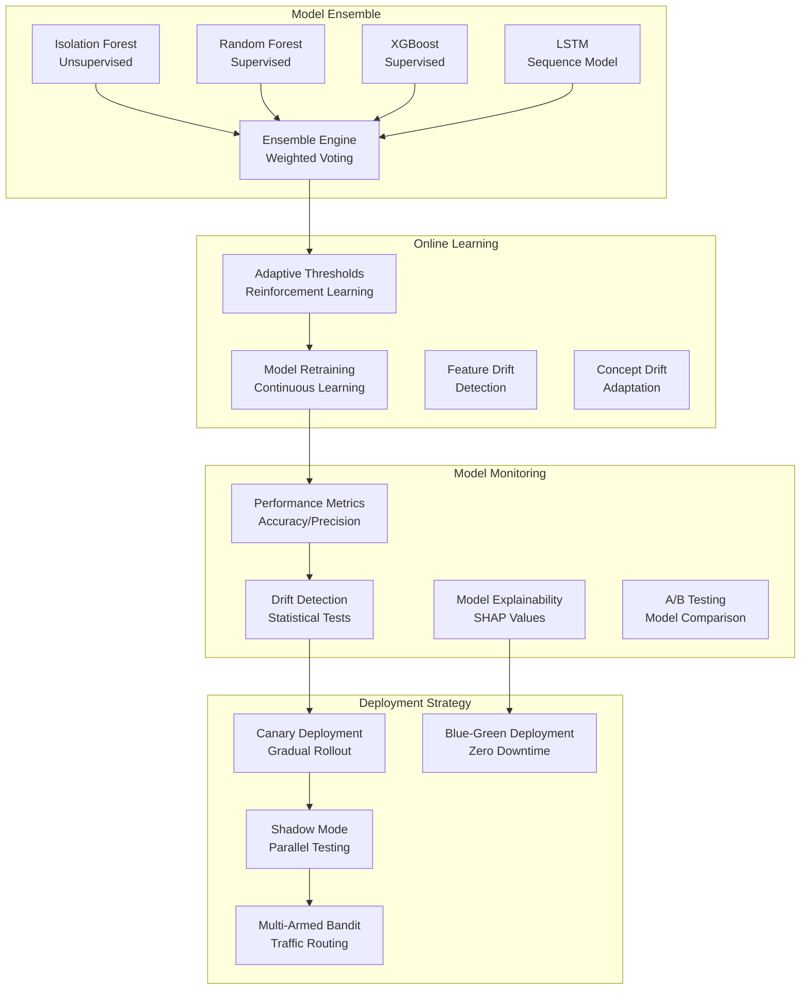

# Advanced ML Models Deployment

## Overview

This document outlines the deployment of advanced machine learning models including ensemble methods, online learning, and model monitoring for the fraud detection system.

## Advanced Model Architecture



## Ensemble Model Implementation

### Weighted Ensemble Engine

```python
import numpy as np
from typing import Dict, List, Any, Optional
import structlog

logger = structlog.get_logger(__name__)


class AdvancedEnsembleEngine:
    """Advanced ensemble engine with dynamic weighting and online learning"""

    def __init__(self, model_configs: Dict[str, Any]):
        self.model_configs = model_configs
        self.models = {}
        self.weights = {}
        self.performance_history = {}
        self.learning_rate = 0.01

    def add_model(self, name: str, model, base_weight: float = 1.0):
        """Add a model to the ensemble"""
        self.models[name] = model
        self.weights[name] = base_weight
        self.performance_history[name] = []

    def predict_ensemble(self, features: np.ndarray) -> Dict[str, Any]:
        """Generate ensemble prediction with confidence scoring"""

        individual_predictions = {}
        individual_probabilities = {}

        # Get predictions from each model
        for name, model in self.models.items():
            try:
                if hasattr(model, 'predict_proba'):
                    probs = model.predict_proba(features)
                    pred = (probs[:, 1] > 0.5).astype(int)
                    prob = probs[:, 1]
                else:
                    pred = model.predict(features)
                    prob = pred.astype(float)

                individual_predictions[name] = pred
                individual_probabilities[name] = prob

            except Exception as e:
                logger.error(f"Error predicting with {name}", error=str(e))
                individual_predictions[name] = np.zeros(len(features))
                individual_probabilities[name] = np.zeros(len(features))

        # Weighted ensemble prediction
        ensemble_prob = np.zeros(len(features))
        total_weight = sum(self.weights.values())

        for name, prob in individual_probabilities.items():
            weight = self.weights[name] / total_weight
            ensemble_prob += weight * prob

        ensemble_pred = (ensemble_prob > 0.5).astype(int)

        # Calculate confidence and consensus
        pred_array = np.array(list(individual_predictions.values()))
        consensus = np.mean(pred_array, axis=0)
        confidence = 1 - np.std(pred_array, axis=0)

        return {
            'prediction': ensemble_pred,
            'probability': ensemble_prob,
            'confidence': confidence,
            'consensus': consensus,
            'individual_predictions': individual_predictions,
            'individual_probabilities': individual_probabilities,
            'weights': self.weights.copy()
        }

    def update_weights(self, true_labels: np.ndarray, predictions: Dict[str, Any]):
        """Update model weights based on performance using online learning"""

        for name in self.models.keys():
            pred = predictions['individual_predictions'][name]
            prob = predictions['individual_probabilities'][name]

            # Calculate binary cross-entropy loss
            eps = 1e-15
            prob = np.clip(prob, eps, 1 - eps)
            loss = -np.mean(true_labels * np.log(prob) + (1 - true_labels) * np.log(1 - prob))

            # Store performance
            self.performance_history[name].append(loss)

            # Update weight using exponential moving average
            if len(self.performance_history[name]) > 1:
                recent_loss = np.mean(self.performance_history[name][-10:])  # Last 10 samples
                # Lower loss = better performance = higher weight
                target_weight = np.exp(-recent_loss)

                # Smooth weight update
                current_weight = self.weights[name]
                self.weights[name] = current_weight + self.learning_rate * (target_weight - current_weight)

                # Ensure minimum weight
                self.weights[name] = max(self.weights[name], 0.1)

    def get_model_performance(self) -> Dict[str, Any]:
        """Get performance statistics for all models"""

        performance = {}

        for name in self.models.keys():
            history = self.performance_history[name]
            if history:
                performance[name] = {
                    'current_loss': history[-1],
                    'avg_loss': np.mean(history),
                    'weight': self.weights[name],
                    'samples': len(history)
                }
            else:
                performance[name] = {
                    'current_loss': None,
                    'avg_loss': None,
                    'weight': self.weights[name],
                    'samples': 0
                }

        return performance
```

### Sequence Model Deployment

```python
import tensorflow as tf
from tensorflow import keras
import numpy as np


class SequenceModelDeployment:
    """Deployment wrapper for LSTM and other sequence models"""

    def __init__(self, model_path: str, sequence_length: int = 50):
        self.sequence_length = sequence_length
        self.model = keras.models.load_model(model_path)
        self.scaler = None  # Load from saved preprocessing

    def preprocess_sequence(self, historical_events: List[Dict[str, Any]]) -> np.ndarray:
        """Preprocess historical events into sequence format"""

        if len(historical_events) < self.sequence_length:
            # Pad sequence
            padding = [historical_events[0]] * (self.sequence_length - len(historical_events))
            historical_events = padding + historical_events

        # Extract features (simplified example)
        features = []
        for event in historical_events[-self.sequence_length:]:
            feature_vector = [
                event.get('amount', 0),
                event.get('bet_amount', 0),
                event.get('win_amount', 0),
                event.get('session_duration', 0),
                1 if event.get('is_fraud', False) else 0
            ]
            features.append(feature_vector)

        sequence = np.array(features).reshape(1, self.sequence_length, -1)

        # Apply scaling if available
        if self.scaler:
            # Reshape for scaling
            original_shape = sequence.shape
            sequence_2d = sequence.reshape(-1, sequence.shape[-1])
            sequence_2d = self.scaler.transform(sequence_2d)
            sequence = sequence_2d.reshape(original_shape)

        return sequence

    def predict_sequence_risk(self, historical_events: List[Dict[str, Any]]) -> Dict[str, Any]:
        """Predict fraud risk from event sequence"""

        sequence = self.preprocess_sequence(historical_events)

        prediction = self.model.predict(sequence, verbose=0)
        fraud_probability = float(prediction[0][0])

        # Calculate risk level
        if fraud_probability > 0.8:
            risk_level = "critical"
        elif fraud_probability > 0.6:
            risk_level = "high"
        elif fraud_probability > 0.4:
            risk_level = "medium"
        else:
            risk_level = "low"

        return {
            'fraud_probability': fraud_probability,
            'risk_level': risk_level,
            'sequence_length': len(historical_events),
            'model_confidence': min(fraud_probability, 1 - fraud_probability) * 2  # Distance from 0.5
        }
```

## Online Learning and Adaptation

### Adaptive Threshold Engine

```python
from sklearn.metrics import precision_recall_curve, roc_curve
import numpy as np


class AdaptiveThresholdEngine:
    """Adaptive threshold adjustment using reinforcement learning"""

    def __init__(self, initial_threshold: float = 0.5, learning_rate: float = 0.01):
        self.threshold = initial_threshold
        self.learning_rate = learning_rate
        self.performance_history = []
        self.threshold_history = [initial_threshold]

    def update_threshold(self, predictions: np.ndarray, true_labels: np.ndarray,
                        target_precision: float = 0.9):
        """Update threshold based on performance feedback"""

        # Calculate precision-recall curve
        precision, recall, thresholds = precision_recall_curve(true_labels, predictions)

        # Find threshold that achieves target precision
        valid_indices = precision >= target_precision
        if np.any(valid_indices):
            best_idx = np.argmax(recall[valid_indices])
            optimal_threshold = thresholds[valid_indices][best_idx]

            # Smooth threshold update
            self.threshold = (self.threshold + self.learning_rate * optimal_threshold) / (1 + self.learning_rate)
        else:
            # If target precision not achievable, use highest precision threshold
            best_idx = np.argmax(precision)
            optimal_threshold = thresholds[best_idx]
            self.threshold = optimal_threshold

        self.threshold_history.append(self.threshold)

        # Store performance
        current_precision = precision[np.argmin(np.abs(thresholds - self.threshold))]
        current_recall = recall[np.argmin(np.abs(thresholds - self.threshold))]

        self.performance_history.append({
            'threshold': self.threshold,
            'precision': current_precision,
            'recall': current_recall,
            'f1': 2 * current_precision * current_recall / (current_precision + current_recall)
        })

    def get_optimal_threshold(self, predictions: np.ndarray) -> float:
        """Get current optimal threshold"""
        return self.threshold

    def get_threshold_stats(self) -> Dict[str, Any]:
        """Get threshold adaptation statistics"""

        if not self.performance_history:
            return {'samples': 0}

        recent_perf = self.performance_history[-10:]  # Last 10 updates

        return {
            'current_threshold': self.threshold,
            'samples': len(self.performance_history),
            'avg_precision': np.mean([p['precision'] for p in recent_perf]),
            'avg_recall': np.mean([p['recall'] for p in recent_perf]),
            'avg_f1': np.mean([p['f1'] for p in recent_perf]),
            'threshold_stability': np.std(self.threshold_history[-10:])
        }
```

## Model Monitoring and Drift Detection

### Drift Detection Engine

```python
from scipy.stats import ks_2samp, chi2_contingency
import pandas as pd
from typing import Dict, Any, List


class DriftDetectionEngine:
    """Detect concept drift and feature drift in deployed models"""

    def __init__(self, reference_data: pd.DataFrame, drift_threshold: float = 0.05):
        self.reference_data = reference_data
        self.drift_threshold = drift_threshold
        self.drift_history = []

    def detect_feature_drift(self, current_data: pd.DataFrame) -> Dict[str, Any]:
        """Detect drift in individual features"""

        drift_results = {}

        for column in self.reference_data.columns:
            if column in current_data.columns:
                ref_values = self.reference_data[column].dropna()
                curr_values = current_data[column].dropna()

                if len(ref_values) > 10 and len(curr_values) > 10:
                    # Kolmogorov-Smirnov test for continuous features
                    if pd.api.types.is_numeric_dtype(ref_values):
                        ks_stat, p_value = ks_2samp(ref_values, curr_values)
                        drift_detected = p_value < self.drift_threshold

                        drift_results[column] = {
                            'drift_detected': drift_detected,
                            'test_statistic': ks_stat,
                            'p_value': p_value,
                            'test_type': 'ks_test'
                        }
                    else:
                        # Chi-square test for categorical features
                        ref_counts = ref_values.value_counts()
                        curr_counts = curr_values.value_counts()

                        # Create contingency table
                        all_categories = set(ref_counts.index) | set(curr_counts.index)
                        contingency = pd.DataFrame({
                            'reference': [ref_counts.get(cat, 0) for cat in all_categories],
                            'current': [curr_counts.get(cat, 0) for cat in all_categories]
                        })

                        try:
                            chi2, p_value, dof, expected = chi2_contingency(contingency)
                            drift_detected = p_value < self.drift_threshold

                            drift_results[column] = {
                                'drift_detected': drift_detected,
                                'test_statistic': chi2,
                                'p_value': p_value,
                                'test_type': 'chi_square'
                            }
                        except:
                            drift_results[column] = {
                                'drift_detected': False,
                                'error': 'chi_square_test_failed'
                            }

        # Overall drift assessment
        drift_features = [col for col, result in drift_results.items()
                         if result.get('drift_detected', False)]

        overall_drift = len(drift_features) > 0

        return {
            'overall_drift': overall_drift,
            'drift_features': drift_features,
            'feature_results': drift_results,
            'drift_percentage': len(drift_features) / len(drift_results) if drift_results else 0
        }

    def detect_concept_drift(self, predictions: np.ndarray, true_labels: np.ndarray) -> Dict[str, Any]:
        """Detect concept drift using prediction performance"""

        from sklearn.metrics import accuracy_score, precision_score, recall_score

        accuracy = accuracy_score(true_labels, predictions)
        precision = precision_score(true_labels, predictions, zero_division=0)
        recall = recall_score(true_labels, predictions, zero_division=0)
        f1 = 2 * precision * recall / (precision + recall) if (precision + recall) > 0 else 0

        # Compare with expected performance (should be calibrated during training)
        expected_accuracy = 0.85  # Example threshold
        expected_precision = 0.80

        concept_drift = (accuracy < expected_accuracy * 0.8 or  # 20% drop
                        precision < expected_precision * 0.8)

        return {
            'concept_drift': concept_drift,
            'accuracy': accuracy,
            'precision': precision,
            'recall': recall,
            'f1': f1,
            'expected_accuracy': expected_accuracy,
            'expected_precision': expected_precision
        }

    def update_reference_data(self, new_data: pd.DataFrame, update_fraction: float = 0.1):
        """Update reference data with new samples"""

        # Online update of reference data
        n_new = int(len(self.reference_data) * update_fraction)
        if len(new_data) >= n_new:
            # Replace oldest samples with new ones
            self.reference_data = pd.concat([
                self.reference_data[:-n_new],
                new_data.head(n_new)
            ]).reset_index(drop=True)
```

## Deployment Strategies

### Canary Deployment

```python
class CanaryDeployment:
    """Canary deployment for gradual model rollout"""

    def __init__(self, canary_percentage: float = 10.0):
        self.canary_percentage = canary_percentage
        self.canary_model = None
        self.production_model = None
        self.canary_metrics = {}
        self.production_metrics = {}

    def route_request(self, features: Dict[str, Any], user_id: str) -> str:
        """Route request to canary or production model"""

        # Simple hash-based routing for consistency
        import hashlib
        hash_value = int(hashlib.md5(user_id.encode()).hexdigest(), 16)
        percentage = (hash_value % 100) / 100.0

        if percentage < (self.canary_percentage / 100.0):
            return "canary"
        else:
            return "production"

    def compare_performance(self) -> Dict[str, Any]:
        """Compare canary vs production performance"""

        comparison = {}

        metrics_to_compare = ['accuracy', 'precision', 'recall', 'auc']

        for metric in metrics_to_compare:
            canary_value = self.canary_metrics.get(metric, 0)
            prod_value = self.production_metrics.get(metric, 0)

            comparison[metric] = {
                'canary': canary_value,
                'production': prod_value,
                'improvement': canary_value - prod_value,
                'relative_improvement': (canary_value - prod_value) / prod_value if prod_value > 0 else 0
            }

        # Determine if canary should be promoted
        avg_improvement = np.mean([comp['relative_improvement'] for comp in comparison.values()])

        comparison['recommendation'] = 'promote' if avg_improvement > 0.05 else 'rollback'  # 5% improvement threshold

        return comparison
```

### Shadow Mode Testing

```python
class ShadowModeTester:
    """Test new models in shadow mode without affecting production"""

    def __init__(self, shadow_model):
        self.shadow_model = shadow_model
        self.shadow_predictions = []
        self.production_predictions = []
        self.comparison_results = []

    def process_request(self, features: Dict[str, Any], production_prediction: Any):
        """Process request in shadow mode"""

        try:
            # Get shadow model prediction
            shadow_pred = self.shadow_model.predict(features)

            # Store for comparison
            self.shadow_predictions.append(shadow_pred)
            self.production_predictions.append(production_prediction)

            # Periodic comparison
            if len(self.shadow_predictions) % 100 == 0:
                self._compare_models()

        except Exception as e:
            logger.error("Shadow mode prediction failed", error=str(e))

    def _compare_models(self):
        """Compare shadow vs production predictions"""

        if len(self.shadow_predictions) < 10:
            return

        # Calculate agreement rate
        agreements = sum(1 for s, p in zip(self.shadow_predictions[-100:],
                                         self.production_predictions[-100:]) if s == p)
        agreement_rate = agreements / 100

        # Store comparison result
        self.comparison_results.append({
            'timestamp': pd.Timestamp.now(),
            'agreement_rate': agreement_rate,
            'samples_compared': 100
        })

        # Log if agreement is concerning
        if agreement_rate < 0.8:  # Less than 80% agreement
            logger.warning("Low agreement between shadow and production models",
                         agreement_rate=agreement_rate)

    def get_shadow_stats(self) -> Dict[str, Any]:
        """Get shadow mode testing statistics"""

        if not self.comparison_results:
            return {'samples_processed': 0}

        recent_results = self.comparison_results[-10:]  # Last 10 comparisons

        return {
            'samples_processed': len(self.shadow_predictions),
            'avg_agreement_rate': np.mean([r['agreement_rate'] for r in recent_results]),
            'min_agreement_rate': min(r['agreement_rate'] for r in recent_results),
            'max_agreement_rate': max(r['agreement_rate'] for r in recent_results),
            'agreement_stability': np.std([r['agreement_rate'] for r in recent_results])
        }
```

## Model Explainability

### SHAP Integration

```python
import shap
import pandas as pd


class ModelExplainer:
    """Generate explanations for model predictions using SHAP"""

    def __init__(self, model, background_data: pd.DataFrame):
        self.model = model
        self.explainer = None

        # Initialize SHAP explainer
        try:
            if hasattr(model, 'predict_proba'):
                self.explainer = shap.TreeExplainer(model)
            else:
                # For other model types
                self.explainer = shap.Explainer(model, background_data.sample(min(100, len(background_data))))
        except Exception as e:
            logger.error("Failed to initialize SHAP explainer", error=str(e))

    def explain_prediction(self, features: pd.DataFrame) -> Dict[str, Any]:
        """Generate SHAP explanation for a prediction"""

        if self.explainer is None:
            return {'error': 'SHAP explainer not initialized'}

        try:
            # Calculate SHAP values
            shap_values = self.explainer.shap_values(features)

            if isinstance(shap_values, list):
                # For multi-class, take positive class
                shap_values = shap_values[1] if len(shap_values) > 1 else shap_values[0]

            # Get feature importance
            feature_importance = dict(zip(features.columns, np.abs(shap_values).mean(axis=0)))

            # Sort by importance
            sorted_features = sorted(feature_importance.items(), key=lambda x: x[1], reverse=True)

            # Get top contributing features
            top_features = sorted_features[:10]

            return {
                'feature_importance': dict(sorted_features),
                'top_contributing_features': top_features,
                'shap_values': shap_values.tolist(),
                'base_value': float(self.explainer.expected_value) if hasattr(self.explainer, 'expected_value') else None
            }

        except Exception as e:
            logger.error("SHAP explanation failed", error=str(e))
            return {'error': str(e)}
```

This advanced ML deployment framework provides sophisticated model ensemble, online learning, monitoring, and deployment capabilities for production fraud detection systems.