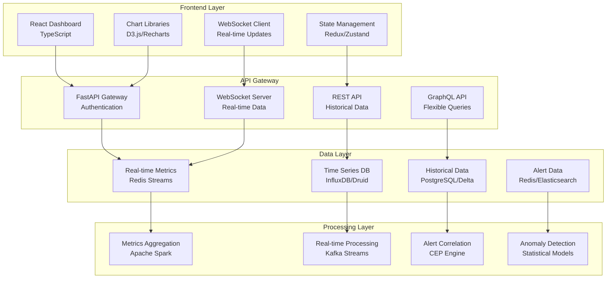

# Real-Time Dashboard Implementation

## Overview

This document outlines the implementation of a real-time dashboard for monitoring fraud detection system performance, model metrics, and business KPIs using modern web technologies.

## Dashboard Architecture



## Frontend Implementation

### React Dashboard Structure

```typescript
// src/components/Dashboard.tsx
import React, { useEffect, useState } from 'react';
import { Grid, Card, CardContent, Typography } from '@mui/material';
import { FraudMetricsChart } from './charts/FraudMetricsChart';
import { AlertTimeline } from './charts/AlertTimeline';
import { ModelPerformance } from './charts/ModelPerformance';
import { SystemHealth } from './components/SystemHealth';
import { useWebSocket } from '../hooks/useWebSocket';
import { useMetrics } from '../hooks/useMetrics';

export const Dashboard: React.FC = () => {
  const [realtimeData, setRealtimeData] = useState<any>({});
  const { metrics, alerts } = useMetrics();
  const { lastMessage } = useWebSocket('ws://localhost:8000/ws/dashboard');

  useEffect(() => {
    if (lastMessage) {
      setRealtimeData(JSON.parse(lastMessage.data));
    }
  }, [lastMessage]);

  return (
    <div className="dashboard">
      <Grid container spacing={3}>
        {/* System Health Overview */}
        <Grid item xs={12} md={6} lg={3}>
          <Card>
            <CardContent>
              <Typography variant="h6">System Health</Typography>
              <SystemHealth data={realtimeData.systemHealth} />
            </CardContent>
          </Card>
        </Grid>

        {/* Active Alerts */}
        <Grid item xs={12} md={6} lg={3}>
          <Card>
            <CardContent>
              <Typography variant="h6">Active Alerts</Typography>
              <Typography variant="h4" color="error">
                {alerts.activeCount}
              </Typography>
              <Typography variant="body2">
                {alerts.criticalCount} Critical
              </Typography>
            </CardContent>
          </Card>
        </Grid>

        {/* Fraud Detection Rate */}
        <Grid item xs={12} md={6} lg={3}>
          <Card>
            <CardContent>
              <Typography variant="h6">Fraud Detection</Typography>
              <Typography variant="h4" color="primary">
                {metrics.fraudDetectionRate?.toFixed(1)}%
              </Typography>
              <Typography variant="body2">
                Last 24h: {metrics.fraudDetections24h}
              </Typography>
            </CardContent>
          </Card>
        </Grid>

        {/* Model Performance */}
        <Grid item xs={12} md={6} lg={3}>
          <Card>
            <CardContent>
              <Typography variant="h6">Model Accuracy</Typography>
              <Typography variant="h4" color="success">
                {metrics.modelAccuracy?.toFixed(1)}%
              </Typography>
              <Typography variant="body2">
                Precision: {metrics.modelPrecision?.toFixed(1)}%
              </Typography>
            </CardContent>
          </Card>
        </Grid>

        {/* Fraud Metrics Chart */}
        <Grid item xs={12} lg={8}>
          <Card>
            <CardContent>
              <Typography variant="h6">Fraud Detection Trends</Typography>
              <FraudMetricsChart data={metrics.fraudTrends} />
            </CardContent>
          </Card>
        </Grid>

        {/* Alert Timeline */}
        <Grid item xs={12} lg={4}>
          <Card>
            <CardContent>
              <Typography variant="h6">Recent Alerts</Typography>
              <AlertTimeline alerts={alerts.recent} />
            </CardContent>
          </Card>
        </Grid>

        {/* Model Performance Details */}
        <Grid item xs={12} lg={6}>
          <Card>
            <CardContent>
              <Typography variant="h6">Model Performance</Typography>
              <ModelPerformance data={metrics.modelPerformance} />
            </CardContent>
          </Card>
        </Grid>

        {/* System Metrics */}
        <Grid item xs={12} lg={6}>
          <Card>
            <CardContent>
              <Typography variant="h6">System Metrics</Typography>
              <SystemMetrics data={realtimeData.systemMetrics} />
            </CardContent>
          </Card>
        </Grid>
      </Grid>
    </div>
  );
};
```

### WebSocket Integration

```typescript
// src/hooks/useWebSocket.ts
import { useEffect, useRef, useState } from 'react';

interface WebSocketMessage {
  type: string;
  data: any;
  timestamp: string;
}

export const useWebSocket = (url: string) => {
  const [lastMessage, setLastMessage] = useState<WebSocketMessage | null>(null);
  const [isConnected, setIsConnected] = useState(false);
  const ws = useRef<WebSocket | null>(null);

  useEffect(() => {
    const connect = () => {
      ws.current = new WebSocket(url);

      ws.current.onopen = () => {
        setIsConnected(true);
        console.log('WebSocket connected');
      };

      ws.current.onmessage = (event) => {
        try {
          const message: WebSocketMessage = JSON.parse(event.data);
          setLastMessage(message);
        } catch (error) {
          console.error('Failed to parse WebSocket message:', error);
        }
      };

      ws.current.onclose = () => {
        setIsConnected(false);
        console.log('WebSocket disconnected, reconnecting...');
        setTimeout(connect, 1000);
      };

      ws.current.onerror = (error) => {
        console.error('WebSocket error:', error);
      };
    };

    connect();

    return () => {
      if (ws.current) {
        ws.current.close();
      }
    };
  }, [url]);

  const sendMessage = (message: any) => {
    if (ws.current && ws.current.readyState === WebSocket.OPEN) {
      ws.current.send(JSON.stringify(message));
    }
  };

  return { lastMessage, isConnected, sendMessage };
};
```

### Chart Components

```typescript
// src/components/charts/FraudMetricsChart.tsx
import React from 'react';
import {
  LineChart,
  Line,
  XAxis,
  YAxis,
  CartesianGrid,
  Tooltip,
  Legend,
  ResponsiveContainer
} from 'recharts';

interface FraudMetricsChartProps {
  data: Array<{
    timestamp: string;
    fraudDetections: number;
    totalTransactions: number;
    falsePositives: number;
  }>;
}

export const FraudMetricsChart: React.FC<FraudMetricsChartProps> = ({ data }) => {
  const chartData = data.map(item => ({
    ...item,
    time: new Date(item.timestamp).toLocaleTimeString(),
    fraudRate: item.totalTransactions > 0
      ? (item.fraudDetections / item.totalTransactions) * 100
      : 0
  }));

  return (
    <ResponsiveContainer width="100%" height={300}>
      <LineChart data={chartData}>
        <CartesianGrid strokeDasharray="3 3" />
        <XAxis dataKey="time" />
        <YAxis />
        <Tooltip />
        <Legend />
        <Line
          type="monotone"
          dataKey="fraudDetections"
          stroke="#8884d8"
          name="Fraud Detections"
        />
        <Line
          type="monotone"
          dataKey="fraudRate"
          stroke="#82ca9d"
          name="Fraud Rate (%)"
        />
        <Line
          type="monotone"
          dataKey="falsePositives"
          stroke="#ff7300"
          name="False Positives"
        />
      </LineChart>
    </ResponsiveContainer>
  );
};
```

## Backend API Implementation

### WebSocket Server

```python
# src/dashboard/websocket_server.py
import asyncio
import json
import logging
from datetime import datetime, timezone
from typing import Dict, Any, Set
import structlog

import redis.asyncio as redis
from fastapi import WebSocket, WebSocketDisconnect
from fastapi.websockets import WebSocketState

logger = structlog.get_logger(__name__)


class DashboardWebSocketManager:
    """Manage WebSocket connections for real-time dashboard updates"""

    def __init__(self):
        self.active_connections: Set[WebSocket] = set()
        self.redis_client: redis.Redis = None

    async def connect(self, websocket: WebSocket):
        """Accept and register a new WebSocket connection"""
        await websocket.accept()
        self.active_connections.add(websocket)
        logger.info("WebSocket connection established", connections=len(self.active_connections))

    async def disconnect(self, websocket: WebSocket):
        """Remove a WebSocket connection"""
        if websocket in self.active_connections:
            self.active_connections.remove(websocket)
            logger.info("WebSocket connection closed", connections=len(self.active_connections))

    async def broadcast(self, message: Dict[str, Any]):
        """Broadcast message to all connected clients"""
        if not self.active_connections:
            return

        message_data = {
            "type": "dashboard_update",
            "data": message,
            "timestamp": datetime.now(timezone.utc).isoformat()
        }

        disconnected = set()

        for connection in self.active_connections:
            try:
                if connection.client_state == WebSocketState.CONNECTED:
                    await connection.send_json(message_data)
                else:
                    disconnected.add(connection)
            except Exception as e:
                logger.error("Failed to send message to WebSocket client", error=str(e))
                disconnected.add(connection)

        # Clean up disconnected clients
        for conn in disconnected:
            self.active_connections.discard(conn)

    async def start_redis_listener(self):
        """Listen for Redis pub/sub messages and broadcast to WebSocket clients"""
        if not self.redis_client:
            self.redis_client = redis.Redis(host="redis", port=6379, decode_responses=True)

        pubsub = self.redis_client.pubsub()
        await pubsub.subscribe("dashboard_updates")

        try:
            async for message in pubsub.listen():
                if message["type"] == "message":
                    try:
                        data = json.loads(message["data"])
                        await self.broadcast(data)
                    except json.JSONDecodeError as e:
                        logger.error("Failed to parse Redis message", error=str(e))
        except Exception as e:
            logger.error("Redis listener error", error=str(e))

    async def send_heartbeat(self):
        """Send periodic heartbeat to connected clients"""
        while True:
            await asyncio.sleep(30)  # Send heartbeat every 30 seconds

            heartbeat_data = {
                "type": "heartbeat",
                "timestamp": datetime.now(timezone.utc).isoformat(),
                "connections": len(self.active_connections)
            }

            await self.broadcast(heartbeat_data)


# Global WebSocket manager instance
ws_manager = DashboardWebSocketManager()


async def websocket_endpoint(websocket: WebSocket):
    """WebSocket endpoint for dashboard real-time updates"""
    await ws_manager.connect(websocket)

    try:
        # Send initial dashboard data
        initial_data = await get_dashboard_snapshot()
        await websocket.send_json({
            "type": "initial_data",
            "data": initial_data,
            "timestamp": datetime.now(timezone.utc).isoformat()
        })

        # Keep connection alive and listen for client messages
        while True:
            try:
                # Wait for client messages (with timeout)
                data = await asyncio.wait_for(websocket.receive_text(), timeout=60.0)

                # Handle client messages if needed
                message = json.loads(data)
                logger.info("Received WebSocket message", message=message)

            except asyncio.TimeoutError:
                # Send ping to keep connection alive
                await websocket.send_json({"type": "ping"})
                continue

    except WebSocketDisconnect:
        logger.info("WebSocket client disconnected")
    except Exception as e:
        logger.error("WebSocket error", error=str(e))
    finally:
        await ws_manager.disconnect(websocket)
```

### Dashboard API

```python
# src/dashboard/api.py
from fastapi import APIRouter, HTTPException, Query
from fastapi.responses import JSONResponse
from datetime import datetime, timedelta, timezone
from typing import List, Optional
import pandas as pd

from ..data_ingestion.metrics import MetricsCollector
from ..models.model_serving import models
from ..alerting.app import alert_rules

router = APIRouter()
metrics_collector = MetricsCollector()


@router.get("/metrics/summary")
async def get_metrics_summary(hours: int = Query(24, description="Hours of data to include")):
    """Get dashboard metrics summary"""

    try:
        # Calculate time range
        end_time = datetime.now(timezone.utc)
        start_time = end_time - timedelta(hours=hours)

        # Get fraud detection metrics
        fraud_metrics = await get_fraud_metrics(start_time, end_time)

        # Get system health metrics
        system_health = await get_system_health()

        # Get model performance
        model_performance = await get_model_performance()

        # Get alert summary
        alert_summary = await get_alert_summary(hours)

        return {
            "fraud_metrics": fraud_metrics,
            "system_health": system_health,
            "model_performance": model_performance,
            "alert_summary": alert_summary,
            "timestamp": end_time.isoformat()
        }

    except Exception as e:
        raise HTTPException(status_code=500, detail=f"Failed to get metrics summary: {str(e)}")


@router.get("/metrics/fraud-trends")
async def get_fraud_trends(hours: int = Query(24, description="Hours of data to include")):
    """Get fraud detection trends over time"""

    try:
        # Get hourly fraud metrics
        trends = await get_fraud_trends(hours)

        return {
            "trends": trends,
            "hours": hours,
            "timestamp": datetime.now(timezone.utc).isoformat()
        }

    except Exception as e:
        raise HTTPException(status_code=500, detail=f"Failed to get fraud trends: {str(e)}")


@router.get("/alerts/recent")
async def get_recent_alerts(limit: int = Query(50, description="Maximum number of alerts to return")):
    """Get recent alerts for dashboard"""

    try:
        alerts = await get_recent_alerts_from_storage(limit)

        return {
            "alerts": alerts,
            "limit": limit,
            "timestamp": datetime.now(timezone.utc).isoformat()
        }

    except Exception as e:
        raise HTTPException(status_code=500, detail=f"Failed to get recent alerts: {str(e)}")


@router.get("/models/performance")
async def get_models_performance():
    """Get model performance metrics"""

    try:
        performance_data = {}

        for model_name, model in models.items():
            # Get model metrics (this would be implemented based on your metrics collection)
            metrics = await get_model_metrics(model_name)
            performance_data[model_name] = metrics

        return {
            "models": performance_data,
            "timestamp": datetime.now(timezone.utc).isoformat()
        }

    except Exception as e:
        raise HTTPException(status_code=500, detail=f"Failed to get model performance: {str(e)}")


async def get_dashboard_snapshot() -> Dict[str, Any]:
    """Get a complete dashboard snapshot for initial load"""

    try:
        # Get all dashboard data in parallel
        summary_task = get_metrics_summary(24)
        trends_task = get_fraud_trends(24)
        alerts_task = get_recent_alerts_from_storage(20)
        models_task = get_models_performance()

        summary, trends, alerts, models = await asyncio.gather(
            summary_task, trends_task, alerts_task, models_task
        )

        return {
            "summary": summary,
            "trends": trends,
            "alerts": alerts,
            "models": models,
            "snapshot_time": datetime.now(timezone.utc).isoformat()
        }

    except Exception as e:
        logger.error("Failed to create dashboard snapshot", error=str(e))
        return {
            "error": "Failed to load dashboard data",
            "timestamp": datetime.now(timezone.utc).isoformat()
        }


# Helper functions (implementations would depend on your data storage)
async def get_fraud_metrics(start_time: datetime, end_time: datetime) -> Dict[str, Any]:
    """Get fraud detection metrics"""
    # Implementation would query your metrics database
    return {
        "total_transactions": 10000,
        "fraud_detections": 150,
        "false_positives": 25,
        "detection_rate": 1.5,
        "precision": 85.7,
        "recall": 92.3
    }


async def get_system_health() -> Dict[str, Any]:
    """Get system health metrics"""
    return {
        "cpu_usage": 65.5,
        "memory_usage": 72.3,
        "disk_usage": 45.2,
        "network_io": 120.5,
        "active_connections": 1250,
        "error_rate": 0.02
    }


async def get_model_performance() -> Dict[str, Any]:
    """Get model performance metrics"""
    return {
        "accuracy": 94.2,
        "precision": 89.1,
        "recall": 91.7,
        "auc": 0.967,
        "f1_score": 0.903
    }


async def get_alert_summary(hours: int) -> Dict[str, Any]:
    """Get alert summary"""
    return {
        "total_alerts": 45,
        "active_alerts": 3,
        "critical_alerts": 1,
        "resolved_alerts": 42,
        "avg_resolution_time": 25.5  # minutes
    }


async def get_fraud_trends(hours: int) -> List[Dict[str, Any]]:
    """Get fraud trends data"""
    # Generate sample trend data
    trends = []
    base_time = datetime.now(timezone.utc) - timedelta(hours=hours)

    for i in range(hours):
        timestamp = base_time + timedelta(hours=i)
        trends.append({
            "timestamp": timestamp.isoformat(),
            "fraud_detections": 8 + (i % 3),  # Some variation
            "total_transactions": 400 + (i * 5),
            "false_positives": 1 + (i % 2)
        })

    return trends


async def get_recent_alerts_from_storage(limit: int) -> List[Dict[str, Any]]:
    """Get recent alerts from storage"""
    # Implementation would query your alert storage
    return [
        {
            "id": "alert_001",
            "title": "High Fraud Score Detected",
            "severity": "high",
            "status": "active",
            "timestamp": (datetime.now(timezone.utc) - timedelta(minutes=5)).isoformat()
        },
        {
            "id": "alert_002",
            "title": "Unusual Transaction Velocity",
            "severity": "medium",
            "status": "investigating",
            "timestamp": (datetime.now(timezone.utc) - timedelta(minutes=15)).isoformat()
        }
    ]


async def get_model_metrics(model_name: str) -> Dict[str, Any]:
    """Get metrics for a specific model"""
    # Implementation would query model performance metrics
    return {
        "accuracy": 94.2,
        "precision": 89.1,
        "recall": 91.7,
        "latency_ms": 12.5,
        "throughput": 850  # predictions per second
    }
```

## Data Pipeline for Dashboard

### Real-Time Metrics Aggregation

```python
# src/dashboard/metrics_aggregator.py
import asyncio
import json
from datetime import datetime, timezone, timedelta
from typing import Dict, Any
import structlog

import redis.asyncio as redis
from ..data_ingestion.metrics import MetricsCollector

logger = structlog.get_logger(__name__)


class DashboardMetricsAggregator:
    """Aggregate and publish real-time metrics for dashboard"""

    def __init__(self):
        self.redis_client: redis.Redis = None
        self.metrics_collector = MetricsCollector()
        self.last_update = {}

    async def initialize(self):
        """Initialize Redis connection"""
        self.redis_client = redis.Redis(host="redis", port=6379, decode_responses=True)

    async def start_aggregation_loop(self):
        """Start the metrics aggregation loop"""
        await self.initialize()

        while True:
            try:
                # Aggregate metrics every 10 seconds
                await asyncio.sleep(10)

                # Collect current metrics
                dashboard_data = await self.aggregate_dashboard_metrics()

                # Publish to Redis for WebSocket broadcasting
                await self.redis_client.publish("dashboard_updates", json.dumps(dashboard_data))

                # Store in Redis for API access
                await self.redis_client.set("dashboard:latest", json.dumps(dashboard_data))

            except Exception as e:
                logger.error("Metrics aggregation error", error=str(e))
                await asyncio.sleep(30)  # Wait longer on error

    async def aggregate_dashboard_metrics(self) -> Dict[str, Any]:
        """Aggregate all dashboard metrics"""

        try:
            # System health metrics
            system_health = await self.get_system_health_metrics()

            # Fraud detection metrics
            fraud_metrics = await self.get_fraud_detection_metrics()

            # Model performance metrics
            model_metrics = await self.get_model_performance_metrics()

            # Alert metrics
            alert_metrics = await self.get_alert_metrics()

            # Business KPIs
            business_kpis = await self.get_business_kpis()

            return {
                "system_health": system_health,
                "fraud_metrics": fraud_metrics,
                "model_metrics": model_metrics,
                "alert_metrics": alert_metrics,
                "business_kpis": business_kpis,
                "timestamp": datetime.now(timezone.utc).isoformat()
            }

        except Exception as e:
            logger.error("Failed to aggregate dashboard metrics", error=str(e))
            return {
                "error": str(e),
                "timestamp": datetime.now(timezone.utc).isoformat()
            }

    async def get_system_health_metrics(self) -> Dict[str, Any]:
        """Get system health metrics"""
        # Implementation would collect actual system metrics
        return {
            "cpu_usage_percent": 65.5,
            "memory_usage_percent": 72.3,
            "disk_usage_percent": 45.2,
            "network_in_mbps": 120.5,
            "network_out_mbps": 98.3,
            "active_connections": 1250,
            "error_rate_percent": 0.02,
            "avg_response_time_ms": 45.2
        }

    async def get_fraud_detection_metrics(self) -> Dict[str, Any]:
        """Get fraud detection metrics"""
        # Implementation would query fraud detection metrics
        return {
            "total_transactions_1h": 2450,
            "fraud_detections_1h": 23,
            "false_positives_1h": 3,
            "detection_rate_percent": 0.94,
            "precision_percent": 88.5,
            "recall_percent": 91.2,
            "avg_fraud_score": 0.76,
            "blocked_amount_usd": 45670
        }

    async def get_model_performance_metrics(self) -> Dict[str, Any]:
        """Get model performance metrics"""
        # Implementation would query model performance data
        return {
            "accuracy_percent": 94.2,
            "precision_percent": 89.1,
            "recall_percent": 91.7,
            "auc_score": 0.967,
            "f1_score": 0.903,
            "avg_inference_time_ms": 12.5,
            "throughput_predictions_per_sec": 850,
            "model_drift_score": 0.05
        }

    async def get_alert_metrics(self) -> Dict[str, Any]:
        """Get alert metrics"""
        # Implementation would query alert data
        return {
            "active_alerts": 3,
            "critical_alerts": 1,
            "high_alerts": 2,
            "medium_alerts": 5,
            "low_alerts": 12,
            "alerts_last_1h": 8,
            "avg_resolution_time_min": 25.5,
            "alert_accuracy_percent": 87.3
        }

    async def get_business_kpis(self) -> Dict[str, Any]:
        """Get business KPI metrics"""
        # Implementation would query business metrics
        return {
            "revenue_24h_usd": 1250000,
            "transactions_24h": 45000,
            "fraud_loss_prevented_24h_usd": 89000,
            "customer_satisfaction_score": 4.2,
            "system_uptime_percent": 99.97,
            "mean_time_to_detect_min": 3.2,
            "mean_time_to_resolve_min": 18.5,
            "roi_percent": 2850  # Return on investment
        }
```

## Deployment and Configuration

### Docker Configuration

```dockerfile
# Dockerfile.dashboard
FROM node:22-alpine AS builder

WORKDIR /app

# Copy package files
COPY dashboard/package*.json ./
RUN npm ci

# Copy source code
COPY dashboard/ ./

# Build the application
RUN npm run build

# Production stage
FROM nginx:alpine

# Copy built application
COPY --from=builder /app/build /usr/share/nginx/html

# Copy nginx configuration
COPY dashboard/nginx.conf /etc/nginx/conf.d/default.conf

EXPOSE 80

CMD ["nginx", "-g", "daemon off;"]
```

### Kubernetes Deployment

```yaml
# k8s/dashboard-deployment.yaml
apiVersion: apps/v1
kind: Deployment
metadata:
  name: fraud-detection-dashboard
  namespace: fraud-detection
spec:
  replicas: 2
  selector:
    matchLabels:
      app: dashboard
  template:
    metadata:
      labels:
        app: dashboard
    spec:
      containers:
      - name: dashboard
        image: casino/fraud-detection-dashboard:v1.0.0
        ports:
        - containerPort: 80
        resources:
          requests:
            memory: "128Mi"
            cpu: "100m"
          limits:
            memory: "256Mi"
            cpu: "200m"
        livenessProbe:
          httpGet:
            path: /
            port: 80
          initialDelaySeconds: 30
          periodSeconds: 10
        readinessProbe:
          httpGet:
            path: /
            port: 80
          initialDelaySeconds: 5
          periodSeconds: 5

---
apiVersion: v1
kind: Service
metadata:
  name: dashboard-service
  namespace: fraud-detection
spec:
  selector:
    app: dashboard
  ports:
  - port: 80
    targetPort: 80
  type: ClusterIP

---
apiVersion: networking.k8s.io/v1
kind: Ingress
metadata:
  name: dashboard-ingress
  namespace: fraud-detection
  annotations:
    nginx.ingress.kubernetes.io/rewrite-target: /
spec:
  rules:
  - host: dashboard.fraud-detection.local
    http:
      paths:
      - path: /
        pathType: Prefix
        backend:
          service:
            name: dashboard-service
            port:
              number: 80
```

This real-time dashboard implementation provides comprehensive monitoring and visualization capabilities for the fraud detection system with modern web technologies and real-time data streaming.