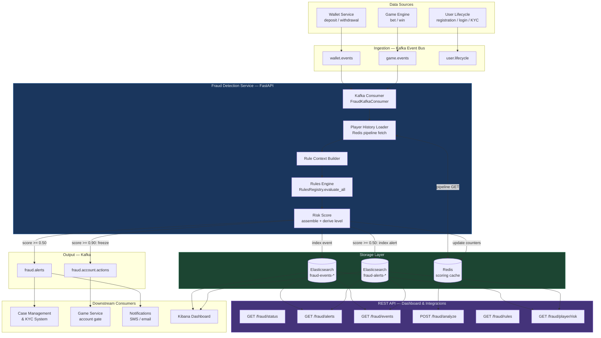

# AcmeToCasino Fraud Detection API — Architecture

Reference implementation for **Chapter 19: Anti-Fraud System Deep Dive** and
**Chapter 24: Security and Compliance**.

---

## System Overview

The fraud detection system is built around a streaming pipeline that scores
every financial transaction in real time, with a target latency of under 50 ms
(P99).  It combines a deterministic rules engine (explainable, auditable) with
an Elasticsearch-backed event store and a Redis scoring cache.

The architecture mirrors the production systems described in Chapter 19:
nothing is batch, everything streams.

---

## Data Flow



---

## Component Details

### Kafka — Event Bus

Apache Kafka is the backbone of the ingestion layer.  Three input topics feed
the fraud pipeline:

| Topic | Producer | Events |
|-------|----------|--------|
| `wallet.events` | Wallet service | deposit, withdrawal, refund |
| `game.events` | Game engine | bet, win |
| `user.lifecycle` | Auth service | registration, login, KYC update |

Two output topics carry fraud decisions downstream:

| Topic | Consumers | Purpose |
|-------|-----------|---------|
| `fraud.alerts` | Case management, notifications | Alert payloads for human review |
| `fraud.account.actions` | Game service, wallet service | Account freeze commands |

**Why Kafka:** partition replication for fault tolerance, consumer group
fan-out (multiple downstream consumers read the same fraud events
independently), and 7-day log retention for incident replay.  Exactly-once
semantics (idempotent producer + manual consumer offset commit) ensure no
transaction is silently dropped or double-scored.

### Redis — Scoring Cache

Redis maintains the sliding-window counters and per-player state that the
rules engine reads at scoring time.

```
player:{id}:deposit_count_1h        INCR, TTL 3600
player:{id}:deposit_count_24h       INCR, TTL 86400
player:{id}:deposit_amount_24h      INCRBYFLOAT, TTL 86400
player:{id}:bet_count_1m            INCR, TTL 60
player:{id}:known_countries         SADD (no TTL — lifetime set)
player:{id}:deposit_amounts_24h     LPUSH + LTRIM 100, TTL 86400
player:{id}:card_bins_1h            LPUSH + LTRIM 50, TTL 3600
player:{id}:last_login_country      SET, TTL 86400
player:{id}:last_login_at           SET (ISO datetime), TTL 86400
player:{id}:collusion_score         SET float, TTL 86400
device:{fp}:players                 SADD (device → player mapping)
device:{fp}:bonus_claimed           SET, no TTL
```

All counters are updated after every event in a single pipeline call
(no round-trips per field).  The `allkeys-lru` eviction policy ensures Redis
never runs out of memory — older, inactive player records are evicted
automatically.

**Graceful degradation:** if Redis is unavailable, the rules engine receives
an empty `player_history` dict.  Rules that require historical context do not
fire, but the service stays running and the rules that can evaluate without
history (amount anomaly against a defined threshold, impossible travel from
the current request payload alone) still function.

### Elasticsearch — Event and Alert Store

Two index patterns store all fraud data:

```
fraud-events-YYYY.MM.dd    individual scored transaction events
fraud-alerts-YYYY.MM.dd    investigation-threshold alerts
```

Index lifecycle policy (ILM):

```
Hot    (0–30 days)    active writes, full replicas
Warm   (30–90 days)   read-only, force-merged to 1 segment per shard
Cold   (90d–1 year)   frozen tier, lowest priority
Delete (5 years)      purged — satisfies UKGC/MGA 5-year retention requirement
```

**Mapping discipline:** both indices use `"dynamic": "false"` to prevent
mapping explosions from ad hoc `metadata` fields.  All fields queried by the
dashboard are explicitly mapped with exact types (`keyword`, `ip`, `date`,
`float`).

### Rules Engine — Explainable Detection Layer

The rules engine provides the explainable layer on top of the future ML
ensemble.  Ten rules cover the core fraud typologies described in Chapter 19:

| Rule ID | Typology | Signal | Threshold |
|---------|----------|--------|-----------|
| RULE-VEL-001 | velocity_anomaly | Deposits per hour | ≥ 5 (MGA/UKGC), ≥ 10 (US) |
| RULE-VEL-002 | bot_activity | Bets per minute | ≥ 30 bets/min |
| RULE-AMT-001 | amount_anomaly | Deposit vs 30-day average | ≥ 10× baseline |
| RULE-GEO-001 | geo_anomaly | New country for player | First occurrence |
| RULE-GEO-002 | account_takeover | Two countries within 2 hours | Impossible travel |
| RULE-DEV-001 | device_sharing | Players per device fingerprint | > 2 accounts |
| RULE-STR-001 | structuring | Deposit within 10% below AML threshold | ≥ 3 repeat deposits |
| RULE-BON-001 | bonus_abuse | First deposit from bonus-used device | Device + bonus flag |
| RULE-CRD-001 | card_testing | Distinct card BINs per hour | ≥ 3 BINs, small amounts |
| RULE-COL-001 | collusion | Pre-computed pair collusion score | ≥ 0.70 |

Rules are **jurisdiction-scoped** — RULE-VEL-001 uses a threshold of 5
deposits/hour for MGA, 10 for US jurisdictions.  The jurisdiction is carried
on every event from the upstream tracking service (Chapter 19: CoreEventInfo).

### FastAPI Service

The REST API layer serves both the compliance dashboard and inline
synchronous scoring from the wallet/game services.

**Synchronous scoring path (POST /fraud/analyze):**
1. Load player history from Redis (single pipeline call)
2. Build `RuleContext`
3. `RulesRegistry.evaluate_all()` — run all applicable rules
4. Return `RiskScore` with `recommended_action` and `feature_importances`
5. Index event and alert asynchronously (background task — does not block caller)

Target: < 50 ms P99.  Redis pipeline fetch is typically 1–3 ms; rule
evaluation is O(n_rules) pure Python — ~1 ms for 10 rules.

**Async ingestion path (Kafka consumer):**
The `FraudKafkaConsumer` runs as a background asyncio task.  It batch-polls
Kafka, processes each message through the same rules engine, and commits
offsets only after the full batch is indexed.

---

## Risk Scoring and Alert Thresholds

The ensemble score is the sum of all fired rule contributions (capped at 1.0).
Chapter 19 defines four alert tiers:

| Score | Level | Automated Response |
|-------|-------|--------------------|
| ≥ 0.90 | CRITICAL | Account freeze command published to `fraud.account.actions` |
| 0.70–0.89 | HIGH | Alert created, held for analyst review |
| 0.50–0.69 | MEDIUM | Alert created, enhanced monitoring flag set |
| < 0.50 | LOW | Event indexed, no alert |

The `recommended_action` field in `RiskScore` responses carries one of:

```
allow              proceed normally
block              reject transaction (CRITICAL)
hold_for_review    hold pending analyst decision
require_2fa        step-up authentication (account takeover signals)
require_kyc_step_up  enhanced due diligence flow
```

---

## KYC / AML Integration

The fraud API integrates with the KYC/AML system through two interfaces:

**Inbound (KYC events):** The `user.lifecycle` Kafka topic carries KYC status
change events.  When a player completes Enhanced Due Diligence (EDD), their
AML risk category is updated and persisted to their fraud profile.

**Outbound (risk data):** `GET /fraud/player/{id}/risk` exposes the player
risk profile to the KYC case management system.  The `aml_risk_category` field
(low / standard / high / very_high) drives CDD trigger logic per AMLD6
Article 18.

**FIAU / SAR filing:** When `aml_report_required = true` on a `FraudAlert`,
the case management system initiates a Suspicious Activity Report filing.
The `correlation_id` links the SAR back to the original wallet transaction
chain, satisfying FATF R.16 end-to-end traceability.

---

## Compliance Reference Map

| Regulation | Requirement | Implementation |
|-----------|-------------|----------------|
| AMLD6 Art. 18 | Risk-based CDD, continuous monitoring | Rules engine + Kafka consumer running on every transaction |
| AMLD6 Art. 18(2) | Automated monitoring | `FraudKafkaConsumer` — real-time, no batch |
| FATF R.10 | Transaction monitoring thresholds | Velocity rules with jurisdiction-aware thresholds |
| FATF R.16 | End-to-end fund traceability | `correlation_id` propagated from wallet → fraud → ES → SAR |
| FATF R.20 | Suspicious transaction reporting | `aml_report_required` flag on `FraudAlert` |
| PCI DSS Req. 10.2 | Log all access to cardholder data | Request middleware logs every API call with `correlation_id` |
| PCI DSS Req. 10.3.2 | Unique identifier per log record | `correlation_id` on every event and log line |
| PCI DSS Req. 10.5 | Protect audit logs | ES ILM warm-phase `readonly` action |
| PCI DSS Req. 10.7 | 12-month online log retention | ES ILM hot + warm phases |
| PCI DSS Req. 3.3/3.4 | Never store full PAN | `_extract_card_bin()` stores only first 6 digits |
| UKGC/MGA | Explain automated decisions | `feature_importances` on every `RiskScore` response |
| UKGC/MGA | 5-year log retention | ES ILM delete phase at 5 years |
| MGA Player Protection 2023 | Risk-proportionate monitoring | Jurisdiction-scoped rule thresholds |

---

## Geo-Fencing Integration (Chapter 24)

The `country_code` field on every incoming event is the verified country from
the four-layer geo-fencing system described in Chapter 24.  By the time an
event reaches the fraud API, the application-layer MaxMind check has already
resolved the country.

RULE-GEO-001 (new country) and RULE-GEO-002 (impossible travel) both rely on
this verified country code — they would not function correctly if the country
were unverified (e.g. player-supplied).

---

## Scaling Notes

| Component | Horizontal Scaling Strategy |
|-----------|----------------------------|
| Fraud API | Multiple stateless replicas behind a load balancer. Kafka consumer must run in one replica only (or use the same consumer group — Kafka partitions distribute load). |
| Kafka consumer | Scale by adding partitions to input topics and running multiple `FraudKafkaConsumer` instances in the same consumer group |
| Redis | Redis Cluster or ElastiCache cluster mode for production; single instance sufficient up to ~50k events/sec with pipeline batching |
| Elasticsearch | 3-node cluster in production; shard count sized to ~50 GB per shard |

---

## Directory Structure

```
fraud-api/
├── ARCHITECTURE.md          — this document
├── README.md                — setup and usage
├── docker-compose.yml       — full local development stack
├── requirements.txt         — Python dependencies
└── app/
    ├── __init__.py
    ├── main.py              — FastAPI application, lifespan, all endpoints
    ├── models.py            — Pydantic domain models
    ├── rules_engine.py      — fraud detection rules + RulesRegistry
    ├── elasticsearch_client.py  — ES index templates, query builders
    └── kafka_consumer.py    — Kafka consumer, event normalisation, alert dispatch
```
