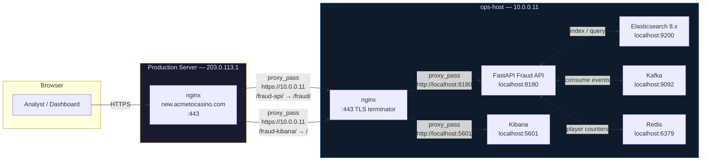
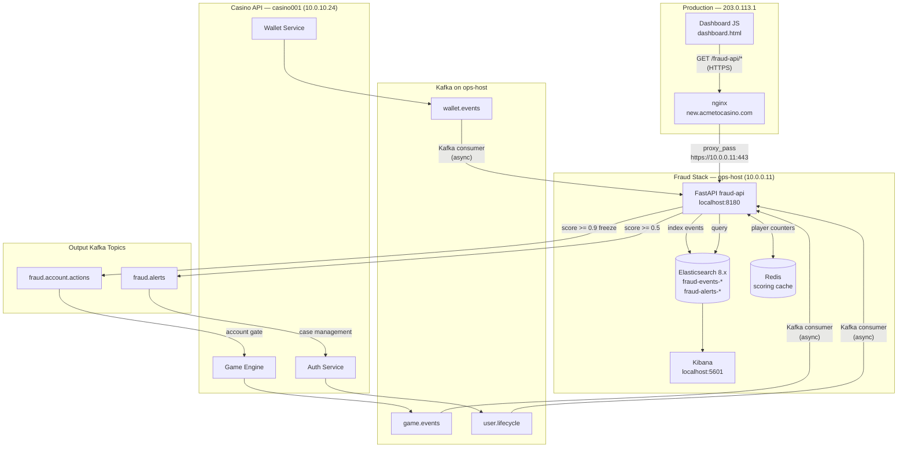

# Fraud Detection API — Production Deployment Plan

**Target:** ops-host (10.0.0.11) → new.acmetocasino.com (203.0.113.1)

This document covers the production deployment of the fraud detection stack described
in `ARCHITECTURE.md`. It is specific to the AcmeToCasino infrastructure. For generic
Kubernetes/cloud deployment patterns see `../architecture/on_premises_deployment.md`.

---

## 1. Architecture Decision

### Recommendation: Option B — nginx TLS termination on ops-host

Three options were considered:

| Option | Description | Verdict |
|--------|-------------|---------|
| A | Direct plaintext proxy from prod nginx to `10.0.0.11:8180` | Rejected — plaintext traffic across the LAN violates PCI DSS Req. 4.2 |
| B | nginx on ops-host terminates TLS, proxies to local fraud API | **Selected** |
| C | WireGuard VPN tunnel | Overkill for a same-datacenter LAN; adds operational complexity with no meaningful benefit over mTLS |

**Why Option B:**

- The production nginx at 203.0.113.1 already has the `/fraud-api/` location block
  partially configured. Pointing it at `https://10.0.0.11:443` requires a
  one-line upstream change.
- nginx on ops-host is a natural TLS termination point. Self-signed certs issued by
  OpenBao PKI are sufficient — the two servers share a private CA that production nginx
  already trusts for other internal services.
- All fraud service components (Elasticsearch, Kafka, Redis, FastAPI) remain on the
  loopback interface inside ops-host. Nothing is exposed on the LAN except port 443.
- Kibana can be proxied on a separate restricted path (`/fraud-kibana/`) with IP
  allowlisting, keeping analyst access without opening 5601 externally.

### Traffic Flow



---

## 2. ops-host Setup

### 2.1 Resource Allocation

ops-host has 499 GB RAM and 128 CPUs. The fraud stack is deliberately under-allocated
to leave headroom for the K8s cluster and other services already running there.

| Service | RAM limit | CPU limit | Rationale |
|---------|-----------|-----------|-----------|
| Elasticsearch | 8 GB heap (16 GB container) | 4 cores | Hot-phase indices with active writes |
| Kibana | 2 GB | 1 core | Read-only dashboard access |
| Kafka + Zookeeper | 2 GB | 2 cores | Low volume — internal events only |
| FastAPI fraud-api | 2 GB | 2 cores | Stateless, P99 < 50 ms target |
| Redis | 1 GB | 1 core | allkeys-lru, 512 MB maxmemory |
| **Total** | **~23 GB** | **~10 cores** | |

These are hard container limits. Burst beyond them requires an explicit change to the
compose file — prevents runaway ES memory from crowding out the K8s workloads.

### 2.2 Deployment Model: Docker Compose (bare-metal containers on ops-host)

The K8s cluster on ops-host is used for application workloads. The fraud stack runs
as a separate Docker Compose project (`/opt/fraud-api/`) **outside** the K8s cluster
for three reasons:

1. Elasticsearch and Kafka have complex stateful requirements that fight Kubernetes
   storage classes when running on the same node as the scheduler.
2. The fraud API is a single-brand service with a single replica; K8s brings no HA
   benefit here.
3. Operational simplicity: `docker compose restart fraud-api` is preferable to
   rolling restarts in a namespace that ops staff also use.

### 2.3 Production Docker Compose

Save as `/opt/fraud-api/docker-compose.prod.yml` on ops-host.

```yaml
# /opt/fraud-api/docker-compose.prod.yml
# Production fraud detection stack — ops-host (10.0.0.11)
#
# Key differences from the dev compose (fraud-api/docker-compose.yml):
#   - ES heap raised to 8 GB, security enabled with generated password
#   - Kafka listeners bound to localhost only (no external exposure)
#   - All ports bound to 127.0.0.1 — nothing exposed on LAN directly
#   - fraud-api binds to 127.0.0.1:8180 (nginx proxies on 443)
#   - Named volumes on /data/fraud-api/ for persistence outside Docker root
#   - Restart policy: always (survives host reboots)

version: "3.9"

services:

  zookeeper:
    image: confluentinc/cp-zookeeper:7.7.1
    container_name: fraud-zookeeper
    environment:
      ZOOKEEPER_CLIENT_PORT: 2181
      ZOOKEEPER_TICK_TIME: 2000
      ZOOKEEPER_LOG4J_ROOT_LOGLEVEL: WARN
    volumes:
      - zookeeper_data:/var/lib/zookeeper/data
      - zookeeper_logs:/var/lib/zookeeper/log
    networks: [fraud-net]
    healthcheck:
      test: ["CMD-SHELL", "echo ruok | nc -w 2 localhost 2181 | grep imok"]
      interval: 15s
      timeout: 10s
      retries: 5
    restart: always
    deploy:
      resources:
        limits:
          memory: 512m

  kafka:
    image: confluentinc/cp-kafka:7.7.1
    container_name: fraud-kafka
    depends_on:
      zookeeper:
        condition: service_healthy
    environment:
      KAFKA_BROKER_ID: 1
      KAFKA_ZOOKEEPER_CONNECT: zookeeper:2181
      KAFKA_LISTENER_SECURITY_PROTOCOL_MAP: INTERNAL:PLAINTEXT
      KAFKA_ADVERTISED_LISTENERS: INTERNAL://kafka:29092
      KAFKA_LISTENERS: INTERNAL://0.0.0.0:29092
      KAFKA_INTER_BROKER_LISTENER_NAME: INTERNAL
      KAFKA_OFFSETS_TOPIC_REPLICATION_FACTOR: 1
      KAFKA_TRANSACTION_STATE_LOG_MIN_ISR: 1
      KAFKA_TRANSACTION_STATE_LOG_REPLICATION_FACTOR: 1
      KAFKA_AUTO_CREATE_TOPICS_ENABLE: "true"
      KAFKA_LOG_RETENTION_HOURS: 168
      KAFKA_LOG4J_ROOT_LOGLEVEL: WARN
    volumes:
      - kafka_data:/var/lib/kafka/data
    networks: [fraud-net]
    healthcheck:
      test: ["CMD-SHELL", "kafka-broker-api-versions.sh --bootstrap-server localhost:29092 2>/dev/null | grep -q '29092'"]
      interval: 30s
      timeout: 15s
      retries: 5
    restart: always
    deploy:
      resources:
        limits:
          memory: 2g

  kafka-init:
    image: confluentinc/cp-kafka:7.7.1
    container_name: fraud-kafka-init
    depends_on:
      kafka:
        condition: service_healthy
    entrypoint: ["/bin/sh", "-c"]
    command: |
      "
      kafka-topics.sh --bootstrap-server kafka:29092 --create --if-not-exists --topic wallet.events       --replication-factor 1 --partitions 6
      kafka-topics.sh --bootstrap-server kafka:29092 --create --if-not-exists --topic game.events         --replication-factor 1 --partitions 6
      kafka-topics.sh --bootstrap-server kafka:29092 --create --if-not-exists --topic user.lifecycle      --replication-factor 1 --partitions 3
      kafka-topics.sh --bootstrap-server kafka:29092 --create --if-not-exists --topic fraud.alerts        --replication-factor 1 --partitions 3
      kafka-topics.sh --bootstrap-server kafka:29092 --create --if-not-exists --topic fraud.account.actions --replication-factor 1 --partitions 3
      echo 'Topics ready.'
      "
    networks: [fraud-net]
    restart: "no"

  redis:
    image: redis:7.4.1-alpine
    container_name: fraud-redis
    command: >
      redis-server
      --maxmemory 512mb
      --maxmemory-policy allkeys-lru
      --save 60 1
      --appendonly yes
      --requirepass "${REDIS_PASSWORD}"
      --loglevel warning
    volumes:
      - redis_data:/data
    networks: [fraud-net]
    healthcheck:
      test: ["CMD", "redis-cli", "-a", "${REDIS_PASSWORD}", "ping"]
      interval: 10s
      timeout: 5s
      retries: 5
    restart: always
    deploy:
      resources:
        limits:
          memory: 1g

  elasticsearch:
    image: docker.elastic.co/elasticsearch/elasticsearch:8.17.0
    container_name: fraud-elasticsearch
    # Port 9200 bound to loopback only — not accessible on LAN
    ports:
      - "127.0.0.1:9200:9200"
    environment:
      - discovery.type=single-node
      - xpack.security.enabled=true
      - xpack.security.http.ssl.enabled=false    # TLS handled by nginx on port 443
      - ES_JAVA_OPTS=-Xms8g -Xmx8g
      - bootstrap.memory_lock=true
      - ELASTIC_PASSWORD=${ELASTIC_PASSWORD}
    ulimits:
      memlock:
        soft: -1
        hard: -1
    volumes:
      - elasticsearch_data:/usr/share/elasticsearch/data
    networks: [fraud-net]
    healthcheck:
      test: ["CMD-SHELL", "curl -s -u elastic:${ELASTIC_PASSWORD} http://localhost:9200/_cluster/health | grep -qv '\"status\":\"red\"'"]
      interval: 20s
      timeout: 10s
      retries: 10
      start_period: 60s
    restart: always
    deploy:
      resources:
        limits:
          memory: 16g

  kibana:
    image: docker.elastic.co/kibana/kibana:8.17.0
    container_name: fraud-kibana
    # Port 5601 bound to loopback only
    ports:
      - "127.0.0.1:5601:5601"
    depends_on:
      elasticsearch:
        condition: service_healthy
    environment:
      ELASTICSEARCH_HOSTS: http://elasticsearch:9200
      ELASTICSEARCH_USERNAME: kibana_system
      ELASTICSEARCH_PASSWORD: ${KIBANA_SYSTEM_PASSWORD}
      XPACK_ENCRYPTEDSAVEDOBJECTS_ENCRYPTIONKEY: "${KIBANA_ENCRYPTION_KEY}"
      SERVER_NAME: fraud-kibana
      SERVER_BASEPATH: /fraud-kibana
      SERVER_REWRITEBASEPATH: "true"
      LOGGING_LEVEL: warn
    networks: [fraud-net]
    healthcheck:
      test: ["CMD-SHELL", "curl -s http://localhost:5601/fraud-kibana/api/status | grep -q 'available'"]
      interval: 30s
      timeout: 10s
      retries: 10
      start_period: 90s
    restart: always
    deploy:
      resources:
        limits:
          memory: 2g

  fraud-api:
    build:
      context: /opt/fraud-api/src
      dockerfile: Dockerfile
    image: acmetocasino/fraud-api:latest
    container_name: fraud-api
    # Port 8180 bound to loopback — nginx proxies on 443
    ports:
      - "127.0.0.1:8180:8080"
    depends_on:
      elasticsearch:
        condition: service_healthy
      kafka:
        condition: service_healthy
      redis:
        condition: service_healthy
    environment:
      ELASTICSEARCH_HOSTS: http://elasticsearch:9200
      ELASTICSEARCH_USERNAME: elastic
      ELASTICSEARCH_PASSWORD: ${ELASTIC_PASSWORD}
      REDIS_URL: redis://:${REDIS_PASSWORD}@redis:6379/0
      KAFKA_BOOTSTRAP_SERVERS: kafka:29092
      API_VERSION: "1.0.0"
      # CORS: allow production dashboard origin only
      CORS_ORIGINS: "https://new.acmetocasino.com"
      LOG_LEVEL: INFO
      # API key for dashboard authentication (see Section 7)
      FRAUD_API_KEY: ${FRAUD_API_KEY}
    networks: [fraud-net]
    healthcheck:
      test: ["CMD-SHELL", "curl -sf http://localhost:8080/fraud/status | grep -q 'status'"]
      interval: 30s
      timeout: 10s
      retries: 5
      start_period: 30s
    restart: always
    deploy:
      resources:
        limits:
          memory: 2g

volumes:
  zookeeper_data:
    driver: local
    driver_opts:
      type: none
      o: bind
      device: /data/fraud-api/zookeeper
  zookeeper_logs:
    driver: local
    driver_opts:
      type: none
      o: bind
      device: /data/fraud-api/zookeeper-logs
  kafka_data:
    driver: local
    driver_opts:
      type: none
      o: bind
      device: /data/fraud-api/kafka
  redis_data:
    driver: local
    driver_opts:
      type: none
      o: bind
      device: /data/fraud-api/redis
  elasticsearch_data:
    driver: local
    driver_opts:
      type: none
      o: bind
      device: /data/fraud-api/elasticsearch

networks:
  fraud-net:
    name: fraud-network
    driver: bridge
    internal: true    # containers cannot reach the LAN directly
```

Environment file at `/opt/fraud-api/.env` (not committed to git):

```bash
# /opt/fraud-api/.env
ELASTIC_PASSWORD=<generate: openssl rand -base64 32>
KIBANA_SYSTEM_PASSWORD=<generate: openssl rand -base64 32>
KIBANA_ENCRYPTION_KEY=<generate: openssl rand -base64 32 | head -c 32>
REDIS_PASSWORD=<generate: openssl rand -base64 24>
FRAUD_API_KEY=<generate: openssl rand -hex 32>
```

---

## 3. nginx TLS Configuration on ops-host

### 3.1 Certificate Strategy

Use **OpenBao PKI** to issue an internal certificate for `fraud.internal.acmetocasino.com`
(or a SAN of `10.0.0.11`). The production server at 203.0.113.1 already trusts the
internal CA for other services.

If OpenBao is not yet available, use a self-signed cert. Since this is a server-to-server
connection (production nginx → ops-host nginx) rather than a browser-to-server connection,
there is no UX penalty for a self-signed cert — production nginx just needs `proxy_ssl_trusted_certificate`
pointing at the CA bundle.

Generate a self-signed cert (fallback):

```bash
# Run on ops-host
openssl req -x509 -newkey rsa:4096 -keyout /etc/ssl/fraud-api/privkey.pem \
  -out /etc/ssl/fraud-api/fullchain.pem -days 825 -nodes \
  -subj "/CN=fraud.internal.acmetocasino.com" \
  -addext "subjectAltName=IP:10.0.0.11,DNS:fraud.internal.acmetocasino.com"
chmod 600 /etc/ssl/fraud-api/privkey.pem
```

For OpenBao PKI (preferred):

```bash
# Issue cert from internal CA (run on the Vault/OpenBao node)
vault write pki_int/issue/internal-services \
  common_name="fraud.internal.acmetocasino.com" \
  alt_names="fraud.internal.acmetocasino.com" \
  ip_sans="10.0.0.11" \
  ttl="8760h"
# Save cert and key to /etc/ssl/fraud-api/ on ops-host
```

### 3.2 nginx Config on ops-host

Save as `/etc/nginx/sites-available/fraud-api` on ops-host:

```nginx
# /etc/nginx/sites-available/fraud-api
# Terminates TLS for the fraud detection API and Kibana.
# Called by production nginx at 203.0.113.1 via proxy_pass.
# All upstream services are on localhost — nothing exposed on LAN except 443.

upstream fraud_api_upstream {
    server 127.0.0.1:8180;
    keepalive 32;
}

upstream kibana_upstream {
    server 127.0.0.1:5601;
    keepalive 16;
}

# Rate limit zones
limit_req_zone $binary_remote_addr zone=fraud_api_ratelimit:10m rate=60r/m;
limit_req_zone $binary_remote_addr zone=kibana_ratelimit:10m  rate=30r/m;

server {
    listen 443 ssl;
    server_name fraud.internal.acmetocasino.com 10.0.0.11;

    ssl_certificate     /etc/ssl/fraud-api/fullchain.pem;
    ssl_certificate_key /etc/ssl/fraud-api/privkey.pem;
    ssl_protocols       TLSv1.2 TLSv1.3;
    ssl_ciphers         ECDHE-ECDSA-AES128-GCM-SHA256:ECDHE-RSA-AES128-GCM-SHA256:ECDHE-ECDSA-AES256-GCM-SHA384:ECDHE-RSA-AES256-GCM-SHA384;
    ssl_prefer_server_ciphers off;
    ssl_session_cache   shared:SSL:10m;
    ssl_session_timeout 1d;

    # --- Fraud API ---
    location /fraud/ {
        limit_req zone=fraud_api_ratelimit burst=20 nodelay;

        # API key validation (set by production nginx as a header)
        if ($http_x_fraud_api_key = "") {
            return 401 '{"error":"missing api key"}';
        }

        proxy_pass         http://fraud_api_upstream/fraud/;
        proxy_http_version 1.1;
        proxy_set_header   Connection "";
        proxy_set_header   Host              $host;
        proxy_set_header   X-Real-IP         $remote_addr;
        proxy_set_header   X-Forwarded-For   $proxy_add_x_forwarded_for;
        proxy_set_header   X-Forwarded-Proto $scheme;
        proxy_read_timeout 10s;
        proxy_connect_timeout 5s;
    }

    # --- Kibana (analyst access, IP-restricted) ---
    location /fraud-kibana/ {
        limit_req zone=kibana_ratelimit burst=10 nodelay;

        # Restrict to production server IP + office VPN range
        allow 203.0.113.1;
        allow 10.0.0.0/8;
        deny all;

        proxy_pass         http://kibana_upstream/fraud-kibana/;
        proxy_http_version 1.1;
        proxy_set_header   Connection        "upgrade";
        proxy_set_header   Upgrade           $http_upgrade;
        proxy_set_header   Host              $host;
        proxy_set_header   X-Real-IP         $remote_addr;
        proxy_read_timeout 3600s;   # Kibana uses long-polling
    }

    # Health probe endpoint (no auth required — used by monitoring)
    location = /health {
        access_log off;
        proxy_pass http://fraud_api_upstream/fraud/status;
        proxy_read_timeout 5s;
    }

    # Block everything else
    location / {
        return 404;
    }

    access_log /var/log/nginx/fraud-api.access.log combined;
    error_log  /var/log/nginx/fraud-api.error.log warn;
}

# Redirect plain HTTP to HTTPS
server {
    listen 80;
    server_name fraud.internal.acmetocasino.com 10.0.0.11;
    return 301 https://$host$request_uri;
}
```

Enable and test:

```bash
ln -s /etc/nginx/sites-available/fraud-api /etc/nginx/sites-enabled/fraud-api
nginx -t && systemctl reload nginx
```

---

## 4. Production nginx Update (203.0.113.1)

Edit `/etc/nginx/sites-enabled/new.acmetocasino.com` on the production server.

### 4.1 Add Upstream and CA Bundle

Add near the top of the server config (or in `/etc/nginx/conf.d/fraud-api-upstream.conf`):

```nginx
upstream fraud_api_ops_host {
    server 10.0.0.11:443;
    keepalive 8;
}
```

### 4.2 Location Blocks

Add inside the `server { listen 443 ssl; ... }` block for new.acmetocasino.com:

```nginx
# -- Fraud API proxy → ops-host (10.0.0.11) --
#
# The fraud API service runs on ops-host and is exposed via TLS.
# The X-Fraud-Api-Key header carries the shared API key validated
# by nginx on ops-host before forwarding to the FastAPI service.
# See: scripts/chapter-19/fraud-api/DEPLOYMENT-PLAN.md

location /fraud-api/ {
    # Strip /fraud-api prefix before forwarding
    rewrite ^/fraud-api/(.*)$ /fraud/$1 break;

    proxy_pass          https://fraud_api_ops_host;
    proxy_http_version  1.1;
    proxy_set_header    Connection         "";
    proxy_set_header    Host               fraud.internal.acmetocasino.com;
    proxy_set_header    X-Real-IP          $remote_addr;
    proxy_set_header    X-Forwarded-For    $proxy_add_x_forwarded_for;
    proxy_set_header    X-Forwarded-Proto  $scheme;
    proxy_set_header    X-Fraud-Api-Key    "${FRAUD_API_KEY}";

    # TLS verification — use internal CA bundle
    proxy_ssl_verify           on;
    proxy_ssl_trusted_certificate /etc/ssl/internal-ca/ca-bundle.pem;
    proxy_ssl_name             fraud.internal.acmetocasino.com;

    proxy_read_timeout         10s;
    proxy_connect_timeout      5s;

    # CORS for dashboard JS (same origin — not strictly needed but explicit is safer)
    add_header Access-Control-Allow-Origin  "https://new.acmetocasino.com" always;
    add_header Access-Control-Allow-Methods "GET, POST, OPTIONS"            always;
    add_header Access-Control-Allow-Headers "Content-Type, X-Requested-With" always;

    if ($request_method = OPTIONS) {
        return 204;
    }
}

# Kibana analyst UI (restricted to internal networks)
location /fraud-kibana/ {
    allow 10.0.0.0/8;
    allow 192.168.0.0/16;
    deny all;

    proxy_pass          https://fraud_api_ops_host/fraud-kibana/;
    proxy_http_version  1.1;
    proxy_set_header    Upgrade            $http_upgrade;
    proxy_set_header    Connection         "upgrade";
    proxy_set_header    Host               fraud.internal.acmetocasino.com;
    proxy_ssl_verify    on;
    proxy_ssl_trusted_certificate /etc/ssl/internal-ca/ca-bundle.pem;
    proxy_read_timeout  3600s;
}
```

Note on `${FRAUD_API_KEY}`: nginx does not expand shell env vars directly. Use
`envsubst` at deploy time or store the value in the nginx config file via your
secrets management workflow (Ansible vault, OpenBao agent, etc.).

---

## 5. Dashboard Integration

### 5.1 Current State

The production dashboard at `new.acmetocasino.com/dashboard.html` has a fully built
"Fraud Detection" tab (`id="tab-fraud"`). The fraud statistics and case tables are
populated by inline JavaScript that generates simulated data. Key element IDs:

| Element ID | Current source | Real endpoint |
|------------|----------------|---------------|
| `fraudDetected` | Simulated count | `GET /fraud-api/alerts?status=detected&size=0` (ES aggs) |
| `fraudInvestigating` | Simulated | `GET /fraud-api/alerts?status=investigating&size=0` |
| `fraudResolved` | Simulated | `GET /fraud-api/alerts?status=resolved&size=0` |
| `fraudTotalAmount` | Simulated | `GET /fraud-api/events?aggregate=amount_sum` |
| Kibana link (already correct) | `http://10.0.0.11:5601/...` | Update to `/fraud-kibana/...` |

The dashboard already references `http://10.0.0.11:5601` for the Kibana link in
the Elasticsearch Analytics section. Once the nginx proxy is live, update this to
`/fraud-kibana/app/dashboards#/view/fraud-monitoring-dashboard`.

### 5.2 Graceful Fallback Strategy

The dashboard JS should:

1. On tab activation, fire `GET /fraud-api/fraud/status` with the API key header.
2. If the response is `200 OK` and `data.status !== "unavailable"`, switch to real mode:
   - Replace simulated data with live ES data from `/fraud-api/fraud/alerts` and
     `/fraud-api/fraud/events`.
   - Show a green "Live" indicator replacing the current "Simulated data" notice.
3. If the fetch fails (network error, `503`, timeout), stay on simulated data and
   show a yellow "Offline — showing cached data" indicator. Do not throw errors.

```javascript
// Suggested pattern for dashboard.html fraud tab initialization

const FRAUD_BASE = '/fraud-api';
const FRAUD_API_KEY = window.__FRAUD_API_KEY || '';  // injected by nginx sub_filter or meta tag

async function initFraudTab() {
  try {
    const res = await fetch(`${FRAUD_BASE}/fraud/status`, {
      headers: { 'X-Fraud-Api-Key': FRAUD_API_KEY },
      signal: AbortSignal.timeout(3000),
    });
    if (!res.ok) throw new Error(`status ${res.status}`);
    const data = await res.json();
    if (data.status !== 'unavailable') {
      await loadLiveFraudData();
      setFraudMode('live');
      return;
    }
  } catch (_) {
    // fall through to simulated
  }
  setFraudMode('simulated');
  loadSimulatedFraudData();  // existing function
}

async function loadLiveFraudData() {
  const headers = { 'X-Fraud-Api-Key': FRAUD_API_KEY };
  const [alerts, events, rules] = await Promise.all([
    fetch(`${FRAUD_BASE}/fraud/alerts?size=50`, { headers }).then(r => r.json()),
    fetch(`${FRAUD_BASE}/fraud/events?size=100`, { headers }).then(r => r.json()),
    fetch(`${FRAUD_BASE}/fraud/rules`, { headers }).then(r => r.json()),
  ]);
  // populate DOM elements with real data...
}
```

### 5.3 New Real Endpoints Used by Dashboard

| Dashboard feature | Endpoint | Notes |
|-------------------|----------|-------|
| Alert queue table | `GET /fraud-api/fraud/alerts` | Paginated, filterable by severity/status |
| Event feed | `GET /fraud-api/fraud/events` | Last N events from ES |
| Rules active list | `GET /fraud-api/fraud/rules` | Static rule catalogue from rules engine |
| Status metrics | `GET /fraud-api/fraud/status` | Health + real-time counters |
| Player risk lookup | `GET /fraud-api/fraud/player/{id}/risk` | Used from player-mgmt.html |
| Inline scoring | `POST /fraud-api/fraud/analyze` | Called by wallet service, not dashboard |

---

## 6. Complete Data Flow (Production)



---

## 7. Security

### 7.1 TLS Between Servers

All traffic between 203.0.113.1 and 10.0.0.11 uses TLS 1.2+. The production nginx
verifies the ops-host certificate against the internal CA bundle. Plaintext HTTP is only
used on the loopback interface (nginx → fraud-api container).

PCI DSS Req. 4.2 compliance: cardholder data never crosses the network in clear text.

### 7.2 API Authentication

A shared API key (`X-Fraud-Api-Key` header) authenticates requests from the production
nginx to ops-host nginx. The key is:

- Generated with `openssl rand -hex 32`
- Stored in `/opt/fraud-api/.env` on ops-host (not in the compose file)
- Injected into the production nginx config via Ansible vault or OpenBao agent
- Rotated quarterly (add to the runbook in `../docs/operational_runbooks.md`)

The FastAPI application validates the key in a middleware function (add to `app/main.py`):

```python
from fastapi import HTTPException, Request

FRAUD_API_KEY = os.environ.get("FRAUD_API_KEY", "")

@app.middleware("http")
async def api_key_middleware(request: Request, call_next):
    # Health endpoint exempted from auth
    if request.url.path in ("/fraud/status",):
        return await call_next(request)
    key = request.headers.get("x-fraud-api-key", "")
    if not FRAUD_API_KEY or key != FRAUD_API_KEY:
        return JSONResponse(status_code=401, content={"error": "unauthorized"})
    return await call_next(request)
```

### 7.3 Elasticsearch Security

- xpack.security enabled in production (disabled in dev compose)
- Kibana system user has read-only access to fraud indices
- ES not exposed on any LAN port; only reachable via the `fraud-network` Docker bridge
- ILM policy enforces `readonly` on warm-phase indices (PCI DSS Req. 10.5)

### 7.4 Rate Limiting Summary

| Layer | Limit | Scope |
|-------|-------|-------|
| Production nginx | 60 req/min | Per source IP |
| ops-host nginx | 60 req/min | Per connecting IP (effectively per prod server) |
| FastAPI | 100 req/min | Per API key (future: add `slowapi` middleware) |
| Kibana | 30 req/min | Per source IP at ops-host nginx |

### 7.5 Network Exposure Summary

| Port | Bound to | Accessible from | Purpose |
|------|----------|-----------------|---------|
| 443 (ops-host nginx) | 0.0.0.0 | 203.0.113.1 and VPN | TLS entrypoint |
| 8180 (fraud-api) | 127.0.0.1 | Loopback only | Internal |
| 9200 (ES) | 127.0.0.1 | Loopback only | Internal |
| 5601 (Kibana) | 127.0.0.1 | Loopback only | Internal |
| 9092 (Kafka) | Docker bridge | Containers only | Internal |
| 6379 (Redis) | Docker bridge | Containers only | Internal |

---

## 8. Implementation Timeline

### Day 1 — Deploy Fraud Stack on ops-host

```bash
# On ops-host (10.0.0.11)

# 1. Prepare data directories
sudo mkdir -p /data/fraud-api/{elasticsearch,kafka,redis,zookeeper,zookeeper-logs}
sudo chown -R 1000:1000 /data/fraud-api/elasticsearch  # ES runs as uid 1000
sudo chmod 700 /data/fraud-api/elasticsearch

# 2. Set ES vm.max_map_count (required by Elasticsearch)
echo "vm.max_map_count=262144" | sudo tee -a /etc/sysctl.conf
sudo sysctl -w vm.max_map_count=262144

# 3. Clone / copy fraud-api source
sudo mkdir -p /opt/fraud-api/src
# scp or rsync the fraud-api/ directory to /opt/fraud-api/src/

# 4. Create .env with generated secrets (do not commit)
sudo touch /opt/fraud-api/.env
sudo chmod 600 /opt/fraud-api/.env
# Edit .env with the generated values listed in Section 2.3

# 5. Build the fraud-api image
cd /opt/fraud-api
sudo docker compose -f docker-compose.prod.yml build fraud-api

# 6. Start infrastructure first, wait for ES to be healthy
sudo docker compose -f docker-compose.prod.yml up -d elasticsearch redis zookeeper kafka
sudo docker compose -f docker-compose.prod.yml logs -f elasticsearch
# Wait for "started" in ES logs (~60s)

# 7. Run kafka-init to create topics
sudo docker compose -f docker-compose.prod.yml run --rm kafka-init

# 8. Start remaining services
sudo docker compose -f docker-compose.prod.yml up -d

# 9. Verify all containers healthy
sudo docker compose -f docker-compose.prod.yml ps
curl -s http://127.0.0.1:8180/fraud/status | python3 -m json.tool
```

### Day 2 — Configure nginx TLS on ops-host, Connect to Production

```bash
# On ops-host

# 1. Generate TLS certificate (or issue from OpenBao PKI)
sudo mkdir -p /etc/ssl/fraud-api
sudo openssl req -x509 -newkey rsa:4096 \
  -keyout /etc/ssl/fraud-api/privkey.pem \
  -out /etc/ssl/fraud-api/fullchain.pem \
  -days 825 -nodes \
  -subj "/CN=fraud.internal.acmetocasino.com" \
  -addext "subjectAltName=IP:10.0.0.11,DNS:fraud.internal.acmetocasino.com"
sudo chmod 600 /etc/ssl/fraud-api/privkey.pem

# 2. Install nginx config (from Section 3.2)
sudo cp fraud-api.nginx.conf /etc/nginx/sites-available/fraud-api
sudo ln -s /etc/nginx/sites-available/fraud-api /etc/nginx/sites-enabled/fraud-api
sudo nginx -t && sudo systemctl reload nginx

# 3. Test TLS from production server
# (run on 203.0.113.1)
curl -sk --cacert /etc/ssl/internal-ca/ca-bundle.pem \
  https://10.0.0.11/health | python3 -m json.tool

# 4. Copy CA cert to production server
# scp /etc/ssl/fraud-api/fullchain.pem root@203.0.113.1:/etc/ssl/internal-ca/fraud-api-ca.pem

# On production server (203.0.113.1)
# 5. Update nginx config (from Section 4.2)
sudo nginx -t && sudo systemctl reload nginx

# 6. Verify end-to-end
curl -sk https://new.acmetocasino.com/fraud-api/fraud/status \
  -H "X-Fraud-Api-Key: ${FRAUD_API_KEY}" | python3 -m json.tool
```

### Day 3 — Update Dashboard to Use Real Endpoints

1. Edit `new-platform/frontend/dashboard.html`:
   - Replace the `fraudCases` simulated array generation with `loadLiveFraudData()`
     (see Section 5.2 pattern).
   - Add `initFraudTab()` call when the fraud tab is activated.
   - Update the Kibana hardcoded URL from `http://10.0.0.11:5601/...` to
     `/fraud-kibana/app/dashboards#/view/fraud-monitoring-dashboard`.
   - Add the "Live / Simulated" mode indicator badge to the fraud tab header.

2. Deploy the updated dashboard to production:
   ```bash
   # On 203.0.113.1
   sudo cp dashboard.html /var/www/new.acmetocasino.com/
   sudo nginx -t && sudo systemctl reload nginx
   ```

### Day 4 — End-to-End Testing

```bash
# Generate test fraud events against the fraud API directly
# Run from any machine with access to 203.0.113.1

# 1. Test status endpoint
curl -s https://new.acmetocasino.com/fraud-api/fraud/status \
  -H "X-Fraud-Api-Key: ${FRAUD_API_KEY}" | python3 -m json.tool

# 2. Submit a test transaction that should trigger RULE-VEL-001 (velocity anomaly)
for i in $(seq 1 6); do
  curl -s -X POST https://new.acmetocasino.com/fraud-api/fraud/analyze \
    -H "Content-Type: application/json" \
    -H "X-Fraud-Api-Key: ${FRAUD_API_KEY}" \
    -d '{
      "event_type": "deposit",
      "player_id": "test-player-001",
      "amount": 100.0,
      "currency": "EUR",
      "country_code": "MT",
      "jurisdiction": "MGA",
      "ip_address": "1.2.3.4",
      "device_fingerprint": "test-device-001",
      "correlation_id": "test-'$i'"
    }' | python3 -m json.tool
  sleep 1
done

# 3. Verify alert was created in ES (sixth deposit should trigger RULE-VEL-001)
curl -s https://new.acmetocasino.com/fraud-api/fraud/alerts?size=5 \
  -H "X-Fraud-Api-Key: ${FRAUD_API_KEY}" | python3 -m json.tool

# 4. Check events list
curl -s "https://new.acmetocasino.com/fraud-api/fraud/events?player_id=test-player-001" \
  -H "X-Fraud-Api-Key: ${FRAUD_API_KEY}" | python3 -m json.tool

# 5. Open dashboard and verify the Fraud Detection tab shows live data
# Confirm: green "Live" badge visible, alert count > 0, rules list shows 10 active rules
```

---

## 9. Book Chapter Updates Required

### Chapter 19: Anti-Fraud System Deep Dive

The chapter currently covers architecture, ML models, and the rules engine in depth.
It ends with `scripts/chapter-19/` as the reference implementation. Add a
**"Deploying to Production"** section after the Elasticsearch coverage that:

- References this deployment plan
- Explains the Option B nginx architecture decision (TLS termination on the
  analysis server, not the web server) and why it satisfies PCI DSS Req. 4.2
- Shows the `docker-compose.prod.yml` key differences from the dev compose
  (security enabled, loopback binds, production resource limits)
- Summarises the 4-day rollout timeline

This section should be approximately 600–800 words and sit before the "Monitoring"
section. It does not duplicate anything currently in the chapter since the chapter
currently has no deployment content — only architecture and implementation.

### Chapter 24: Security and Compliance

Chapter 24 already covers DevSecOps, pen testing, IDS/IPS, and certificate strategy.
Add a **"Fraud API Integration Security"** subsection under the IDS/IPS section that:

- Explains how the mTLS pattern (Option B) satisfies PCI DSS Req. 4.2 for
  server-to-server communication on an internal LAN
- References the API key middleware pattern (Section 7.2 above) as an example of
  defense-in-depth: TLS + application-layer API key, both required
- Connects to the geo-fencing discussion already in `24e-geofencing-location-verification.md`:
  the `country_code` on fraud events is the verified output of that four-layer check

This avoids duplicating the rules engine or Kafka material (Chapter 19), KYC/AML
(Chapter 24d), or Wazuh SIEM (Chapter 24b). The focus is purely on the transport
security and authentication layer between production and the fraud service.

---

## Appendix: File Locations Reference

| File | Location | Purpose |
|------|----------|---------|
| Production Docker Compose | `/opt/fraud-api/docker-compose.prod.yml` on ops-host | Runs the full stack |
| Environment secrets | `/opt/fraud-api/.env` on ops-host | Passwords and API keys (not in git) |
| Data volumes | `/data/fraud-api/*` on ops-host | Persistent storage outside Docker root |
| ops-host nginx config | `/etc/nginx/sites-available/fraud-api` on ops-host | TLS termination |
| Prod nginx update | `/etc/nginx/sites-enabled/new.acmetocasino.com` on 203.0.113.1 | `/fraud-api/` proxy location |
| Internal CA bundle | `/etc/ssl/internal-ca/ca-bundle.pem` on 203.0.113.1 | Verifies ops-host TLS cert |
| Fraud API source | `scripts/chapter-19/fraud-api/` in this repo | Copied to `/opt/fraud-api/src/` |
| Architecture doc | `scripts/chapter-19/fraud-api/ARCHITECTURE.md` | Component design reference |
| This document | `scripts/chapter-19/fraud-api/DEPLOYMENT-PLAN.md` | Production deployment plan |
