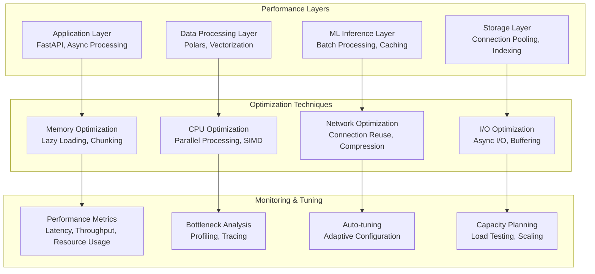

# Performance Tuning Guide

## Overview

This guide provides comprehensive performance tuning strategies for the fraud detection system, covering optimization techniques for data processing, machine learning inference, memory management, and system scalability.

## Performance Architecture



## Data Processing Optimization

### Polars Performance Tuning

```python
import polars as pl
from typing import List, Dict, Any
import psutil
import os

class OptimizedDataProcessor:
    """High-performance data processor with memory and CPU optimization"""

    def __init__(self, memory_limit_gb: float = 8.0, n_threads: int = None):
        self.memory_limit_gb = memory_limit_gb
        self.n_threads = n_threads or min(os.cpu_count(), 8)

        # Configure Polars for optimal performance
        pl.Config.set_global_string_cache(True)
        pl.Config.set_global_float_width(4)  # Reduce memory usage
        pl.Config.set_global_tbl_rows(1000)  # Limit display for performance

        # Set thread pool size
        os.environ["POLARS_MAX_THREADS"] = str(self.n_threads)

    def process_large_dataset_chunked(self, file_path: str, chunk_size: int = 100000) -> pl.DataFrame:
        """Process large datasets in memory-efficient chunks"""

        # Get total rows for progress tracking
        total_rows = pl.scan_csv(file_path).select(pl.len()).collect().item()

        processed_chunks = []

        for start_row in range(0, total_rows, chunk_size):
            # Check memory usage before processing chunk
            memory_usage = psutil.virtual_memory().percent
            if memory_usage > 85:
                self._force_garbage_collection()

            # Process chunk with lazy evaluation
            chunk = (
                pl.scan_csv(file_path)
                .slice(start_row, chunk_size)
                .with_columns([
                    pl.col("timestamp").str.strptime(pl.Datetime, "%Y-%m-%d %H:%M:%S"),
                    pl.col("amount").cast(pl.Float32),  # Use smaller float type
                ])
                .filter(pl.col("amount").is_not_null())
                .collect()
            )

            # Apply feature engineering
            processed_chunk = self._apply_feature_engineering(chunk)
            processed_chunks.append(processed_chunk)

            # Memory cleanup
            del chunk
            self._force_garbage_collection()

        # Concatenate results efficiently
        result = pl.concat(processed_chunks, rechunk=False)

        return result

    def _apply_feature_engineering(self, df: pl.DataFrame) -> pl.DataFrame:
        """Apply optimized feature engineering"""

        return (
            df.lazy()
            .group_by("player_id")
            .agg([
                pl.col("amount").sum().alias("total_amount"),
                pl.col("amount").mean().alias("avg_amount"),
                pl.col("amount").std().alias("amount_std"),
                pl.col("amount").count().alias("transaction_count"),
                # Rolling aggregations for time-series features
                pl.col("amount").rolling_mean(window_size=10).alias("rolling_avg_10"),
                pl.col("amount").rolling_std(window_size=10).alias("rolling_std_10"),
            ])
            .with_columns([
                (pl.col("total_amount") / pl.col("transaction_count")).alias("avg_transaction"),
                pl.when(pl.col("amount_std") > 0)
                .then((pl.col("rolling_std_10") / pl.col("amount_std")))
                .otherwise(0)
                .alias("volatility_ratio")
            ])
            .collect()
        )

    def _force_garbage_collection(self):
        """Force garbage collection to free memory"""
        import gc
        gc.collect()

    def optimize_dataframe_operations(self, df: pl.DataFrame) -> pl.DataFrame:
        """Apply performance optimizations to DataFrame operations"""

        # Use lazy evaluation for complex operations
        optimized = (
            df.lazy()
            # Pre-filter to reduce data size
            .filter(pl.col("amount") > 0)
            # Use vectorized operations
            .with_columns([
                pl.col("amount").log().alias("log_amount"),
                pl.col("timestamp").dt.hour().alias("hour"),
                pl.col("timestamp").dt.weekday().alias("weekday"),
            ])
            # Efficient aggregations
            .group_by(["player_id", "hour"])
            .agg([
                pl.col("amount").sum().alias("hourly_total"),
                pl.col("amount").count().alias("hourly_count"),
                pl.col("log_amount").mean().alias("avg_log_amount"),
            ])
            .collect()
        )

        return optimized
```

### Memory Management Strategies

```python
import psutil
import os
from contextlib import contextmanager

class MemoryManager:
    """Memory management utilities for performance optimization"""

    def __init__(self, memory_threshold: float = 0.8):
        self.memory_threshold = memory_threshold
        self.process = psutil.Process(os.getpid())

    @contextmanager
    def memory_monitor(self, operation_name: str = "operation"):
        """Context manager to monitor memory usage during operations"""

        start_memory = self.process.memory_info().rss / 1024 / 1024  # MB
        start_time = time.time()

        try:
            yield
        finally:
            end_memory = self.process.memory_info().rss / 1024 / 1024  # MB
            end_time = time.time()

            memory_delta = end_memory - start_memory
            duration = end_time - start_time

            print(f"{operation_name}:")
            print(f"  Duration: {duration:.2f}s")
            print(f"  Memory delta: {memory_delta:.1f}MB")
            print(f"  Memory peak: {psutil.virtual_memory().percent:.1f}%")

    def should_process_chunk(self, estimated_chunk_size_mb: float) -> bool:
        """Check if there's enough memory to process a chunk"""

        available_memory = psutil.virtual_memory().available / 1024 / 1024  # MB
        current_usage = psutil.virtual_memory().percent / 100

        # Reserve some memory for system operations
        effective_available = available_memory * (1 - current_usage * 0.1)

        return effective_available > estimated_chunk_size_mb * 2  # 2x safety margin

    def optimize_chunk_size(self, total_rows: int, row_size_estimate: int = 1000) -> int:
        """Dynamically optimize chunk size based on available memory"""

        available_memory = psutil.virtual_memory().available / 1024 / 1024  # MB
        memory_for_data = available_memory * 0.7  # Use 70% of available memory

        estimated_total_size = (total_rows * row_size_estimate) / 1024 / 1024  # MB

        if estimated_total_size <= memory_for_data:
            return total_rows  # Process all at once

        # Calculate optimal chunk size
        chunk_size = int(memory_for_data / row_size_estimate * 1024 * 1024 / total_rows * total_rows)

        # Ensure reasonable bounds
        chunk_size = max(10000, min(chunk_size, 500000))

        return chunk_size
```

## Machine Learning Inference Optimization

### Batch Processing and Caching

```python
import asyncio
import time
from typing import List, Dict, Any, Optional
from concurrent.futures import ThreadPoolExecutor
import redis.asyncio as redis

class OptimizedMLInference:
    """Optimized ML inference with batching, caching, and parallel processing"""

    def __init__(self, batch_size: int = 100, cache_ttl: int = 3600):
        self.batch_size = batch_size
        self.cache_ttl = cache_ttl
        self.redis_client: Optional[redis.Redis] = None
        self.executor = ThreadPoolExecutor(max_workers=4)

        # Model cache
        self.model_cache = {}
        self.feature_cache = {}

    async def initialize(self):
        """Initialize Redis connection"""
        self.redis_client = redis.Redis(host="redis", port=6379, decode_responses=True)

    async def batch_predict(self, features_list: List[Dict[str, Any]],
                          model_name: str = "ensemble") -> List[Dict[str, Any]]:
        """Batch prediction with caching and parallel processing"""

        # Check cache first
        cached_results = await self._get_cached_predictions(features_list)
        uncached_indices = [i for i, result in enumerate(cached_results) if result is None]
        uncached_features = [features_list[i] for i in uncached_indices]

        if uncached_features:
            # Process uncached features in batches
            batch_results = await self._process_batches(uncached_features, model_name)

            # Cache results
            await self._cache_predictions(uncached_features, batch_results)

            # Merge with cached results
            for i, result in zip(uncached_indices, batch_results):
                cached_results[i] = result

        return cached_results

    async def _process_batches(self, features_list: List[Dict[str, Any]],
                             model_name: str) -> List[Dict[str, Any]]:
        """Process features in optimized batches"""

        results = []

        for i in range(0, len(features_list), self.batch_size):
            batch = features_list[i:i + self.batch_size]

            # Process batch asynchronously
            batch_result = await asyncio.get_event_loop().run_in_executor(
                self.executor,
                self._predict_batch_sync,
                batch,
                model_name
            )

            results.extend(batch_result)

        return results

    def _predict_batch_sync(self, batch: List[Dict[str, Any]],
                           model_name: str) -> List[Dict[str, Any]]:
        """Synchronous batch prediction (runs in thread pool)"""

        # Load model if not cached
        if model_name not in self.model_cache:
            self.model_cache[model_name] = self._load_model(model_name)

        model = self.model_cache[model_name]

        # Convert to DataFrame for efficient processing
        import pandas as pd
        df = pd.DataFrame(batch)

        # Make predictions
        start_time = time.time()

        if hasattr(model, 'predict_proba'):
            probabilities = model.predict_proba(df)[:, 1]
            predictions = (probabilities > 0.5).astype(int)
        else:
            predictions = model.predict(df)
            probabilities = predictions.astype(float)

        inference_time = time.time() - start_time

        # Return results
        results = []
        for i, (pred, prob) in enumerate(zip(predictions, probabilities)):
            results.append({
                "prediction": int(pred),
                "probability": float(prob),
                "inference_time_ms": inference_time * 1000 / len(batch),
                "model_version": getattr(model, 'version', 'unknown')
            })

        return results

    async def _get_cached_predictions(self, features_list: List[Dict[str, Any]]) -> List[Optional[Dict[str, Any]]]:
        """Get cached predictions"""

        if not self.redis_client:
            return [None] * len(features_list)

        cached_results = []

        for features in features_list:
            # Create cache key from features
            cache_key = self._create_cache_key(features)

            try:
                cached_result = await self.redis_client.get(cache_key)
                if cached_result:
                    cached_results.append(json.loads(cached_result))
                else:
                    cached_results.append(None)
            except Exception:
                cached_results.append(None)

        return cached_results

    async def _cache_predictions(self, features_list: List[Dict[str, Any]],
                               results: List[Dict[str, Any]]):
        """Cache prediction results"""

        if not self.redis_client:
            return

        for features, result in zip(features_list, results):
            cache_key = self._create_cache_key(features)

            try:
                await self.redis_client.set(
                    cache_key,
                    json.dumps(result),
                    ex=self.cache_ttl
                )
            except Exception as e:
                print(f"Failed to cache prediction: {e}")

    def _create_cache_key(self, features: Dict[str, Any]) -> str:
        """Create cache key from features"""

        # Create a deterministic key from important features
        key_components = [
            str(features.get('player_id', '')),
            str(features.get('amount', '')),
            str(features.get('transaction_count', '')),
            str(int(features.get('timestamp', 0)) // 3600)  # Hour-level caching
        ]

        import hashlib
        key_string = '|'.join(key_components)
        return f"prediction:{hashlib.md5(key_string.encode()).hexdigest()}"

    def _load_model(self, model_name: str):
        """Load model (placeholder implementation)"""
        # In real implementation, load from MLflow or model registry
        class MockModel:
            def predict_proba(self, X):
                import numpy as np
                return np.random.rand(len(X), 2)

            def predict(self, X):
                import numpy as np
                return np.random.randint(0, 2, len(X))

        return MockModel()
```

## System-Level Optimizations

### Connection Pooling and Async I/O

```python
import asyncio
import aiohttp
from typing import Dict, Any, Optional
import redis.asyncio as redis
from concurrent.futures import ThreadPoolExecutor

class OptimizedConnectionManager:
    """Optimized connection management for databases and external services"""

    def __init__(self, pool_size: int = 10, max_keepalive: int = 30):
        self.pool_size = pool_size
        self.max_keepalive = max_keepalive

        # HTTP session pool
        self.http_session: Optional[aiohttp.ClientSession] = None

        # Redis connection pool
        self.redis_pool: Optional[redis.Redis] = None

        # Thread pool for CPU-bound operations
        self.executor = ThreadPoolExecutor(max_workers=pool_size)

    async def initialize(self):
        """Initialize connection pools"""

        # HTTP client session with connection pooling
        timeout = aiohttp.ClientTimeout(total=30, connect=10)
        connector = aiohttp.TCPConnector(
            limit=self.pool_size,
            limit_per_host=self.pool_size,
            ttl_dns_cache=300,
            use_dns_cache=True,
            keepalive_timeout=self.max_keepalive
        )

        self.http_session = aiohttp.ClientSession(
            connector=connector,
            timeout=timeout,
            headers={'Connection': 'keep-alive'}
        )

        # Redis connection pool
        self.redis_pool = redis.Redis(
            host="redis",
            port=6379,
            max_connections=self.pool_size,
            decode_responses=True,
            retry_on_timeout=True
        )

    async def make_http_request(self, url: str, method: str = "GET",
                              data: Optional[Dict[str, Any]] = None) -> Dict[str, Any]:
        """Make optimized HTTP request"""

        if not self.http_session:
            raise RuntimeError("Connection manager not initialized")

        async with self.http_session.request(method, url, json=data) as response:
            return {
                "status": response.status,
                "data": await response.json(),
                "headers": dict(response.headers)
            }

    async def redis_operation(self, operation: str, *args, **kwargs):
        """Execute Redis operation with connection pooling"""

        if not self.redis_pool:
            raise RuntimeError("Redis pool not initialized")

        method = getattr(self.redis_pool, operation)
        return await method(*args, **kwargs)

    async def execute_cpu_bound_task(self, func, *args, **kwargs):
        """Execute CPU-bound task in thread pool"""

        loop = asyncio.get_event_loop()
        return await loop.run_in_executor(self.executor, func, *args, **kwargs)

    async def close(self):
        """Close all connections"""

        if self.http_session:
            await self.http_session.close()

        if self.redis_pool:
            await self.redis_pool.close()

        self.executor.shutdown(wait=True)
```

## Performance Monitoring and Profiling

### Real-Time Performance Metrics

```python
import time
import psutil
import threading
from typing import Dict, Any, List
from collections import deque
import statistics

class PerformanceMonitor:
    """Real-time performance monitoring and profiling"""

    def __init__(self, window_size: int = 100):
        self.window_size = window_size
        self.metrics = {
            "cpu_percent": deque(maxlen=window_size),
            "memory_percent": deque(maxlen=window_size),
            "disk_io": deque(maxlen=window_size),
            "network_io": deque(maxlen=window_size),
            "response_times": deque(maxlen=window_size),
            "throughput": deque(maxlen=window_size)
        }

        self.monitoring = False
        self.monitor_thread: Optional[threading.Thread] = None

    def start_monitoring(self):
        """Start performance monitoring"""

        self.monitoring = True
        self.monitor_thread = threading.Thread(target=self._monitor_loop, daemon=True)
        self.monitor_thread.start()

    def stop_monitoring(self):
        """Stop performance monitoring"""

        self.monitoring = False
        if self.monitor_thread:
            self.monitor_thread.join(timeout=5)

    def _monitor_loop(self):
        """Main monitoring loop"""

        while self.monitoring:
            try:
                # System metrics
                self.metrics["cpu_percent"].append(psutil.cpu_percent(interval=1))
                self.metrics["memory_percent"].append(psutil.virtual_memory().percent)

                # Disk I/O
                disk_io = psutil.disk_io_counters()
                if disk_io:
                    self.metrics["disk_io"].append(disk_io.read_bytes + disk_io.write_bytes)

                # Network I/O
                net_io = psutil.net_io_counters()
                if net_io:
                    self.metrics["network_io"].append(net_io.bytes_sent + net_io.bytes_recv)

                time.sleep(5)  # Monitor every 5 seconds

            except Exception as e:
                print(f"Monitoring error: {e}")
                time.sleep(10)

    def record_response_time(self, response_time_ms: float):
        """Record API response time"""

        self.metrics["response_times"].append(response_time_ms)

    def record_throughput(self, requests_per_second: float):
        """Record system throughput"""

        self.metrics["throughput"].append(requests_per_second)

    def get_performance_stats(self) -> Dict[str, Any]:
        """Get current performance statistics"""

        stats = {}

        for metric_name, values in self.metrics.items():
            if values:
                stats[metric_name] = {
                    "current": values[-1] if values else 0,
                    "average": statistics.mean(values) if len(values) > 1 else values[0] if values else 0,
                    "min": min(values) if values else 0,
                    "max": max(values) if values else 0,
                    "std_dev": statistics.stdev(values) if len(values) > 1 else 0
                }
            else:
                stats[metric_name] = {
                    "current": 0,
                    "average": 0,
                    "min": 0,
                    "max": 0,
                    "std_dev": 0
                }

        # Calculate percentiles for response times
        if self.metrics["response_times"]:
            response_times = list(self.metrics["response_times"])
            response_times.sort()
            n = len(response_times)

            stats["response_times"]["p50"] = response_times[int(n * 0.5)]
            stats["response_times"]["p95"] = response_times[int(n * 0.95)]
            stats["response_times"]["p99"] = response_times[int(n * 0.99)]

        return stats

    def detect_performance_anomalies(self) -> List[str]:
        """Detect performance anomalies"""

        anomalies = []
        stats = self.get_performance_stats()

        # CPU usage anomaly
        if stats["cpu_percent"]["current"] > 90:
            anomalies.append(f"High CPU usage: {stats['cpu_percent']['current']:.1f}%")

        # Memory usage anomaly
        if stats["memory_percent"]["current"] > 90:
            anomalies.append(f"High memory usage: {stats['memory_percent']['current']:.1f}%")

        # Response time anomaly
        if "p95" in stats["response_times"] and stats["response_times"]["p95"] > 1000:
            anomalies.append(f"High response time P95: {stats['response_times']['p95']:.1f}ms")

        return anomalies
```

## Configuration Optimization

### Adaptive Configuration Tuning

```python
import json
import os
from typing import Dict, Any

class AdaptiveConfigurationManager:
    """Adaptive configuration tuning based on performance metrics"""

    def __init__(self, config_file: str = "performance_config.json"):
        self.config_file = config_file
        self.current_config = self._load_default_config()
        self.performance_history = []

    def _load_default_config(self) -> Dict[str, Any]:
        """Load default performance configuration"""

        return {
            "data_processing": {
                "chunk_size": 100000,
                "max_memory_usage": 0.8,
                "thread_pool_size": 4,
                "polars_string_cache": True
            },
            "ml_inference": {
                "batch_size": 100,
                "cache_ttl": 3600,
                "max_concurrent_requests": 10,
                "model_cache_size": 5
            },
            "api_server": {
                "workers": 4,
                "max_requests_per_worker": 1000,
                "timeout": 30,
                "connection_pool_size": 20
            },
            "caching": {
                "redis_max_connections": 20,
                "redis_pool_timeout": 30,
                "feature_cache_ttl": 1800
            }
        }

    def optimize_configuration(self, performance_metrics: Dict[str, Any]) -> Dict[str, Any]:
        """Optimize configuration based on performance metrics"""

        optimized_config = self.current_config.copy()

        # Optimize data processing settings
        if performance_metrics.get("memory_percent", 0) > 85:
            optimized_config["data_processing"]["chunk_size"] = max(
                10000, optimized_config["data_processing"]["chunk_size"] // 2
            )
            optimized_config["data_processing"]["max_memory_usage"] = 0.6

        # Optimize ML inference settings
        response_time = performance_metrics.get("response_times", {}).get("p95", 0)
        if response_time > 500:
            optimized_config["ml_inference"]["batch_size"] = max(
                10, optimized_config["ml_inference"]["batch_size"] // 2
            )

        throughput = performance_metrics.get("throughput", {}).get("current", 0)
        if throughput < 50:
            optimized_config["api_server"]["workers"] = min(
                8, optimized_config["api_server"]["workers"] + 1
            )

        # Store performance history
        self.performance_history.append(performance_metrics)
        if len(self.performance_history) > 100:
            self.performance_history = self.performance_history[-100:]

        # Update current configuration
        self.current_config = optimized_config
        self._save_config()

        return optimized_config

    def _save_config(self):
        """Save current configuration to file"""

        try:
            with open(self.config_file, 'w') as f:
                json.dump(self.current_config, f, indent=2)
        except Exception as e:
            print(f"Failed to save configuration: {e}")

    def get_current_config(self) -> Dict[str, Any]:
        """Get current optimized configuration"""
        return self.current_config.copy()
```

This performance tuning guide provides comprehensive strategies for optimizing the fraud detection system across all layers, from data processing to ML inference to system configuration.