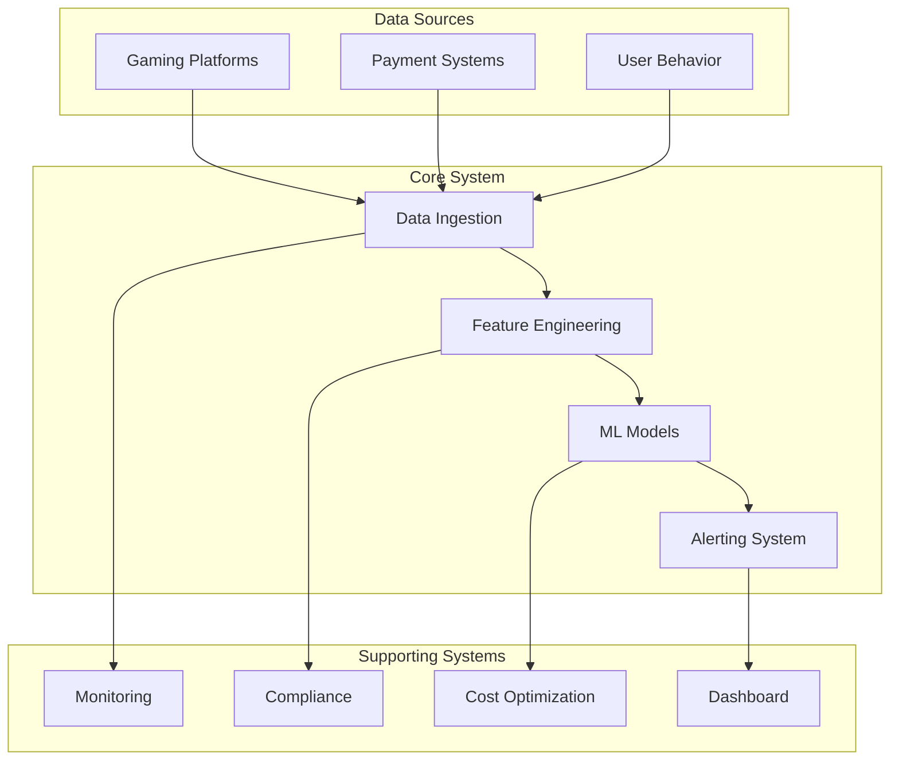
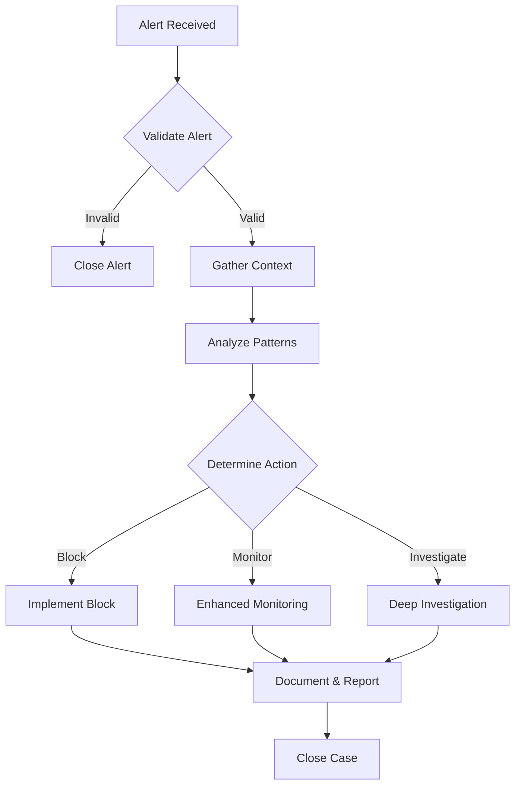

# User Training Materials

## Overview

This comprehensive training program is designed to equip users with the knowledge and skills needed to effectively operate and maintain the fraud detection system. The training covers system operations, monitoring, troubleshooting, and best practices for different user roles.

## Training Program Structure

### Module 1: System Overview and Architecture (2 hours)

#### Learning Objectives
- Understand the overall system architecture and data flow
- Identify key components and their interactions
- Recognize system capabilities and limitations
- Understand security and compliance features

#### Training Materials

**System Architecture Overview**



**Key System Components:**

| Component | Purpose | Technologies |
|-----------|---------|--------------|
| Data Ingestion | Collect and validate incoming data | Kafka, Kinesis, APIs |
| Feature Engineering | Transform raw data into ML features | Polars, Spark, Python |
| ML Models | Fraud detection and scoring | XGBoost, LSTM, Ensemble |
| Alerting System | Real-time notifications and case management | WebSocket, SMS, Email |
| Monitoring | System health and performance tracking | Prometheus, Grafana |
| Compliance | Regulatory compliance and audit | Automated checks, reporting |
| Cost Optimization | Resource usage optimization | Automated analysis, recommendations |

#### Hands-on Exercises

**Exercise 1.1: System Navigation**
- Access the main dashboard
- Navigate through different system views
- Understand the main menu structure

**Exercise 1.2: Data Flow Understanding**
- Trace a sample transaction through the system
- Identify key processing steps
- Understand data transformation points

### Module 2: Daily Operations and Monitoring (4 hours)

#### Learning Objectives
- Monitor system health and performance
- Respond to alerts and incidents
- Perform routine maintenance tasks
- Generate operational reports

#### Training Materials

**Daily Monitoring Checklist**

```markdown
## Morning Check (9:00 AM)
- [ ] System health dashboard review
- [ ] Alert queue check (should be < 10 pending)
- [ ] Performance metrics review (CPU < 80%, Memory < 85%)
- [ ] Data ingestion rates verification
- [ ] Model prediction accuracy check

## Midday Check (12:00 PM)
- [ ] Alert response time verification (< 15 min for critical)
- [ ] Queue depths monitoring
- [ ] Database connection health
- [ ] External API status checks

## Evening Check (5:00 PM)
- [ ] Daily metrics summary review
- [ ] Backup status verification
- [ ] Security scan results review
- [ ] End-of-day report generation
```

**Key Monitoring Dashboards**

1. **System Health Dashboard**
   - Service status indicators
   - Resource utilization graphs
   - Error rate trends
   - Response time percentiles

2. **Fraud Detection Dashboard**
   - Real-time fraud scores distribution
   - Alert generation rates
   - False positive/negative rates
   - Model performance metrics

3. **Business Metrics Dashboard**
   - Transaction volume trends
   - Fraud detection effectiveness
   - Financial impact metrics
   - Regulatory compliance status

#### Hands-on Exercises

**Exercise 2.1: Alert Management**
- Review pending alerts in the queue
- Categorize alerts by severity
- Create investigation cases for high-priority alerts
- Document alert resolution steps

**Exercise 2.2: Performance Monitoring**
- Access Grafana dashboards
- Identify performance bottlenecks
- Generate performance reports
- Set up custom alerts for key metrics

**Exercise 2.3: System Health Checks**
- Run automated health checks
- Interpret system status indicators
- Perform manual service restarts
- Document health check procedures

### Module 3: Alert Response and Investigation (6 hours)

#### Learning Objectives
- Understand alert types and severity levels
- Conduct thorough investigations
- Implement appropriate response actions
- Document findings and resolutions

#### Training Materials

**Alert Severity Guidelines**

| Severity | Response Time | Actions Required | Escalation |
|----------|---------------|------------------|------------|
| Critical | Immediate (< 5 min) | Stop transactions, notify executives | Automatic escalation |
| High | 15 minutes | Investigation, potential blocking | Manager notification |
| Medium | 1 hour | Analysis, monitoring | Team lead notification |
| Low | 4 hours | Review, documentation | Weekly summary |

**Investigation Framework**



**Common Investigation Steps:**

1. **Initial Assessment (5 minutes)**
   - Review alert details and context
   - Check player history and patterns
   - Assess immediate risk level

2. **Evidence Gathering (15 minutes)**
   - Collect transaction history
   - Review device and location data
   - Check for similar patterns

3. **Pattern Analysis (30 minutes)**
   - Identify suspicious behaviors
   - Compare with known fraud patterns
   - Assess financial impact

4. **Decision Making (15 minutes)**
   - Determine appropriate action
   - Calculate risk vs. impact
   - Prepare implementation plan

5. **Action Implementation (Variable)**
   - Execute blocking or monitoring actions
   - Communicate with stakeholders
   - Document all actions taken

#### Hands-on Exercises

**Exercise 3.1: Alert Triage**
- Review sample alerts of different severities
- Practice alert categorization
- Determine appropriate response actions

**Exercise 3.2: Case Investigation**
- Create investigation cases from alerts
- Gather and analyze evidence
- Document investigation findings
- Implement resolution actions

**Exercise 3.3: Pattern Recognition**
- Analyze historical fraud cases
- Identify common patterns and indicators
- Practice risk assessment techniques

### Module 4: System Maintenance and Troubleshooting (4 hours)

#### Learning Objectives
- Perform routine system maintenance
- Troubleshoot common issues
- Implement emergency procedures
- Coordinate with technical teams

#### Training Materials

**Maintenance Schedule**

```markdown
## Weekly Maintenance (Sunday 2:00 AM)
- [ ] Database vacuum and analyze operations
- [ ] Log file rotation and cleanup
- [ ] Backup verification
- [ ] Certificate renewal checks

## Monthly Maintenance (1st Sunday)
- [ ] Full system backup validation
- [ ] Security patch application
- [ ] Performance optimization review
- [ ] Compliance audit preparation

## Quarterly Maintenance
- [ ] Major version updates planning
- [ ] Disaster recovery testing
- [ ] Capacity planning review
- [ ] Vendor system updates
```

**Common Troubleshooting Scenarios**

| Issue | Symptoms | Initial Steps | Escalation |
|-------|----------|---------------|------------|
| High Latency | Response times > 2s | Check database connections, restart services | DBA team |
| Alert Flood | > 100 alerts/minute | Review alert rules, adjust thresholds | Development team |
| Data Ingestion Lag | > 5 min delay | Check Kafka queues, restart consumers | Infrastructure team |
| Model Accuracy Drop | False positive rate > 10% | Review recent data, trigger retraining | ML team |

**Emergency Response Procedures**

1. **System Down (Critical)**
   - Notify all stakeholders immediately
   - Activate disaster recovery procedures
   - Switch to backup systems if available
   - Communicate status updates every 15 minutes

2. **Data Loss (Critical)**
   - Stop all data ingestion immediately
   - Assess extent of data loss
   - Restore from backups
   - Validate data integrity before resuming

3. **Security Breach (Critical)**
   - Isolate affected systems
   - Notify security team and executives
   - Preserve evidence for investigation
   - Implement containment measures

#### Hands-on Exercises

**Exercise 4.1: Routine Maintenance**
- Perform log rotation procedures
- Execute backup verification steps
- Update system configurations
- Document maintenance activities

**Exercise 4.2: Troubleshooting Practice**
- Diagnose simulated system issues
- Apply troubleshooting methodologies
- Implement fix procedures
- Document problem resolution

**Exercise 4.3: Emergency Response**
- Practice emergency response procedures
- Coordinate with different teams
- Communicate status updates
- Conduct post-incident reviews

### Module 5: Reporting and Analytics (3 hours)

#### Learning Objectives
- Generate operational and business reports
- Analyze system performance trends
- Create compliance and audit reports
- Present findings to stakeholders

#### Training Materials

**Report Types and Schedules**

| Report Type | Frequency | Audience | Key Metrics |
|-------------|-----------|----------|-------------|
| Daily Operations | Daily | Operations team | System health, alert counts, performance |
| Weekly Fraud Summary | Weekly | Management | Fraud detection rates, financial impact |
| Monthly Compliance | Monthly | Compliance officers | Regulatory adherence, audit findings |
| Quarterly Business Review | Quarterly | Executives | ROI, system effectiveness, future plans |

**Key Performance Indicators**

```python
# Sample KPI calculations
kpis = {
    "fraud_detection_rate": {
        "formula": "confirmed_fraud_cases / total_suspicious_transactions",
        "target": "> 90%",
        "current": "94.2%"
    },
    "false_positive_rate": {
        "formula": "incorrectly_flagged_transactions / total_flagged_transactions",
        "target": "< 5%",
        "current": "3.1%"
    },
    "average_resolution_time": {
        "formula": "total_resolution_time / number_of_cases",
        "target": "< 2 hours",
        "current": "1.5 hours"
    },
    "system_uptime": {
        "formula": "total_uptime_minutes / total_minutes",
        "target": "> 99.9%",
        "current": "99.95%"
    }
}
```

#### Hands-on Exercises

**Exercise 5.1: Report Generation**
- Generate daily operations reports
- Create fraud summary reports
- Produce compliance documentation
- Customize report parameters

**Exercise 5.2: Data Analysis**
- Analyze performance trends
- Identify improvement opportunities
- Create custom dashboards
- Export data for external analysis

### Module 6: Advanced Topics and Best Practices (3 hours)

#### Learning Objectives
- Understand advanced system features
- Implement optimization strategies
- Plan for system evolution
- Contribute to continuous improvement

#### Training Materials

**Advanced Features**

1. **A/B Testing for Models**
   - Configure model experiments
   - Monitor variant performance
   - Implement winning models

2. **Custom Alert Rules**
   - Create business-specific rules
   - Test rule effectiveness
   - Monitor rule performance

3. **Cost Optimization**
   - Analyze resource usage
   - Implement optimization recommendations
   - Monitor cost trends

**Best Practices**

```markdown
## Operational Excellence
- Always document actions and decisions
- Follow change management procedures
- Maintain clear communication channels
- Regular training and skill development

## Security Awareness
- Never share credentials or sensitive data
- Report suspicious activities immediately
- Follow data handling procedures
- Maintain compliance with regulations

## Continuous Improvement
- Provide feedback on system issues
- Suggest process improvements
- Participate in post-incident reviews
- Stay updated with system changes
```

#### Hands-on Exercises

**Exercise 6.1: Advanced Configuration**
- Configure custom alert rules
- Set up A/B testing experiments
- Implement cost optimization measures

**Exercise 6.2: Process Improvement**
- Identify operational inefficiencies
- Propose improvement solutions
- Create implementation plans
- Measure improvement impact

## Training Delivery Methods

### Instructor-Led Training
- Classroom sessions with hands-on exercises
- Interactive demonstrations and simulations
- Q&A sessions and discussion forums
- Practical workshops and labs

### Self-Paced Learning
- Online learning modules with videos
- Interactive tutorials and simulations
- Knowledge base and documentation access
- Certification quizzes and assessments

### On-the-Job Training
- Shadowing experienced operators
- Gradual responsibility increase
- Mentorship programs
- Performance feedback sessions

## Assessment and Certification

### Knowledge Assessment
- Multiple-choice quizzes after each module
- Practical exercises evaluation
- Case study analysis
- Final comprehensive exam

### Skills Certification
- Level 1: Basic Operations (Modules 1-2)
- Level 2: Alert Response (Modules 1-3)
- Level 3: System Administration (Modules 1-4)
- Level 4: Advanced Operations (All modules)

### Certification Requirements
- 80% passing score on knowledge assessments
- Successful completion of practical exercises
- Supervisor sign-off on skills demonstration
- 6-month probationary period for full certification

## Training Resources

### Documentation
- System user manuals and guides
- API documentation and references
- Troubleshooting runbooks
- Best practices guides

### Tools and Environments
- Training sandbox environment
- Practice datasets and scenarios
- Simulation tools for various scenarios
- Performance testing environments

### Support Resources
- 24/7 technical support hotline
- Online knowledge base and FAQs
- User community forums
- Regular training refreshers

## Training Program Evaluation

### Feedback Collection
- End-of-module surveys
- Post-training assessments
- Supervisor evaluations
- User satisfaction surveys

### Program Metrics
- Training completion rates
- Certification pass rates
- Knowledge retention measurements
- On-the-job performance improvements

### Continuous Improvement
- Regular curriculum updates
- Incorporation of user feedback
- Addition of new modules based on needs
- Technology and methodology updates

This comprehensive training program ensures that all users have the knowledge and skills necessary to effectively operate and maintain the fraud detection system, contributing to its success and reliability in production.