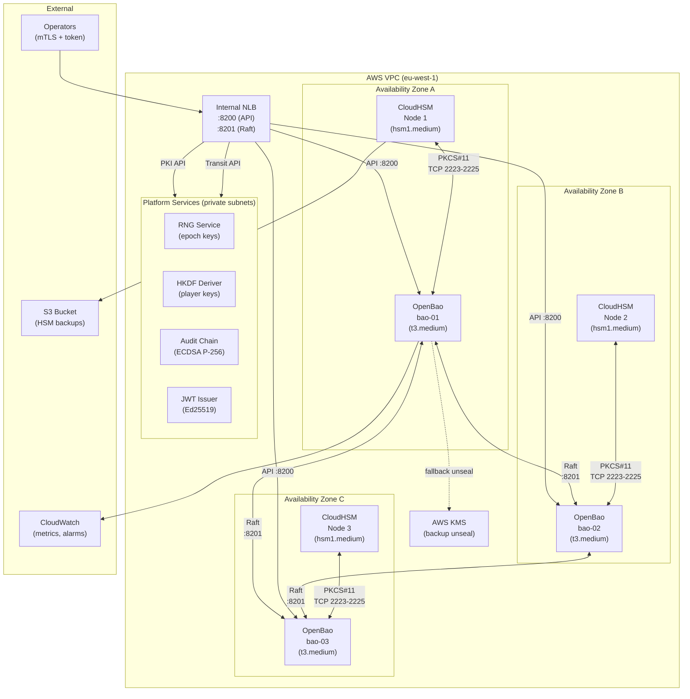
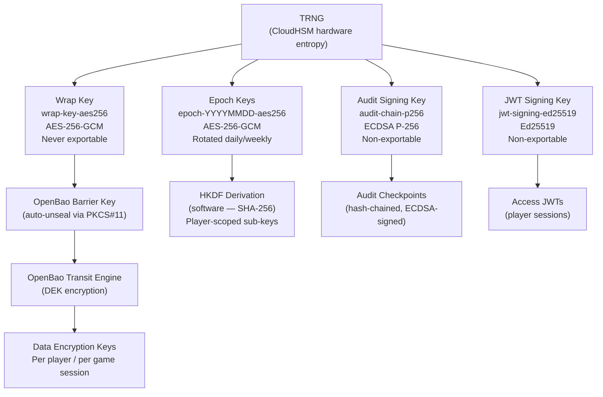

# AWS CloudHSM Implementation Guide
## iGaming Platform — Cloud HSM for Key Management, OpenBao Seal, and FIPS 140-2 Level 3 Compliance

---

## Document Control

| Field | Value |
|-------|-------|
| **Document ID** | SEC-HSM-CLOUD-001 |
| **Version** | 1.0 |
| **Classification** | CONFIDENTIAL — RESTRICTED |
| **Compliance Scope** | PCI DSS v4.0.1 Req. 3.5–3.7, FIPS 140-2 Level 3, GLI-19, ISO 27001 A.10.1 |
| **Author** | Platform Security Team |
| **Review Cycle** | Annual |
| **Relates to** | `chapter-20/yubihsm-setup/` (on-premises counterpart) |

---

## Executive Summary

### CloudHSM vs YubiHSM 2 at a Glance

| Attribute | YubiHSM 2 | AWS CloudHSM |
|-----------|-----------|--------------|
| **FIPS Level** | 140-2 Level 3 | 140-2 Level 3 |
| **Form factor** | USB device | Dedicated HSM appliance (Luna Network HSM 7) |
| **Acquisition cost** | ~£550 per device | Zero (usage-based) |
| **Ongoing cost** | Power, maintenance | ~£1.25/hour per HSM (~£1,800/month × 2) |
| **Minimum HA** | 2 USB devices (manual) | 2 HSMs in the cluster (automatic) |
| **PKCS#11** | Yes (`yubihsm_pkcs11.so`) | Yes (`libcloudhsm_pkcs11.so`) |
| **Ed25519** | Yes | Yes (added SDK 5.11, 2023) |
| **ECDSA P-256** | Yes | Yes |
| **AES-256-GCM** | Yes | Yes |
| **HKDF (native)** | Yes | Partial — HKDF-SHA256 via `CKM_SP800_108_COUNTER_KDF` |
| **TRNG** | Yes (hardware) | Yes (hardware) |
| **Network topology** | USB → localhost:12345 | VPC ENI (ports 2223–2225) |
| **Backup** | Manual (`yubihsm-backup`) | Automatic (cluster sync + manual export) |
| **Cross-region DR** | Manual key export | Cluster restore from encrypted backup |
| **Multi-tenancy** | No | No (dedicated hardware per cluster) |
| **Best for** | On-premises, bare metal | AWS-native production deployments |
| **SDK / Library** | YubiHSM SDK 2.x | CloudHSM Client SDK 5.x |

**Recommendation:** For operators deploying exclusively on AWS, CloudHSM provides equivalent FIPS 140-2 Level 3 assurance with superior HA, automated backups, and native AWS integration. For on-premises or hybrid deployments, continue using YubiHSM 2 per `chapter-20/yubihsm-setup/`.

---

## Architecture Overview



### Key Management Hierarchy



---

## Prerequisites

### AWS Infrastructure

- AWS account with IAM permissions: `cloudhsm:*`, `ec2:*`, `kms:*`, `logs:*`
- VPC with at least 3 private subnets across 3 Availability Zones
- NAT Gateway or VPC endpoints for outbound Internet access (SDK downloads)
- Security group plan: CloudHSM cluster SG (TCP 2223–2225), OpenBao SG (TCP 8200/8201)
- An S3 bucket for CloudHSM backup storage (encrypted, versioned)
- AWS CLI v2 configured with appropriate credentials

### Software Requirements

| Tool | Minimum Version | Notes |
|------|----------------|-------|
| AWS CLI | 2.x | `aws cloudhsmv2` sub-commands |
| CloudHSM Client SDK | 5.11+ | Ed25519 support requires SDK 5.11 |
| OpenBao | 2.2+ (CGO build) | PKCS#11 seal needs CGO (`openbao-hsm` package) |
| Terraform | 1.5+ | For infrastructure-as-code deployment |
| `cloudhsm_mgmt_util` | Bundled with SDK 5.x | HSM user / key management |
| `key_mgmt_util` | Bundled with SDK 5.x | PKCS#11 key generation |
| OpenSSL | 3.x | Certificate generation for cluster init |

### CloudHSM Client SDK Feature Notes

| Operation | Mechanism ID | CKM Name | SDK Version |
|-----------|-------------|----------|------------|
| AES-256-GCM encrypt/decrypt | `0x00001087` | `CKM_AES_GCM` | 5.0+ |
| AES-256 key wrap | `0x00001085` | `CKM_AES_KEY_WRAP_PAD` | 5.0+ |
| ECDSA P-256 sign | `0x00001041` | `CKM_ECDSA` with P-256 | 5.0+ |
| Ed25519 sign/verify | `0x80000040` | `CKM_EDDSA` | **5.11+** |
| HKDF-SHA256 | `0x0000402F` | `CKM_SP800_108_COUNTER_KDF` | 5.0+ |
| TRNG (random bytes) | `C_GenerateRandom` | n/a | 5.0+ |

> **Important:** Ed25519 (CKM_EDDSA) was added in CloudHSM Client SDK 5.11 (released Q4 2023). Ensure your EC2 instances run SDK 5.11 or later. Verify with: `dpkg -l cloudhsm-client | grep Version`

> **HKDF note:** AWS CloudHSM supports NIST SP 800-108 counter-mode KDF (`CKM_SP800_108_COUNTER_KDF`) as the native key derivation mechanism. True RFC 5869 HKDF-SHA256 as used by this platform's epoch key derivation is implemented in software (the CloudHSM TRNG seeds the epoch key, derivation runs in the application layer). This is architecturally equivalent to the YubiHSM 2 approach.

---

## Step-by-Step Setup

### Step 1: Create the CloudHSM Cluster

```bash
# Set environment variables
export AWS_REGION="eu-west-1"
export SUBNET_IDS="subnet-aaa111,subnet-bbb222,subnet-ccc333"  # one per AZ

# Create the cluster
CLUSTER_ID=$(aws cloudhsmv2 create-cluster \
    --hsm-type hsm1.medium \
    --subnet-ids ${SUBNET_IDS//,/ } \
    --region "${AWS_REGION}" \
    --query 'Cluster.ClusterId' \
    --output text)

echo "Cluster ID: ${CLUSTER_ID}"

# Wait for UNINITIALIZED state
aws cloudhsmv2 wait cluster-active \
    --region "${AWS_REGION}" \
    --filter "ClusterId=${CLUSTER_ID}" 2>/dev/null || true

# Poll until ready
while true; do
    STATE=$(aws cloudhsmv2 describe-clusters \
        --filters "clusterIds=${CLUSTER_ID}" \
        --region "${AWS_REGION}" \
        --query 'Clusters[0].State' \
        --output text)
    echo "Cluster state: ${STATE}"
    [[ "${STATE}" == "UNINITIALIZED" ]] && break
    sleep 15
done
```

### Step 2: Create the First HSM Device

```bash
# Create HSM in the first subnet (needed for cluster initialisation)
HSM_ID=$(aws cloudhsmv2 create-hsm \
    --cluster-id "${CLUSTER_ID}" \
    --availability-zone "${AZ_1:-eu-west-1a}" \
    --region "${AWS_REGION}" \
    --query 'Hsm.HsmId' \
    --output text)

# Wait for HSM to be ACTIVE
while true; do
    STATE=$(aws cloudhsmv2 describe-clusters \
        --filters "clusterIds=${CLUSTER_ID}" \
        --region "${AWS_REGION}" \
        --query 'Clusters[0].Hsms[0].State' \
        --output text)
    [[ "${STATE}" == "ACTIVE" ]] && break
    echo "HSM state: ${STATE} — waiting..."
    sleep 20
done
echo "First HSM active: ${HSM_ID}"
```

### Step 3: Initialise the Cluster (One-Time Ceremony)

This step generates the cluster CA certificate and establishes the trust anchor. It is a **key ceremony** — document and record who performs it.

```bash
# Retrieve the cluster CSR
aws cloudhsmv2 describe-clusters \
    --filters "clusterIds=${CLUSTER_ID}" \
    --region "${AWS_REGION}" \
    --query 'Clusters[0].Certificates.ClusterCsr' \
    --output text > cluster.csr

# Generate your own self-signed CA (or use your corporate CA)
# WARNING: The CA private key must be stored in an offline HSM or secure vault
openssl genrsa -aes256 -out hsm-ca.key 4096
openssl req -new -x509 -days 3650 \
    -key hsm-ca.key \
    -out hsm-ca.crt \
    -subj "/CN=iGaming CloudHSM CA/O=iGaming Platform/C=GB"

# Sign the cluster CSR
openssl x509 -req -days 3650 \
    -in cluster.csr \
    -CA hsm-ca.crt \
    -CAkey hsm-ca.key \
    -CAcreateserial \
    -out cluster.crt

# Initialise the cluster with the signed certificate
aws cloudhsmv2 initialize-cluster \
    --cluster-id "${CLUSTER_ID}" \
    --signed-cert file://cluster.crt \
    --trust-anchor file://hsm-ca.crt \
    --region "${AWS_REGION}"

# Wait for INITIALIZED state
while true; do
    STATE=$(aws cloudhsmv2 describe-clusters \
        --filters "clusterIds=${CLUSTER_ID}" \
        --region "${AWS_REGION}" \
        --query 'Clusters[0].State' \
        --output text)
    echo "State: ${STATE}"
    [[ "${STATE}" == "INITIALIZED" ]] && break
    sleep 15
done
```

### Step 4: Install the CloudHSM Client SDK on EC2 Instances

Run on each OpenBao EC2 node:

```bash
# Amazon Linux 2 / Amazon Linux 2023
wget https://s3.amazonaws.com/cloudhsmv2-software/CloudHsmClient/EL7/cloudhsm-client-5.11.0-1.el7.x86_64.rpm
sudo yum install -y ./cloudhsm-client-5.11.0-1.el7.x86_64.rpm

# Ubuntu 22.04 / 24.04
wget https://s3.amazonaws.com/cloudhsmv2-software/CloudHsmClient/Jammy/cloudhsm-client_5.11.0_amd64.deb
sudo apt-get install -y ./cloudhsm-client_5.11.0_amd64.deb

# Verify SDK version (must be 5.11+ for Ed25519)
dpkg -l cloudhsm-client | grep Version

# Configure the client with the cluster CA certificate
sudo /opt/cloudhsm/bin/configure-client \
    -a "${HSM_ENI_IP}" \   # get from: aws cloudhsmv2 describe-clusters ...Hsms[0].EniIp
    --hsm-ca-cert ./hsm-ca.crt

# Start the CloudHSM client daemon
sudo systemctl enable cloudhsm-client
sudo systemctl start cloudhsm-client
sudo systemctl status cloudhsm-client
```

### Step 5: Create HSM Users

CloudHSM has three user roles. They are created via `cloudhsm_mgmt_util`:

| Role | Purpose | This Platform |
|------|---------|--------------|
| **Crypto Officer (CO)** | Admin — create/delete users, manage policies | `hsm-co` (held by infrastructure team) |
| **Crypto User (CU)** | Key operations — generate, use, share keys | `hsm-app` (used by OpenBao and services) |
| **Appliance User (AU)** | Clone keys between HSMs | Internal (managed by CloudHSM automatically) |

```bash
# Activate the Crypto Officer (initial login uses default credentials)
/opt/cloudhsm/bin/cloudhsm_mgmt_util /opt/cloudhsm/etc/cloudhsm_mgmt_util.cfg

# Inside cloudhsm_mgmt_util:
# loginHSM CO admin <default-password>
# changePswd CO admin <new-strong-password>
# createUser CU hsm-app <app-password>
# quit
```

### Step 6: Generate Keys via PKCS#11

Once a CU session is established, generate the platform keys. The automated script `setup-cloudhsm-cluster.sh` wraps these operations:

```bash
# Set environment for key_mgmt_util
export CLOUDHSM_PIN="hsm-app:<app-password>"

# Generate AES-256 wrap key (for OpenBao auto-unseal)
/opt/cloudhsm/bin/key_mgmt_util << 'EOF'
loginHSM -u CU -s hsm-app -p <password>
genSymKey -t 31 -s 32 -l wrap-key-aes256 -nex -sess 0 -id 1001
genSymKey -t 31 -s 32 -l epoch-YYYYMMDD-aes256 -nex -sess 0 -id 1002
logout
quit
EOF

# Generate Ed25519 signing key (JWT)
/opt/cloudhsm/bin/key_mgmt_util << 'EOF'
loginHSM -u CU -s hsm-app -p <password>
genECCKeyPair -curve ED25519 -l jwt-signing-ed25519 -nex -id 2001
logout
quit
EOF

# Generate ECDSA P-256 signing key (audit chain)
/opt/cloudhsm/bin/key_mgmt_util << 'EOF'
loginHSM -u CU -s hsm-app -p <password>
genECCKeyPair -curve prime256v1 -l audit-chain-p256 -nex -id 2002
logout
quit
EOF
```

### Step 7: Configure OpenBao with CloudHSM PKCS#11 Seal

Deploy the `openbao-cloudhsm.hcl` configuration file and inject the PIN securely via systemd drop-in (never store in the config file):

```bash
# Create the systemd drop-in with HSM PIN
sudo mkdir -p /etc/systemd/system/openbao.service.d
sudo tee /etc/systemd/system/openbao.service.d/hsm.conf > /dev/null << EOF
[Service]
Environment="CLOUDHSM_PIN=hsm-app:<app-password>"
EOF
sudo chmod 600 /etc/systemd/system/openbao.service.d/hsm.conf
sudo chown root:root /etc/systemd/system/openbao.service.d/hsm.conf

# Start OpenBao
sudo systemctl daemon-reload
sudo systemctl enable openbao
sudo systemctl start openbao
```

### Step 8: Initialise the OpenBao Cluster

Run on the first OpenBao node only:

```bash
# Initialise (the PKCS#11 seal wraps the root key in CloudHSM)
bao operator init \
    -recovery-shares=5 \
    -recovery-threshold=3 \
    -format=json > /secure/openbao-init.json

# OpenBao will auto-unseal via CloudHSM PKCS#11 — no manual unseal needed
bao status

# Enable audit logging to CloudWatch (via file → CloudWatch agent)
bao audit enable file path=/var/log/openbao/audit.log
```

### Step 9: Enable Platform Engines

```bash
export BAO_ADDR="https://bao-01:8200"
export BAO_CACERT="/opt/openbao/tls/ca.crt"
export BAO_TOKEN="$(jq -r .root_token /secure/openbao-init.json)"

# Transit engine — DEK management for player data and game sessions
bao secrets enable -path=transit transit
bao write transit/keys/player-pii type=aes256-gcm96
bao write transit/keys/game-session type=aes256-gcm96
bao write transit/keys/audit-log type=aes256-gcm96

# PKI engine — mTLS certificates for inter-service communication
bao secrets enable pki
bao secrets tune -max-lease-ttl=87600h pki
bao write pki/root/generate/internal \
    common_name="iGaming Platform Root CA" \
    ttl=87600h

# KV v2 — configuration and non-cryptographic secrets
bao secrets enable -path=secret kv-v2

# AppRole auth — for platform services
bao auth enable approle
```

### Step 10: Configure LUKS Integration via OpenBao Transit

Platform VMs use OpenBao Transit to wrap LUKS volume keys:

```bash
# On the VM — fetch the LUKS key from OpenBao Transit
LUKS_KEY=$(bao write -field=plaintext transit/decrypt/game-session \
    ciphertext="$(cat /etc/luks-key.enc)" \
    | base64 -d)

# Use key to unlock LUKS volume
echo -n "${LUKS_KEY}" | cryptsetup luksOpen /dev/nvme0n1p2 data-volume -d -
```

### Step 11: Configure Monitoring and Alerting

Deploy the CloudWatch dashboard and alarms from `monitoring/`:

```bash
cd monitoring/
aws cloudwatch put-dashboard \
    --dashboard-name "CloudHSM-OpenBao-${ENV}" \
    --dashboard-body file://dashboard.json

aws cloudwatch put-metric-alarm \
    --cli-input-json file://alarm-hsm-availability.json

aws cloudwatch put-metric-alarm \
    --cli-input-json file://alarm-openbao-unhealthy.json
```

---

## Key Management Policy

### Key Inventory (CloudHSM variant)

| Key Label | Type | Length | Mechanism | Purpose | Exportable | Rotation |
|-----------|------|--------|-----------|---------|------------|---------|
| `wrap-key-aes256` | AES | 256 bit | CKM_AES_KEY_WRAP_PAD | OpenBao barrier key wrap | No | Annual or on compromise |
| `epoch-YYYYMMDD-aes256` | AES | 256 bit | CKM_AES_GCM | HKDF seed / epoch key | No | Daily (RNG mode) or weekly |
| `jwt-signing-ed25519` | EC | Ed25519 | CKM_EDDSA | JWT authentication tokens | No | Annual |
| `audit-chain-p256` | EC | P-256 | CKM_ECDSA | Audit checkpoint signatures | No | Annual |
| `transit/player-pii` | AES | 256 bit | AES-GCM-96 (Transit) | Player PII field encryption | No | Annual |
| `transit/game-session` | AES | 256 bit | AES-GCM-96 (Transit) | Game session DEKs | No | Annual |

### Key Access Controls

The `hsm-app` Crypto User (CU) account has access to all keys above. The following least-privilege policy applies:

- The OpenBao process runs as a dedicated `openbao` system user with no shell
- The `CLOUDHSM_PIN` is injected via systemd `Environment` in a mode-600 drop-in file
- IAM role policy restricts `cloudhsm:DescribeClusters` only — no AWS-level key extraction is possible
- Audit logging captures all PKCS#11 operations in CloudWatch Logs and OpenBao audit log

---

## Disaster Recovery

### Cluster Backup Architecture

AWS CloudHSM automatically synchronises key material across all HSMs within a cluster. For cross-cluster and cross-region backup:

```bash
# Create an encrypted cluster backup (requires CU credentials)
/opt/cloudhsm/bin/key_mgmt_util << 'EOF'
loginHSM -u CU -s hsm-app -p <password>
backupHSM -p <backup-password> -s 0 -k 0
logout
quit
EOF

# Upload backup to S3 (encrypted at rest with KMS)
aws s3 cp /tmp/cloudhsm-backup-*.bin \
    s3://${BACKUP_BUCKET}/cloudhsm/$(date +%Y/%m/%d)/ \
    --sse aws:kms \
    --sse-kms-key-id "${KMS_KEY_ARN}"
```

### Cross-Region Replication

For multi-region DR, create a second cluster in the DR region and restore from backup:

1. Create a new CloudHSM cluster in the DR region (same CA certificate)
2. Copy the backup from S3 to the DR region
3. Restore: `aws cloudhsmv2 restore-backup --backup-id <id> --region <dr-region>`
4. Validate key handles and update OpenBao configuration

### Recovery Time Objectives

| Scenario | RTO | RPO |
|----------|-----|-----|
| Single HSM failure (same cluster) | Seconds (auto-failover) | 0 (synchronous replication) |
| Full cluster failure (region) | 30–60 minutes (new cluster + restore) | 24 hours (last backup) |
| Complete region loss | 1–2 hours | 24 hours |

---

## Cost Analysis

### Pricing (EU West 1, March 2026)

| Component | Cost | Notes |
|-----------|------|-------|
| CloudHSM instance | $1.60/hour | Per HSM device |
| Minimum HA (2 HSMs) | $2.30/hour | AWS requires 2+ for cluster |
| 2 HSMs × 730 hours | **~$1,680/month** | Without OpenBao EC2 |
| OpenBao EC2 (3× t3.medium) | ~$90/month | Private subnets |
| NLB | ~$20/month | Internal only |
| CloudWatch + S3 | ~$10/month | Logs and backups |
| **Total estimated** | **~$1,800/month** | For production deployment |
| **Annual** | **~$21,600/year** | |

> Prices are approximate. Verify current pricing at https://aws.amazon.com/cloudhsm/pricing/

### YubiHSM 2 Cost Comparison (on-premises)

| Component | One-time | Recurring |
|-----------|---------|-----------|
| 2× YubiHSM 2 FIPS | ~$1,100 | — |
| Server infrastructure | ~$3,000 | $200/year power |
| Maintenance | — | $500/year |
| **Total 3-year TCO** | ~$4,800 | |

**CloudHSM is ~5× more expensive over 3 years**, but provides AWS-native HA, automatic backups, no physical asset management, and seamless integration with AWS services. For operators already on AWS, the operational simplicity and reduced SRE burden generally justifies the premium.

---

## Migration Path

### YubiHSM 2 to CloudHSM

> **Note:** Cryptographic keys generated on FIPS 140-2 Level 3 devices cannot be extracted in plaintext. Migration requires re-keying, not key transfer.

1. **Provision CloudHSM cluster** (parallel to existing YubiHSM setup)
2. **Generate new keys** in CloudHSM (`wrap-key-aes256`, `jwt-signing-ed25519`, etc.)
3. **Stand up new OpenBao cluster** pointing to CloudHSM seal
4. **Migrate secrets** via `bao operator migrate` or re-issue to new cluster
5. **Update application configuration** to point to new OpenBao NLB endpoint
6. **Rotate DEKs** in Transit engine (re-encrypt all stored ciphertexts)
7. **Decommission** YubiHSM 2 after validation period (≥ 30 days)
8. **Destroy old keys** with documented evidence (PCI DSS Req. 3.7.5)

### CloudHSM to YubiHSM 2 (reverse migration)

Follow the same re-keying approach in reverse. Use `setup-openbao-cluster.sh` from `chapter-20/yubihsm-setup/`.

---

## Compliance Mapping

### PCI DSS 4.0.1

| Requirement | Mapping |
|-------------|---------|
| 3.5.1 — PAN unreadable at rest | Transit engine AES-256-GCM96 DEKs, seed material in CloudHSM |
| 3.6.1 — Key management procedures | This document; `setup-cloudhsm-cluster.sh` |
| 3.6.1.1 — Key inventory | Key Inventory table above |
| 3.7.1 — Key generation | CloudHSM TRNG; `key_mgmt_util genSymKey/genECCKeyPair` |
| 3.7.2 — Key distribution | PKCS#11 over TLS 1.3 within VPC; no plaintext export |
| 3.7.3 — Key storage | Non-exportable keys stored exclusively in CloudHSM hardware |
| 3.7.4 — Key retirement | Epoch keys rotated daily/weekly; annual rotation for signing keys |
| 3.7.5 — Key destruction | `deleteKey` in `key_mgmt_util`; documented in CloudWatch audit log |
| 3.7.6 — Split knowledge / dual control | CO and CU separation; IaC changes require PR approval |

### GLI-19 (Gaming Laboratories International)

| GLI-19 Section | Mapping |
|---------------|---------|
| 5.4 — RNG seeding | CloudHSM TRNG provides FIPS 140-2 validated entropy for epoch keys |
| 5.5 — RNG output post-processing | HKDF-SHA256 in application layer; epoch key as IKM |
| 5.7 — RNG audit | CloudWatch Logs audit trail; PKCS#11 operation logs |
| 7.2 — Key protection | Non-exportable HSM keys; no software key material for epoch or signing keys |

### ISO 27001:2022

| Control | Mapping |
|---------|---------|
| A.5.33 — Protection of records | CloudWatch Logs with 90-day retention; S3 versioned backup |
| A.8.24 — Use of cryptography | FIPS 140-2 Level 3 validated; AES-256, ECDSA P-256, Ed25519 |
| A.8.25 — Secure development lifecycle | IaC Terraform; scripts in version control; shellcheck enforced |

---

## Troubleshooting

### CloudHSM Client Cannot Connect

```bash
# Check daemon status
sudo systemctl status cloudhsm-client

# Verify ENI IP reachability
nc -zv "${HSM_ENI_IP}" 2223

# Check daemon logs
sudo journalctl -u cloudhsm-client -n 50 --no-pager

# Regenerate client configuration
sudo /opt/cloudhsm/bin/configure-client \
    -a "${HSM_ENI_IP}" \
    --hsm-ca-cert ./hsm-ca.crt
```

### OpenBao Fails to Unseal

```bash
# Check seal status
bao status

# Verify PKCS#11 library is present
ls -la /opt/cloudhsm/lib/libcloudhsm_pkcs11.so

# Check key label exists
/opt/cloudhsm/bin/key_mgmt_util << 'EOF'
loginHSM -u CU -s hsm-app -p <password>
findKey -l wrap-key-aes256
logout
quit
EOF

# Check systemd environment
sudo systemctl show openbao | grep Environment
sudo cat /etc/systemd/system/openbao.service.d/hsm.conf
```

### Ed25519 Key Generation Fails

```bash
# Verify SDK version (must be 5.11+)
dpkg -l cloudhsm-client | grep Version

# If SDK is older, upgrade:
wget https://s3.amazonaws.com/cloudhsmv2-software/CloudHsmClient/Jammy/cloudhsm-client_5.11.0_amd64.deb
sudo apt-get install -y ./cloudhsm-client_5.11.0_amd64.deb
sudo systemctl restart cloudhsm-client
```

---

## Related Files

| File | Purpose |
|------|---------|
| `setup-cloudhsm-cluster.sh` | End-to-end cluster setup and key generation |
| `setup-openbao-cloudhsm.sh` | OpenBao installation and configuration for CloudHSM |
| `openbao-cloudhsm.hcl` | OpenBao server configuration (CloudHSM seal) |
| `terraform/main.tf` | Terraform module — CloudHSM cluster, OpenBao ASG, NLB |
| `test-cloudhsm.sh` | Verification test suite (5 iterations per test) |
| `cloudhsm-vs-yubihsm.md` | Detailed comparison document |
| `monitoring/dashboard.json` | CloudWatch dashboard |
| `monitoring/alarm-*.json` | CloudWatch alarm definitions |
| `../yubihsm-setup/` | On-premises YubiHSM 2 counterpart |
| `../../improvements/hsm/` | Production Terraform module (full stack) |
