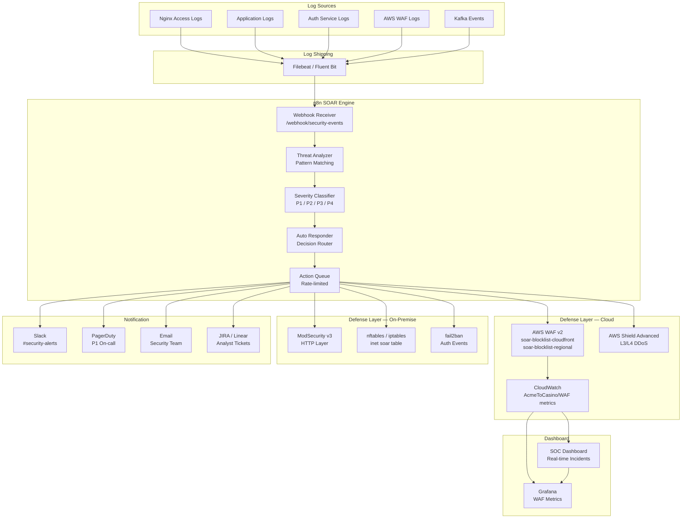
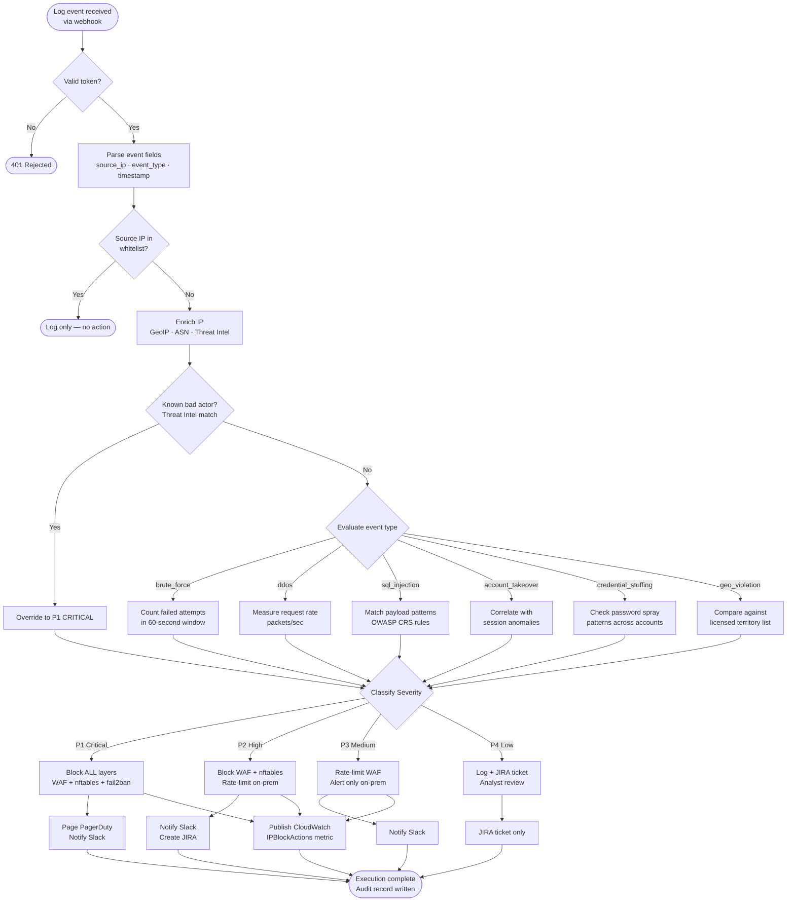
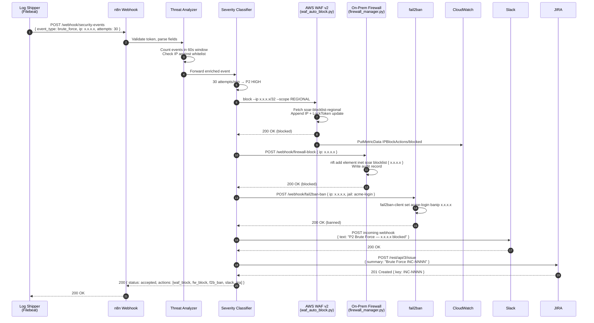
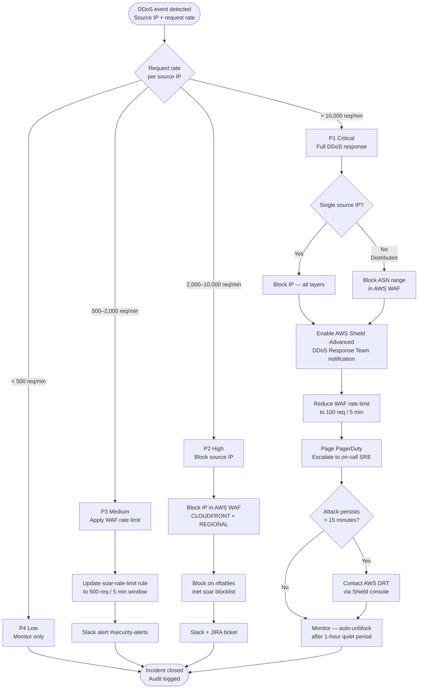
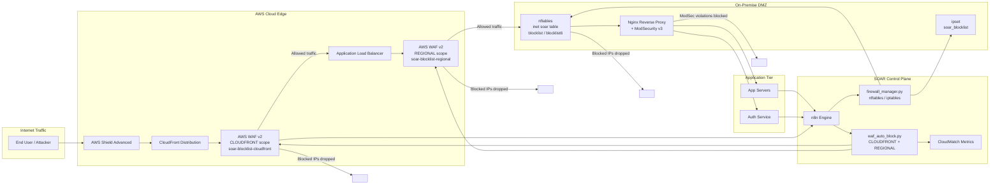
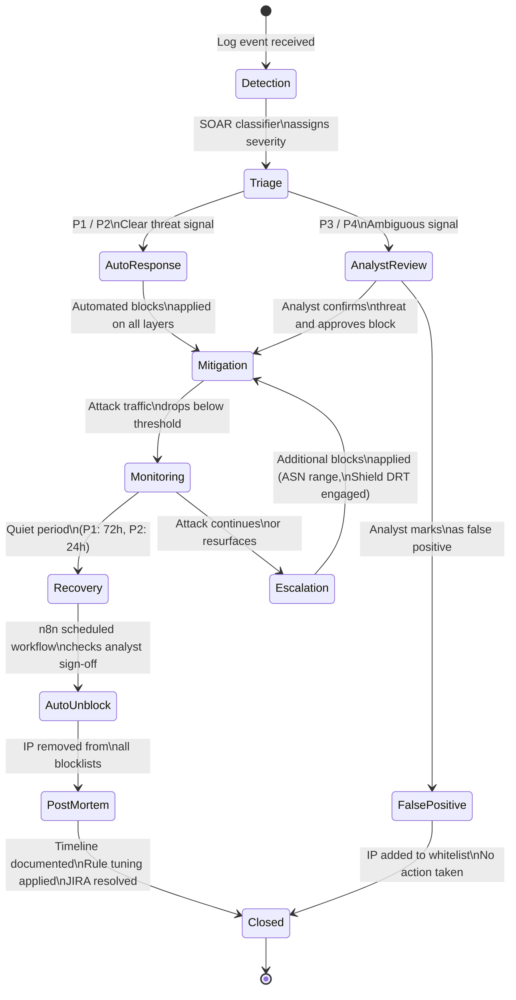

# SOAR Architecture — AcmeToCasino iGaming Platform

This document describes the architecture of the Security Orchestration, Automation and Response (SOAR) system, with detailed flow diagrams for each major operational scenario.

---

## Table of Contents

1. [High-Level SOAR Architecture](#1-high-level-soar-architecture)
2. [Threat Detection Flow](#2-threat-detection-flow)
3. [Brute Force Response Sequence](#3-brute-force-response-sequence)
4. [DDoS Mitigation Flow](#4-ddos-mitigation-flow)
5. [AWS WAF + On-Prem Integration](#5-aws-waf--on-prem-integration)
6. [Incident Lifecycle](#6-incident-lifecycle)
7. [Component Interaction Reference](#7-component-interaction-reference)

---

## 1. High-Level SOAR Architecture

This diagram shows all major components and their groupings. Arrows represent data flow direction.



### Key Design Principles

- **Defense in depth**: Every automated block is applied simultaneously at the cloud edge (AWS WAF) and on-premises (nftables/iptables), so a single layer failure does not leave the platform exposed.
- **Non-blocking queue**: The n8n action queue rate-limits outbound API calls to avoid overwhelming AWS WAF's write API or triggering CloudWatch throttling.
- **Fail-safe**: If n8n is unreachable, fail2ban and ModSecurity continue operating autonomously using their own local rules.
- **Auditability**: Every action produces a structured audit record in `/var/log/acmetocasino/firewall_audit.jsonl` and a CloudWatch metric.

---

## 2. Threat Detection Flow

This flowchart shows the complete decision tree from raw log ingestion through to the final response action.



### Whitelist Evaluation

Before any classification, the source IP is checked against:

1. The AWS WAF IP sets `whs_ipset` (CLOUDFRONT) and `UsAndLicencees` (REGIONAL) — existing whitelist sets defined in `infra-terraform/waf.tf`
2. An internal n8n whitelist node containing known-good IP ranges (office networks, internal scanners, payment gateway callbacks)

If the IP matches any whitelist, the event is logged but no defensive action is taken.

### Threat Intelligence Enrichment

The enrichment step queries:

- **GeoIP database** (MaxMind GeoLite2): resolves country code and ASN
- **Internal threat intelligence feed**: JSON feed updated every hour by the threat-intel pipeline
- **AbuseIPDB** (optional, P1/P2 events): queries reputation score via REST API

---

## 3. Brute Force Response Sequence

This sequence diagram shows the exact order of operations when a brute-force attack is detected at P2 (HIGH) severity.



### Automatic Unblock

After a configurable cool-down period (default: 24 hours for P2, 72 hours for P1), the n8n scheduled unblock workflow runs:

1. Queries the JIRA ticket for analyst sign-off
2. If the ticket is resolved or the IP's threat score has dropped below threshold, calls `POST /webhook/waf-unblock` and `POST /webhook/firewall-block` with a removal flag
3. Publishes an `unblocked` CloudWatch metric

---

## 4. DDoS Mitigation Flow

This flowchart shows the multi-level escalation used to absorb volumetric attacks.



### L7 vs L3/L4 DDoS

| Attack Type | Primary Mitigation | Secondary Mitigation |
|---|---|---|
| HTTP flood (L7) | AWS WAF rate-based rules | ModSecurity connection limits |
| TCP SYN flood (L4) | AWS Shield Advanced | nftables connection tracking drop |
| UDP amplification (L3) | AWS Shield Advanced | On-prem ISP null-route request |
| Slowloris | Nginx `limit_req` + ModSecurity | fail2ban slow-connection jail |

---

## 5. AWS WAF + On-Prem Integration

This diagram shows how the cloud and on-premise defensive layers coordinate, and the data paths for the two Python management scripts.



### Lock-Token Management

AWS WAF v2 uses optimistic locking: every update must include the current `LockToken`. The `waf_auto_block.py` script handles this transparently with exponential back-off (up to 5 retries, 2–10 second delays). Concurrent modifications from multiple n8n worker instances are safe.

### Scope Routing

| Scope | Script Target | AWS Region |
|---|---|---|
| `CLOUDFRONT` | `soar-blocklist-cloudfront` | `us-east-1` (hardcoded — CloudFront requirement) |
| `REGIONAL` | `soar-blocklist-regional` | Configurable via `--region` flag / `AWS_REGION` env var |

---

## 6. Incident Lifecycle

This state diagram shows all states an incident passes through from first detection to post-mortem closure.



### State Definitions

| State | Description | Responsible Party |
|---|---|---|
| **Detection** | SOAR receives an event from a log shipper or WAF | Automated |
| **Triage** | Threat analyzer and severity classifier evaluate the event | Automated |
| **AutoResponse** | Blocks applied immediately without human approval | Automated (n8n) |
| **AnalystReview** | JIRA ticket created; analyst must approve or dismiss | SOC Analyst |
| **FalsePositive** | IP confirmed as legitimate; added to whitelist | SOC Analyst |
| **Mitigation** | Active blocks in place; traffic being dropped at cloud edge and on-prem | Automated |
| **Monitoring** | Attack traffic has subsided; SOAR watches for recurrence | Automated |
| **Escalation** | Attack continues beyond mitigation; additional layers engaged | SRE + AWS DRT |
| **Recovery** | Quiet period elapsed; auto-unblock workflow preparing | Automated |
| **AutoUnblock** | IP removed from all blocklists; metrics updated | Automated |
| **PostMortem** | Timeline documented; detection rules tuned if needed | SOC Lead |
| **Closed** | JIRA ticket resolved; incident archived | SOC Analyst |

---

## 7. Component Interaction Reference

### Port and Protocol Map

| Source | Destination | Protocol | Port | Purpose |
|---|---|---|---|---|
| Log shippers | n8n webhook | HTTPS | 5678 | Security event ingestion |
| n8n | AWS WAF API | HTTPS | 443 | IP set updates |
| n8n | CloudWatch API | HTTPS | 443 | Metric publishing |
| n8n | On-prem `firewall_manager.py` | SSH / local exec | 22 / local | Firewall block commands |
| n8n | Slack API | HTTPS | 443 | Notifications |
| n8n | PagerDuty API | HTTPS | 443 | On-call alerts |
| n8n | JIRA API | HTTPS | 443 | Ticket creation |
| Grafana | CloudWatch | HTTPS | 443 | Metric queries |
| SOC Dashboard | n8n REST API | HTTPS | 5678 | Execution history |

### Script Invocation Reference

| Script | Invoked By | Key Commands |
|---|---|---|
| `aws-waf/waf_auto_block.py` | n8n HTTP node / CLI | `block`, `unblock`, `create-rate-rule`, `update-rate-rule` |
| `onprem-firewall/firewall_manager.py` | n8n SSH node / CLI | `block-ip`, `unblock-ip`, `block-cidr`, `rate-limit`, `list`, `flush`, `status` |

### Data Flow Summary

```
External Traffic
       ↓
AWS Shield (L3/L4 DDoS absorption)
       ↓
CloudFront + AWS WAF (CLOUDFRONT scope — soar-blocklist-cloudfront)
       ↓
ALB + AWS WAF (REGIONAL scope — soar-blocklist-regional)
       ↓
nftables SOAR table (inet soar blocklist/blocklist6)
       ↓
Nginx + ModSecurity v3 (HTTP-layer rules)
       ↓
Application / Auth Service
```

Each layer independently blocks threats, ensuring that if any single layer is misconfigured or temporarily unavailable, the remaining layers continue to protect the platform.
