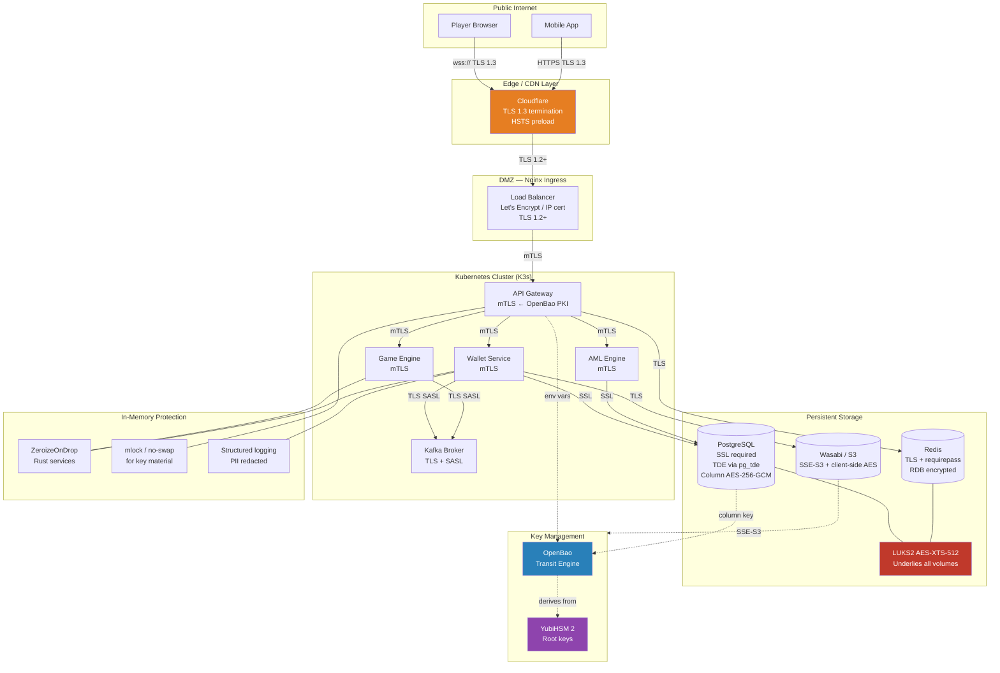

# End-to-End Encryption Lifecycle Guide

## Overview

This guide covers the complete encryption lifecycle for an iGaming platform: data in transit,
at rest, in use (processing), and at deletion. Every design decision maps to a specific
regulatory obligation — PCI DSS Req.3/4, GDPR Art.32, GLI-33 Section 6, and ISO 27001:2022
Annex A.8.24.

The goal is not "encryption everywhere for its own sake" but a layered, auditable system
where the failure of any single layer does not expose regulated data.

---

## Data Flow: All Encryption Layers



---

## Pillar 1: Encryption in Transit

### 1.1 TLS for Public Endpoints

| Endpoint | Protocol | Certificate | Key Size | Rotation |
|----------|----------|-------------|----------|----------|
| Player web / API | TLS 1.3 (fallback 1.2) | Let's Encrypt ECDSA P-256 | 256-bit | 60-day auto |
| IP-based admin panel | TLS 1.2+ | Let's Encrypt IP cert (RFC 9525) | RSA-2048 | 60-day auto |
| WebSocket (live odds / game) | wss:// TLS 1.3 | Same as web cert | P-256 | 60-day auto |

**Cipher suites allowed (TLS 1.3):** `TLS_AES_256_GCM_SHA384`, `TLS_CHACHA20_POLY1305_SHA256`

**Cipher suites allowed (TLS 1.2):** `ECDHE-ECDSA-AES256-GCM-SHA384`, `ECDHE-RSA-AES256-GCM-SHA384`

**Prohibited:** RC4, 3DES, export ciphers, NULL ciphers, SSLv3, TLSv1.0, TLSv1.1.

**HSTS:** `Strict-Transport-Security: max-age=31536000; includeSubDomains; preload`

**Compliance:** PCI DSS v4.0.1 Req.4.2.1 (strong cryptography for PAN in transit); GDPR Art.32(1)(a); GLI-33 Section 6.1.

### 1.2 Mutual TLS Between Microservices

All inter-service communication uses mTLS managed by OpenBao PKI.

| Component | CA Issuer | Cert Lifetime | Identity |
|-----------|-----------|---------------|----------|
| API Gateway → Game Engine | OpenBao intermediate CA | 24 hours | `api-gateway.svc.cluster.local` |
| Wallet → PostgreSQL | OpenBao intermediate CA | 24 hours | `wallet-svc.svc.cluster.local` |
| Any service → Redis | OpenBao intermediate CA | 24 hours | `<svc>.svc.cluster.local` |

Short-lived certificates (24 h) mean a stolen cert expires before it can be exploited. No manual revocation required for routine rotation.

```bash
# Issue a service certificate via OpenBao
vault write pki_int/issue/microservices \
  common_name="wallet-svc.svc.cluster.local" \
  ttl="24h" \
  alt_names="wallet-svc,wallet-svc.default"
```

**Key lives in:** OpenBao Transit Engine, ultimately backed by YubiHSM 2 root key material.

**Rotation schedule:** Automatic cert renewal every 20 hours (4 hours before expiry).

**Compliance:** GLI-33 Section 6.2 (authenticated channels between system components); ISO 27001:2022 A.8.20.

### 1.3 Kafka TLS

```yaml
# broker configuration (server.properties)
listeners=SASL_SSL://0.0.0.0:9093
ssl.keystore.location=/etc/kafka/certs/broker.keystore.jks
ssl.truststore.location=/etc/kafka/certs/ca.truststore.jks
ssl.endpoint.identification.algorithm=https
security.inter.broker.protocol=SASL_SSL
sasl.mechanism.inter.broker.protocol=SCRAM-SHA-512
```

Consumer and producer authenticate with SCRAM-SHA-512 credentials stored in OpenBao. Keystore password itself is fetched from OpenBao at startup — never stored on disk.

### 1.4 PostgreSQL SSL

```sql
-- postgresql.conf
ssl = on
ssl_cert_file = '/etc/ssl/certs/server.crt'
ssl_key_file  = '/etc/ssl/private/server.key'
ssl_ca_file   = '/etc/ssl/certs/ca.crt'
ssl_min_protocol_version = 'TLSv1.2'

-- pg_hba.conf — reject non-SSL connections
hostssl  all  all  0.0.0.0/0  scram-sha-256
host     all  all  0.0.0.0/0  reject       -- this line blocks plaintext
```

### 1.5 Redis TLS

```
# redis.conf
tls-port 6380
port 0                       # disable plaintext port entirely
tls-cert-file /etc/redis/tls/redis.crt
tls-key-file  /etc/redis/tls/redis.key
tls-ca-cert-file /etc/redis/tls/ca.crt
tls-auth-clients yes         # mTLS: clients must present cert
requirepass <vault-managed-password>
```

---

## Pillar 2: Encryption at Rest

### 2.1 LUKS2 Disk Encryption

All VM and bare-metal volumes that hold persistent data (PostgreSQL data dir, Redis RDB, Kafka log dirs, backup staging) run on LUKS2-encrypted block devices.

| Parameter | Value | Rationale |
|-----------|-------|-----------|
| Cipher | `aes-xts-plain64` | XTS mode purpose-built for disk encryption (IEEE 1619) |
| Key size | 512-bit (XTS uses two 256-bit subkeys) | Meets FIPS 140-3 strength requirement |
| PBKDF | `argon2id` | Memory-hard, resistant to GPU cracking |
| Key source | OpenBao / YubiHSM 2 | Key never on disk in plaintext |

```bash
# Format and open with HSM-backed key
cryptsetup luksFormat --type luks2 \
  --cipher aes-xts-plain64 --key-size 512 \
  --pbkdf argon2id \
  /dev/sdb

# Key retrieved from OpenBao at boot
vault kv get -field=key secret/luks/pg-data | \
  cryptsetup luksOpen /dev/sdb pg-data-enc
```

**Key rotation:** Add new key slot before removing old one (zero downtime):

```bash
vault kv get -field=new_key secret/luks/pg-data | \
  cryptsetup luksAddKey /dev/sdb -d <(vault kv get -field=old_key ...)
cryptsetup luksKillSlot /dev/sdb 0  # remove old slot
```

**Compliance:** PCI DSS v4.0.1 Req.3.5.1 (disk-level encryption for PAN at rest); ISO 27001:2022 A.8.24.

### 2.2 PostgreSQL Transparent Data Encryption (TDE)

Using the `pg_tde` extension (Percona, PostgreSQL 16+). TDE encrypts individual table files and WAL segments using AES-256-CBC.

```sql
-- Install and activate
CREATE EXTENSION pg_tde;
SELECT pg_tde_add_key_provider_vault_v2(
  'openbao-provider',
  '{"url":"http://openbao.svc.cluster.local:8200",
    "mount":"pki", "key_name":"pg-tde-master"}'
);
SELECT pg_tde_set_principal_key('pg-master-key', 'openbao-provider');

-- Enable on sensitive table
ALTER TABLE players SET ACCESS METHOD tde_heap;
```

Master key lives in OpenBao Transit. PostgreSQL fetches it once at startup via service account token; the key is held in process memory for the database lifetime.

**Key rotation schedule:** 90 days (PCI DSS Req.3.7.1). Automated via cron + OpenBao key rotation API.

### 2.3 Column-Level AES-256-GCM for PII

For the highest-sensitivity PII fields (email, phone, date of birth, document numbers), a second encryption layer sits above TDE. Each player gets a unique data encryption key (DEK) wrapped by a key encryption key (KEK) stored in OpenBao Transit.

```python
# Encrypt PII field before INSERT
def encrypt_pii(value: str, player_id: str) -> str:
    # DEK derived per-player from KEK in OpenBao
    kek_response = vault_client.secrets.transit.encrypt_data(
        name="pii-kek",
        plaintext=base64.b64encode(player_id.encode()).decode()
    )
    dek = derive_dek(kek_response["data"]["ciphertext"])
    nonce = os.urandom(12)
    cipher = AESGCM(dek)
    ciphertext = cipher.encrypt(nonce, value.encode(), player_id.encode())
    return base64.b64encode(nonce + ciphertext).decode()
```

**Why per-player DEK?** Crypto-shredding: delete a single player's DEK and all their PII becomes permanently unrecoverable — without touching any transaction records. See Pillar 4.

**Compliance:** GDPR Art.32(1)(a) (appropriate technical measures); PCI DSS Req.3.5.1 (render PAN unreadable anywhere stored).

### 2.4 S3 / Wasabi Object Storage

| Layer | Mechanism | Key |
|-------|-----------|-----|
| Server-side (SSE-S3) | AES-256 by storage provider | Provider-managed |
| Client-side | AES-256-GCM before upload | OpenBao Transit DEK |

```python
# Encrypt before upload — key never reaches S3
key = vault_transit_get_key("backup-s3-key")
nonce = os.urandom(12)
ciphertext = AESGCM(key).encrypt(nonce, plaintext, b"s3-backup")
s3.put_object(Bucket=bucket, Key=path, Body=nonce + ciphertext)
```

The two layers mean: even if an S3/Wasabi account credential is compromised, the data is still protected by client-side encryption whose keys live in OpenBao.

### 2.5 Backup Encryption

All backups are encrypted client-side before leaving the originating host:

```bash
# AES-256-CBC backup encryption (openssl for portability)
BACKUP_KEY=$(vault kv get -field=key secret/backup/daily-key)
pg_basebackup -Ft -z -D - | \
  openssl enc -aes-256-cbc -pbkdf2 -iter 600000 \
  -pass "pass:${BACKUP_KEY}" \
  -out "/backup/$(date +%Y%m%d)-pg.enc"
unset BACKUP_KEY
```

**Compliance:** PCI DSS Req.3.5.1; GDPR Art.32. Backup keys are rotated on a separate schedule from operational keys (monthly) to limit blast radius of key compromise.

---

## Pillar 3: Encryption in Use

### 3.1 ZeroizeOnDrop (Rust Services)

All Rust services that handle key material use the `zeroize` crate to guarantee key bytes are overwritten on drop:

```rust
use zeroize::ZeroizeOnDrop;

#[derive(ZeroizeOnDrop)]
struct PlayerDek {
    key_bytes: [u8; 32],
}
// When PlayerDek goes out of scope, key_bytes is zeroed before memory is freed.
// Prevents key recovery from process core dumps or memory inspection.
```

**Compliance:** GDPR Art.32; ISO 27001:2022 A.8.10 (information deletion).

### 3.2 Encrypted Environment Variables via OpenBao Transit

No plaintext secrets in environment variables or Docker layers. All services retrieve secrets at startup:

```bash
# Service init script pattern
export DB_PASSWORD=$(vault kv get -field=password secret/postgres/wallet-svc)
export REDIS_PASSWORD=$(vault kv get -field=password secret/redis/session)
# Secrets exist only in process memory; not in /proc/<pid>/environ after startup
```

**Why not Docker ENV?** `docker inspect` reveals ENV vars. Layer history reveals anything baked into image. OpenBao retrieval at runtime means no secret ever touches a Docker layer.

### 3.3 PII Redaction in Structured Logs

```python
# Middleware applied to all log events
REDACT_PATTERNS = {
    "email":  re.compile(r'[a-zA-Z0-9._%+-]+@[a-zA-Z0-9.-]+\.[a-zA-Z]{2,}'),
    "phone":  re.compile(r'\+?[0-9]{7,15}'),
    "pan":    re.compile(r'\b[0-9]{13,19}\b'),
    "dob":    re.compile(r'\b(19|20)\d{2}[-/](0[1-9]|1[0-2])[-/](0[1-9]|[12]\d|3[01])\b'),
}

def redact_log_event(event: dict) -> dict:
    for key, pattern in REDACT_PATTERNS.items():
        for field in ("message", "error", "context"):
            if field in event:
                event[field] = pattern.sub(f"[REDACTED:{key}]", str(event[field]))
    return event
```

**Compliance:** GDPR Art.5(1)(f) (integrity and confidentiality); GLI-33 Section 6.3.

### 3.4 Memory Protection for Key Processes

```bash
# For PostgreSQL and OpenBao — prevent swap of key material
# /etc/systemd/system/postgresql.service.d/override.conf
[Service]
LimitMEMLOCK=infinity
AmbientCapabilities=CAP_IPC_LOCK
```

OpenBao is configured with `disable_mlock = false` (default) so it calls `mlock()` on all memory pages containing key material. Combined with encrypted swap (or swap disabled entirely), this prevents key material from reaching disk via paging.

---

## Pillar 4: Secure Deletion

### 4.1 Crypto-Shredding (Preferred Method)

The elegance of crypto-shredding: destroying a key is orders of magnitude faster than overwriting data, and it works even when data has been replicated to backups and offsite archives.

```
Time to delete 1 TB of data:
  shred -n 3:    ~3 hours (sequential write, 3 passes)
  crypto-shred:  ~1 ms (delete 32-byte key in OpenBao)
```

Process for a GDPR Art.17 right-to-erasure request:

1. Retrieve player's DEK reference from `players.pii_key_id`
2. Delete the DEK in OpenBao: `vault kv delete secret/pii-keys/<player_id>`
3. All column-level encrypted PII fields are now permanently unreadable
4. Transaction records (non-PII) remain intact for AML / regulatory hold
5. Log the deletion event with timestamp for compliance audit

**Why transactions are retained:** FATF Recommendation 11 requires AML records for a minimum of 5 years. GDPR Recital 65 acknowledges this: erasure is not required where processing is necessary for compliance with a legal obligation. The skeleton (amount, date, game reference) is retained; the PII linking it to a natural person is destroyed.

### 4.2 GDPR Art.17 Pseudonymisation

When crypto-shredding is not applicable (e.g., fields not encrypted at column level), pseudonymisation with ephemeral salt achieves the same irreversibility:

```python
salt = secrets.token_bytes(32)                   # ephemeral, never stored
pseudonym = hmac.new(salt, player_id.encode(), "sha256").hexdigest()
# Replace all PII fields with pseudonym
UPDATE players SET email=pseudonym, phone=pseudonym, ... WHERE id=player_id
# Destroy salt — the hash is now irreversible
del salt
```

The pseudonym links all records for that player together (for internal analytics) but cannot be reversed to identify the natural person.

### 4.3 LUKS Key Destruction

For decommissioned servers or disks:

```bash
# Destroy all key slots — data becomes unrecoverable
cryptsetup luksErase /dev/sdb
# The data remains on disk but is permanently inaccessible
# Regulatory data retention satisfied: data "exists" but is unreadable
```

**Compliance:** NIST SP 800-88r1 Section 2.4 (cryptographic erasure); GDPR Art.17.

### 4.4 Secure File Deletion

For temporary files containing PII (export files, KYC documents in staging):

```bash
shred -vfz -n 3 /tmp/player-export-*.csv
# -v: verbose, -f: force, -z: final zero pass to hide shredding, -n 3: 3 random passes
```

Note: `shred` is effective on traditional HDD and ext4. On SSD with wear-levelling or copy-on-write filesystems (btrfs, ZFS), crypto-shredding (LUKS key destruction) is more reliable.

### 4.5 Backup Expiration with Lifecycle Rules

```yaml
# Wasabi lifecycle policy (S3-compatible)
Rules:
  - ID: backup-expiration-gdpr
    Status: Enabled
    Filter:
      Prefix: backups/player-data/
    Expiration:
      Days: 365          # GDPR erasure after 1 year
  - ID: aml-retention
    Status: Enabled
    Filter:
      Prefix: backups/transactions/
    Expiration:
      Days: 1825         # AML 5-year hold
```

When an object expires, the S3 provider deletes it. Because the object was client-side encrypted, even if the physical blocks are not immediately zeroed, the data is unrecoverable without the key.

---

## Compliance Mapping

| Requirement | Standard | Clause | Implementation |
|-------------|----------|--------|----------------|
| Encrypt PAN at rest | PCI DSS v4.0.1 | Req.3.5.1 | TDE + column AES-256-GCM |
| Encrypt PAN in transit | PCI DSS v4.0.1 | Req.4.2.1 | TLS 1.2+ everywhere |
| Key management procedures | PCI DSS v4.0.1 | Req.3.7 | OpenBao + YubiHSM, 90-day rotation |
| Technical security measures | GDPR | Art.32(1)(a) | AES-256-GCM, TLS 1.3 |
| Right to erasure | GDPR | Art.17 | Crypto-shredding + pseudonymisation |
| Data minimisation | GDPR | Art.5(1)(c) | PII redaction in logs |
| Encryption of sensitive data | GLI-33 | Section 6.1–6.3 | All pillars |
| Cryptographic controls | ISO 27001:2022 | A.8.24 | LUKS2, AES-256-GCM, TLS 1.3 |
| Information deletion | ISO 27001:2022 | A.8.10 | Crypto-shredding, LUKS key destruction |
| Secure key management | ISO 27001:2022 | A.8.24 | OpenBao + YubiHSM 2 |

---

## Attack Scenarios

### Scenario 1: Attacker Steals a Disk

**Attack:** Physical access to server; extracts disk drive.

**Protection:** LUKS2 AES-XTS-512. Without the key (which lives in OpenBao/YubiHSM), the disk is random noise.

**If LUKS is bypassed:** TDE still protects individual table files. Even a mounted filesystem reveals only encrypted table data.

**If TDE is bypassed:** Column-level AES-256-GCM still protects PII fields. Email addresses, phone numbers, and document IDs are unreadable ciphertext.

**Residual risk:** Non-PII fields (bet amounts, game IDs, timestamps) may be readable if not column-encrypted. These are by design — they are not personally identifiable.

### Scenario 2: Attacker Compromises a Microservice Container

**Attack:** Remote code execution in the game engine container.

**Protection:** The game engine holds only its own short-lived mTLS certificate (24 h TTL). It has no access to PII — wallet and player data live in separate services. OpenBao policies grant it only the secrets it needs (RNG seed refresh; its own DB credentials).

**Blast radius:** Attacker can read game session data for current sessions. Cannot access player PII, payment data, or other services' credentials.

**Mitigation:** Certificate expires within 24 h. OpenBao audit log shows any unusual secret access, triggering alert.

### Scenario 3: OpenBao Key Management Compromise

**Attack:** Attacker gains access to OpenBao root token.

**Protection:** OpenBao root token is generated once, used for initial setup, then revoked. Operations use scoped service account tokens. YubiHSM 2 holds the true root key material; OpenBao unseals from HSM, not from a stored key.

**If OpenBao Transit is fully compromised:** Attacker can decrypt column-level PII. This is the highest-severity scenario — it represents compromise of the key hierarchy root.

**Mitigation:** YubiHSM 2 requires physical presence for administrative operations. OpenBao audit log provides forensic trail. Incident response: rotate all DEKs immediately (re-encrypt all PII with new key hierarchy), revoke all service tokens, re-issue mTLS certificates.

### Scenario 4: Attacker Intercepts Network Traffic

**Attack:** Man-in-the-middle on internal network.

**Protection:** mTLS means both sides must present a valid certificate from the internal CA. An attacker cannot forge certificates without access to OpenBao PKI intermediate CA private key.

**If TLS is stripped:** PostgreSQL `pg_hba.conf` rejects plaintext connections (`host all all 0.0.0.0/0 reject`). Redis has plaintext port disabled (`port 0`).

### Scenario 5: Regulatory Investigation — Data Cannot Be Found

**Attack (regulatory perspective):** Regulator demands player data that should have been retained for 5 years.

**Protection:** Transaction skeleton (non-PII) is retained in PostgreSQL under AML hold. The AML table is never touched by the GDPR erasure process. Crypto-shredding removes only the DEK that decrypts PII fields — transaction amounts, dates, and game references remain in plaintext (they are not PII).

**Compliance evidence:** Audit log of crypto-shredding event with timestamp, player ID, and regulatory justification code (GDPR Art.17 request received + Art.17(3)(b) exemption applied for AML records).

---

## Script Reference

| Script | Purpose |
|--------|---------|
| `test-transit-encryption.sh` | Verify TLS versions, cipher suites, mTLS, HSTS on all endpoints |
| `test-rest-encryption.sh` | Verify LUKS, TDE, column encryption, S3 SSE |
| `test-deletion-security.sh` | Test crypto-shredding, pseudonymisation, LUKS key destruction |
| `demo-crypto-shredding.py` | End-to-end crypto-shredding demonstration against real PostgreSQL |
| `demo-pseudonymisation.py` | GDPR Art.17 pseudonymisation workflow |
| `pii-scanner.py` | Scan database / logs / files for unencrypted PII patterns |
| `encryption-audit.sh` | Run all tests and generate compliance evidence report |
