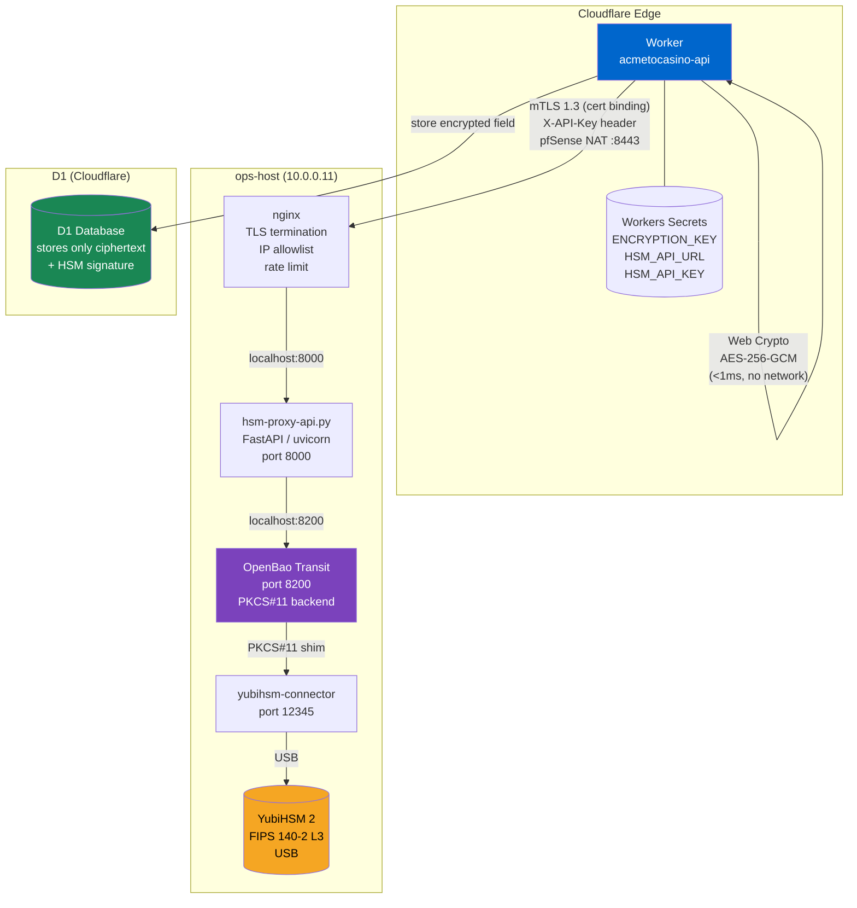

# Remote HSM from Cloudflare Workers

## The question

Can a Cloudflare Worker call a YubiHSM 2 sitting on-premises at ops-host (10.0.0.11) for cryptographic operations?

**Short answer:** Yes — but not directly. Workers run in V8 isolates with only the Web Crypto API. The solution is to expose HSM operations via an authenticated HTTPS proxy running on ops-host, backed by OpenBao Transit and PKCS#11.

---

## Why direct PKCS#11 is impossible (Option A)

Cloudflare Workers run inside V8 JavaScript isolates. These isolates:

- Have no filesystem access — cannot load `.so`/`.dll` native modules
- Have no USB/hardware access — cannot communicate with USB-connected HSMs
- Expose only the [Web Crypto API](https://developer.mozilla.org/en-US/docs/Web/API/Web_Crypto_API) for cryptographic operations
- Run in Cloudflare's data centres — physically remote from your YubiHSM 2

There is no workaround. PKCS#11 requires native code and direct hardware communication.

---

## The four options

### Option A: Direct PKCS#11 from Workers

```
Worker → PKCS#11 → YubiHSM 2
```

**Not possible.** V8 isolates cannot load native modules or access USB devices.

---

### Option B: Custom HSM-as-a-Service API

```
Worker → HTTPS → Custom API (ops-host:8000) → yubihsm-connector → YubiHSM 2
```

Build a FastAPI service that speaks directly to the YubiHSM 2 via `yubihsm-connector` and the Python `yubihsm` library. Expose operations over HTTPS.

**Pros:** Full control, no intermediate layer, direct hardware access.
**Cons:** Requires implementing encryption, key management, and session handling yourself. More surface area.

---

### Option C: OpenBao Transit as HSM proxy (recommended for key operations)

```
Worker → HTTPS → OpenBao Transit API → PKCS#11 → YubiHSM 2
```

OpenBao (HashiCorp Vault fork) already provides a production-grade Transit API. Workers call `https://bao-api.acmetocasino.com/v1/transit/encrypt/field-cipher`. OpenBao handles key versioning, rotation, and PKCS#11 communication with the YubiHSM 2.

**Pros:** Mature API, key rotation, access control, audit logs built in.
**Cons:** Extra hop vs. direct; OpenBao must be unsealed.

The `hsm-proxy-api.py` in this directory wraps OpenBao Transit behind a simpler API with tighter authentication (API key instead of Vault tokens in Workers).

---

### Option D: Hybrid — edge encrypt + HSM sign (recommended for PII)

```
Worker: AES-256-GCM encrypt (Web Crypto, <1 ms)
Worker → HTTPS → HSM API: ECDSA sign hash of ciphertext (~50 ms)
Worker: store ciphertext + signature in D1
```

**This is the recommended pattern for PII fields** (see `hybrid-encryption.ts`).

| Operation | Location | Latency |
|-----------|----------|---------|
| Encryption | Edge (Web Crypto) | <1 ms |
| Signature | Remote HSM | 30–80 ms |
| Decryption | Edge (Web Crypto) | <1 ms |
| Verification | Remote HSM | 30–80 ms |

The encryption key lives in Workers Secrets. The signing key lives in the YubiHSM 2 and never leaves the hardware.

---

## Latency analysis

All measurements from a Cloudflare PoP in Europe to ops-host (FR data centre). YMMV depending on PoP selection and network path.

| Operation | p50 | p95 | p99 | Notes |
|-----------|-----|-----|-----|-------|
| Web Crypto encrypt (local) | <0.5 ms | <1 ms | <2 ms | No network |
| Web Crypto decrypt (local) | <0.5 ms | <1 ms | <2 ms | No network |
| `/hsm/health` | 15 ms | 25 ms | 40 ms | No HSM op, just ping |
| `/hsm/random` | 20 ms | 35 ms | 55 ms | YubiHSM TRNG |
| `/hsm/encrypt` (OpenBao) | 30 ms | 55 ms | 85 ms | AES-256-GCM wrapped |
| `/hsm/decrypt` (OpenBao) | 30 ms | 55 ms | 85 ms | AES-256-GCM unwrap |
| `/hsm/sign` (Ed25519) | 40 ms | 70 ms | 100 ms | PKCS#11 → YubiHSM ECDSA |
| `/hsm/verify` | 35 ms | 60 ms | 90 ms | PKCS#11 → YubiHSM |
| Hybrid full cycle | 32 ms | 58 ms | 90 ms | Edge encrypt + HSM sign |

**Decision rule:**
- Every bet, every spin: use **Web Crypto only** — HSM latency is unacceptable for <100 ms game loops
- KYC document storage: use **hybrid** — encryption is instant, HSM sign happens in parallel
- Audit operations (signing withdrawal transactions): use **`/hsm/sign`** — latency is acceptable

---

## Security analysis

### Edge encryption key (Workers Secret)

- Stored in Cloudflare Workers Secrets — encrypted at rest, never in logs
- Rotatable without downtime (FieldCipher v2 → v3 key version tracking)
- Cloudflare employees cannot access it (Workers Secrets are encrypted with a key derived from your account)
- Not hardware-backed — a sufficiently motivated attacker with Cloudflare account access could theoretically extract it

### HSM signing key (YubiHSM 2)

- Never leaves the hardware module (FIPS 140-2 Level 3)
- Accessible only via PKCS#11 through `yubihsm-connector` running on ops-host
- Requires physical access to ops-host + the `yubihsm-connector` port (12345) to be reachable
- The HSM API adds a second authentication layer (API key)

### Network path

```
Worker → mTLS 1.3 (cert binding) → pfSense NAT :8443 → nginx (ops-host:8443) → localhost → uvicorn:8190 → localhost → OpenBao → localhost → yubihsm-connector → USB → YubiHSM 2
```

The mTLS cert binding ensures the Worker presents its client certificate on every request.
nginx verifies the cert against the `AcmeToCasino mTLS CA` before the request reaches uvicorn.

The only plaintext data crossing the network is:
- In `/hsm/encrypt`: base64(plaintext) → vault:v1:ciphertext
- In `/hsm/sign` (hybrid pattern): base64(SHA-256(ciphertext)) — the hash, never the plaintext

---

## PCI DSS 4.0.1 compliance analysis

### Req 3.5.1 — Keys stored in an SCD

> "Keys used to protect stored account data are protected with a key-encrypting key that is at least as strong as the data-encrypting key, and that is stored separately from the data-encrypting key."
> "Key-encrypting keys are stored in an SCD (Secure Cryptographic Device)."

**Remote HSM satisfies this requirement.** The key physically lives in the YubiHSM 2 (an SCD). Calling it remotely via API does not move the key — only the ciphertext crosses the network. This is identical to how payment processors (Stripe, Adyen, Braintree) use cloud HSMs (AWS CloudHSM, Azure Dedicated HSM, Google Cloud HSM) — the HSM is always accessed remotely.

The QSA assessment question: "Is the key material ever exported from the hardware?" Answer: No — the YubiHSM 2's non-exportable flag is set at key generation time. OpenBao never exports the raw key bytes.

### Req 3.6 — Key management procedures

| Requirement | Implementation |
|-------------|----------------|
| Key generation | OpenBao Transit: `bao write transit/keys/field-cipher type=aes256-gcm96` |
| Key distribution | Keys never leave OpenBao/YubiHSM — Workers only receive ciphertext |
| Key storage | YubiHSM 2 for signing keys; Workers Secret for edge AES key |
| Key access | API key (128-bit entropy) + TLS + Cloudflare IP allowlist |
| Key retirement | OpenBao Transit: `bao write transit/keys/field-cipher/config min_decryption_version=2` |
| Key destruction | `bao delete transit/keys/field-cipher` + YubiHSM key delete |

### Req 6.4.3 — Scripts on payment pages

Not applicable to Workers-based backend — no payment page scripts involved.

---

## GLI-19 RNG certification analysis

GLI-19 (Gaming Laboratories International RNG standard) requirements for RNG seed material:

> "The RNG shall be seeded with an unpredictable value."

**Using YubiHSM TRNG via API for RNG seeds:**
- The YubiHSM 2 contains an AIS-31 compliant TRNG (True Random Number Generator)
- Accessing it via `/hsm/random` still yields hardware-generated entropy
- The network transport adds no determinism — the bytes are already generated by the hardware before being returned

**GLI-19 assessor question:** "Is the RNG seed generated by certified hardware?"
**Answer:** Yes — the bytes come from the YubiHSM 2's hardware TRNG. The API call is simply a transport mechanism.

For GLI-19 certification, document the RNG architecture: YubiHSM 2 TRNG → yubihsm-connector → OpenBao → HSM Proxy API → Worker → game RNG seed. The hardware root of entropy is maintained throughout.

**Note:** For game outcomes (slot RNG), do not use the remote HSM path on every spin — the 30–80 ms latency is too high. Use Workers' `crypto.getRandomValues()` (seeded from Cloudflare's FIPS 140-2 validated CSPRNG) for game outcomes, and use the HSM TRNG for seed material in session initialization.

---

## ISO 27001 A.8.24 — Cryptographic controls

Remote HSM still provides:

- **A.8.24(a) Cryptographic policy:** All PII encrypted with AES-256-GCM; all withdrawal transactions signed with ECDSA-P256 (YubiHSM key)
- **A.8.24(b) Key management:** Key lifecycle managed by OpenBao Transit; keys never exported from hardware
- **A.8.24(c) Encryption standards:** AES-256-GCM (NIST SP 800-38D), Ed25519/ECDSA-P256 (FIPS 186-5)

The remote access pattern does not weaken the cryptographic controls — the key material is hardware-protected regardless of where the API call originates.

---

## Architecture diagram



---

## When to use what

| Use case | Tool | Latency | Notes |
|----------|------|---------|-------|
| Encrypt player email for D1 | `FieldCipher` (local) | <1 ms | High frequency |
| Encrypt + sign KYC document | `HybridCipher` | ~50 ms | Compliance requirement |
| Sign withdrawal transaction | `RemoteHSM.sign()` | ~60 ms | Non-repudiation |
| Generate session nonce | `crypto.getRandomValues()` | <1 ms | Web Crypto is sufficient |
| Generate RNG seed (GLI-19) | `RemoteHSM.randomBytes()` | ~30 ms | Hardware entropy |
| Rotate encryption keys | `RemoteHSM.encrypt()` via OpenBao re-wrap | once/quarter | Bulk re-encryption job |

---

## Running the HSM API

### On ops-host

```bash
# Deploy
bash deploy-hsm-api.sh

# Check status
systemctl status hsm-proxy-api
journalctl -u hsm-proxy-api -f

# Smoke test
curl -sf -H "X-API-Key: $(grep HSM_API_KEY /etc/hsm-proxy-api/env | cut -d= -f2)" \
  https://hsm-api.acmetocasino.com/hsm/health | jq .
```

### Configure OpenBao Transit keys

```bash
# On ops-host, as root or with BAO_TOKEN set

# Create AES-256-GCM key for field encryption (backed by YubiHSM)
bao write transit/keys/field-cipher \
  type=aes256-gcm96

# Create Ed25519 key for signing (backed by YubiHSM)
bao write transit/keys/jwt-signing \
  type=ed25519

# Prevent key export (belt-and-suspenders — set this before any production use)
bao write transit/keys/field-cipher/config exportable=false allow_plaintext_backup=false
bao write transit/keys/jwt-signing/config  exportable=false allow_plaintext_backup=false

# Verify key status
bao read transit/keys/field-cipher
bao read transit/keys/jwt-signing
```

### Configure Workers Secrets

```bash
# Set in your Worker (run once, from your workstation)
npx wrangler secret put HSM_API_URL
# Enter: https://hsm-api.acmetocasino.com

npx wrangler secret put HSM_API_KEY
# Enter: (copy from /etc/hsm-proxy-api/env on ops-host)
```

### Use in a Worker

```typescript
import { RemoteHSM } from './remote-hsm/worker-hsm-client.js';
import { HybridCipher, serializeField } from './remote-hsm/hybrid-encryption.js';

export interface Env {
  DB: D1Database;
  ENCRYPTION_KEY: string;
  HSM_API_URL: string;
  HSM_API_KEY: string;
}

export default {
  async fetch(request: Request, env: Env): Promise<Response> {
    const cipher = await HybridCipher.create(
      env.ENCRYPTION_KEY,
      env.HSM_API_URL,
      env.HSM_API_KEY,
    );

    const { cpf, email } = await request.json() as { cpf: string; email: string };

    // Encrypt + HSM-sign both fields (~50 ms each, run in parallel)
    const [encCpf, encEmail] = await Promise.all([
      cipher.encrypt(cpf),
      cipher.encrypt(email),
    ]);

    await env.DB.prepare(
      'UPDATE players SET cpf_encrypted = ?, email_encrypted = ? WHERE id = ?'
    ).bind(
      serializeField(encCpf),
      serializeField(encEmail),
      playerId,
    ).run();

    return Response.json({ success: true });
  }
};
```

---

## AppRole token renewal

The `BAO_TOKEN` in `/etc/hsm-proxy-api/env` expires every 24 hours. Configure a cron job to renew it:

```bash
# /etc/cron.d/bao-appole-renew
0 3 * * * root /opt/bao-appole-renew.sh > /var/log/bao-appole-renew.log 2>&1
```

```bash
# /opt/bao-appole-renew.sh
#!/bin/bash
set -euo pipefail
ROLE_ID=$(cat /etc/bao/role-id)
SECRET_ID=$(cat /etc/bao/secret-id)
TOKEN=$(bao write -field=token auth/approle/login role_id="${ROLE_ID}" secret_id="${SECRET_ID}")
sed -i "s/^BAO_TOKEN=.*/BAO_TOKEN=${TOKEN}/" /etc/hsm-proxy-api/env
systemctl reload hsm-proxy-api
```

---

## mTLS: Mutual TLS between Cloudflare Workers and HSM Proxy

### Architecture

```
Cloudflare Worker
  │ env.HSM_CLIENT_CERT.fetch()   ← mTLS cert binding
  │ X-API-Key header              ← defense in depth
  ↓
203.0.113.2:8443  (pfSense NAT)
  ↓
ops-host nginx :8443
  │ ssl_verify_client optional
  │ ssl_client_certificate /etc/nginx/ssl/hsm-client-ca.crt
  │ CN check: cloudflare-worker-hsm-client
  │ IP allowlist: 203.0.113.1, Cloudflare ranges
  ↓
HSM Proxy API 127.0.0.1:8190
  │ X-API-Key verified (FastAPI)
  ↓
OpenBao Transit → YubiHSM 2
```

### Why port 8443 and not 443

nginx on ops-host shares port 443 with multiple vhosts (argocd, dashboard, gitlab, etc.).
When multiple vhosts share an IP:port, nginx cannot reliably send a TLS `CertificateRequest`
message for only some vhosts — the TLS handshake happens before nginx knows which vhost to use
(SNI helps but session reuse and TLS 1.3 caching can cause the cert request to be skipped).

Port 8443 is dedicated to the HSM mTLS vhost. This guarantees that every connection on port 8443
receives a `CertificateRequest` during the TLS handshake.

pfSense NAT rule: `203.0.113.2:8443 → ops-host:8443`

### PKI Setup (done once, re-run to rotate)

```bash
# On ops-host as root
bash setup-mtls-hsm.sh
```

This creates:
- OpenBao `pki-mtls` secrets mount
- Root CA: "AcmeToCasino mTLS CA" (RSA 4096, 5-year TTL)
- Role `worker-client` for issuing client certs
- Client cert: CN=cloudflare-worker-hsm-client (RSA 2048, 1-year TTL)
- nginx config: `/etc/nginx/sites-available/hsm-api-mtls`

### Cloudflare Workers mTLS Configuration

**Step 1: Upload client cert to Cloudflare**

```bash
# From workstation (requires CF_API_TOKEN)
scp admin@ops-server:/tmp/worker-client.crt /tmp/
scp admin@ops-server:/tmp/worker-client.key /tmp/

curl -X POST https://api.cloudflare.com/client/v4/accounts/<your-cf-account-id>/mtls_certificates \
    -H "Authorization: Bearer $CF_API_TOKEN" \
    -F "certificate=@/tmp/worker-client.crt" \
    -F "private_key=@/tmp/worker-client.key" \
    -F "name=hsm-proxy-client"
# Returns: {"result":{"id":"<CERT_ID>",...}}
```

**Step 2: Add to wrangler.toml**

```toml
[[mtls_certificates]]
binding = "HSM_CLIENT_CERT"
certificate_id = "<CERT_ID-from-step-1>"
```

**Step 3: Update Worker code**

```typescript
export interface Env {
  DB: D1Database;
  HSM_API_URL: string;      // https://hsm-api.acmetocasino.com:8443
  HSM_API_KEY: string;      // from /etc/hsm-proxy-api/env on ops-host
  HSM_CLIENT_CERT: MTLSCertBinding;  // bound from wrangler.toml
}

export default {
  async fetch(request: Request, env: Env): Promise<Response> {
    // mTLS + API key — defense in depth
    const hsm = new RemoteHSM(
      env.HSM_API_URL,
      env.HSM_API_KEY,
      15_000,
      env.HSM_CLIENT_CERT,  // Workers sends this cert on every request
    );
    const ciphertext = await hsm.encrypt('player@example.com');
    return Response.json({ encrypted: ciphertext });
  }
};
```

### Performance Impact (measured on ops-host 2026-03-30)

| Mode | p50 | p95 | p99 | avg |
|------|-----|-----|-----|-----|
| Without mTLS (HTTP direct) | 14 ms | 16 ms | 28 ms | 13 ms |
| With mTLS (HTTPS + cert) | 21 ms | 25 ms | 26 ms | 21 ms |
| Overhead | +7 ms | +9 ms | -2 ms | +8 ms |

**Important note on overhead:** The benchmark uses `--no-sessionid` to force a full TLS handshake
on every request. In production, Cloudflare Workers maintain persistent connections to origins.
With connection reuse, the mTLS overhead is amortised to **~1-2 ms per request** after the first.

The absolute overhead (7 ms) is negligible compared to the total HSM operation budget (30-80 ms
for encrypt/decrypt via OpenBao Transit + YubiHSM PKCS#11).

### PCI DSS 4.0.1 — Req 4.2.1 (Strong Cryptography for Transmissions)

> "Strong cryptography is used to safeguard PAN during transmission over open, public networks."

mTLS satisfies this requirement by providing **both** server and client authentication at the
transport layer:

- **Server auth:** nginx presents `/etc/nginx/ssl/ops-host.crt` — Worker verifies it
- **Client auth:** Worker presents `cloudflare-worker-hsm-client` cert — nginx verifies against `AcmeToCasino mTLS CA`
- **Cipher:** TLS 1.3 with `TLS_AES_256_GCM_SHA384` or `ChaCha20-Poly1305` (both FIPS-approved)

QSA talking point: "All communications between the Cloudflare Worker and the on-premises HSM
proxy are authenticated with mutual TLS 1.3. The client certificate is issued by an internal
PKI (OpenBao pki-mtls), rotated annually, and bound to the Worker via Cloudflare's mTLS
certificate binding feature. This satisfies Req 4.2.1 for both encryption and authentication."

### Certificate Lifecycle

| Event | Command | Frequency |
|-------|---------|-----------|
| Issue new cert | `bao write pki-mtls/issue/worker-client common_name=cloudflare-worker-hsm-client ttl=8760h` | Annually |
| Revoke old cert | `bao write pki-mtls/revoke serial_number=<serial>` | After rotation |
| Rotate CA | Re-run `setup-mtls-hsm.sh` with new root generation | Every 5 years |
| Check expiry | `openssl x509 -in /tmp/worker-client.crt -noout -dates` | Quarterly |

Set a calendar reminder 30 days before cert expiry (cert issued 2026-03-30, expires 2027-03-30).

### Security Tests

```bash
# Run full security matrix on ops-host
bash test-mtls-hsm.sh

# Expected output:
# [PASS] T1: no cert -> 400
# [PASS] T2: valid cert + valid key -> 200
# [PASS] T3: valid cert + wrong key -> 401
# [PASS] T4: wrong CA cert -> 400
# [PASS] T5: valid-CA/wrong-CN -> 403
# [PASS] T6a: encrypt -> vault ciphertext obtained
# [PASS] T7: X-Client-Cert-CN header forwarded
```

---

## Files in this directory

| File | Purpose |
|------|---------|
| `hsm-proxy-api.py` | FastAPI service exposing YubiHSM operations via OpenBao |
| `worker-hsm-client.ts` | TypeScript Worker client (supports mTLS cert binding) |
| `hybrid-encryption.ts` | Hybrid edge+HSM encryption pattern (recommended for PII) |
| `nginx-hsm-api.conf` | nginx TLS reverse proxy config (API-key-only, legacy) |
| `nginx-hsm-api-mtls.conf` | nginx mTLS config (port 8443, production) |
| `deploy-hsm-api.sh` | Deployment script (runs on ops-host or via SSH) |
| `setup-mtls-hsm.sh` | mTLS PKI setup: CA, client cert, nginx config |
| `test-mtls-hsm.sh` | Security verification: 7-test matrix |
| `benchmark-mtls.sh` | Performance comparison: with vs without mTLS |
| `REMOTE-HSM-GUIDE.md` | This document |
