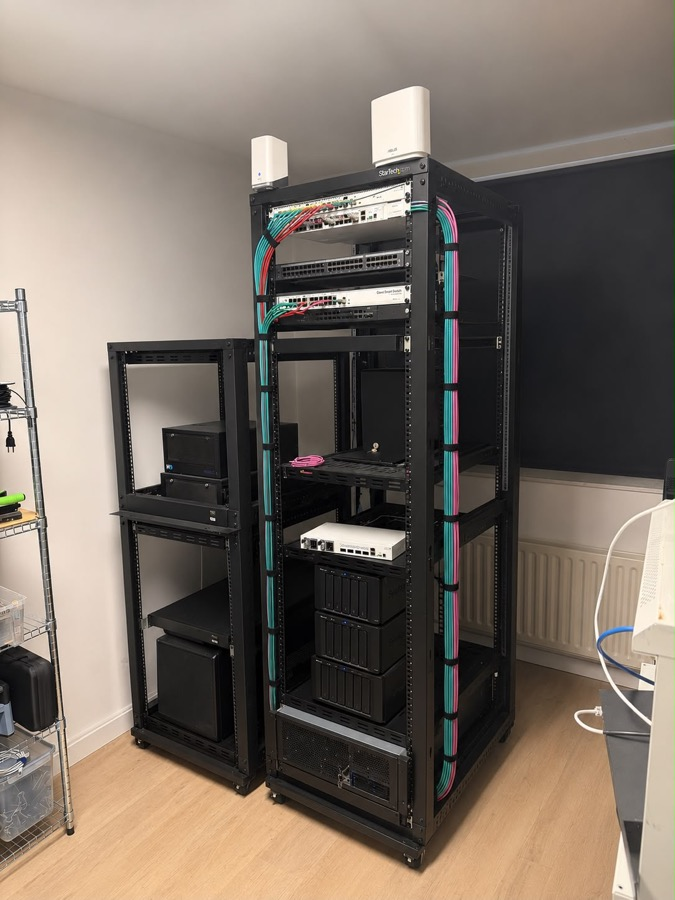
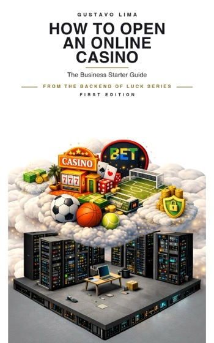
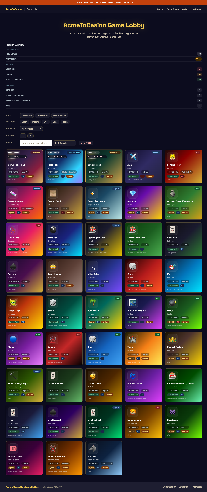
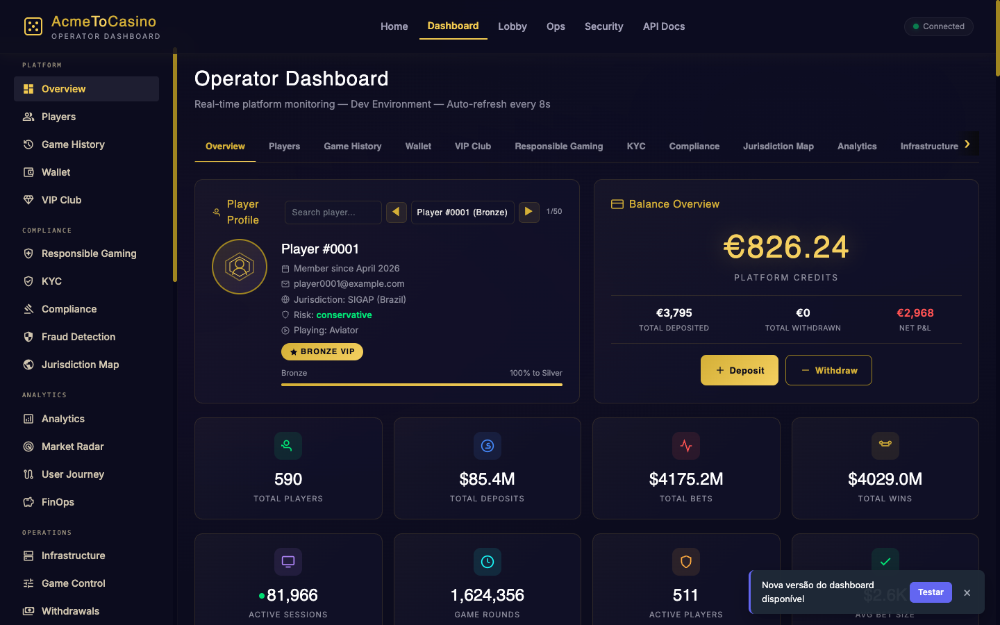
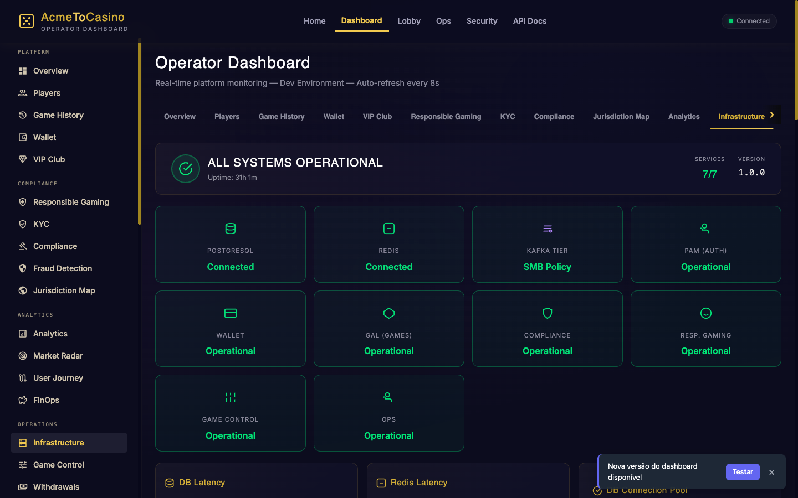
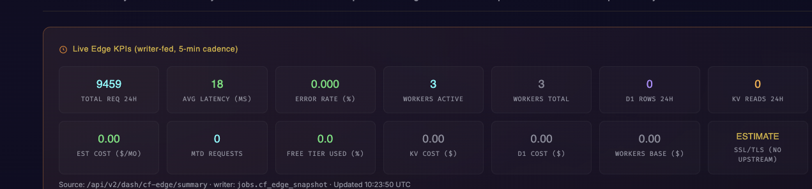
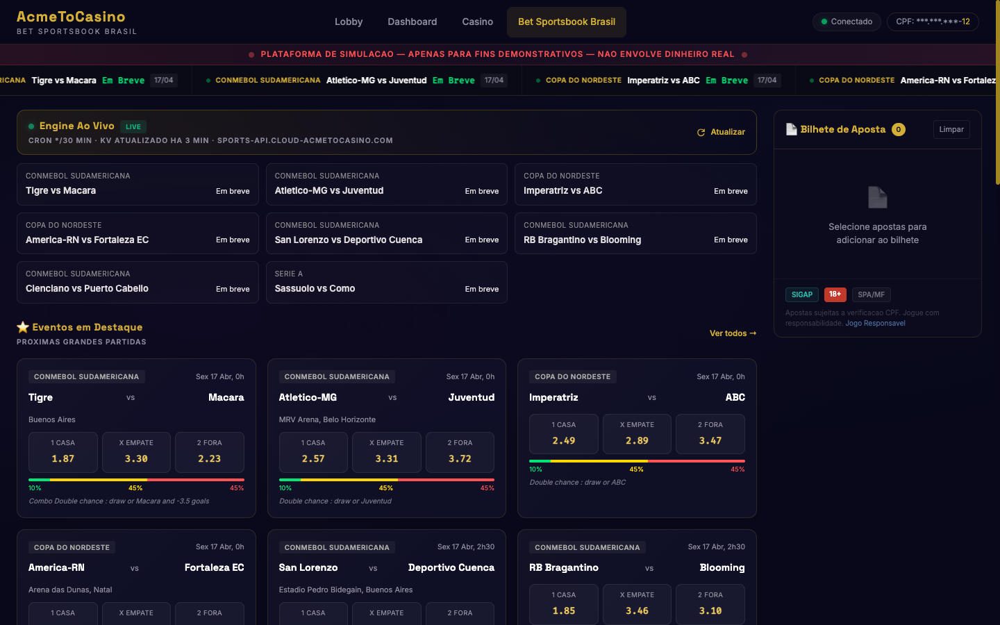
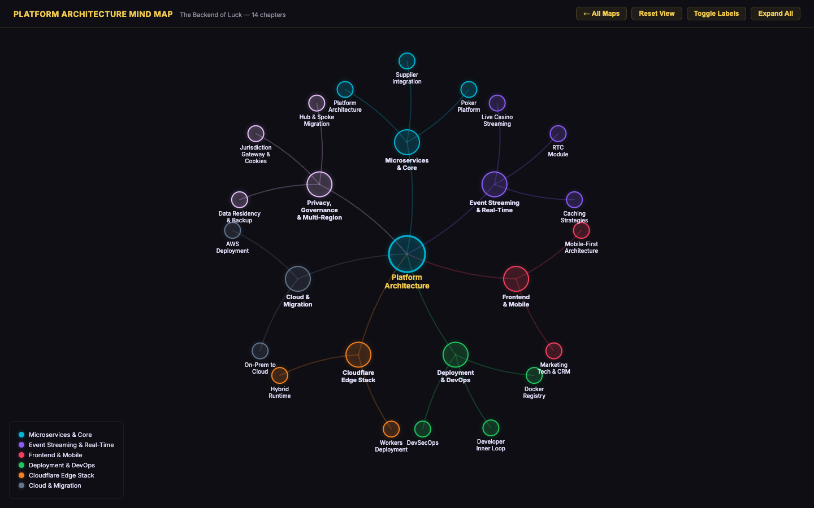

# The Backend of Luck

### *Inside the systems that power real-money gaming.*

Written from the trenches of iGaming platform engineering — the book every operator, architect, and security engineer wished existed before they built their first casino.

 

 

 

**[Buy on Amazon →](https://www.amazon.com/dp/B0H3W9J5NN)** &nbsp;·&nbsp; [PDF on Leanpub](https://leanpub.com/the-backend-of-luck) &nbsp;·&nbsp; [Chapter map](#chapter-map) &nbsp;·&nbsp; [Live platform](https://new.acmetocasino.com) &nbsp;·&nbsp; [Português →](https://portrasdasorte.com.br)

---

## The lab behind the book

Every architecture in this series was built, broken and re-built on this rack before it reached the page. It is not a diagram: it is the machine the code was tested on.

- **Hardware root of trust.** A **YubiHSM 2** (FIPS 140-2 Level 3) backs the platform's key hierarchy: database encryption keys, JWT signing, mTLS issuance and the OpenBao PKI. Chapter 20 documents the key ceremony, the wrapping model and the recovery runbook that were exercised here.
- **Encrypted enterprise storage.** The NAS runs **enterprise NVMe drives with full-disk encryption**, unlocked against the HSM rather than a passphrase on disk. This is where the PostgreSQL layered-encryption work in Chapters 20 and 27 was benchmarked, including the pg-aegis and Transparent Data Encryption comparisons.
- **100 Gbps fabric.** The compute nodes are cross-connected at **100 Gbps**, which is what made the replication, streaming and traffic-surge tests in Chapters 27, 31 and 31b meaningful instead of synthetic: at 1 Gbps the network is the bottleneck long before the database is.
- **Clusters and virtualization.** Proxmox hosts the virtual machines; several Kubernetes clusters (k3s and OKD) run the platform, the observability stack, the SIEM and the CI/CD chain that Chapters 22 to 25 and 28 to 29 describe.

The manifests, Terraform modules and runbooks in this repository are the sanitized form of what runs here. Internal hostnames and addresses have been replaced with documentation values, so nothing in the published code points at the lab itself.

---

## Live, right now

The book is backed by running systems you can open today:

| | |
|---|---|
| 📊 **[Regulator revenue dashboard](https://thebackendofluck.com/regulator-global.html)** | Regulator-verified GGR for 23+ jurisdictions, refreshed weekly, with an open archive of source files and integrity hashes. |
| ⚖️ **[Casino vs sports betting licensing](https://thebackendofluck.com/casino-vs-sports-betting-licensing.html)** | Seven licensing routes side by side. Every fee and timeline links to the regulator, legislation portal, or government service itself. |
| ⚽ **[Brazilian sportsbook, live on the edge](https://bet-brazil.cloud-acmetocasino.com/bet-brazil-sports)** | SIGAP-aware sportsbook running on Cloudflare Workers: live odds feeds, 30-minute cron refresh, per-brand edge routing. |
| ☁️ **[The platform on Cloudflare](https://thebackendofluck.com/tech/cloudflare.html)** | 43 playable games and the operator dashboard on a Workers, D1, KV and R2 edge fleet, running in the free tier. |
| 🎰 **[Three production games on the Cloudflare runtime](https://cfgp.cloud-acmetocasino.com/)** | Crash, Plinko and a provably-fair dice game running end to end on Workers: the RNG, the bet ledger and the settlement loop at the edge, with per-round hashes you can verify. The reference build behind Chapter 44. |

---

## 🇧🇷 Português: o mercado de bets do Brasil

> ### **[portrasdasorte.com.br →](https://portrasdasorte.com.br)**
> O portal em português da série, focado em quem vai construir e operar sob a **Lei 14.790/2023** e o novo regime da **SPA/MF**.

O Brasil regulou as apostas de quota fixa e ligou a chave em 2025. Quem vai operar aqui não precisa de teoria: precisa saber ligar o **PIX** ao caixa, reportar ao **SIGAP**, atender ao **COAF** e à **LGPD**, e manter o dado do jogador dentro da jurisdição que exige.

O que a série cobre, com o Brasil no centro e não como nota de rodapé:

- **Pagamentos que decidem a operação.** Depósito via **PIX** liquidando em menos de três segundos, saque, conciliação, estorno e redundância de PSP. O capítulo 46 constrói uma plataforma de apostas brasileira de ponta a ponta.
- **Regulação e licenciamento.** A **Lei 14.790**, a outorga da **SPA/MF**, o custo real em capital e meses, e o que muda em relação a Curaçao, Malta ou Reino Unido.
- **Reporte e conformidade.** **SIGAP**, prevenção à lavagem com o **COAF**, jogo responsável, autoexclusão e a **LGPD** ao lado do GDPR.
- **Arquitetura na borda.** Um sportsbook brasileiro rodando ao vivo em Cloudflare Workers, com feeds de odds, cron de 30 minutos e roteamento por marca, [**ao vivo aqui**](https://bet-brazil.cloud-acmetocasino.com/bet-brazil-sports).
- **Residência de dados.** Onde o dado do apostador pode e não pode ficar, e como provar isso a um regulador.

### O que existe em português

- **Guia iniciante em PT-BR: _Como Abrir um Cassino Online_.** A porta de entrada da série, em linguagem simples para empreendedores e investidores, com o caso brasileiro (PIX, Lei 14.790, SIGAP) no centro. PDF pronto, **lançamento em breve**.
- Os **seis volumes técnicos** e a **Edição Completa** estão disponíveis **em inglês**. O material de mercado, tributação e pagamentos cobre o Brasil em profundidade, mas os livros técnicos não são traduzidos.

**[Conheça a série em português → portrasdasorte.com.br](https://portrasdasorte.com.br)**

---

## Table of contents

- [The lab behind the book](#the-lab-behind-the-book)
- [Live, right now](#live-right-now)
- [About this repository](#about-this-repository)
- [What makes this book different](#what-makes-this-book-different)
- [Who it's for](#who-its-for-and-who-it-isnt)
- [The six volumes & editions](#the-six-volumes--editions)
- [New: the starter guide](#new-the-starter-guide)
- [See the games — 43 playable](#see-the-games--43-playable)
- [The operator dashboard, live](#the-operator-dashboard-live)
- [Interactive mind maps](#interactive-mind-maps)
- [Tech stack covered](#tech-stack-covered)
- [Chapter map](#chapter-map)
- [Pricing & bundles](#pricing--bundles)
- [How access works](#how-access-works)
- [FAQ](#faq)
- [Author](#author)
- [Support & contact](#support--contact)
- [License](#license)

---

## About this repository

This is the **public showcase** for *The Backend of Luck*. It's a navigator — a map — **not the content itself**.

The [chapter map](#chapter-map) below shows every chapter of the series and which volume it belongs to. The full chapters, scripts, diagrams and runnable examples live in **private content repositories** that buyers receive access to after redeeming a code. Print and Kindle editions are published by **Brainiacs B.V.** under the series' own ISBNs and available on Amazon.

Public showcase = marketing & navigation. Private volumes = the actual book. Live running example = [**new.acmetocasino.com**](https://new.acmetocasino.com).

---

## What makes this book different

- 🎯 **Precision over prose.** Every claim is backed by a file, a diagram, or a running script. No padding.
- 🛠️ **Production, not prototypes.** Scripts are versioned, linted, tested — the same code patterns the author has shipped to regulated operators.
- 🌐 **Multi-jurisdiction.** Licensing paths, datacenter footprints, and compliance reporting for 8+ jurisdictions — including Brazil's new SPA regime.
- 💰 **Multi-gateway.** Payment flows, webhook dedup, chargeback handling across **Stripe · Hotmart · Kirvano · Amazon** with side-by-side configuration.
- 🔬 **Deep dives nowhere else.** Post-quantum crypto readiness, mobile-operator Cloudflare Access, synthetic traffic & bot lifecycle at launch, Brazilian betting architecture.
- 🎮 **Live reference implementation.** [`new.acmetocasino.com`](https://new.acmetocasino.com) runs a real, operating dev platform built from the book's scripts — 43 playable games, live operator dashboard, Cloudflare Edge fleet, 7-brand multi-tenancy.

---

## Who it's for (and who it isn't)

| It IS for... | It is NOT for... |
|---|---|
| Engineers building or hardening a platform | Casual readers who want "fun facts" |
| Founders planning licensing and go-live | People looking for gambling tips *(who knows, hehehe)* |
| Security engineers on HSM, KYC, anti-fraud | Game design / UX theory readers |
| SREs running multi-jurisdiction infra | Beginners without an engineering base *(start with the [starter guide](#new-the-starter-guide))* |
| Compliance officers coordinating with eng | Readers expecting short articles |
| Operators targeting the Brazilian SPA market | Anyone who prefers abstractions over code |

---

## The six volumes & editions

Six focused volumes. Pick the slice that matches your role, or take everything in the Complete Edition.

<table>
<tr>
<td width="50%" valign="top">

### 📘 Volume 1 — Markets, Regulation, Launch & Business Foundations

**€34.90**

*For founders, executives, legal, compliance, consultants.*

Ecosystem, global markets, licensing, planning, team, contracts, and the complete Brazilian betting platform build.

[**Kindle**](https://www.amazon.com/dp/B0HBRVQZQB) · [**PDF**](https://leanpub.com/the-backend-of-luck)

</td>
<td width="50%" valign="top">

### 📗 Volume 2 — Platform, Game & Product Architecture

**€59.90**

*For CTOs, architects, principal engineers, product leads.*

Platform architecture, supplier integration, wallets, games, RNG, distributed systems, edge runtime, sportsbook.

[**Kindle**](https://www.amazon.com/dp/B0HBS2RGXR) · [**PDF**](https://leanpub.com/the-backend-of-luck)

</td>
</tr>
<tr>
<td width="50%" valign="top">

### 📙 Volume 3 — Security Engineering & Runtime Defense

**€84.90**

*For security engineers, SREs, platform teams.*

Anti-fraud, HSM, OpenBao, DevSecOps pipelines, SIEM, IDS/IPS, mTLS, post-quantum, operator access, bot traffic.

[**Kindle**](https://www.amazon.com/dp/B0GZCRSTMH) · [**PDF**](https://leanpub.com/the-backend-of-luck)

</td>
<td width="50%" valign="top">

### 📕 Volume 4 — Compliance, Player Safety, Data Residency & Governance

**€64.90**

*For compliance officers, DPOs, auditors.*

Security & compliance foundation, KYC, geofencing, player protection, self-exclusion, reporting, data residency, AI governance.

[**Kindle**](https://www.amazon.com/dp/B0HBS473SJ) · [**PDF**](https://leanpub.com/the-backend-of-luck)

</td>
</tr>
<tr>
<td width="50%" valign="top">

### 📔 Volume 5 — Infrastructure, Datacenter & Deployment

**€49.90**

*For infrastructure teams, SREs, datacenter planners.*

Caching, internal registry, inner loops, infra patterns, datacenters on five continents, AWS, Terraform, decommissioning.

[**Kindle**](https://www.amazon.com/dp/B0GYYG1HZ3) · [**PDF**](https://leanpub.com/the-backend-of-luck)

</td>
<td width="50%" valign="top">

### 📓 Volume 6 — Operations, Finance, Growth & Case Studies

**€64.90**

*For operations leaders, finance, growth teams.*

FinOps, QA, playbooks, analytics, incidents, financial operations, CRM, migration and launch case studies, war stories.

[**Kindle**](https://www.amazon.com/dp/B0GZLM5J8M) · [**PDF**](https://leanpub.com/the-backend-of-luck)

</td>
</tr>
</table>

### 📚 Complete Edition — everything in one book

**All six volumes, end to end — €199.90.** Every chapter in the master manuscript order: one reference, one index, no volume boundaries. [**Kindle →**](https://www.amazon.com/dp/B0H3W9J5NN) · [**PDF and EPUB on Leanpub →**](https://leanpub.com/the-backend-of-luck)

Kindle on any Amazon marketplace: swap the domain for `.nl`, `.de`, `.co.uk` or `.com.br`. Leanpub sells the DRM-free PDF and EPUB and gives you every future update of the edition you bought.

---

## New: the starter guide

### 🚀 How to Open an Online Casino — The Business Starter Guide

**€12.90 ebook · €22.90 paperback**

The plain-language entry point to the series, written for entrepreneurs and investors with no technical background: the business, casino vs sportsbook, regulation and licensing, platform anatomy, payments (with the Brazil PIX case), team, budget, compliance, and a complete launch plan. No code, no jargon, and it continues naturally into the six volumes.

[**Kindle →**](https://www.amazon.com/dp/B0HBS1WQNT) · [**Paperback →**](https://www.amazon.com/dp/9083754952)

---

## See the games — 43 playable

The book isn't theory. The **live dev platform** at [`new.acmetocasino.com`](https://new.acmetocasino.com/lobby.html) ships **43 real, playable casino games** across 4 families — slots, table games, crash/instant arcade, and roulette/sicbo/craps. Every card in the grid has real RTP, volatility, and architecture attributes (client-side vs. hybrid vs. server-authoritative) drawn directly from the book's production patterns.

*43 playable games · 4 families · real RTP & volatility · server-authoritative migration in progress.*

**What you see in the grid:**

- 🃏 **Table games** — Crown Poker Club, Pulse Poker, Street Hold'em, Blackjack, Baccarat, Craps, Sic Bo, Video Poker, Casino Hold'em.
- 🎰 **Slots** — Fortune Tiger, Sweet Bonanza, Book of Dead, Gates of Olympus, Starburst, Gonzo's Quest, Mega Moolah, Wolf Gold, Reactoonz, Wheel of Fortune, Pharaoh Fortune, Bonanza Megaways, Dead or Alive, Recife Gold, Amsterdam Nights, Mines…
- 🚀 **Crash & instant arcade** — Aviator, Crazy Time, Pinko, Double, Dice, Tower, Hi-Lo, Scratch Cards.
- 🎡 **Live & wheel** — Lightning Roulette, European Roulette (Classic / In-House), Mega Ball, Dragon Tiger, Live Baccarat, Live Blackjack, Dream Catcher.

Each card displays **RTP, volatility bucket, architecture mode, provider, and review state** — the exact metadata the platform uses to gate games into specific jurisdictions (see Chapter 25, GLI-GSF Compliance Framework, in Volume 4).

---

## The operator dashboard, live

[`new.acmetocasino.com/dashboard.html`](https://new.acmetocasino.com/dashboard.html) is the **operator dashboard** running the book's architecture in production. It is not a mockup — it's a functional tool with real-time data feeds, 12+ tabs covering every operational area, and it auto-refreshes every 8 seconds.

### Overview — players, wallet, VIP, risk

*Player 360 · balance overview · totals (players, deposits, bets, wins) · active sessions · VIP tier progression.*

Tabs (all live, all drawing from the platform's APIs):

- **Overview** — player 360, balance, deposits, bets, wins, active sessions.
- **Players · Game History · Wallet · VIP Club** — lifecycle of a gambler, end to end.
- **Responsible Gaming · KYC · Compliance · Fraud Detection** — the compliance spine. (Volume 3)
- **Jurisdiction Map · Market Radar · User Journey · FinOps** — where the money comes from, where it goes.
- **Infrastructure · Cloudflare Edge · Game Control · Backoffice** — what operations needs every day.
- **Withdrawals · Payments · Game Licensing · Performance · Deployments · Security SOC · Risk & Fraud · Payment Ops · Exclusion Reg.** — everything else.

### Infrastructure tab — service health

*PostgreSQL · Redis · Kafka · PAM · Wallet · GAL (Games) · Compliance · Responsible Gaming · Game Control · Ops — 7/7 operational, 31h uptime.*

### Cloudflare Edge tab — workers, cost, free-tier monitoring

**[▶ Open the live Cloudflare Edge dashboard →](https://new.acmetocasino.com/dashboard.html)**

*Live edge KPIs (latency · error rate · workers active · D1 rows · KV reads · R2 objects) · per-worker deployment status for the operator API + 4 brand APIs · cost monitor with free-tier headroom.*

A full chapter on the architecture behind these dashboards is in Chapter 44, Deploying iGaming Platforms on Cloudflare Workers (Volume 2), with the operations deep dive in the Chapter 47 series (Volume 6).

### The games run on the edge, not just the marketing

Chapter 44 is not a hello-world Worker. It is a working real-money casino runtime built entirely on Cloudflare's free tier: the request never leaves the edge, from the bet to the payout.

**[Three production games on the Cloudflare runtime → cfgp.cloud-acmetocasino.com](https://cfgp.cloud-acmetocasino.com/)**

- **Crash, Plinko and provably-fair dice**, each running end to end on a Worker: the RNG, the bet ledger, the settlement loop.
- **Provably fair by construction.** Every round commits a server seed hash up front and reveals the seed after, so a player can recompute the outcome and verify the house did not move the result.
- **State where it belongs.** D1 holds the ledger, KV holds per-brand config and rate limits, R2 holds assets, Durable Objects serialize each game round so two bets can never race the same balance.
- **Latency you feel.** The dice resolves in single-digit milliseconds at the edge because there is no origin round trip to make.

The book walks the whole build: the money-safe wallet, the RNG certification story, the KV rate limiter, and how to keep all of it inside the free tier while it is genuinely playable.

### Multi-brand on the edge — seven brands, one codebase

The dashboard's Cloudflare tab is monitoring a real multi-brand edge deployment. Every brand points at the same Worker runtime with per-hostname routing, KV-backed config, and D1 per tenant. Here's one of them live:

*Brazilian sportsbook running on Cloudflare Workers — SIGAP & SPA/MF compliance markers · CONMEBOL Sudamericana + Copa do Nordeste + Serie A odds feeds · live 30-min cron refresh · SGX API upstream at `sports-api.cloud-acmetocasino.com`.*

**What's on Cloudflare in the reference platform** (all covered in the book, chapters 44 · 44b · 47b · 47c):

- **Workers fleet** — one `acmetocasino-api` shared runtime + per-brand APIs (`brand-alpha-api` … `brand-delta-api` + `bet-brazil`), each with its own routes and KV namespace.
- **Cache Components (Next.js 16)** — `"use cache"` directives on catalogue, lobby, and odds pages with per-tenant revalidation.
- **D1** — player lifecycle, odds cache, and redemption ledger, sharded by brand.
- **KV** — feature flags, jurisdiction config, rate-limit counters with fail-closed error handling.
- **R2** — WORM logs for compliance, signed upload URLs, replay archives.
- **Queues** — webhook retry buffer for Stripe · Hotmart · Kirvano · Amazon with idempotency on `(provider, external_id)`.
- **Access** — Cloudflare Access in front of the operator dashboard, `/admin` routes, and internal tooling; mobile-operator access via Access + OpenBao SSH CA (Chapter 24k).
- **WAF** — per-country rules, managed rulesets, plus custom rate-limit burst guards on auth and payment paths.
- **Pages** — the `tbof-access` redeem site runs as Pages + Worker split, nginx routing `/auth`, `/webhooks`, `/admin`, `/api` to the Worker and the rest to Pages.
- **Turnstile** — anti-bot on redeem, KYC, and sign-up flows.
- **Routing Middleware (Next.js 16 + Cloudflare)** — region detection, jurisdiction gating, A/B split.
- **Zero-downtime deploys** — every Worker version pinned, gradual rollout via percentage splits, instant rollback on error-rate trigger.
- **Cost discipline** — entire demo platform runs in Cloudflare's free tier thanks to Worker bundle size control + KV read coalescing (see cost monitor screenshot above).

---

## Interactive mind maps

The book ships **12 interactive knowledge maps** — each a zoomable, pan-able force graph of a pillar: Architecture, Security, Kubernetes, Compliance, Games, Financial Ops, Sports Betting, On-Premise, Jurisdictions, Anti-Fraud, Database & HA, Data Governance.

*Platform Architecture mind map — 14 chapters, 7 clusters (Microservices · Real-Time · Frontend · DevOps · Edge · Migration · Privacy). Click a node to jump to the chapter.*

Browse the full collection at [`new.acmetocasino.com/mindmaps/`](https://new.acmetocasino.com/mindmaps/).

---

## Tech stack covered

The book is deliberately **multi-stack** — the same pattern is often shown in 2–3 technologies so readers can map it to their own environment. This is the real technology footprint covered across the six volumes:

<table>
<tr>
<td width="25%" valign="top">

**🧱 Languages & runtimes**
- TypeScript / Node.js
- Python (FastAPI, Django)
- Scala (Pekko / Play)
- Go
- Rust
- Kotlin / Swift (mobile)
- PHP (legacy back-office)
- Shell / Bash

</td>
<td width="25%" valign="top">

**☁️ Cloud & edge**
- AWS (EKS, RDS, ECS, S3, Lambda)
- Cloudflare (Workers, D1, R2, KV, Access, WAF)
- GCP (selective)
- Azure (selective)
- Vercel
- On-prem (Dell, HPE, libvirt/KVM)

</td>
<td width="25%" valign="top">

**🗄️ Data & messaging**
- PostgreSQL (primary OLTP + partitioning)
- Redis (cache, pub/sub, streams)
- Kafka (event streaming)
- ClickHouse (OLAP)
- MongoDB
- D1 / SQLite (edge)
- S3 / R2 (WORM logs)

</td>
<td width="25%" valign="top">

**🔐 Security & compliance**
- OpenBao / HashiCorp Vault
- YubiHSM 2 (FIPS 140-2)
- AWS CloudHSM
- Wazuh SIEM
- GuardDuty · Security Hub
- Semgrep · Trivy · ZAP
- Suricata · AWS Network Firewall
- OSSEC · Falco

</td>
</tr>
<tr>
<td valign="top">

**🚀 DevSecOps**
- GitLab CI (self-hosted)
- GitHub Actions
- ArgoCD · Flux
- Helm · Kustomize
- Tilt · Skaffold
- cert-manager · trust-manager
- SPIRE (workload identity)

</td>
<td valign="top">

**☸️ Kubernetes**
- EKS (managed)
- K3s / K3d (edge & on-prem)
- Rancher (multi-cluster)
- kubeadm (regulated US markets)
- Flannel · Cilium · Calico
- Blue/Green rotation
- mTLS mesh

</td>
<td valign="top">

**💳 Payments & regulation**
- Stripe · Hotmart · Kirvano · Amazon
- Pix (Brazil) · SEPA · ACH
- Crypto (BTC · ETH · Lightning)
- MGA · UKGC · SPA · Curaçao
- GLI-19/33 · GSF · PCI-DSS
- GDPR · LGPD
- FATF Travel Rule

</td>
<td valign="top">

**🎮 Gaming & RNG**
- In-house RNG (RDRAND + entropy pool)
- PG Soft · NetEnt · Pragmatic · Red Tiger · Evolution · Spribe integrations
- Live dealer streaming (HLS, WebRTC)
- Server-authoritative migration patterns
- RTP simulation & GLI-certifiable math

</td>
</tr>
</table>

Full per-chapter tech mapping in the [chapter map](#chapter-map) below.

---
---

## 🔐 Security & cryptography — the hardware line

Regulated real-money gaming is where cryptography gets serious. The book dedicates all of Volume 3 and much of Volume 4 to the hardware and protocol layers that actually protect player funds, game fairness, and compliance evidence. Four pillars, covered end-to-end:

<table>
<tr>
<td width="25%" valign="top">

### 🔑 YubiHSM 2 & HSM infrastructure

Hardware root of trust for the platform — FIPS 140-2 Level 3, $650 per unit, 256 object slots.

- YubiHSM 2 deployment, firmware hardening, CKM algorithm allow-listing
- AWS CloudHSM (FIPS 140-3), on-prem Thales / Luna
- LUKS full-disk encryption with HSM-backed keys on every database host
- PostgreSQL TDE via pg_tde + HSM-wrapped master keys
- OpenBao (fork of Vault) for dynamic secrets & PKI, with HSM seal
- Key rotation runbooks, secure decommissioning, audit export for regulators
- Post-quantum readiness — hybrid ECDHE + Kyber, TLS hybrid suites

*Chapters: 20, 20b, 24g, 29a. Volume 2 + 3.*

</td>
<td width="25%" valign="top">

### 🔒 mTLS mesh on Kubernetes

Every service-to-service call inside the platform is mutually authenticated. No network-level trust.

- cert-manager + trust-manager for certificate lifecycle
- SPIRE for SPIFFE-based workload identity (no shared secrets)
- Istio / Linkerd mesh comparison — picking one
- Blue/green cluster rotation with cert rollover
- Post-quantum TLS preparation — hybrid X25519 + Kyber
- Debugging mTLS failures without disabling them
- Operator onboarding with certificate issuance playbook
- Cloudflare Access + OpenBao SSH CA for mobile operator access

*Chapters: 24h, 24i, 24k. Volume 2.*

</td>
<td width="25%" valign="top">

### 🐘 PostgreSQL at real-money scale

Not a generic database chapter — the actual patterns used by regulated operators.

- Partitioned ledgers: wallet, bets, sessions, audit
- Logical replication for jurisdiction data residency
- pg_partman + pg_cron for lifecycle
- Connection pooling at scale (PgBouncer + PgPool comparison)
- Row-level security for multi-tenant brands
- PgAudit + WORM export to satisfy GLI-19/33
- Transparent Data Encryption (pg_tde) with HSM-wrapped keys
- Backup encryption, restore drills, ransomware recovery
- Slow-query hunting, vacuum tuning, partition-prune pitfalls

*Chapters: 20 (TDE), 27 (residency/backup), 28a-c (patterns), 29a-f (datacenters), 36b (ledger). Volumes 2–3.*

</td>
<td width="25%" valign="top">

### 🔐 Cryptography in flight & at rest

The protocol and algorithm choices that matter for audit.

- AES-256-GCM for data at rest — backups, R2, replay archives
- RSA / ECDSA / Ed25519 for signing game outcomes (GLI evidence)
- RDRAND + user-space entropy pool for RNG (CGF-19 / GLI-19 audit trail)
- Hybrid classical + post-quantum key exchange (ML-KEM / Kyber-768)
- KMS envelope encryption patterns (data keys wrapped by HSM master keys)
- TLS 1.3 baseline, strict cipher profile, HSTS preload
- Certificate pinning for mobile apps, public-key pinning rotation
- Secret scanning (git hygiene, pre-commit, Gitleaks, Semgrep)
- Hashing: Argon2id for passwords, HMAC-SHA256 for webhooks, BLAKE3 for content IDs

*Chapters: 17 (RNG), 20, 23c (secrets), 24g (post-quantum), 24l (email authn). Volume 2.*

</td>
</tr>
</table>

**Why this matters for buyers:** you can't certify a GLI-19 / GLI-33 audit, pass an MGA technical inspection, or survive an SPA (Brazilian) compliance review if this layer is hand-waved. The book treats it as a first-class engineering concern with runnable scripts (LUKS unlock, HSM key ceremony, certificate issuance, backup restore) — not just architecture diagrams.

## Chapter map

Every chapter of the series, grouped by volume (master manuscript numbering). Linked chapters have their companion code in this repository; the rest are covered inside their parent chapter folder or are narrative only.

<strong>📘 Volume 1 — Markets, Regulation, Launch & Business Foundations</strong> · <strong>€34.90</strong> · 12 chapters

| # | Title |
|---|---|
| `1` | The Online Casino Ecosystem |
| `2` | Regulation and Compliance Landscape |
| `3` | Global Market Analysis |
| `4` | Market Analysis and Industry Players |
| `5` | Differences Between Betting Sites and Online Casinos |
| `6` | Licensing Guide |
| `7` | Casino Implementation Planning and Timeline |
| `8` | Team Structure and Operations |
| `9` | Legal Framework and Contracts |
| `App.` | How to Launch an Online Casino or Betting Operation: A Practical Guide by Jurisdiction |
| `App.` | Data Sources Verification |

<strong>📗 Volume 2 — Platform, Game & Product Architecture</strong> · <strong>€59.90</strong> · 17 chapters

| # | Title |
|---|---|
| `10` | [Complete Platform Architecture](./10-complete-platform-architecture/) |
| `10b` | Supplier Integration Control Plane |
| `11` | [Online Poker Platform Architecture](./11-online-poker-platform-architecture/) |
| `12` | [Real-Time Cash Flow Management for Online Casinos](./12-casino-money-monitor-use-case/) |
| `13` | [Live Casino Streaming Infrastructure](./13-live-casino-streaming-infrastructure/) |
| `14` | [Mobile-First Architecture for iGaming](./14-mobile-first-architecture/) |
| `15` | [Casino Mathematics and Game Economy](./15-casino-mathematics-game-economy/) |
| `15b` | [Game Exploits, Fake Hacks, and the Engineering of Trust](./15b-game-exploits-fake-hacks-trust-engineering/) |
| `16` | [Cryptocurrency and DeFi Integration](./16-cryptocurrency-defi-integration/) |
| `17` | [Random Number Generation (RNG)](./17-random-number-generation-rng/) |
| `18` | [Real-Time Clock Module Implementation](./18-rtc-module-implementation/) |
| `28a` | [Distributed Systems Deep Dive](./28a-distributed-systems-deep-dive/) |
| `28c` | Architecture Patterns Deep Dive |
| `44` | [Deploying iGaming Platforms on Cloudflare Workers](./44-deploying-igaming-on-cloudflare-workers/) |
| `44b` | Cloudflare Hybrid Runtime: Edge/Core Split, Degraded Mode, and Consistency Guarantees |
| `46` | [Building a Brazilian Betting Platform: Architecture, Compliance, and Implementation](./46-brazilian-betting-platform/) |
| `46b` | Sports Betting Architecture: From Odds Feed to Settlement |

<strong>📙 Volume 3 — Security Engineering & Runtime Defense</strong> · <strong>€84.90</strong> · 17 chapters

| # | Title |
|---|---|
| `19` | [Anti-Fraud System Deep Dive](./19-anti-fraud-system-deep-dive/) |
| `20` | [Hardware Security Module Infrastructure](./20-hardware-security-module-infrastructure/) |
| `20b` | [OpenBao Operations: Secret Engines, Dynamic Credentials and Disaster Recovery](./20b-openbao-operations/) |
| `23` | [DevSecOps for iGaming](./23-devsecops-igaming/) |
| `23b` | [DevSecOps Pipeline Implementation: From GitHub Actions to Self-Hosted GitLab CI](./23b-devsecops-pipeline-implementation/) |
| `23c` | [Secrets Management and Git Hygiene for iGaming Engineering](./23c-secrets-management-git-hygiene/) |
| `24b` | [Wazuh SIEM for iGaming Compliance](./24b-wazuh-siem-igaming-compliance/) |
| `24c` | [AWS SIEM Implementation for iGaming Compliance](./24c-aws-siem-igaming/) |
| `24f` | Network IDS/IPS: Suricata and AWS Network Firewall for iGaming |
| `24g` | Post-Quantum Cryptography for iGaming Platforms |
| `24h` | [Mutual TLS Between Kubernetes Services for iGaming Platforms](./24h-mtls-kubernetes/) |
| `24i` | [Blue-Green Cluster Switching for iGaming Kubernetes Environments](./24i-blue-green-kubernetes/) |
| `24j` | [IP Reputation and Blocklist Integration for iGaming Platforms](./24j-ip-reputation-blocklists/) |
| `24k` | Mobile Operator Access: Cloudflare Access, OpenBao SSH CA, and the Case Against Teleport |
| `24l` | Email Authentication and Anti-Spoofing for iGaming Brand Domains |
| `24m` | [Security Workflow Automation with n8n on Kubernetes](./24m-security-workflow-automation-n8n-kubernetes/) |
| `48` | Synthetic Traffic and the Bot Lifecycle |

<strong>📕 Volume 4 — Compliance, Player Safety, Data Residency & Governance</strong> · <strong>€64.90</strong> · 14 chapters

| # | Title |
|---|---|
| `24` | [Security and Compliance](./24-security-compliance/) |
| `24d` | KYC Evidence Lifecycle |
| `24e` | Geofencing and Location Verification |
| `25` | [GLI-GSF Compliance Framework: Online Gaming Information Security](./25-gli-gsf-compliance-framework/) |
| `25b` | [Regulatory Reporting and Evidence Export](./25b-regulatory-reporting-evidence-export/) |
| `26` | [Responsible Gaming and Player Protection Systems](./26-responsible-gaming-player-protection/) |
| `26b` | Self-Exclusion Registries: From API to Audit Trail |
| `27` | [Data Residency and Backup/Recovery](./27-data-residency-backup-recovery/) |
| `27b` | [The Jurisdiction Transfer Gateway and Cookie Consent](./27b-jurisdiction-gateway-cookies/) |
| `27c` | [Migrating a Single-Jurisdiction Casino Platform to Hub & Spoke](./27c-hub-spoke-migration-playbook/) |
| `27d` | [PostgreSQL Aegis: Testing Layered Encryption End-to-End](./27d-postgres-aegis-testing/) |
| `34b` | [Data Governance for iGaming Platforms](./34b-data-governance-igaming/) |
| `43b` | AI Governance for iGaming Platforms under the EU AI Act |
| `App.` | postgres-aegis Bugs and Fixes |

<strong>📔 Volume 5 — Infrastructure, Datacenter & Deployment</strong> · <strong>€49.90</strong> · 14 chapters

| # | Title |
|---|---|
| `21` | [Caching Strategies and Benefits](./21-caching-strategies-benefits/) |
| `22` | [Internal Docker Registry: Why You Need Your Own and How to Build It](./22-internal-docker-registry-benefits/) |
| `22b` | [Developer Inner-Loop Experience in Containerized iGaming Platforms](./22b-developer-inner-loop-kubernetes/) |
| `28b` | [Infrastructure Patterns Deep Dive](./28b-infrastructure-patterns-deep-dive/) |
| `28d` | [Elastic Compute and Cluster Autoscaling on EKS](./28d-elastic-compute-cluster-autoscaling/) |
| `29a` | On-Premises Infrastructure for US-Regulated iGaming |
| `29b` | Datacenter Infrastructure for Regulated Gaming |
| `29c` | European Datacenter Infrastructure for Regulated Gaming |
| `29d` | Datacenter Infrastructure for Regulated Gaming: Asia-Pacific and Middle East |
| `29e` | Datacenter Infrastructure for Africa and Offshore Jurisdictions |
| `29f` | Latin America Datacenter Infrastructure for Regulated Gaming |
| `38b` | AWS Platform Deployment for iGaming |
| `38c` | Terraform at Scale for iGaming Infrastructure |
| `45` | [Secure Infrastructure Decommissioning](./45-secure-infrastructure-decommissioning/) |

<strong>📓 Volume 6 — Operations, Finance, Growth & Case Studies</strong> · <strong>€64.90</strong> · 31 chapters

| # | Title |
|---|---|
| `30` | [FinOps Deep Dive](./30-finops-deep-dive/) |
| `31` | [Performance Benchmarks and Metrics](./31-performance-benchmarks-metrics/) |
| `31b` | [Cache, DNS, and Traffic Surge Engineering](./31b-cache-dns-and-traffic-surge-engineering/) |
| `32` | [Testing and QA in Gambling](./32-testing-qa-gambling/) |
| `32b` | AI-Driven Game QA: Finding Real Bugs With Simulated Players |
| `32c` | AI-QA Multi-Agent Architecture: The Harness as an Adversary |
| `33` | [Operational Playbooks](./33-operational-playbooks/) |
| `33b` | Workflow Engine and Case Management |
| `33c` | Notifications and Transactional Communications |
| `33d` | Disputes, Chargebacks, and Player Support |
| `33e` | [Docker Disk Lifecycle, Truncation, and the Anatomy of a Disk-Full Incident](./33e-docker-disk-lifecycle-and-monitoring/) |
| `34` | [Data and Analytics](./34-data-analytics/) |
| `35` | [Incident Management](./35-incident-management/) |
| `35b` | [Cash-Flow Integrity Incident Response](./35b-cashflow-integrity-incident-response/) |
| `36` | [Financial Operations](./36-financial-operations/) |
| `36b` | The Financial Truth Layer: Ledger, Treasury, and Reconciliation |
| `37` | [Marketing Technology and CRM Systems](./37-marketing-technology-crm/) |
| `38` | [Case Study: On-Premises to Cloud Migration](./38-case-study-on-premises-cloud-migration/) |
| `39` | [Case Study: Security Incident Response](./39-case-study-security-incident-response/) |
| `40` | [Case Study: Launching in a New Regulated Market](./40-case-study-launching-new-regulated-market/) |
| `41` | [Case Study: Scaling for the World Cup](./41-case-study-scaling-world-cup/) |
| `41b` | Case Study: The Grey-Market Doorway and the Regulated Alternative |
| `42` | [War Stories: When Everything Goes Wrong](./42-war-stories/) |
| `43` | [Future Technology & Innovation in iGaming](./43-future-technology-innovation/) |
| `43c` | Prediction Markets: Where Trading Meets Betting |
| `47` | [Platform Onboarding: From Contract to First Real-Money Bet](./47-platform-onboarding-new-operators/) |
| `47b` | Configuration and Rules Distribution: Feature Flags, Jurisdiction Rules, and the Propagation Model |
| `47c` | [Operating 100 Casinos From One Dashboard](./47c-dashboard-control-plane-100-casinos/) |
| `47d` | [Casino as a Service: White-Label Provisioning at the Press of a Button](./47d-casino-as-a-service-white-label-provisioning/) |
| `App.` | Academic Bibliography |
| `App.` | Education, Certifications, and Industry Resources |

<strong>🚀 How to Open an Online Casino — The Business Starter Guide</strong> · <strong>€12.90 ebook · €22.90 paperback</strong> · standalone, 10 chapters

| # | Title |
|---|---|
| `1` | The Business of Online Casinos |
| `2` | Casino, Sportsbook, or Both? |
| `3` | How Regulation Works |
| `4` | Choosing Your License and Jurisdiction |
| `5` | What a Casino Platform Is Made Of |
| `6` | Payments and the Flow of Money |
| `7` | The Team You Need |
| `8` | Budget and Timeline |
| `9` | Staying Legal: Compliance, KYC, and Player Protection |
| `10` | [Your Launch Plan: From Idea to First Bet](./10-complete-platform-architecture/) |
| `+` | Glossary, index, and the series guide |

Written in plain language for readers with no technical background. Not part of the six-volume numbering.

---

## Pricing & bundles

| SKU | What you get | Price | Kindle | PDF & EPUB |
|---|---|---:|---|---|
| `V1` | Volume 1 — Markets, Regulation, Launch & Business | **€34.90** | [Amazon](https://www.amazon.com/dp/B0HBRVQZQB) | [Leanpub](https://leanpub.com/the-backend-of-luck) |
| `V2` | Volume 2 — Platform, Game & Product Architecture | **€59.90** | [Amazon](https://www.amazon.com/dp/B0HBS2RGXR) | [Leanpub](https://leanpub.com/the-backend-of-luck) |
| `V3` | Volume 3 — Security Engineering & Runtime Defense | **€84.90** | [Amazon](https://www.amazon.com/dp/B0GZCRSTMH) | [Leanpub](https://leanpub.com/the-backend-of-luck) |
| `V4` | Volume 4 — Compliance, Player Safety & Governance | **€64.90** | [Amazon](https://www.amazon.com/dp/B0HBS473SJ) | [Leanpub](https://leanpub.com/the-backend-of-luck) |
| `V5` | Volume 5 — Infrastructure, Datacenter & Deployment | **€49.90** | [Amazon](https://www.amazon.com/dp/B0GYYG1HZ3) | [Leanpub](https://leanpub.com/the-backend-of-luck) |
| `V6` | Volume 6 — Operations, Finance, Growth & Case Studies | **€64.90** | [Amazon](https://www.amazon.com/dp/B0GZLM5J8M) | [Leanpub](https://leanpub.com/the-backend-of-luck) |
| `CE` | **Complete Edition** — all six volumes in one book | **€199.90** | [Amazon](https://www.amazon.com/dp/B0H3W9J5NN) | [Leanpub](https://leanpub.com/the-backend-of-luck) |
| `SG` | **Starter Guide** — How to Open an Online Casino | **€12.90 ebook · €22.90 paperback** | [Amazon](https://www.amazon.com/dp/B0HBS1WQNT) | [Paperback](https://www.amazon.com/dp/9083754952) |

Kindle on any Amazon marketplace: swap the domain for `.nl`, `.de`, `.co.uk` or `.com.br`. Leanpub sells the DRM-free PDF and EPUB and gives you every future update of the edition you bought.

**[All titles on Amazon →](https://www.amazon.com/dp/B0H3W9J5NN)** &nbsp;·&nbsp; **[DRM-free PDF and EPUB on Leanpub →](https://leanpub.com/the-backend-of-luck)**

---

## How access works

1. **Buy** the Kindle edition on [Amazon](https://www.amazon.com/dp/B0H3W9J5NN), the DRM-free PDF and EPUB on [Leanpub](https://leanpub.com/the-backend-of-luck), or direct from [thebackendofluck.com](https://thebackendofluck.com).
2. **Receive a code** by email (usually instant, max 10 minutes).
3. **Redeem** at [redeem.thebackendofluck.com](https://redeem.thebackendofluck.com) with your GitHub login.
4. **Get immediate access** — you're added as a collaborator to the private volume repo(s) your SKU grants.

Codes are **one-time use**, **bound to one GitHub account**. Full policy: <https://thebackendofluck.com/access-policy.html>.

---

## FAQ

<strong>Is this a PDF / EPUB, or GitHub-only?</strong>

Primary delivery is the private GitHub repos with markdown, runnable scripts, and diagrams. PDF / EPUB are delivered through a secure channel linked from your redemption page. The book is designed for readers who want to *clone, run, and modify* the examples — not just read them.

<strong>Can I upgrade a single volume to a bundle later?</strong>

Yes. Buy the bundle SKU and redeem with the same GitHub login — your access extends to cover the additional volumes. The bundle discount already accounts for this.

<strong>Why six volumes instead of one big book?</strong>

Most readers want a focused slice. Volumes map to roles: V1 to founders and regulators, V2 to engineers, V3 to security, V4 to compliance, V5 to infrastructure, V6 to operations. The Complete Edition (€199.90) exists for readers who want everything in a single end-to-end book, and complete beginners can start with the €12.90 starter guide.

<strong>Does the book cover the Brazilian SPA (Secretaria de Prêmios e Apostas) regime?</strong>

In depth. Volume 1 covers licensing, market structure, and has the dedicated **Brazilian Betting Platform** chapter (46), **Sports Betting Architecture** (46b), and the launch playbook. Em português (site e guia iniciante): <https://portrasdasorte.com.br>.

<strong>Are the scripts production-grade or toy examples?</strong>

Production-grade — many are extracted or simplified from code the author has shipped to operators. Each volume's `scripts/chapter-NN/` has a README explaining prerequisites, how to run, and security notes.

<strong>Can I see the platform the book describes, actually running?</strong>

Yes. <https://new.acmetocasino.com> is the live dev platform — 43 playable games, operator dashboard with 20+ tabs, Cloudflare edge fleet, simulated 7-brand multi-tenancy. Treat it as the reference implementation; every pattern in the book is exercised there.

<strong>What's the refund policy?</strong>

Gateway-specific refund windows (typically 7–14 days). Refunds trigger automatic collaborator revocation. Full terms at <https://thebackendofluck.com/refund.html>.

<strong>Can I resell or share my code?</strong>

No. One-time use, bound to one GitHub account. Reselling or sharing voids access. See [Terms of Service](https://thebackendofluck.com/terms.html).

<strong>Are updates included?</strong>

Yes. New chapters and revisions are pushed to the private volume repos you have access to. You keep getting updates as long as your access is valid.

---

## Author

Written by an engineer who has spent a decade building, operating, and defending iGaming platforms — from multi-brand casino backends to live-dealer streaming, from HSM wiring to full-jurisdiction compliance stacks. The book is the author's attempt to compress that decade into something the next engineer can *run*, not just read.

Not a reviewer, not a pundit. *From the trenches.*

---

## Support & contact

- **General / access / redeem help:** [`support@backendofluck.com`](mailto:support@backendofluck.com)
- **Privacy / data request (GDPR/LGPD):** [`privacy@backendofluck.com`](mailto:privacy@backendofluck.com)
- **Data Protection Officer:** [`dpo@backendofluck.com`](mailto:dpo@backendofluck.com)

Response within **1 business day**.

---

## License

**This repository is the companion code, licensed under Apache-2.0** (the Casino as a Service chapters `47c` and `47d` are BUSL-1.1, converting to Apache-2.0 on 2030-08-28). You are free to clone, study, and use it, subject to those licences and the "for testing and evaluation only" notice each file carries. See [`LICENSE`](./LICENSE).

The **book itself** (its text, chapters, and diagrams) is a separate commercial product published by Brainiacs B.V. on [Amazon](https://www.amazon.com/dp/B0H3W9J5NN) and [Leanpub](https://leanpub.com/the-backend-of-luck), and is licensed for personal and educational use, not for resale or redistribution. Full terms at <https://thebackendofluck.com/terms.html>.

---

**Ready?**

# [Buy on Amazon →](https://www.amazon.com/dp/B0H3W9J5NN)

### [or get the PDF and EPUB on Leanpub →](https://leanpub.com/the-backend-of-luck)

© 2026 Backend of Luck · [Privacy](https://thebackendofluck.com/privacy.html) · [Terms](https://thebackendofluck.com/terms.html) · [Refund](https://thebackendofluck.com/refund.html) · [Access policy](https://thebackendofluck.com/access-policy.html)

